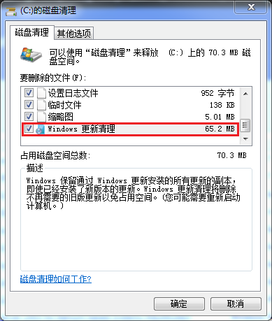

# 制作自己的Windows 7安装镜像

*版本：1.0*

查看Github渲染器中的**目录**：使用Github Markdown渲染页面右上角的“菜单”（⋮☰）按钮。

---

2009年7月22日，微软发布了Windows 7工厂压片版本（RTM）。

2009年8月22日，微软发布了Windows 7正式版（GA），Windows 7正式进入历史进程。

2011年2月9日，微软发布了Windows 7 首个服务包（SP1）。

2012年8月1日，微软发布了Windows 8 RTM。

2013年4月9日，微软停止了对没有更新到SP1的Windows 7的支持。

2014年8月31日，微软停止向OEM提供除专业版外的所有版本的Windows 7密钥。

2015年1月13日，微软停止了对Windows 7的“主流”支持，但是“延长”支持到2020年1月14日。这意味着原则上不会再有任何的功能性和性能更新，只有安全性更新。

2015年7月15日，微软发布了Windows 10 RTM。

2016年8月31日，微软停止向OEM提供专业版Windows 7密钥。至此，无论是OEM还是零售版，不会再有新的正版Windows 7流出。

2020年1月14日，微软停止了所有的Windows 7 (SP1)支持。只有付费订阅了Windows 7扩展安全更新（ESU）的企业用户，能够接收后续的安全性更新。

2020年6月17日，微软发布了KB4567409更新，Windows 7的最后一个功能性更新：基于Chromium的Microsoft Edge。

2021年6月11日，英伟达宣布停止对Windows 7提供Game Ready显卡驱动程序。6月21日，AMD也宣布停止对Windows 7提供Adrenalin显卡驱动程序。

2021年6月24日，微软发布了Windows 11 RTM。

2023年1月10日，微软停止了Windows 7 ESU支持。原则上不会再有对Windows 7的任何更新。至此，Windows 7正式离开历史舞台。

**2009~2023，一代传奇的操作系统Windows 7。**

## 零、为什么要制作一个自己的Windows 7安装镜像？

除了缅怀一代传奇操作系统的情怀，最重要的还是因为最近（202301）我是真的在一台实体机上安装了Windows 7。  
为什么要安装Windows 7呢，因为这台实体机年头有点旧了。i3-3240是一款2012年9月发布的CPU，那时候Windows 8刚压完盘。  
但并不是老机器一定要安装符合时代的操作系统。在我个人的体验中，对旧机兼容性最好的Windows其实是Windows 8.1。实际上手，Windows 8.1甚至表现比Windows 7还要好，不仅在于Windows 8.1支持快速启动、UEFI，而且其后台服务比Windows 10少，兼具轻量与现代化，还没有Windows 8那么反人类。  
但为什么最后还是安装了Windows 7呢？因为这台实体机是借来的，我拔下上面安装的SSD，塞了一块2006年的机械硬盘。  
2006年还没有Windows 7什么事呢，2007年7月Codename Windows 7才出现。把一块机械硬盘交给Windows 8.1就已经是很头疼的事了，更别提是一块Windows XP时代的机械硬盘，跑在SATA 1.5协议上，还跑不满理论速度，实测是这个德行：  
  
我寻思着可能插个SD卡都比这表现好。所以最后选择了安装Windows 7。

既然系统装上是要用的，一般我都会保持更新到最新版本，能打上的官方更新都打上。我个人是不喜欢网络上对个人PC禁用Windows更新的风气，永恒之蓝漏洞和后续WannaCry病毒的肆虐所敲响的警钟，保持更新最新的安全性更新是非常有必要的。所以我一如往常地在安装好系统之后，打开Windows Update，更新系统。

安装2小时，更新2个周……

是的没错，无论是慢的要死的Windows 7更新服务器（Windows 10和11的很快），还是这个，平均响应时间2000多毫秒的2006年的机械硬盘，我断断续续地更新了2周才更完……后来又想到，以后玩老设备，或者还有给一些老人的电脑重装系统（我确实有这个需要），要是都得经历这漫长的系统更新过程，那真是爽的一批。于是我就想，既然有DISM工具能够将更新部署在Windows安装镜像中，为何我不自己制作一个更新到最新更新的Windows 7安装镜像呢？

其实网上已经有类似的镜像了，不过这就像用各种什么菜市场PE装机大师啥的装系统一样，用那玩意，真不定在装完系统的电脑上搞点什么花活。反正搞一个自己的安装镜像也不是什么难事，不如自己手动制作一个。

## 一、准备所需镜像、文件、制作工具

### 1. 微软官方Windows 7 SP1镜像

或许以前，甚至现在还有人跟你说去“MSDN，我告诉你”这个网站下载原版镜像。其实我以前也是去这个网站下载过几次iso安装镜像，不过现在来看，这个网站提供的许多ed2k链接已经无法连通（或许你用迅雷可以下载ed2k链接，不过那也是迅雷服务器中的资源，其他下载软件很难获取到资源），网站本身也更新了新的地址（next.itellyou.cn），很遗憾地说，这个网站也已经进入到历史的长河中了。

既然提到了历史的长河，有一个地方专门放互联网的历史，它就是 *[Internet Archive](https://archive.org/)* 。下面这个链接可以直接直链下载到历史的、已经被微软停止提供的微软官方 *Windows 7 SP1 专业VL版* 镜像：

[Windows 7 Professional (VL) with Service Pack 1 (Simplified Chinese) (x86/x64) : Microsoft : Free Download, Borrow, and Streaming : Internet Archive](https://archive.org/details/windows-7-professional-vl-with-service-pack-1-simplified-chinese)

在打开的页面中，找到右边的 *“DOWNLOAD OPTIONS”* ，将光标悬停在下面的 *“ISO IMAGE”* 右边，会出现一个下 *尖括号（V）* ，点击它，会出现两个iso文件链接。点击文件名中 *带有“x64”的链接* 下载64位系统安装镜像，点击文件名中 *带有“x86”的链接* 下载32位系统安装镜像。


如果你想要下载其他的版本，可以在网站的 *搜索框* 中搜索关键词如`creator:"Microsoft" windows 7 chinese`。


#### QA：

**a. 为什么是专业版？旗舰版不是更NB功能更广吗？**

旗舰版比专业版只多三个主要功能:Bitlocker、Bitlocker To Go和多语言界面。而且专业版被官方支持的时间更久。还有一点，专业版有VL版，而旗舰版没有。  
虽然我很喜欢Bitlocker（可能挺多人不喜欢吧……），但Windows 7中的Bitlocker是**不能向后兼容**的：Windows 7创建的Bitlocker加密磁盘，可以被Windows 7以后的系统读取；但Windows 8.1以后的系统创建的Bitlocker加密磁盘，无法被Windows 8.1以前的系统读取。既然是个残废那还不如不用。

**b. 什么是VL版？不是VL版可以吗？**

VL是Volume Licensing for organizations的简称，即“团体批量许可证”，面向一次采购大量系统副本的大客户。VL版在安装时不要求立即输入激活密钥，在安装后可以统一通过企业联网激活。
不是VL版当然可以。提倡支持正版的意识。

**c. 不下载SP1可以吗？**

呃……本教程旨在把所有的更新装完，装完之后不就是SP1了吗……

**d. 我需要选择64位还是32位安装镜像？**

我的推荐是只要CPU支持64位指令集，就选64位的，具体CPU支不支持64位指令集，可以搜索一下。

### 2. 让Windows Update自动打上所有更新

如何才能知道Windows 7所需要的所有更新呢？  
答案很简单：直接装一台，然后让Windows Update打上所有更新就好了。

打开 *Windows Update（控制面板 - 系统和安全 - Windows Update，或者开始菜单 - 所有程序 - Windows Update）* ，点击左边的 *“检查更新”* ，然后在弹出更新选项后，选中需要更新的更新。推荐只要列表中针对Windows 7和.net Framework的更新能更新都更新，无论是重要还是可选；对于明确不需要的更新， *右键更新 - 忽略* 来隐藏特定更新。

  
~~二级菜单的图忘截了~~

刚刚装好官方镜像的Windows 7 SP1，系统状态还停留在2011年5月。要让Windows Update能够跟上近年来微软的更新调整，在进行系统更新之前，Windows Update平台应该会先进行自我更新。更新完Windows Update平台后，就可以进一步使用Windows Update自动扫描Windows 7缺失的更新了。

> 如果想要提前下载离线更新包对Windows Update平台进行更新，请依次下载并安装以下更新：  
[KB3138612 - Windows 7 和 Windows Server 2008 R2 的 Windows 更新客户端：2016 年 3 月](https://www.microsoft.com/zh-CN/download/details.aspx?id=51212)  
[KB4474419 - 适用于 Windows Server 2008 R2、Windows 7 和 Windows Server 2008 的 SHA-2 代码签名支持更新：2019 年 9 月 23 日](https://catalog.update.microsoft.com/search.aspx?q=KB4474419) - 这个更新也是安装火绒的必需更新  
[KB4490628 - Windows 7 SP1 和 Windows Server 2008 R2 SP1 的服务堆栈更新：2019 年 3 月 12 日](https://catalog.update.microsoft.com/search.aspx?q=4490628)  
[KB4575903 - 适用于 Windows 7 SP1 和 Windows Server 2008 R2 SP1 的扩展安全更新（ESU）许可准备程序包的更新](https://www.catalog.update.microsoft.com/Search.aspx?q=KB4575903)  
[KB4592510 - 2020-适用于 Windows 7 的 12 服务堆栈更新，适合基于 x64 的系统](https://www.catalog.update.microsoft.com/Search.aspx?q=4592510)  
由于Windows 7在2020 年1月14日后结束扩展支持，理论上没有续费ESU的Windows 7将无法更新任何更新号大于KB4522133的更新。这点将在后面进行说明。

对于隐藏的更新，如果要恢复，在Windows Update中点击 *左栏的“还原隐藏的更新”* 。


但这基本上是不可能的。

### 3. “劝说”系统允许更新ESU - 扩展安全更新

为什么上一步最后说Windows Update无法帮我们打上所有的Windows 7更新？我自己在实践的时候，最后总有几个更新永远重复在更新失败 - 重试 - 更新失败的循环当中。按更新号进行寻找并下载到离线更新包后，手动离线安装，会提示更新包不兼容当前的系统。原因在于，Windows 7在2020年1月14日后结束扩展支持，理论上没有续费ESU（Extended Security Update, 扩展安全更新）的Windows 7将无法更新任何更新号大于KB4522133的更新。在这个更新之后的Windows 7更新在安装前会先搜索系统中有没有获取到ESU MAK加载项密钥，如果没有，则拒绝安装。这个密钥的获取途径是购买了Windows 7 专业版的企业用户从微软购买Windows NT 6.1系列的扩展安全更新，没有续费的用户，或者说根本没法续费的用户是得不到后续的安全更新的。

鉴于潜在的法律问题，我在这里就不分享相应解决方案的链接了。有意者可自行搜素关键字“BypassESU v12”。

~~使用管理员权限运行LiveOS-Setup.cmd，弹出操作选项后，按1进行安装（其他选项也可，有能力者自行决断）。安装后重启电脑，应该就可以安装后续更新了。这样最后应该能一路更新到KB5022338，2023年1月10日最后的ESU更新。~~

（话说既然不让普通用户安装ESU更新，为啥Windows Update还能扫描到这些更新？）

### 4. 进行更新清理

由于Windows 7的Windows Update在更新时并不像后续Windows 10、Windows 11的Windows 更新那么智能——能够分析每个需要的更新是否被后面的更新覆盖而跳过过时更新，Windows 7的Windows Update基本上是一股脑地挨个装一遍，许多过时更新也被安装上了，即使后面的更新会覆盖掉这些过时的更新，或者因为后面的更新已被安装，所以过时更新所做的操作会被忽略。因此清理掉这些过时更新记录是很重要的，因为我们要根据实体机上已经安装好的更新列表来下载离线更新包，下载这些过时更新毫无疑问是无意义且浪费时间的。

举我自己的例子，我更新完所有更新之后，更新列表显示安装了约147个更新，在更新清理之后，总数只有71个，说明之前安装的约一半的更新是过时的。

由于潜在的玄学问题和不可抗力的可能性，我十分推荐在执行更新清理之前，先使用实体机一段时间，看看有没有什么问题，是由于更新造成的，防止在后续工作中突然发现前面哪个更新会造成某种问题而返工。

> 好了，已经玩嗨了，忘掉还要做镜像的事了o(*≧▽≦)ツ┏━┓

然后推荐对系统分区做一次分区备份。这里可以使用DiskGenius软件来进行一次全盘备份。其优点是该软件可以创建一个超级精简的Win PE环境到U盘中，在我们把系统玩挂掉之后，可以用该软件在其他电脑上创建一个恢复U盘，恢复系统分区到之前备份的能用的版本。该功能是免费的，到官网下载最新版软件即可使用。

[备份分区 - DiskGenius](https://www.diskgenius.cn/help/part2file.php)

（当然这一步不是必须的。）

在做好安全准备后，通过Windows 7自带的磁盘清理就可以进行更新清理了。

打开 *Windows资源管理器* ，在 *系统盘* （以C盘为例）上 *右键 - 属性* ，打开驱动器属性页面。在 *“常规”* 选项卡中，点击 *“容量”* 下的 *“磁盘清理”* 按钮，在弹出的 *“(C:)的磁盘清理”* 窗口中，点击带有UAC图标的 *“清理系统文件”* 按钮。


在重新打开的 *“(C:)的磁盘清理”* 窗口中，选中 *“要删除的文件:”* 列表中的 *“Windows 更新清理”* 选项，点击 *“确定”* ，等待清理完成。



清理之后重新启动电脑，打开 *“命令提示符”(Windows徽标键 + R，输入“CMD”后运行，或从开始菜单查找并进入)* ，输入

`systeminfo`

并 *回车* 运行，在输出的结果中找到 *“修补程序”* 部分，即可看到进行了更新清理后的更新列表。


> 请注意：这仅是一个示例图片。因后续更新发布以及其他情况，实际结果可能与图片产生区别。

之后就是根据这个列表来下载离线更新包了。除了复制控制台输出以外，还可以通过输入以下命令将systeminfo输出到 *文本文档* 里：

```PowerShell
systeminfo > <输出文档.txt>
```
### 5. 下载离线更新包

#### 5.1 搜索离线更新包

我们现在根据上文的更新列表中的每个更新号，来依次下载离线更新包。到微软的更新目录中进行搜素并下载：

[Microsoft Update Catalog](https://www.catalog.update.microsoft.com/Home.aspx)

在右上角的搜索框中输入要下载的更新号并搜索，以“KB2491683”为例：


#### 5.2 找到最新的离线更新包

搜到后先确定该更新适用的Windows版本和指令集，在本例中我们选择 *Windows 7* 并标明类似于 *“适用于基于 x64 的系统的”* 。先不要急着下载，先点进该更新的 *标题链接* ，在弹出的 *“更新详情”* 弹出式窗口中，先点选 *“Package Details”* 选项卡，在下面的 *“本更新已被下列更新取代 (This update has been replaced by the following updates:)”* 列表中，查看是否已经有更新取代了这个更新。如果有，那就说明这个更新也是过时更新，只不过没有被更新清理清理掉。找出“本更新已被下列更新取代”列表中更新号最大的一个更新，点进链接，重复以上过程，直到该列表中显示 *“n/a”* ，即没有更新取代新更新，那就是最初更新的目前为止的最新版本了。  
（注：可能会有多个旧更新被同一个新更新取代的情况。）

  
*图例为KB2491683*

在这个例子中，这个2014年9月发布的更新在经过多次被取代后，最后停在了目前最新的更新——“2023年1月月度安全质量汇总 KB5022338”上。

   
*图例为KB5022338*

这时只需要下载最新的离线更新包即可，不用再去下载过时的更新包了。

#### 5.3 查看该更新包的描述

回到 *“Overview”* 选项卡，点击右侧 *“More information:”* 处的链接，即可查看该更新包的描述。

  
*图例为KB3125574*

这是因为许多更新的标题并不明确指明该更新的作用是什么。这一步不是必须的，但这一步能够很好地帮助我们归档更新时对更新进行简短的说明，例如对更新重命名。

#### 5.4 下载离线更新包

回到5.2，现在可以点击更新右边的 *“Download”* 按钮，在弹出的 *“Download Updates”* 弹出式窗口中，点击其提供的 *下载链接* 进行下载。


解释一下更新包的默认文件名：

`Windows内核版本-更新号-修订版本-指令集_SHA1值.msu`

以“windows6.1-KB3125574-v4-x64_2dafb1d203c8964239af3048b5dd4b1264cd93b9.msu”为例：

| 适用的Windows内核版本 | Windows 6.1 |
| - | - |
| 更新号 | KB3125574 |
| 修订版本（省略v1） | v4 |
| 指令集 | x64 |
| SHA1校验值 | 2dafb1d203c8964239af3048b5dd4b1264cd93b9 |

如果想要验证下载到的更新有没有因传输问题出现错误，可通过在 *下载文件夹* 下打开 *命令提示符窗口（或Windows终端，方法为在资源管理器的文件夹空白处按住Shift键并右键，选择“在此处打开命令提示符”或“在终端中打开”）* ，输入如下命令：

```PowerShell
certutil -hashfile <文件名> SHA1
```

 *回车* 运行，其结果若与文件名中的SHA1值相同，则没有问题。

### 6. 下载所有最新离线更新包并归档

按照2-5的操作，你现在应该已经取得了经过Windows清理过的所需更新列表，并手动从微软更新目录中再次筛选出一部分过时更新，并下载到了所有没有被取代的、最新版本的离线更新了。我自己整理的最终更新列表如下（手动删掉了一些空格）：

（如果你懒得按上面2-5步骤查看需要的更新列表，也可以直接用这个：）

> KB2574819-v2-现已推出针对Windows7SP1中的DTLS添加支持的更新  
KB2592687-Windows7的远程桌面协议(RDP)8.0更新  
KB2667402-v2-MS12-020：终端服务器拒绝服务漏洞的安全更新说明：2012年3月13日  
KB2670838-Windows7SP1的平台更新  
KB2685811-适用于Windows7的内核模式驱动程序框架1.11版更新  
KB2685813-适用于Windows7的内核模式驱动程序框架1.11版更新  
KB2698365-MS12-045：Microsoft数据访问组件中的漏洞可能允许远程代码执行  
KB2706045-MS12-056：JScript和VBScript引擎中的漏洞可能允许远程代码执行  
KB2729094-v2-Windows7中SegoeUI符号字体的更新可用  
KB2750841-已推出用于Windows7的IPv6准备就绪更新  
KB2761217-已推出可向Windows7添加CalibriLight和CalibriLightItalic字体的更新  
KB2862330-v2-MS13-081：USB驱动程序安全更新说明：2013年10月8日  
KB2884256-MS13-081：USB驱动程序安全更新说明：2013年10月8日  
KB2894844-用于x64系统的Windows7上的Microsoft.NETFramework3.5.1的安全更新程序  
KB2984972-用于支持Windows7上的受限管理登录的RDC7.1更新  
KB2984976-Windows7上的受限管理的RDP8.0更新  
KB2990941-v3-通用NVME驱动，版本stornvme_v6.1.7601.18615  
KB3004375-v3-Microsoft安全公告：用于改善Windows命令行审核的更新：2015年2月10日  
KB3020387-MS15-004：安装了远程桌面连接8.0客户端更新时Windows7的安全更新说明：2015年1月13日  
KB3021917-更新到Windows7SP1的性能改进  
KB3046269-MS15-037：Windows任务计划程序中的漏洞可能允许特权提升：2015年4月14日  
KB3059317-MS15-060：Microsoft常用控件中的漏洞可能允许远程执行代码：2015年6月9日  
KB3087873-v2-解决在安装Windows7SP1安装修补程序KB2990941后出现的0x0000007E错误  
KB3125574-v4-适用于Windows7SP1的便利性汇总更新（可视作SP2）  
KB3138612-Windows7的Windows更新客户端：2016年3月  
KB3140245-更新了以在Windows中的WinHTTP中启用TLS1.1和TLS1.2作为默认安全协议  
KB3150513-适用于Windows7SP1的最新兼容性定义更新  
KB3156016-MS16-055：Microsoft图形组件的安全更新程序说明：2016年5月10日  
KB3159398-MS16-072：组策略安全更新说明：2016年6月14日  
KB3161102-Windows日记本中删除组件的更新  
KB3161949-MS16-077：WPAD安全更新程序说明：2016年6月14日  
KB3172605-适用于Windows7SP1的2016年7月更新汇总  
KB3179573-8月2016年的Windows7SP1更新汇总  
KB3184143-删除与Windows10免费升级产品服务相关的软件  
KB4019990-在Windows7上的d3dcompiler_47.dll组件的更新  
KB4099950-NIC设置将替换或安装KB4088875或KB4088878后静态IP地址设置都将丢失  
KB4474419-v3-适用于Windows7的SHA-2代码签名支持更新：2019年9月23日  
KB4490628-Windows 7 SP1的服务堆栈更新：2019年3月12日  
KB4532945-2020-01适用于Windows7的.NETFramework3.5.1安全和质量汇总  
KB4575903-2020-07适用于Windows7的扩展安全更新(ESU)许可准备程序包  
KB4592510-Windows7SP1的服务堆栈更新：2020年12月8日  
KB5010798-Windows7SP1的带外更新：2022年1月17日  
KB5013637-2022-05适用于Windows7的.NETFramework3.5.1安全和质量汇总  
KB5017397-适用于Windows7SP1的09服务堆栈更新：2022年9月13日  
KB5020861-2022-12适用于Windows7的.NETFramework3.5.1安全和质量汇总  
KB5022338-2023年1月10日月度汇总（最后的ESU更新）  

以上共46个更新。其他没有囊括进来的，和在虚拟机上安装测试后补充的更新的说明：

> ================  
在i3-3240通用机上：  
================  
KB2990941 包含了NVME通用驱动，版本为stornvme_v6.1.7601.18615。该驱动被便利性汇总更新（Windows 7 SP2）KB3125574所替换，版本为stornvme_v6.1.7601.23403。但是有反映说该替换只替换了版本号，只包含了KB3087873更新，而没有真正包含实际的驱动程序。
KB3087873 修复由KB2990941带来的蓝屏问题。  
<br>
KB4571729和KB5008244在安装了KB5021291的Windows 7 SP1上均显示“不适用于您的计算机”，已被替代。  
KB3087873 安装失败，显示：“不适用于您的计算机”。  
KB5022338 在替换了KB5021291之后，成为Windows 7 (SP1)的最后一个(ESU)更新。理论上不再有任何更新在这个更新后发布。  
<br>
KB3087873 KB2990941的后续更新，用于增强Windows 7对Nvme协议的SSD的支持。安装不成功。  
<br>
一些说明：  
KB976902  Windows 7 SP1铺垫支持更新，显示在SP1更新列表中但没有实际独立安装包，可无视。  
KB2491683 显示在SP1更新列表中，但被KB5022338代替。  
KB2533552 显示在SP1更新列表中，但被KB5017397代替。  
KB2545698 IE9相关。不再囊括。  
KB2547666 IE相关。不再囊括。  
KB2598845 Internet Explorer 8兼容性视图列表，IE相关，不再囊括。  
KB2603229 显示在SP1更新列表中，但被KB3125574代替。  
KB2676562 显示在SP1更新列表中，但被KB5008244代替。KB5008244被KB5022338代替。  
KB2732059 显示在SP1更新列表中，但被KB3125574代替。  
KB2773072 显示在SP1更新列表中，但被KB3125574代替。  
KB2813347 显示在SP1更新列表中，但被KB5008244代替。KB5008244被KB5022338代替。  
KB2830477 显示在SP1更新列表中，但被KB3125574代替。  
KB2834140 显示在SP1更新列表中，但被KB3125574代替。  
KB2900986 Windows 7 中 ActiveX Killbit 累积安全更新程序。IE相关。不再囊括。  
KB2919469 显示在SP1更新列表中，但被KB3125574代替。  
KB2952664 显示在SP1更新列表中，但被KB5008244代替。KB5008244被KB5022338代替。  
KB2970228 显示在SP1更新列表中，但被KB3125574代替。  
KB3006137 显示在SP1更新列表中，但被KB3125574代替。  
KB3020370 显示在SP1更新列表中，但被KB3125574代替。  
KB3068708 显示在SP1更新列表中，但被KB3125574代替。  
KB3080149 显示在SP1更新列表中，但被KB3125574代替。  
KB3102429 显示在SP1更新列表中，但被KB3125574代替。  
KB3118401 显示在SP1更新列表中，但被KB5022338代替。  
KB3123479 显示在SP1更新列表中，但被KB5022338代替。  
KB3124275 Internet Explorer 8积累安全更新，IE相关，不再囊括。  
KB3138378 显示在SP1更新列表中，但被KB3125574-v4代替。  
KB3147071 显示在SP1更新列表中，但被KB3125574-v4代替。  
KB4040980 .Net Framework更新，这个更新不再囊括于Microsoft Update Catalog中，可能已被代替。  
KB4524752 适用于Windows 7 SP1的停止支持通知。不再囊括于Microsoft Update Catalog中。  
KB4536952 显示在SP1更新列表中，但被KB5017397代替。  
KB4539602 显示在SP1更新列表中，但被KB5022338代替。  
KB5001027 Windows 7 x64的Microsoft Edge，Edge相关，不再囊括。  
<br>
=========================  
在VirtualBox 7.0.6虚拟机上：  
=========================  
KB890830  Windows恶意软件删除工具，新增为exe安装包，需在安装系统后手动安装。  
KB976932  Windows 7 的手动SP1升级，显示在SP1更新列表中，但KB2533552重叠（依据Microsoft Update Catalog），故不再囊括。  
KB2562937 Windows 7 中 ActiveX Killbit 累积安全更新程序。IE相关。不再囊括。  
KB2618451 Windows 7 中 ActiveX Killbit 累积安全更新程序。IE相关。不再囊括。  
KB2984976 新增  
KB3020387 新增  
KB4041083 显示在SP1更新列表中，但被KB5021091代替。  
KB4049016 显示在SP1更新列表中，但被KB5021091代替。  
KB4497410 适用于Windows的Microsoft.NETFramework4.8语言包（脱机安装程序）。无法手动安装，只能通过Windows Update安装。  
KB4503548 更新合集包：KB4019990和KB4503575。  
KB4503575 适用于Windows的Microsoft.NETFramework4.8脱机安装程序。无法手动安装，只能通过Windows Update安装。  
KB5020869 2022年12月13日-适用于Windows7SP1的 .NETFramework4.6.2、4.7、4.7.1、4.7.2安全与质量汇总。无法手动安装，只能通过Windows Update安装。  
KB5020879 2022年12月13日-适用于Windows7SP1的.NETFramework4.8安全和质量汇总。无法手动安装，只能通过Windows Update安装。  
KB5021091 更新合集包：KB4019990、KB5020861、KB5020869、KB5020879。  
<br>
=====================================  
在VMWare Workstation Player 17虚拟机上：  
=====================================  
KB971033  Windows 激活技术更新，验证是否为盗版。不再囊括。  
KB3163245 显示在SP1更新列表中，但被KB5021091代替。  
KB3196686 显示在SP1更新列表中，但被KB5021091代替。  
KB3205402 显示在SP1更新列表中，但被KB5021091代替。  
KB4032113 显示在SP1更新列表中，但被KB5021091代替。  
KB4035036 显示在SP1更新列表中，但被KB5021091代替。  
KB4042076 显示在SP1更新列表中，但被KB5021091代替。  
KB4043766 显示在SP1更新列表中，但被KB5021091代替。  
KB5018547 显示在SP1更新列表中，但被KB5021091代替。  

因为Microsoft Internet Explorer在2023年2月14日彻底停止支持，所以所有对IE的更新都不再囊括。顺带一提，Chromium核心的浏览器在109版本后（2023年1月）都不再有支持Windows 7的更新，包括Microsoft Edge。


仅仅是“去重”两次的离线更新包就占用了1.15GB，再搭配上慢的要死的Windows 7更新服务器，那场面……

后注：在安装完最终成品镜像后，Windows 7中的Windows Update仍然会检测到过时更新（见上文 *一、4* ），除了故意不再囊括的，可以选择安装或者忽略，没有区别。

### 7. 准备安装后的附加软件

首先这里得先说一下wim镜像文件：wim是Microsoft Windows Imaging Format的简称，即“Windows基于文件的映像格式”，找到它并不难，找到我们已经准备好的ISO安装镜像，使用如7-zip一类的压缩软件或者直接使用文件资源管理器挂载上，打开其中的sources文件夹，里面的install.wim就是我们在安装Windows系统需要释放的镜像。安装的系统几乎全部基于这个镜像，而ISO镜像上的其他文件，其实就是为了让用户在安装系统的时候能有个具有图形化界面、所有释放该镜像的工具、一些急救工具和描述文件（比如EULA）等的环境。所以在使用一些第三方Windows PE系统释放wim镜像来安装系统，就是这么一回事。其实上面所说的“环境”，本身就是一个PE系统。


具体要准备什么软件，这个就见仁见智了，比如必要的.net framework支持库、C++运行库等，还有Chrome离线安装包什么的。这个我才疏学浅不知道怎么整合到wim安装镜像中，但我至少可以整合到ISO镜像中，这样在安装系统后不用联网，不用拔U盘就可以把这些工具装上了。

从另一个角度说，最好还是不要往wim镜像里塞没有微软签名的文件，如果你有分享的想法。


### 8. 准备制作镜像的工具

**8.1 NTLite**

NTLite的官网描述：面向 IT 专业人士和爱好者的，用于在本地控制更新和编辑 Windows 映像和部署的工具。我们就将借助这款软件对wim镜像进行修改。

官网：[Download – NTLite](https://www.ntlite.com/download/)


售价290元，只提供一年更新……

本文中我们将使用NTLite 2.1试用版来进行展示。

**8.2 BypassESU**

**8.3 7-zip或者Windows文件资源管理器**

用于解压缩ISO镜像。

官网：[Download](https://7-zip.org/download.html)

**8.4 ImgBurn**

ImgBurn虽然是一款很老的软件了（最后更新于2013年），但其功能放在今天仍然好用（毕竟CD-ROM技术也好多年没更新了）。7-zip或Windows文件资源管理器只能提取ISO文件无法修改它们，我们将借助ImgBurn生成新的ISO可引导光盘镜像。

官网：[The Official ImgBurn Website](https://www.imgburn.com/index.php?act=download)

需要特别提醒的是，在官网提供的几个镜像站中，有的已经失效，有的下载下来的文件完全不是我们想要的软件（毕竟这个站点也很多年没有维护过了），所以下载文件后一定要验证网站上提供的校验值，避免下到不想要的文件！

UI汉化文件：

在官方下载页的中间可以下载到UI翻译文件。简体中文版没有更新到软件的最新版本，下面的文章将以繁体中文版进行演示。


将下载到的压缩包解压到`软件安装文件夹\Languages`文件夹下：


## 二、对WIM镜像进行修改

下文将默认已经准备好所有所需文件、校验过并安装好所有工具。

首先创作一个专门用于制作镜像的 *工作文件夹* ，然后使用 *7-zip或者Windows文件资源管理器* 将 *Windows 7 SP1 专业VL版* 官方原版安装盘解压到该工作文件夹（下文统称 *“工作文件夹”* ）下，例如：


其中 *windows_7_professional_with_sp1_vl_build_x64_dvd_u_677816工作文件夹* 就是从 *windows_7_professional_with_sp1_vl_build_x64_dvd_u_677816.iso* 解压而来。

### 1. BypassESU修改wim镜像

由于潜在的法律问题，此处不作过多讲解。下面的截图仅作于技术研究记录与分享。

  
  


然后，将修改过的 *install.wim* 移动回 *工作文件夹* 的原位置里。

### 2. NTLite修改wim镜像
（试用版NTLite可能存在不稳定的情况。以下操作请尽量一次性完成，即出成果前最好不要涉及到软件的开关。）

首先打开NTLite 2.1，点击 *“映像” - “添加” - “映像文件夹”* ，选择 *工作文件夹* ：

