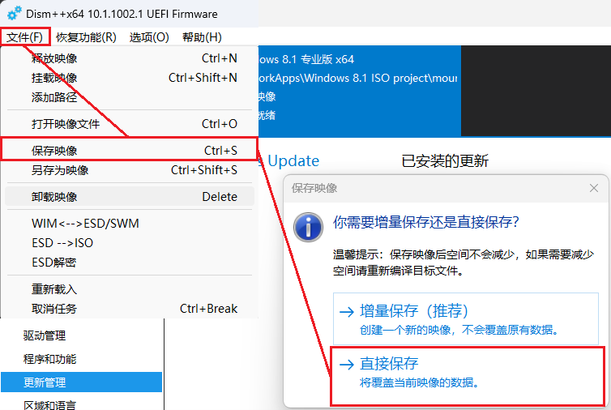
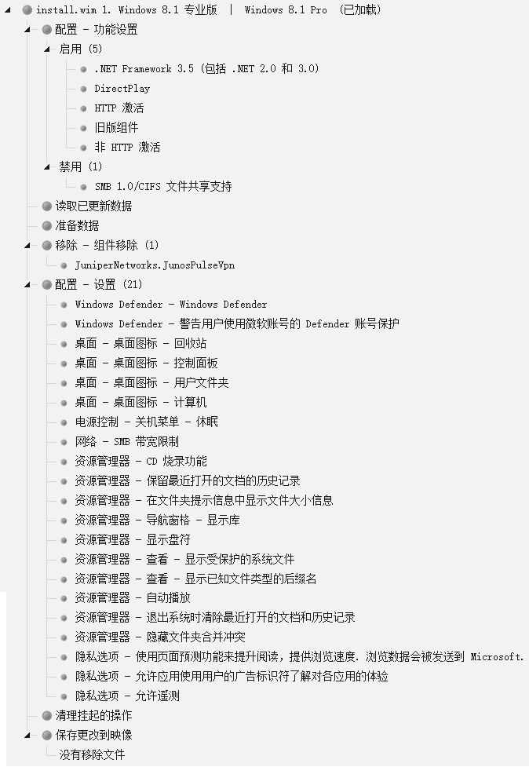
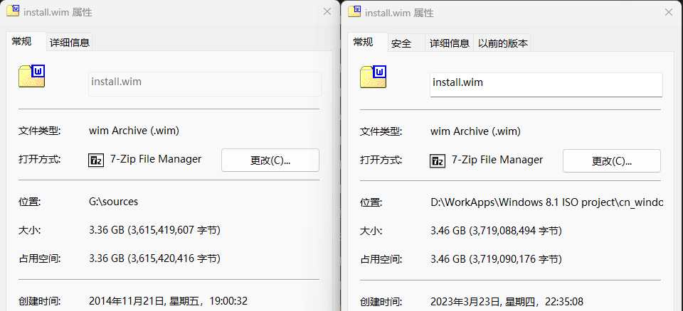

# 制作自己的Windows 8.1安装镜像

*版本：1.0*

查看Github渲染器中的**目录**：使用Github Markdown渲染页面右上角的“菜单”（⋮☰）按钮。

---

.jpg)
*Windows 8.1原版默认桌面壁纸*

2012年8月1日，微软发布了Windows 8工厂压片版本（RTM）。

2012年10月26日，微软发布了Windows 8正式版（GA），Windows 8正式进入历史进程。

2012年10月30日，微软宣布在发布首周有400万用户升级到了Windows 8。然而对于Windows 8和Surface平板的销售情况，微软时任CEO史蒂夫·鲍尔默拒绝透露。

2012年11月16日，微软时任高级技术分析师保罗·瑟罗特称“Windows 8 PC的销量远低于微软的内部预测，公司内部称其令人失望。”

2012年11月27日，微软宣布第一个月就售出了4000 万份Windows 8许可证，超越了Windows 7当初的步伐。现在原文已无法检索到。

2012年11月29日，据研究公司NPD称，与2011年同期相比，美国运行Windows的设备销量下降了21%。

2013年2月8日，ZDNet网站透露，微软正计划开发一个代号为“Blue”的新操作系统。3月26日，微软公司时任副总裁弗兰克·肖(Frank X. Shaw)证实了这一说法。

2013年5月7日，《金融时报》称Windows 8“标志着自近30年前可口可乐公司的新可口可乐惨败以来，新的大众市场消费产品最显着的失败之一。”同月11日，《经济学人》发表文章《Microsoft Blue》称，“恢复开始按钮并不会让微软重现昔日的辉煌。”同日，弗兰克·肖表示，虽然许多负面评论都很极端，但微软正在“听取反馈并改进产品”，并称“这是一件好事”。

2013年的美国客户满意度指数（ACSI）报告称，微软的客户满意度有所下降，这是自Windows Vista以来的最低水平。

2013年5月14日，微软宣布“代号Blue”作为Windows 8.1正式亮相。

2013年8月23日，微软宣布时任CEO史蒂夫·鲍尔默将在1年内退休。

2013年8月27日，微软发布了Windows 8.1 RTM。

2013年10月17日，微软发布了Windows 8.1 GA，Windows 8.1正式进入历史进程。同日，《The Verge》资深编辑Tom Warren称“有非常多的改进，但还期望可以有更多更好的改进。”“微软在 12 个月内取得了很多成就。”

2014年4月2日，微软发布了“通用 Windows 应用程序（UWP）”。在6年后的某一天，作者对Windows 10 UWP会占用任意盘符根目录下“Program Files”文件夹名而锁定该文件夹访问权限，无论该文件夹是否已经存在的问题忍无可忍，而将以后的软件默认安装路径改为了“D:\Program Files (UWPfree)\”。

2014年4月8日，微软发布了“含有更新包的Windows 8.1（Windows 8.1 with update）”。

2015年3月，NetMarketShare报告称Windows 8.1的市场占有率为10.55%，是当时Windows 8 3.52%的三倍之多。

2015年7月15日，微软发布了Windows 10 RTM。

2016年1月12日，微软停止了Windows 8的支持。

2018年1月9日，微软停止了Windows 8.1的主流支持，并开启为期5年的扩展支持。这意味着将不会再有功能性更新，仅有安全更新。

2023年1月10日，伴随着微软对Windows 7扩展安全更新（ESU）的停止支持，Windows 8.1也停止了扩展支持，双双正式在历史舞台上谢幕。与Windows 7不同的是，微软将不会对Windows 8系列有任何的扩展安全更新计划。

**2013~2023，即使是命途多舛，诞生于骂名之中，肩负着安抚用户和Windows未来发展希望的Windows 8.1，也走过了坎坷的十年。**

## 零、Windows 8系列真就那么屑吗？为什么要制作一个自己的Windows 8.1安装镜像？

相较于一代传奇Windows 7，Windows 8和8.1带来的**前所未有**的功能有：

**硬件：**

- **安装镜像支持纯UEFI启动**，并支持基于硬件（TPM）的安全启动
- 初代Windows To Go
- 原生USB 3.0支持
- 原生多显示器支持
- 原生Nvme驱动器支持
- WDDM 1.3以及Miracast
- Hyper-V虚拟机

**软件：**

- “文件历史记录”功能，允许将文件的增量修订备份到辅助存储设备并从中恢复
- “存储空间”功能，通过Windows管理模块实现原生存储池、原生软RAID等功能
- 通用 Windows 应用程序（UWP）。但这玩意的前期体验给我留下了不小的心理创伤，直到Windows 10 22H2才恢复
- Metro设计语言和磁贴，还有捆绑应用
- 全新登陆界面，包括使用微软账户、使用PIN登录等。（Windows Hello是Windows 10新功能）
- 全新任务管理器
- 触摸键盘
- 标记“按流量计费的网络”
- 本地一键重置
- 更多的Win快捷键
- **Windows 评估和部署工具包（Windows ADK）**

“前所未有”，指的就是Windows 7并不包含上述功能。Windows 8的许多创新的功能成为了又一代优秀PC操作系统Windows 10的基石。我认为最重要的新功能莫不过于  
一、纯UEFI启动，即使在写这篇文章的时候，作者仍苦恼于如何使Win7安装盘能够通过纯UEFI引导（更新：搞成了）；  
二、Windows ADK，Windows ADK的出现带来了**完全版**的DISM工具，使得本文中如NTLite、Dism++这样的工具和各种Windows PE工具得以运行和工作。  
记得当年刚从Windows 7换到Windows 8，给我带来最大的震撼就是无与伦比的启动速度，当我还在为1分钟进win7沾沾自喜的时候，win8已经可以十几秒进入桌面了（同为机械硬盘）。还有就是再也搜不到家里WiFi的震撼，升级Windows 8.1也认不到，以至于Windows 10刚推出我就迫不及待地升级了，真不为的是体验什么新功能，孩子只是想连上WiFi而已。结果刚升级完成就搜到了WiFi，喜悦地当场痛哭流涕。

---

### “上一篇文章”

在上一篇文章中（本文后面指的 *“上一篇文章”* 均指下面链接的这篇文章，不再重复粘贴链接），我在该文章的零章也指出，个人的体验中对旧PC兼容性最好的Windows是Windows 8.1。

[Build your own Windows 7 installation image - 制作自己的Windows 7安装镜像](../Build%20your%20own%20Windows%207%20installation%20image%20-%20制作自己的Windows%207安装镜像/Build%20your%20own%20Windows%207%20installation%20image%20-%20制作自己的Windows%207安装镜像.md)

因为Windows 8.1不但系统支持纯UEFI引导，安装程序也支持纯UEFI引导；对新软件兼容性不差（除非新软件限制了必须高于Windows 8.1），后台服务比Windows 10少很多，操作也十分现代化（开始菜单因人而异）。唯一废弃且无法再继续使用的功能，我想应该是Windows 8.1的商店（被微软抛弃，无法连接服务器），但由于我并没有对UWP应用的任何情怀（PTSD倒可能是有），所以这并不是个问题。在 *上一篇文章* 中，最后导致我选择在老机上安装Windows 7是因为超级慢的06年的机械硬盘，实属无奈之举，不过现在我借到了一块垃圾SSD，终于可以给那台相同的老机器装上较为现代化的Windows 8.1了。

本文对于一些概念的解释、软件的下载均与 *上一篇文章* 相同（链接如上），因此在本文中不再赘述，如需参考请转到 *上一篇文章* 。

## 一、准备所需镜像、文件、制作工具

（本来拔智齿想多咕咕几天到5月再更的，但是报了个业余无线电考试，那就赶紧更完这个好all in无线电去了）

### 1. 微软官方Windows 8.1 with Update镜像

还是从 *[Internet Archive](https://archive.org/)* ；由于 *上一篇文章* 已经写了如何在此网站中获取镜像，此处仅提供链接，具体方式请见 *上一篇文章* 。

[Windows 8.1 Pro (VL) with Update (Simplified Chinese) (x86/x64) : Microsoft : Free Download, Borrow, and Streaming : Internet Archive](https://archive.org/details/windows-8.1-pro-vl-with-update-simplified-chinese)

#### QA：

**a. 为什么是专业版？旗舰版不是更NB功能更广吗？**

Windows 8开始，微软不再提供旗舰版这一细分版本。

**b. 什么是VL版？不是VL版可以吗？**

VL是Volume Licensing for organizations的简称，即“团体批量许可证”，面向一次采购大量系统副本的大客户。VL版在安装时不要求立即输入激活密钥，在安装后可以统一通过企业联网激活。
不是VL版当然可以。提倡支持正版的意识。

**c. with update版本和update版本有什么区别？**

update版本只是一个大更新包，而且还是过时的，不包含系统本体。这里的with update其实已经是微软发布的第三次整合更新的版本（U3）。从文章开头的Windows 8曲折历史来看，微软也正经历着其最为颠簸和混乱的一个时期，这一时期也影响到了旗下不少产品的开发，比如：Windows 8混乱的产品线、赶鸭子上架的8.1、抛弃了Service Pack但是又没想好该怎么推出新的产品更新步伐，还有后面整理归档更新的时候，那些混乱的更新定位和基本全都是微软式中文的机翻（Windows 7的更新的简中知识库文章大部分不是机翻，而Windows 8系列基本都是机翻，甚至很多连机翻都没有）。

**d. 我需要选择64位还是32位安装镜像？**

我的推荐是只要CPU支持64位指令集，就选64位的，具体CPU支不支持64位指令集，可以搜索一下。这个问题在Windows 11之后应该不再是一个问题，因为从Windows 11之后的Windows都将不再提供32位版本系统。

### 2. 让Windows Update自动打上所有更新

如何才能知道Windows 8.1所需要的所有更新呢？

答案很简单：直接装一台，然后让Windows Update打上所有更新就好了。

关于如何让已经安装好的Windows 8.1安装更新，可以参考 *上一篇文章* 的 *一、2* ，操作逻辑和Windows 7一模一样。但由于Windows 8.1已经内置了新版Windows Update的SHA2时代版本，所以不需要再先对Windows Update进行自我（平台）更新。不过遗憾的是，Windows 8.1的Windows Update仍然像Windows 7那样又慢又卡。

### 3. Windows 8.1的扩展安全更新？

由于Windows 8系列系统在市场上的低活跃度和低保有量，微软决定不像Windows 7那样给他续那么长时间的命，不再提供扩展安全更新（ESU）。Windows 8.1将和Windows 7 SP1 ESU同时于2023年1月10日被彻底停止所有支持。这意味着我们也用不着去想办法劝说系统同意扩展安全更新了，倒是省事。

### 4. 进行更新清理

这一步与Windows 7 SP1操作完全一样，请参照 *上一篇文章* 的 *一、4* 。

### 5. 下载离线更新包

**5.1 搜索离线更新包**  
**5.2 找到最新的离线更新包**  
**5.3 查看该更新包的描述**  
**5.4 下载离线更新包**  

这几步与Windows 7 SP1操作完全一样，请参照 *上一篇文章* 的 *一、5* 。

### 6. 下载所有最新离线更新包并归档

按照 *2-5* 的操作，你现在应该已经取得了经过Windows清理过的所需更新列表，并手动从微软更新目录中再次筛选出一部分过时更新，并下载到了所有没有被取代的、最新版本的离线更新了。我自己整理的最终更新列表如下：

（如果你懒得按上面2-5步骤查看需要的更新列表，也可以直接用这个：）

>  KB2894856-v2-适用于Windows 8.1的 .NET Framework 4.5.1 安全更新说明：2013 年 12 月 10 日  
KB2899189-更新Windows 8.1中添加许多相机特定文件格式的支持 2013 年 12 月  
KB2976978-v24-为使 Windows 保持最新 Windows 8.1 中的兼容性更新  
KB2990967-不再为 Windows 8.1 上的 OneDrive 桌面应用程序的使用者版本提供更新  
KB2994290-为 Windows 8.1 SP1更新 (KB2919355)添加71种界面语言包  
KB3003667-2014年11月更新以支持Windows 8.1中许多照相机特定文件格式  
KB3004545-您不能访问位于通过 VPN 连接在 Windows Azure 托管服务的虚拟机  
KB3012235-v3-修复Windows 8.1中打印向导停止响应的问题  
KB3012702-当您登录到 Windows 中的 RDS 服务器时，漫游用户的某些默认程序关联可能会丢失  
KB3013172-不能通过“安全地删除硬件”在Windows 8.1 中弹出外部存储设备  
KB3013410-Windows 操作系统的累积时区更新2014 年 12 月  
KB3013538-在 Windows 的 PC 设置页面间切换后意外禁用自动亮度选项  
KB3013769-Windows 8.1的更新汇总（2014 年 12 月）  
KB3013791-Windows 8.1硬件故障停止代码：DPC_WATCHDOG_VIOLATION (0x133)  
KB3013816-2014年12月在 Windows 中 MDM 客户机更新  
KB3015696-在 Windows 中的 InputPersonalization.exe 进程崩溃  
KB3018133-已更新KB2919355的Windows 8.1中不恰当地显示锁定屏幕上的内容  
KB3019978-MS15-004：Windows 的安全更新描述：2015 年 1 月 13 日  
KB3020370-更新 Windows 中的 Cmitrust.dll 文件的副本  
KB3023266-MS15-001：Windows 应用程序兼容性缓存中的漏洞可能允许特权提升：2015 年 1 月 13 日  
KB3024755-退出 Windows 计算器之后多点触控不工作  
KB3029606-v2-更新以改进Windows 8.1中的蓝牙驱动程序诊断  
KB3030947-Windows 中依赖特定内存代码布局的应用程序的兼容性问题  
KB3031044-嵌入的锁定管理器意外地安装在Windows 8.1上  
KB3033446-v2-解决Windows8.1在Intel Cherry Trail平台上的Wi-Fi性能问题  
KB3036612-Windows 8.1中的部分Windows应用商店程序可能会崩溃  
KB3042085-v2-安装了KB3000850的Windows 8.1在启用快速启动后于关机期间无响应  
KB3044673-v2-某些 Android 设备拍摄的照片在拍摄在 Windows 资源管理器中的字段日期中显示空值  
KB3045634-重新连接Windows 8.1中的 PLC 设备后不能进行 PPP 连接  
KB3045685-MS15-038：Windows 的安全更新描述：2015 年 4 月 14 日  
KB3045717-在Windows中，按下 Ctrl 键时，讲述人不会停止朗读  
KB3045999-MS15-038：Windows 的安全更新描述：2015 年 4 月 14 日  
KB3046017-MS15-088 Windows Notebook、Internet Explorer 以及 Office 安全更新说明：2015 年 8 月 11 日  
KB3047254-蓝牙音频设备的驱动死锁报错0x0000009F：“DRIVER_POWER_STATE_FAILURE”  
KB3053863-Windows 8.1 无法发现三星电视作为无线显示设备  
KB3054256-v2-Windows 8.1 的可靠性改进：2015年6月  
KB3054464-在 Windows 中使用 AddEntry 方法的应用程序可能会出现故障  
KB3055323-更新KB3000850 引入了深层防御更改来加强安全  
KB3056347-使用 geofencing Api 的应用程序仍在接收 geofencing 中包含位置的坐标，即使在组策略中禁用的位置服务  
KB3059317-MS15-060：Microsoft 常用控件中的漏洞可能允许远程执行代码：2015 年 6 月 9 日  
KB3060793-当通过基于 USB 的 RNDIS 设备在 Windows 上传输数据时出现0x0000001E或0x00000133错误  
KB3061493-更新 magstripe 驱动程序以使 Windows 8.1 支持OEM的更多设备  
KB3061512-MS15-069：Windows 的安全更新说明：2015 年 7 月 14 日  
KB3063843-注册表膨胀导致登录延迟或跳出“Windows 8.1 中没有足够的系统资源错误：0x800705AA”  
KB3064059-在 Windows 8.1 中打开控制面板中的文件历史记录后，Explorer.exe 崩溃  
KB3071756-MS15-085：Windows Mount Manager 的安全更新说明：2015 年 8 月 11 日  
KB3076949-MS15-089：WebDAV 中的漏洞可能允许安全功能规避：2015 年 8 月 11 日  
KB3077715-Windows 操作系统的2015年8月累积时区更新  
KB3078405-v2-Windows 8.1中的0x0000004A或0x0000009F错误  
KB3080149-更新的客户体验和诊断遥测，收集更少的信息且用户可以自行选择应用是否参加用户体验计划  
KB3080800-Windows 8.1 中的 NcdAutoSetup 服务崩溃访问冲突 (0xc0000005错误)  
KB3084135-MS15-102：Windows 任务管理的安全更新程序说明：2015 年 9 月 8 日  
KB3084905-v2-TPM 在Windows 8.1中意外的发生了锁定  
KB3086255-MS15-097：Windows 图形组件的安全更新程序说明：2015 年 9 月 8 日  
KB3087137-应用程序具有Windows 8.1中的嵌套转换的几何图形时出现的问题  
KB3091297-当 Windows 应用商店应用程序使用 Web 身份验证代理程序 Api 时，Web 身份验证代理程序崩溃  
KB3100473-禁用或删除故障转移关系的作用域就会触发伙伴节点的动态注册 DNS 记录的删除操作，适用于Windows Server 2012 R2  
KB3102429-v2-在 Windows 中支持阿塞拜疆马纳特和格鲁吉亚语拉里货币符号的更新  
KB3103616-WMI 监视计划任务的运行时， Wmiprvse.exe发生内存泄漏  
KB3103696-更新USB Type-C支持  
KB3103709-v2-更新基于 Windows Server 2012 的域控制器，2016年4月  
KB3109103-MS15-133：Windows PGM 安全更新程序说明：2015 年 12 月 8 日  
KB3109560-MS16-007：适用于 Windows 的安全更新程序说明：2016 年 1 月 12 日  
KB3109976-德克萨斯仪器 xHCI USB 控制器可能会在 Windows 8.1 中的大数据量传输的硬件问题  
KB3110329-MS16-007：适用于 Windows 的安全更新程序说明：2016 年 1 月 12 日  
KB3121261-v2-（官网机翻）系统故障回复到一个主机副本而不是数组副本或存储停机后重置 Windows Server 2012 R2 中的 LUN  
KB3126030-在安装了部分安全软件后，事件查看器会记录错误的日志  
KB3126434-MS16-014：Windows 8.1安全更新程序说明：2016 年 2 月 9 日  
KB3126587-MS16-014：Windows 8.1安全更新程序说明：2016 年 2 月 9 日  
KB3137728-当您使用ResyncLuns卷影复制服务 (VSS) API 来执行硬件快照恢复时，恢复可能会失败，由于媒体受写保护错误  
KB3138602-v2-Windows搜索中“文件内容”选项始终可选；开始屏幕变为空白；或者在 Windows 8.1 中启动时计算机死机  
KB3138910-MS16-027：适用于 Windows Media 的安全更新程序说明：2016 年 3 月 8 日  
KB3138962-MS16-027：适用于 Windows Media 的安全更新程序说明：2016 年 3 月 8 日  
KB3139914-MS16-032：Windows 辅助登录服务的安全更新程序说明：2016 年 3 月 8 日  
KB3140219-Windows Server 2012 R2 中安装修补程序KB3061460 后出现的错误0x00000133  
KB3145384-Windows 8.1中增加 MinDiffAreaFileSize 注册表值限制  
KB3146604-Windows 8.1中的Windows 管理规范 (WMI) 服务崩溃  
KB3146751-当您登录 Windows Server 2012 R2 中的 APP-V 时出现“登录不是可能的”错误  
KB3147071-当在Windows中使用Microsoft ODBC或者OLE DB Driver for Oracle或者Microsoft DTC时，连接 Oracle 数据库失败  
KB3150513-Windows 的最新兼容性定义更新（2016年5月）  
KB3156059-MS16-057：Windows Shell 安全更新程序说明：2016 年 5 月 10 日  
KB3159398-MS16-072：组策略安全更新说明：2016 年 6 月 14 日  
KB3161102-微软决定将所有的Windows版本中的Windows 日记本删除  
KB3161949-MS16-077：WPAD 安全更新程序说明：2016 年 6 月 14 日  
KB3172614-2016 年 7 月 Windows 8.1 的更新汇总  
KB3178539-MS16-112：Windows 锁屏安全更新说明：2016 年 9 月 13 日  
KB4040956-适用于Windows 8.1的 .NET Framework 4.6、4.6.1、4.6.2 和 4.7 的仅安全更新说明： 2017 年 9 月 12 日  
KB4040958-适用于Windows 8.1的 .NET Framework 4.5.2 仅安全更新说明： 2017 年 9 月 12 日  
KB4040967-适用于Windows 8.1的 .NET Framework 3.5 仅安全更新说明： 2017 年 9 月 12 日  
KB4486105-适用于Windows 8.1的 Microsoft .NET Framework 4.8  
KB5012170-安全启动 DBX 的安全更新（此更新可能带来潜在开机问题）  
KB5018519-2022 年 10 月 11 日-Windows 8.1的.NET Framework 4.8 的安全和质量汇总  
KB5018922-Windows 8.1的服务堆栈更新：2022 年 10 月 11 日  
KB5020862-适用于Windows 8.1的 .NET Framework 3.5 安全和质量汇总说明  
KB5020868-适用于Windows 8.1的 .NET Framework 4.6.2、4.7、4.7.1、4.7.2 安全和质量汇总说明  
KB5020878-2022 年 12 月 13 日-适用于 Windows 8.1的 .NET Framework 4.8 安全和质量汇总  
KB5022352-2023 年 1 月 10 日Windows 8.1最后的月度汇总（Windows 8.1在此终止支持）

以上共97个更新。其他没有囊括进来的的更新的说明：

> =========================  
在VirtualBox 7.0.6虚拟机上：  
=========================  
KB2931358 出现在Windows8.1更新列表中，但被KB4041092代替。  
KB2931366 出现在Windows8.1更新列表中，但被KB4041092、KB5021093代替。  
KB2937220 已被Microsoft Update Catalog移除。微软志愿审阅人“HinataLi”回复其已被KB2919355（SP1）更新包包含。  
KB2938772 已被Microsoft Update Catalog移除。微软志愿审阅人“HinataLi”回复其已被KB2919355（SP1）更新包包含。  
KB2949621 已被Microsoft Update Catalog移除。微软志愿审阅人“HinataLi”回复其已被KB2919355（SP1）更新包包含。  
KB2939153 Windows Defender相关，不再囊括。  
KB2958262 已被Microsoft Update Catalog移除。微软用户“我家的呆狗不見了”发帖称其已被KB3109976更新代替。  
KB2958263 已被Microsoft Update Catalog移除。针对部分驱动程序和安全软件的兼容性更新。姑且认为其已被KB3150513代替。  
KB2961072 微软用户“我家的呆狗不見了”发帖称其已被KB3092601代替。KB3092601已被KB5022352代替。  
KB2962140 Junos Pulse软件修复更新，不再囊括。  
KB2965142 Microsoft 家庭安全设置相关，不再囊括。  
KB2965500 已被Microsoft Update Catalog移除。微软用户“我家的呆狗不見了”发帖称其实际为KB2955164。KB2955164已被KB3000850代替。  
KB2966407 已被Microsoft Update Catalog移除。微软用户“我家的呆狗不見了”发帖称其已被KB3000850代替。  
KB2968599 已被Microsoft Update Catalog移除。微软用户“我家的呆狗不見了”发帖称其已被KB2978002代替。  
KB2971203 出现在Windows8.1更新列表中，但被KB3000850代替。  
KB2973351 出现在Windows8.1更新列表中，但被KB5022352代替。  
KB2975061 已被Microsoft Update Catalog移除。微软知识库文章称其已被KB3021910代替。KB3021910已被KB5018922代替。  
KB2976627 已被Microsoft Update Catalog移除。IE 11相关，不再追踪后续更新。  
KB2977629 已被Microsoft Update Catalog移除。IE 11相关，不再追踪后续更新。  
KB2978002 已被Microsoft Update Catalog移除。Surface Pro 3相关，不再追踪后续更新。  
KB2981580 出现在Windows8.1更新列表中，但被KB3013410代替。  
KB2987107 已被Microsoft Update Catalog移除。IE 11相关，不再追踪后续更新。  
KB2989647 已被Microsoft Update Catalog移除。微软知识库文章称其已被KB3021910代替。KB3021910已被KB5018922代替。  
KB2989930 Surface Pro 3相关，不再囊括。  
KB2998527 不囊括。  
KB3001237 已被Microsoft Update Catalog移除。Adobe Flash Player相关，不再追踪后续更新。  
KB3003057 已被Microsoft Update Catalog移除。IE 11相关，不再追踪后续更新。  
KB3013531 Windows Phone相关，不再囊括。  
KB3014442 已被Microsoft Update Catalog移除。微软知识库文章称其已被KB3000850囊括。  
KB3024751 Surface Pro 3相关，不再囊括。  
KB3038002 Microsoft Surface相关，不再囊括。  
KB3044374 推送升级到Windows 10的更新，由于已经过时（Windows 11已推出），不再囊括。  
KB3045719 Microsoft Project Siena相关，Microsoft Project Siena已被Microsoft Power Apps取代，不再囊括。  
KB3046480 升级到Windows 10前进行兼容性检查，由于已经过时（Windows 11已推出），不再囊括。  
KB3046737 在断开与蓝牙设备的连接时，韩语版本Windows 8.1显示的文本有误。不再囊括。  
KB3062760 Junos Pulse软件安全修复更新，不再囊括。  
KB3133690 此更新仅针对Azure上的Windows Server 2012 R2虚拟机，不再囊括。  
KB3184143 删除与Windows 10免费升级产品/服务相关的软件，由于KB3044374、KB3046480没有囊括进来，因此此更新也不再囊括。  
KB4486107 KB4087514的一部分，为.net Framework 4.8本地化语言包。由于KB4087514包含独立语言包太多，不再囊括，请安装系统后通过Windows Update更新。  
//KB2920189 Windows 8.1 with update官方安装镜像已整合，不再囊括。  
//KB2954879 Windows 8.1 with update官方安装镜像已整合，不再囊括。  
//KB2959936 Windows 8.1 with update官方安装镜像已整合，不再囊括。  
//KB2967917 Windows 8.1 with update官方安装镜像已整合，不再囊括。  
//KB2919355 Windows 8.1 with update官方安装镜像已整合，不再囊括。  
//KB3000850 Windows 8.1 with update官方安装镜像已整合，不再囊括。  
//KB4041092 更新合集包，包含KB4040956、KB4040958、KB4040967。  
//KB5021093 更新合集包，包含KB5020862、KB5020868、KB5020878。  
>  
> ================  
在i3-3240通用机上：  
================  
KB890830  Windows恶意软件删除工具，每月都会发布新的工具，整合意义不大，故不再囊括，请安装系统后通过Windows Update更新。  
KB2938861 中国专供微软“设备健康助手”，当支X宝相关插件运行时可调用该工具，安装“小鱼天气”等插件。不再囊括。  
KB3023266 新增  
KB3185319 IE 11相关，不再囊括。  
KB5001027 Microsoft Edge相关，不再囊括。  

因为Microsoft Internet Explorer在2023年2月14日彻底停止支持，所以所有对IE的更新都不再囊括。顺带一提，Chromium核心的浏览器在109版本后（2023年1月）都不再有支持Windows 8.1的更新，包括Microsoft Edge。

由于我并没有Surface Pro 3等预装Windows 8系列的Surface机，故单独为Surface修复问题的更新不再囊括。如果你有需要，可以手动下载KB2989930、KB3024751、KB3038002，或者在安装后使用Windows Update进行更新。如果你使用的是韩语版本，可以手动下载KB3046737更新，或者在安装后使用Windows Update进行更新。

顺带一提——上面更新的标题都是我从微软知识库里用高超的“微软式中文——简体中文”翻译技巧翻译过来，或者直接到英文页面翻译英文而来。如果你想从微软在这段时期有多不对多语言知识库文章上心，从而见微知著微软的这一困难阶段，可以亲自去Microsoft Update Catalog探索。

注：在安装完最终成品镜像后，Windows 8.1中的Windows Update仍然会检测到过时更新（见 *上一篇文章* 中的 *一、4* ），除了故意不再囊括的，可以选择安装或者忽略，没有区别。如果想要一键忽略，可以使用下文中的vbs脚本。

### 7. 准备安装后的附加软件

关于什么是wim镜像文件，请参考 *上一篇文章* 中的 *一、7* 。

我才疏学浅不知道怎么把附加软件整合到wim安装镜像中，但我至少可以整合到ISO镜像中，这样在安装系统后不用联网，不用拔U盘就可以把这些工具装上了。从另一个角度说，最好还是不要往wim镜像里塞没有微软签名的文件，如果你有分享的想法。

相对于Windows 7 SP1安装盘，这里省去了DBCTaskManager、等线字体独立安装包和第三方输入法。

### 8. 准备制作镜像的工具

**8.1 NTLite**

请参考 *上一篇文章* 中的 *一、8.1* 。

**8.2 Dism++**

**DISM**

Windows 自动安装工具包（Windows AIK），是微软设计的用于将Windows操作系统映像部署到目标计算机或虚拟硬盘中的一系列工具和技术的集合，首次于Windows Vista引入（Vista虽然也是Windows发展之路上的巨大坎坷，不过也成为了一代传奇Windows 7不可磨灭的基石，就像Windows 8对于Windows 10）。在Windows 8发布时，更迭了多代的Windows AIK正式更名为Windows 评估和部署工具包（Windows ADK）并沿用到今天，其中于Windows 7中首次引入的映像部署服务和管理工具（DISM）工具，也在Windows ADK中成为正式的、完全体的版本，替代了许多Windows AIK中的功能，如PEImg、IntlCfg、ImgX等。

DISM是一种命令行工具，它可以查询、配置、安装和卸载 Windows 功能，例如区域设置、语言包、可选组件、设备驱动程序、UWP 应用程序或 Windows 更新。DISM 可以在正在运行的Windows 实例、脱机实例或 WIM 镜像上执行这些任务。从 Windows 8开始，它还可以在线下载新副本来修复损坏或损坏的 Windows 文件。

DISM是一个内置于Windows系统中的工具，不需要另行下载；但DISM为纯命令行工具，普通用户使用会有困难，所以我推荐使用下面的DISM++：

**DISM++**

DISM++是由初雨团队编写的一款开源免费的实用工具，DISM++可以说是一个DISM的GUI版，但是并不依赖DISM，直接基于更底层的CBS（Component Based Servicing Reference）。因此DISM++拥有出色的兼容性以及更加轻巧的体积。其中还整合了许多互联网大神提供的实用小功能，如清理常见软件垃圾、修改右键菜单项目等这些DISM没有提供的功能。

DISM++支持Vista至Windows 11所有系统（也包括服务器、ARM、嵌入式平台等Windows系统）。

由于其官网域名到期且开源软件维护困难，原官网已经废弃，但仍可在Github页面下载到：

[Releases · Chuyu-Team/Dism-Multi-language](https://github.com/Chuyu-Team/Dism-Multi-language/releases)

**8.3 7-zip或Windows文件资源管理器**

**8.4 ImgBurn**

请参考 *上一篇文章* 中的 *一、8.3 8.4* 。

## 二、对WIM镜像进行修改

下文将默认已经准备好所有所需文件、校验过并安装好所有工具。

首先创作一个专门用于制作镜像的 *工作文件夹* ，然后使用 *7-zip* 或者 *Windows文件资源管理器* 将 *Windows 8.1 with Update 专业版 VL版 64位版本* 官方原版安装盘（下略： *原版安装盘* ）解压到该 *工作文件夹* 下，如下：

其中 *cn_windows_8.1_pro_vl_with_update_x64_dvd_6050873文件夹* 就是从 *cn_windows_8.1_pro_vl_with_update_x64_dvd_6050873.iso* 解压而来。

### 1. 使用Dism++整合离线更新包到wim镜像

与 *上一篇文章* 使用 *NTLite* 来将离线更新包整合到wim镜像不同的是，本例我们使用 *Dism++* 来整合，原因是我在使用NTLite整合时总有约13个更新整合失败，由于Dism++更贴合微软原生工具，在整合更新上更加稳定一些。

打开 *Dism++* ，选择 *“文件” - “挂载映像”* ，在弹出的 *对话框* 中的第一文本行 *“映像文件路径”* 中，浏览选择`工作文件夹\sources\install.wim`，然后在第二文本行 *挂载路径* 中，指定一个临时用于存放镜像释放文件的文件夹，本例为 `mountTemp文件夹` ；然后点击 *“确定”* ，软件开始挂载镜像，需要一些时间。

挂载完成后，在Dism++的 *“实例”* 行将看到在我们正在运行的Windows系统的右侧，出现了一个挂载的 *Windows 8.1 专业版镜像* ：

点击中间的 *“打开会话”* ，然后在左侧的操作栏中选择 *“控制面板” - “更新管理” - “添加”* ，在打开的 *“打开”对话框* 中，导航到归档的`更新文件夹`，全选所有离线更新包，然后点击 *“打开”* ：

  
  

然后，Dism++将开始安装更新，这是一个相对漫长的过程（在我的电脑上耗时约13分钟）：

  
*实例行和状态栏均会提示安装进度*

如果在安装结束后出现了如下 *对话框* ，请不要惊慌，这是正常情况，因为在Windows Update让他自动更新也动不动就出问题不是吗。重复以上安装更新的操作，已经装好的更新会自动跳过，一般重复一次后，全部的更新都可以装好。

在装好所有离线更新包后，在 *“已安装的更新”* 中可以看到所有已安装的更新情况。此处 *“状态”列* 的 *“安装挂起”* 指的是在最后制成的安装镜像，在安装程序正式安装的倒数第二步“安装更新”时会安装，所以这里不用管。

在**保持实例栏选中Windows 8.1专业版的情况下**（即在操作过程中没有乱动上面蓝色的那一栏），选择 *“文件” - “保存映像”* 。由于这是我们另外解压出来的镜像，所以覆盖保存即可；未经过修改的镜像仍在原版安装盘中。

  
*保存后应该会自动卸载镜像，如果没有，选择“文件” - “卸载映像”*

保存后的wim镜像将暴涨1.47GB。

### 2. NTLite修改wim镜像

（试用版NTLite可能存在不稳定的情况。以下操作请尽量一次性完成，即出成果前最好不要涉及到软件的开关。）

首先打开NTLite 2.1，点击 *“映像” - “添加” - “映像文件夹”* ，选择 *工作文件夹* ：

在下面的操作窗口，可以看到 *“映像操作历史”* 中已经出现了我们选择的解压的ISO安装盘文件夹，其中包含了1个安装wim和2个环境wim：

选中 *“操作系统 | install.wim”* 下的 *Windows 8.1 专业版* ，上面的 *操作栏* 中的 *“加载”按钮* 将会亮起，点击该按钮：

由于加载过程是一个解压挂载的过程，这期间会占用一些时间。

#### 2.1 整合 - 更新整合

由于我们已经使用Dism++进行了更新整合，所以此处仅进行更新清理。选择操作栏 *“工具栏” - “清理更新备份”* 中的 *“自定义（已完成）”* ，这样就能把更新产生的备份文件删除，节省镜像容量。

然后直接应用更改，点击左栏 *“结束 - 应用”* ，然后在操作栏点击 *“开始”按钮* 。这是吸取了上一篇文章中的教训：

> 试用版的NTLite并不稳定，我自己使用时出现在安装完更新后无法应用设置的问题，猜测可能是更新会修改一些设置导致后面的调整设置部分失效。所以我建议先安装更新——应用并保存wim镜像修改，然后重新挂载进行删除组件操作——应用并保存wim镜像修改，然后重新挂载进行修改设置操作——应用并保存wim镜像修改。

所以这次先把更新整合这部分做完，再进行下一步的操作。

#### 2.2 移除 - 组件移除
#### 2.3 配置 - 功能设置
#### 2.4 配置 - 设置
#### 2.5 整合 - 驱动程序
#### 2.6 应用

所有操作描述均类似于 *上一篇文章* 的 *二、2.1 2.2 2.3 2.5 2.6* ，在此不再赘述，有特别说明的：

1. 保留所有内置Metro应用，即使它们所有的在线功能基本全部无法使用（包括Windows商店）。考虑到怀旧党可能需要这些应用，不过我是会在系统安装后卸个遍。
2. 移除了Junos Pulse，由于其已结束生命周期且存在许多安全性问题。
3.  *配置 - 功能设置*  
  
*我个人的开关偏好，绿色项为默认打开*  
关闭了SMB 1.0，因为其易受攻击。
4.  *配置 - 设置*  
  
  
  
所有与默认设置不同的更改：  
  

最后，整合后的wim镜像仅比原版镜像大0.1GB。  

  

## 三、一键隐藏指定KB号更新的vbs脚本

在 *上一篇文章* 中，安装完整合了所有更新的Windows 7 SP1之后，Windows Update仍然会扫描出约37个过时更新，我给出的建议是手动隐藏他们。但手动一个一个去隐藏实在太麻烦了，有没有一种方法可以一键隐藏所有的过时更新呢？

在http://superuser.com上的一个提问，和我有相同的问题，里面的答案提供了一个可以一键隐藏指定KB号更新的vbs脚本。我复制下来稍微改了改，修复了一个bug，使得在Windows 8.1安装后，运行这个脚本可以一键隐藏 *一、6“说明”* 中提到的40个忽略掉的更新。我将会将其包含于我最后发布的ISO镜像的addtional文件夹中，你也可以直接下载我另一个仓库 *“Hide-specified-patch-script”* 中的代码并自行修改为你想隐藏的更新列表（仅在Windows 7 ~ 8.1测试成功，其他系统未进行测试）：

### 如何使用？

首先下载仓库中的 *.vbs文件* 和 *.reg* 文件。先 *运行reg文件* ，使得文件资源管理器可以允许以管理员身份运行vbs脚本（上面的vbs脚本需要操作到Windows Update，这必须要有管理员权限才能实现）。然后，让新安装的Windows 8.1的Windows Update *扫描一次更新（但不要安装）* 。之后，在文件资源管理器中 *右键vbs脚本 - “以管理员身份运行”* （如果不以管理员身份运行，则会报错）。

运行时不会出现任何窗口或提示，这是正常现象，请不要惊慌而运行多次。耐心等待20秒~10分钟（取决于想要隐藏的更新多少），最后会 *弹出一个窗口* 提示你有多少更新被成功隐藏了。请注意，**再次运行该更新只会显示新成功隐藏的更新，而不会显示已经隐藏的更新**。

  
*(1) 新安装系统第一次检查更新，有多个更新等待安装*  

  
*(2) 新安装系统没有隐藏的更新*  

  
*(3) 正确运行脚本后的弹窗信息。截图仅为示例。*  

  
*(4) 正确运行脚本后隐藏的更新。截图仅为示例。*

### 如何修改？

假设你一共想要隐藏5个补丁，那么修改`Dim hideupdates(12) ……`行，将里面的数字改为`4`（5 - 1 = 4）。然后，更改下面的列表的每一行`hideupdates(*) = "KB*******" `。

### 版权提示

你可以随意修改并使用脚本的内容，不过记得留下初始内容的两行（注释里带有“Original”的两行），因为90%的内容是其原作者创作的，为保护这一点，我加入了AGPL-3.0开源协议，详细条件见协议内容。

## 四、加入附加软件并制作可引导光盘镜像

请参考 *上一篇文章* 中的 *三、1 三、3* 。

## 五、完成

至此，一个自己的Windows 8.1安装镜像正式制作完成，可以将其烧录在U盘上（使用如Rufus一类的软件）制作最新版Windows 8.1安装盘或者放入虚拟机使用。

我将在此处放入我自己制作的Windows 7安装镜像，**请注意：**

1. 你不该相信网络上任何非微软官方发布的系统安装镜像。
2. 即使要安装第三方系统镜像，在应用到实体机前，应先安装在虚拟机上测试其安全性和功能性。

windows_8.1_pro_vl_final_9600_20778_x64_v2.iso，链接：[https://pan.baidu.com/s/1SjXlLQ3kAPKtXq6q-dXeHw?pwd=win8](https://pan.baidu.com/s/1SjXlLQ3kAPKtXq6q-dXeHw?pwd=win8)

由于上传限制，分割为两个压缩包，ISO镜像SHA256: 

`ec45f6b938624a9e21ef69003cd79349c5c092c9405fd62041db966bdf29242a`

这个镜像的全部制作过程都在上面，如果日后更新，会在文章中同步更新。

我在最近一段时间在虚拟机和一台i3-3240实体机上测试刚制作的镜像。目前发现的问题有：

- VirtualBox 7.0.6的VBoxSVGA在部分UWP应用运行时会产生屏幕闪动，即使是安装了VBox来宾系统附加组件驱动。这可能说明VirtualBox 7.0.6的VBoxSVGA的硬件加速功能无法在Windows 8.1上实现，使得一些需要硬件加速才能正常显示的软件出现无法显示的问题，尚不清楚是否由于宿主机使用英特尔核显导致。

## 六、为什么Win 8.1之后的Windows不再需要像这样制作安装镜像了？

Windows 8系列处于一个过渡的尴尬时期。微软在Windows 8时取消了Windows以前的Service Pack策略，但又没有搞出来一个稳定的新更新策略，从Windows 8.1 with Update反复发布3次就可以看得出来。同一时期，微软撤掉了Windows测试团队，这使得本就混乱的Windows 8 Bug更加繁多，一路影响到Windows 10 1511，甚至导致了当时影响巨大的“更新清空用户文档”事故。在Windows 10推出时，微软重新制定了新的更新策略，包括将Windows重新定义为“软件即服务（SaaS）”模式、发布半年版本（从XX03、XX09到XXH1、XXH2）、推出Windows Insider，让广大的社区参与到系统的前期体验与反馈中来。如今，你几乎不需要像这两篇文章一样，去查找并下载ISO镜像，然后准备一大堆补丁，还要费老大劲整合。如果想要尽可能新的系统镜像，直接下载最近的半年版本即可，这样最迟也只有半年的补丁没装上而已，而不是像Windows 7那样需要补上8年的补丁（截至 *上一篇文章* 发布时间）。即使你真的需要一个补丁都没落下的镜像，直接在下面这个网站下载即可：

[UUP dump](https://uupdump.net/?lang=zh-cn)

该网站遵循Windows的新更新模式——SaaS，从不同更新通道收集信息并实时更新，通过自动脚本自动整合更新并发布为ISO安装镜像，与这两篇文章繁琐的操作流程相比，该网址只需要进行三步操作——选择语言、选择版本、选择下载方式，就可以下载到甚至是包含昨天才更新的补丁的系统。详细操作方式不在此介绍了，网上有很多教程，自己摸索也很简单。不过要注意的一点是：由于该网站提供的整合脚本依赖于Windows NT 10的DISM组件，其只能原生运行在Windows 10、Windows 11上，其他操作系统则需要安装Windows ADK，详情请见网站说明。