# Windows 11 + Kubuntu双系统安全启动

*版本：1.0*

查看Github渲染器中的**目录**：使用Github Markdown渲染页面右上角的“菜单”（⋮☰）按钮。

---

网络上有很多关于使Windows 10以上的Windows系统和Linux系统多重启动的文章，第一件事便是要求关闭UEFI中的安全启动功能，甚至这算作是一项必要条件。我理解很多Linux用户对于微软主导的安全启动嗤之以鼻甚至恨之入骨（见过有的Arch Linux社区问安全启动就关帖），但是吧，我认为安全启动还是有一定可取之处的。比如说我主力平台是Windows 11，而且Bitlocker对于我来说是真的有用😂。所以还是不想在关闭安全启动的情况下，希望Linux和Windows可以共存。

在之前弃过坑的，在电脑上使用Manjaro Linux并尝试安全启动多种方式多次失败之后（超长的挫败步骤），最后遗憾将其装进虚拟机。之前（202405）再次尝试再次失败（在联想拯救者R9000P 2020上，MokManager死活无法录入rEFInd的签名，不知道是不是主板限制）。不过听说这几年终于有Linux发行版将其引导efi文件签入了安全启动密钥库，其中就有大名鼎鼎的Ubuntu。Arch系及其衍生发行版如Manjaro Linux极度痛恨安全启动，就别想了。由于之前使用Manjaro KDE Plasma给我留下了很深的印象，我非常想要继续在KDE Plasma上的桌面体验，于是便找到了Kubuntu——默认使用KDE Plasma桌面的Ubuntu分支。

（本来打算5月写的，后来躺了，开学了之后课上要求必须使用Linux被强制催更……）

## 一、准备工作

本文章将在已安装Windows 11系统 + 已启用安全启动的情况下进行说明。

**检查Windows下的安全启动状态**

如果PC是购买的OEM机器，那么一般情况下默认是开启了安全启动。对于Windows 8~11，可以使用如下方法在系统内快速确定：
按 *“Windows徽标键 + R”* 或从 *“开始菜单”* 打开 *“运行”* 窗口，输入`msinfo32`，并确定，打开 *“系统信息”* 。

在打开的 *系统信息* 页面中，向下滚动，找到 *“安全启动状态”项目* ，如果 *值* 显示为 *“启用”* ，则安全启动已启用。

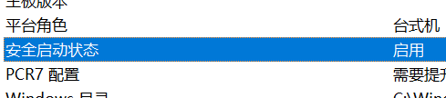

### 1. 下载Kubuntu镜像

进入Kubuntu官网：[Kubuntu | Friendly Computing](https://kubuntu.org/)，直接点击 *“Download Kubuntu”* ，网页将自动下载最新的LTS版Kubuntu。

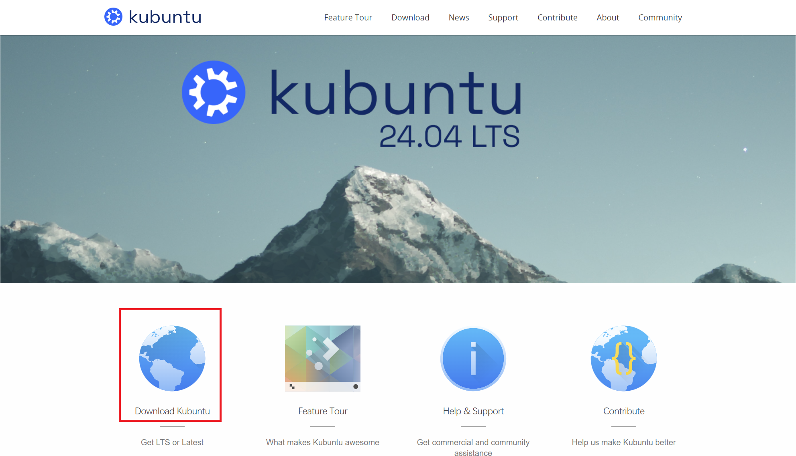

在点击后自动跳转的页面中，也可以自行下载以前版本的Kubuntu。默认情况下，上一步中自动下载的镜像是本页面中最上面的镜像，其镜像校验和在卡片中的 *“Alternative downloads, torrents, mirrors and check-sums ›”* 链接中，推荐在下载后检查一下校验和。

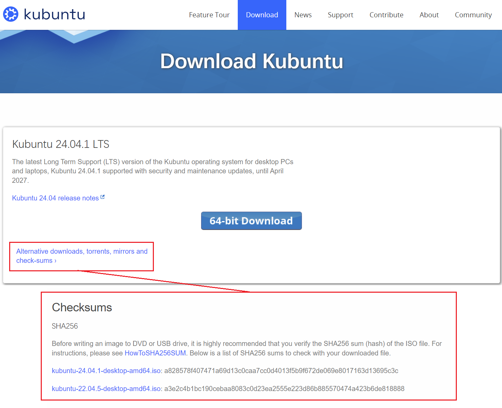

### 2. 烧写启动U盘

个人推荐使用 *Rufus* 这款软件进行系统盘烧写。具体操作步骤，在之前的[用树莓派躺床上玩PC游戏](../Playing%20PC%20games%20in%20bed%20with%20a%20Raspberry%20Pi%20-%20用树莓派躺床上玩PC游戏/Playing%20PC%20games%20in%20bed%20with%20a%20Raspberry%20Pi%20-%20用树莓派躺床上玩PC游戏.md)文章中的 *二、1.2* 中已经介绍过，在此不再赘述。

> Rufus可能会默认以MBR分区类型进行刷写，我还是推荐更改为GPT分区类型。

### 3. 进行必要备份

由于当下任何安装现代系统的操作都涉及到对EFI分区的读写，而且在操作过程中存在误操作将全盘擦除的风险（大佬小白都有可能湿鞋），所以提前对电脑重要数据进行备份，甚至直接进行全盘备份也是必要的，给自己留后悔药。关于全盘备份，在之前的[制作自己的Windows 7安装镜像](../Build%20your%20own%20Windows%207%20installation%20image%20-%20制作自己的Windows%207安装镜像/Build%20your%20own%20Windows%207%20installation%20image%20-%20制作自己的Windows%207安装镜像.md)文章中的 *一、4* 中已经介绍过，在此不再赘述。

### 4. 确定有足够空余存储空间

由于要安装双系统，所以需要提前保证在本地硬盘上有一定空余空间来进行Kubuntu的安装。鉴于我个人且大部分本文章的读者（我猜）都相对于Windows更加熟悉，所以我还是推荐在Windows上对本地硬盘进行操作。

对于腾出这片空余空间，一般有（不限于）以下几种情况：
1. 空间是在一开始装机的时候就提前预留的
   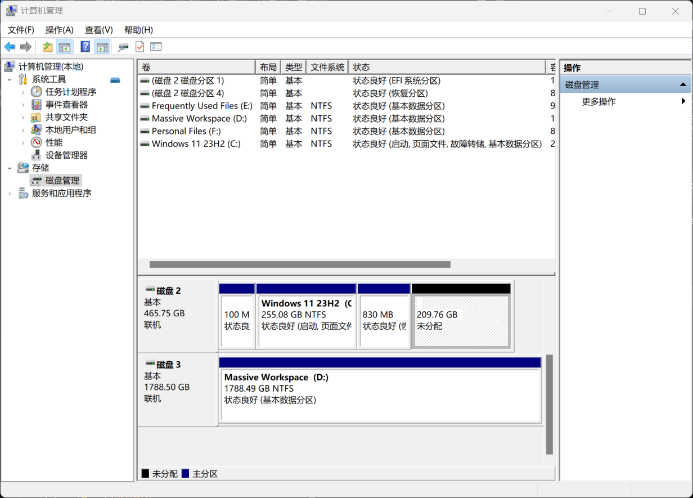
   *(我一开始是给黑苹果留的，那就更是个远古的大坑了……)*
2. 空间是通过缩小Windows系统分区得来的
3. 空间是通过缩小其他分区得来的
4. 空间是通过直接删除卷得来的
5. 空间是通过添加本地物理磁盘得来的
   
对于上面2.3.，可以使用 *“计算机管理”* 中的 *“磁盘管理”* 在对应分区上进行 *“压缩卷”* 来得到，或者推荐使用[数据恢复软件，硬盘分区工具，系统备份软件 - DiskGenius官方网站](https://www.diskgenius.cn/)来进行分区压缩。对于上面的4.，可以选择一个不再需要的分区（注意不是磁盘！），直接将其删除即可。

推荐将Kubuntu与Windows安装在同一磁盘上。即，如果你像上图一样在一台PC上连接了多个物理磁盘，假设Windows安装在**磁盘2**上，那么Kubuntu也最好安装在**磁盘2**上。如果你知道该如何编辑EFI分区以及EFI文件，则可忽略本段。

## 二、进行安装

### 1. 从启动U盘引导

请根据使用的PC主板说明，或OEM机器的说明，确认在开机时进入到默认系统前，选择其他引导媒介的快捷键。该快捷键通常会使UEFI进入到 *引导选择菜单* 。

> 例如，我所使用的开源UEFI *coreboot* 使用ESC键进入引导选择菜单，华擎主板使用F11，其他品牌也有使用F1、F2、F6、F7、F8、F10、F12等键。

在进入 *引导选择菜单* 后，选择插入的 *启动U盘* 。

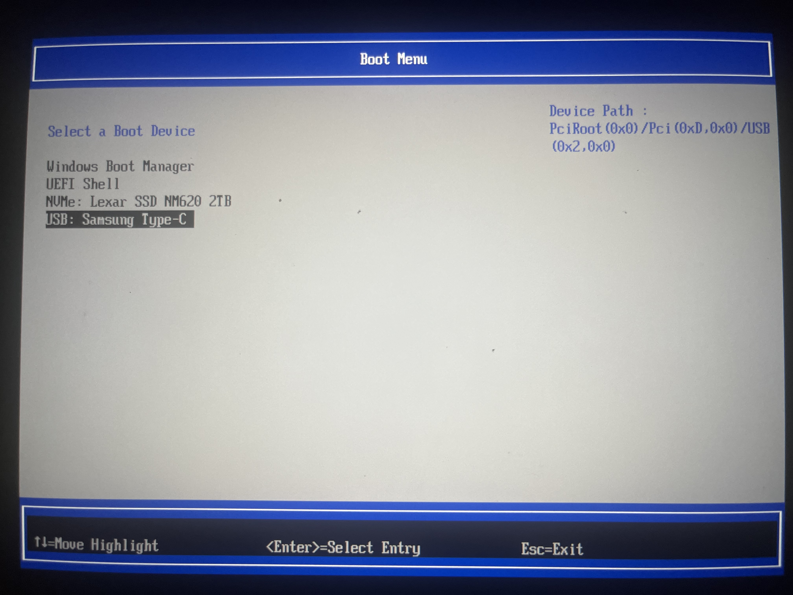

另一种选择是，由于本文介绍的是Windows已经安装到电脑中的情况，也可使用已经安装在Windows系统中的Windows Boot Manager（Windows启动管理器）引导进入启动U盘。

（以Windows 11为例）在PC运行中，将 *启动U盘* 插入PC，然后点击 *“开始菜单” - “电源”*，在按住键盘上的 *“Shift键”* 的同时，点击 *电源选项* 中的 *“↺重启”*。

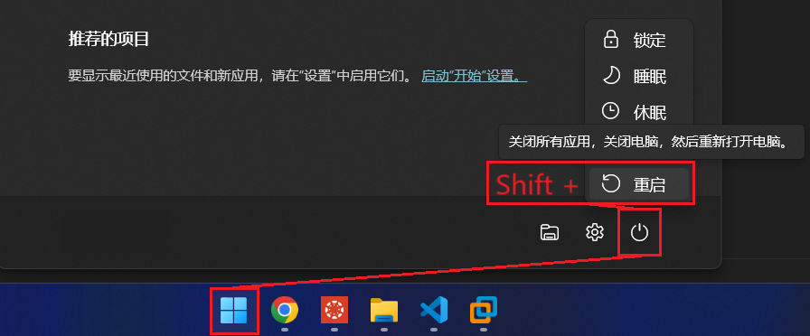  

之后Windows将进入Windows Boot Manager页面。点击 *“使用设备”* ，

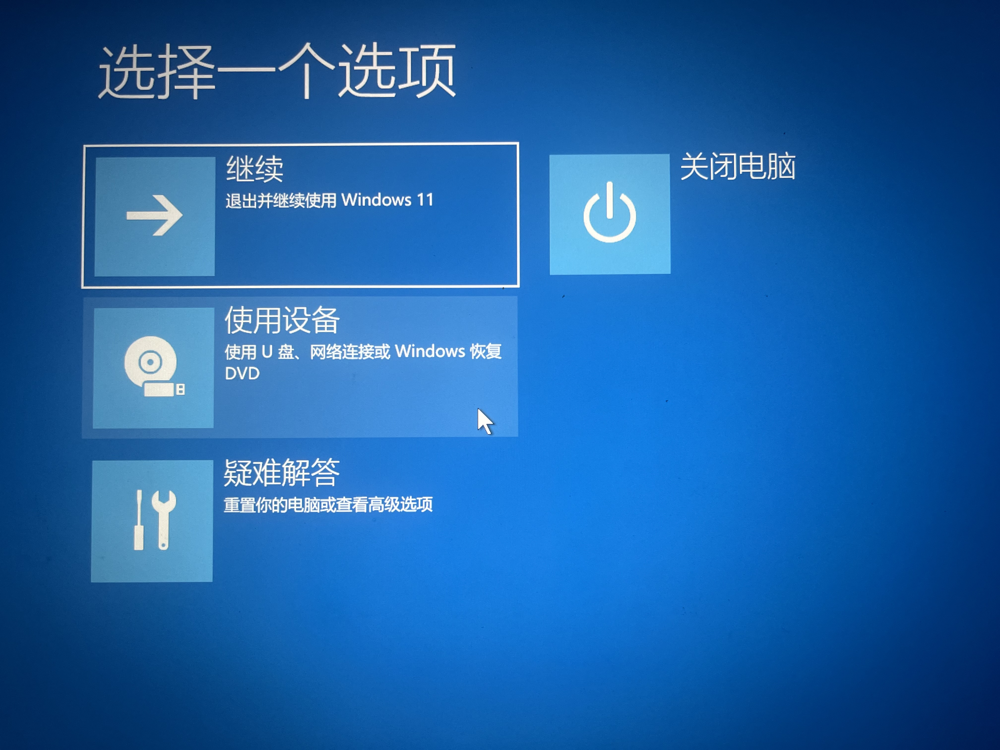

选择插入的 *启动U盘* 。

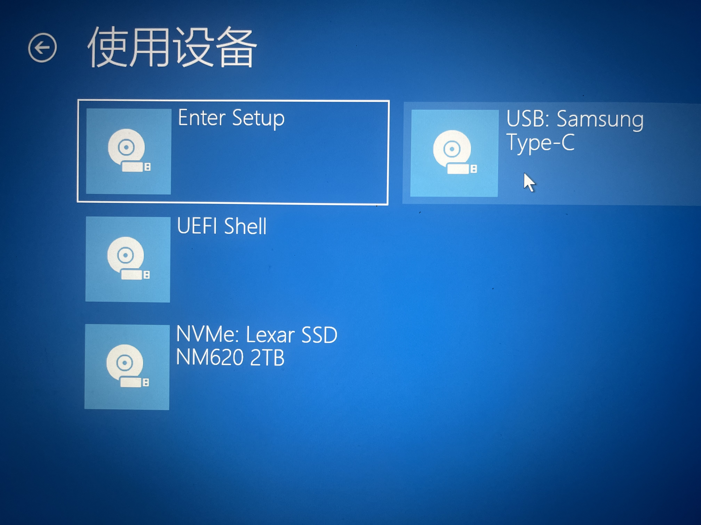

### 2. 安装Kubuntu

*（由于饶罗翔实在是太难绷了，因此此处选择在虚拟机上安装来方便截图。具体操作和实体机上相同，实在无法同步的点会继续饶罗翔）*

在上一步的操作之后，应该可以引导到安装U盘的GRUB界面：

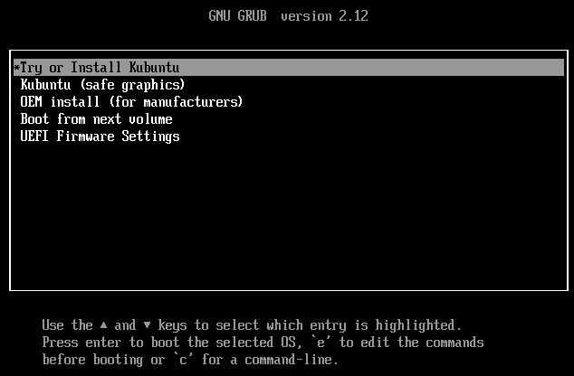

等待自动进入默认选项，或者使用键盘上的方向键，将高亮的选项选择到第一项 *“Try or Install Kubuntu”* ，然后按下 *回车（Enter）* 键。

稍等片刻，安装程序将进入GUI安装界面：

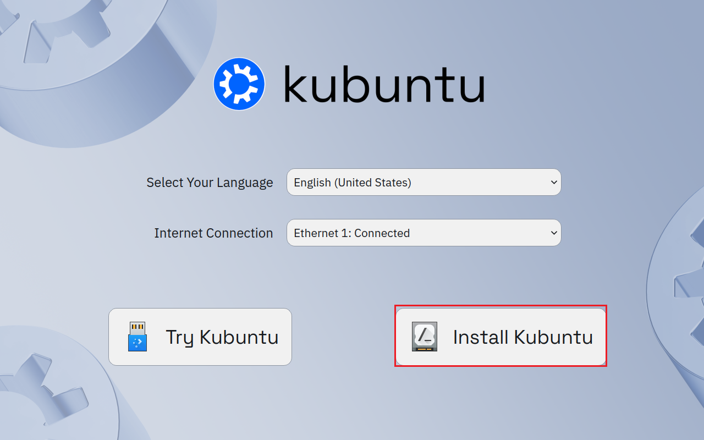

选择系统语言和网络连接，完成后点击 *“Install Kubuntu”* 。

> 之前有种说法是，在安装时尽量选择英语，因为一些Linux发行版在安装后会根据安装时选择的系统语言对 *主文件夹* 下的各默认用户分类文件夹使用对应的语言进行命名，如选择英语则有“Document”“Download”文件夹，选择中文则会有“文档”“下载”文件夹。一些优化或没有考虑到不同系统语言的软件可能会因为非英语用户分类文件夹名而产生问题。但就我个人近期使用经验，Manjaro Linux和Kubuntu均无这个问题；而且如果使用英文语言进行安装，则许多内置软件的中文界面包不会被系统安装程序自动安装，需要一个个地在系统安装后手动安装。因此此处的语言选项应按照具体情况选择，本文中将以 *简体中文 (中国) - Chinese (China)* 作为例子。

> 如果你可以顺畅通过网关连接到国际互联网，则我推荐在此处就连接到互联网；否则不推荐在此处联网，在系统安装完成后再联网。如果选择通过WiFi联网，点击 *“Internet Connection”* 菜单中的 *你的局域网SSID: Disconnected* ，然后输入你的 *WiFi密码* ，并点击 *“Connect”* 。

>  *“Try Kubuntu”* 选项将会将此Kubuntu启动U盘作为 *“LiveCD”* 启动，进入到一个小型的、临时的Linux环境中，类似于Windows的Windows PE系统，常用于故障恢复。

进入Kubuntu安装程序界面，点击 *“下一步”* ：

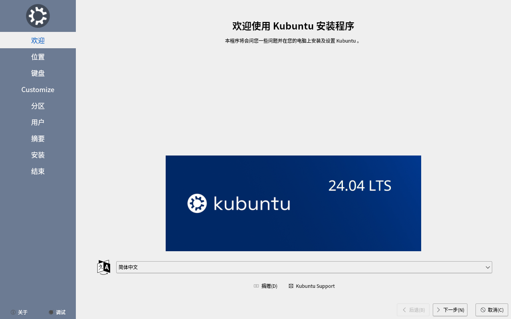

下一步，在 *“位置”* 选项卡中，设定 *“地区”* 和 *“区域”* （也可在 *地图* 上点击）。设定 *“数字和日期地域”* ，设定语言和字符集，然后点击 *“确定”* 。

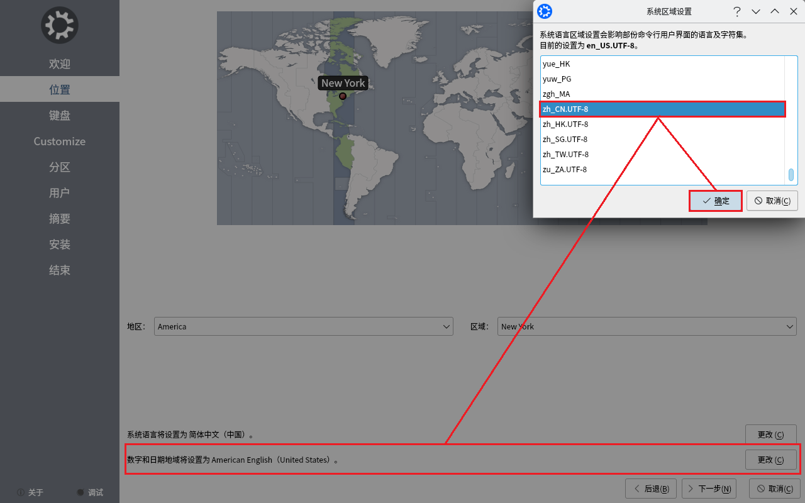

下一步，在 *“键盘”* 选项卡中，选择 *键盘布局* 。

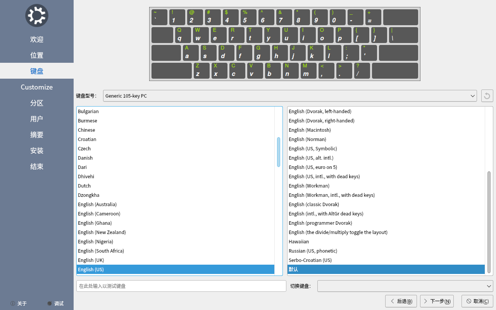

下一步，在 *“Customize（自定义）”* 选项卡中，选择 *“Installation Mode（安装模式）”* ，推荐默认 *“Normal Installation”* 。对于 *“Additional Options（附加选项）”* 中的 *“Download and install updates following installation（在安装后下载并安装更新）”* 复选框，如果在前面连入了国际互联网，则推荐在此处勾选，否则不推荐勾选。

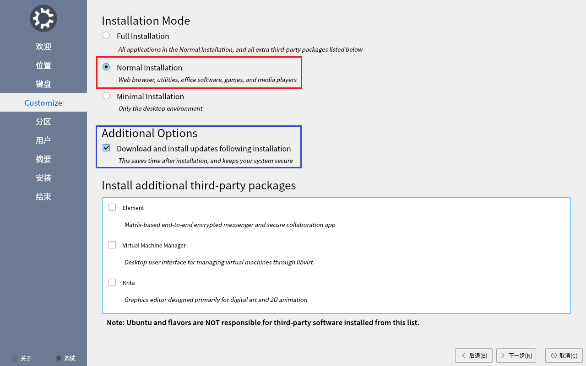

下一步，*“分区”* 选项卡，整个安装过程中最容易没有回头路的一步。

首先，在上方的 *“选择存储器”下拉菜单* 中选择要安装Kubuntu的正确的本地磁盘，如果在上面的 *一、准备工作* 中已经留出了空余空间，那么应该在此处能够在下面的 *分区表条状图* 中看到预留的空余磁盘空间。若是，选择上方的 *“取代一个分区”* 选项，并点击下方 *选择要安装到的分区 - 当前* 条状图中的 *（灰色）空闲空间* 条。在 *之后* 条状图中， *（红色）Kubuntu_2404* 即为Kubuntu安装后应该装载到的分区。

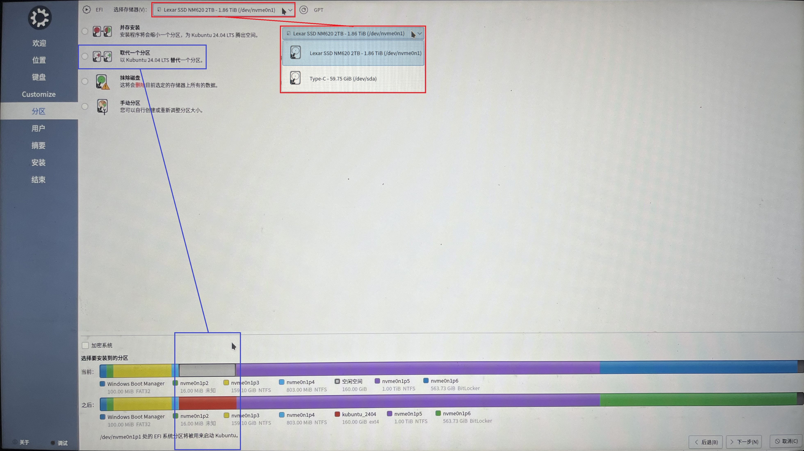

> 在选中 *“取代一个分区”* 选项后，其下方应该出现一个下拉菜单，选择分区文件系统。一般情况下默认的ext4即可。

> 如果选中下方 *“取代一个分区”* 选项上面的 *“加密系统”* 复选框，则会使得安装后的Kubuntu系统分区被LUKS加密。这个加密类似于Windows下的Bitlocker，执行全盘加密，通过提供有效密钥来进行解密，不同的是Bitlocker在TPM下可以通过验证Windows管理员账户密钥来进行解密，也可通过独立的单个密钥解密，LUKS不通过TPM所以只需提供独立密钥解密，但可以使用多个密钥解密。Android中的User分区加密类似。

> 由于已经安装了Windows，所以PC上应已存在现有的EFI分区。该分区将会被Kubuntu自动识别，显示为最下方的 *“...处的 EFI 系统分区将被用来启动 Kubuntu”*。 

下一步，在 *“用户”* 选项卡中，输入 *“您的姓名？”“您想要使用的登陆用户名是？”“计算机名称为？”“选择一个密码来保证您的账户安全。”* 。

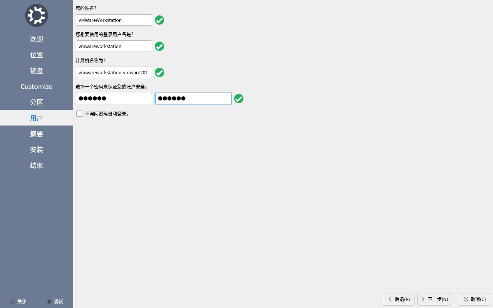

> 极不推荐密码留空，即使勾选 *“不询问密码自动登录”*。

下一步，在 *“摘要”* 选项卡中，最后检查一下各项设置，尤其是 *“分区”* 项是否正确。

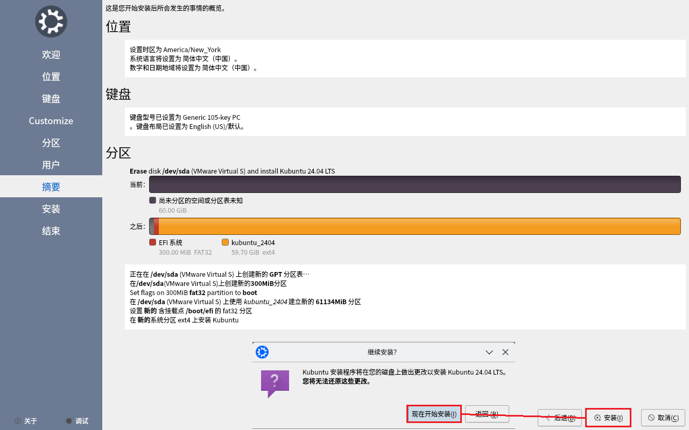  
*（这是虚拟机上的截图，和实机不符，仅作参考）*

检查无误后，点击 *“▶️⬇️安装”* 按钮，在弹出的 *“继续安装？”* 窗口中，点击 *“现在开始安装”* ，进行正式安装。

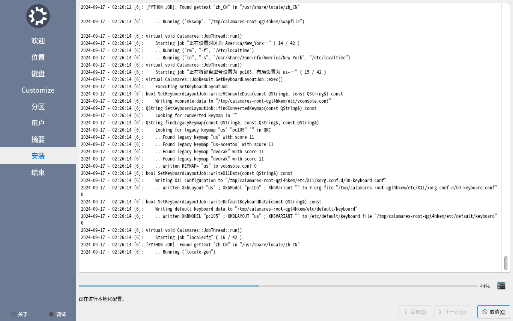  

> 如果未连接到国际互联网，且在前面勾选了 *“Download and install updates following installation”* 复选框，则这一步可能将等待极长时间。

之后安装完成，在 *“结束”* 选项卡中保持默认勾选的 *“现在重启”* 复选框，点击 *“完成”* 按钮，自此Windows + Kubuntu双系统正式完成安装。之后还需要进行一些设置，不过起码U盘不用一直插着了。

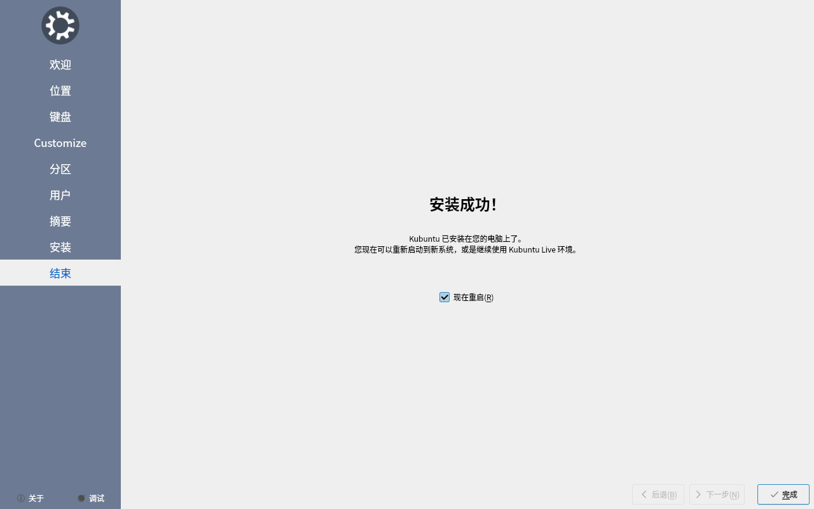  

> 若在重启过程中出现 *“Please remove the installation medium, then press ENTER:”* 字样，拔下 *启动U盘* 并按 *回车（Enter）* 键。*（在虚拟机上又忘截图了，淦）*

重启并登录后，即可进入Kubuntu的OOBE页面：

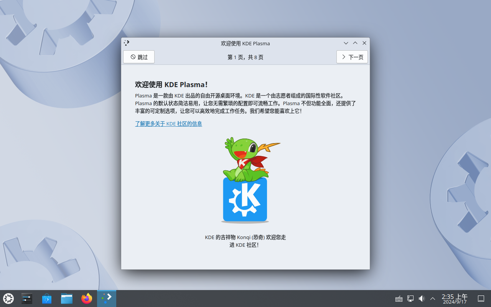  
*（虚拟机截完图就可以删了，哦耶）*

## 三、正式使用前的一些设置

以下操作均非必须，仅按个人需求说明。

### 1. 安装Chrome浏览器

由于这篇文章是在另一台Windows PC上用VS Code写的，我习惯使用[PairDrop | Transfer Files Cross-Platform. No Setup, No Signup.](https://pairdrop.net/)来通过网页在局域网中传输少量数据，这就必须要先经过网络浏览器，我还是惯用自己习惯的浏览器。

很不幸地，KDE官方应用市场（[Discover 软件管理中心 - KDE 应用程序](https://apps.kde.org/zh-cn/discover/)）并未提供Google Chrome浏览器（可能是因为不开源？记得以前在Arch系中的AUX装过）。不过，可以通过Chrome浏览器官网安装.deb包的形式来安装。

首先，下载Chrome浏览器：
[Google Chrome - 快速安全的网络浏览器，专为您而打造](https://www.google.com/chrome/)，进入官网后，点击 *“下载 Chrome”* ，然后在弹出的控件中保持默认选项 *“64 位 .deb （适用于 Debian/Ubuntu）”* ，然后点击 *“接受并安装”* 。 

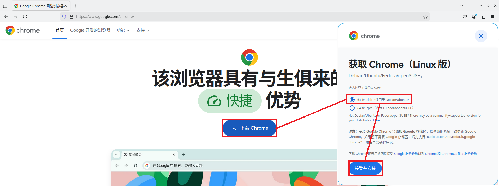

在 *Dolphin 文件管理器* 中定位到 *“下载（Download）”* 文件夹，找到下载的`google-chrome-stable_current_amd64.deb`文件，在其上 *右键 - 打开方式 - Discover 软件管理中心* ，使用 *Discover 软件管理中心* 打开该软件包。

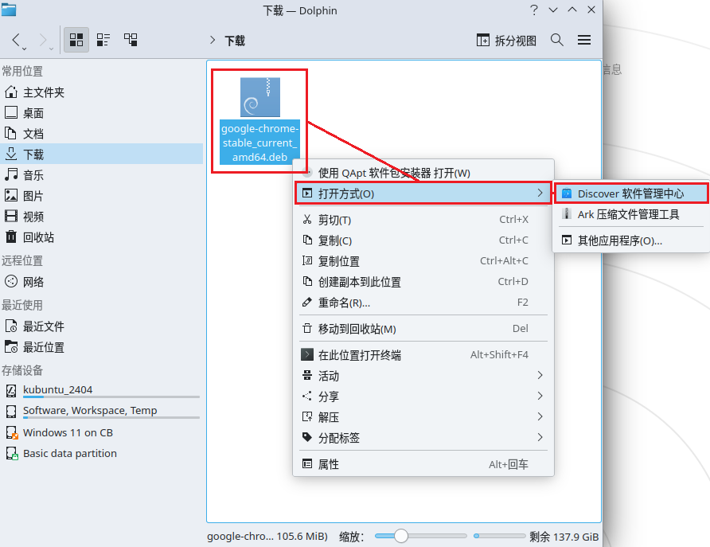

> *Discover 软件管理中心* 可以自动解决.deb软件包的依赖问题。

在打开的 *Discover 软件管理中心* 页面中，点击右上角的 *“⬇️安装”* 按钮，在弹出的 *“需要进行身份验证 — PolicyKit1 KDE 代理程序”* 窗口中，输入在安装Ubuntu时的账户密码 *（以下统称“账户密码”）* ，然后点击 *“确定”* 按钮。

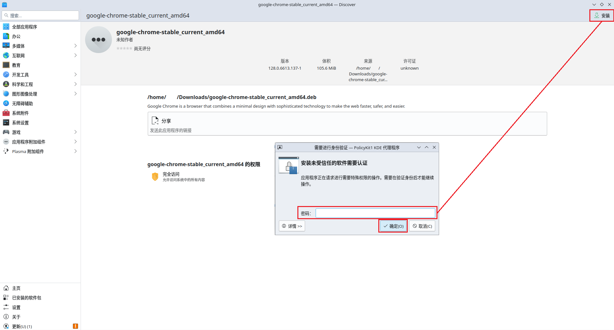

等待Discover安装Chrome软件包即可。在启动Chrome浏览器后，可能会先弹出以下的 *“KDE 密码库服务”* 弹窗：

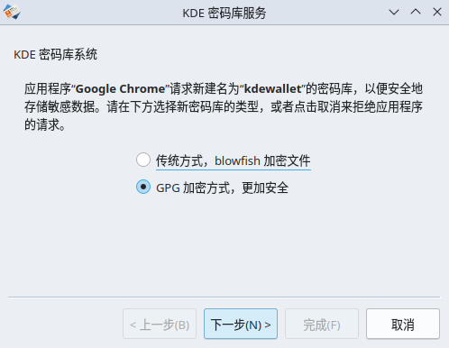

一开始没太搞明白这个密码库是干啥的，一直放着没管，结果有一次重启之后发现开启Chrome不再弹出这个窗口，而是直接询问密码库密码。试着输入了 *账户密码* ，结果就通过了，怀疑是Chrome直接创建了一个以blowfish方式加密、使用 *账户密码* 作为密钥的密码库？

### 2. 调整主题、字体DPI、桌面缩放、夜间模式

**2.1 调整全局主题**

依次打开 *“应用程序启动器 - 设置 - 系统设置”* ，进入 *系统设置* 。点击左侧栏的 *“外观”* ，进入 *外观设置* 。在默认进入的 *“全局主题”* 设置项中，选择一个自己喜欢的全局主题，此处以 *“Breeze 微风深色”* 为例。点击 *“Breeze 微风深色”* ，在弹出的 *“应用...吗？”* 窗口中，依喜好勾选自定义选项，并点击 *“确定”* 按钮。

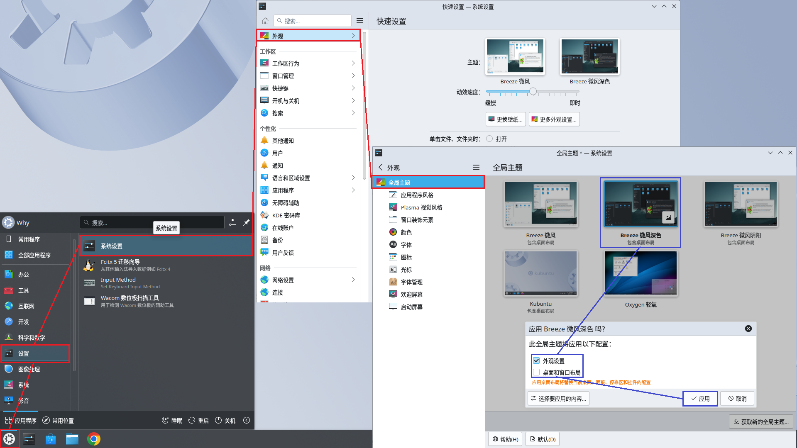

**2.2 调整字体DPI**

**这一步是非必要的。**  
//TODO

**2.3 调整桌面缩放**

**请一定在调整字体DPI后再调整桌面缩放。**  
在 *系统设置* 中点击左侧栏的 *“硬件 - 显卡与显示器”* ，进入 *显卡与显示器设置* 。点击 *“显示器配置”* ，在右侧的 *“全局缩放率”* 中，调整自己喜欢的缩放倍率，然后点击 *“应用”* 按钮。与Windows下调整桌面缩放类似，在更改缩放倍率后，需要 *注销并重新登录* 或 *重启* 。

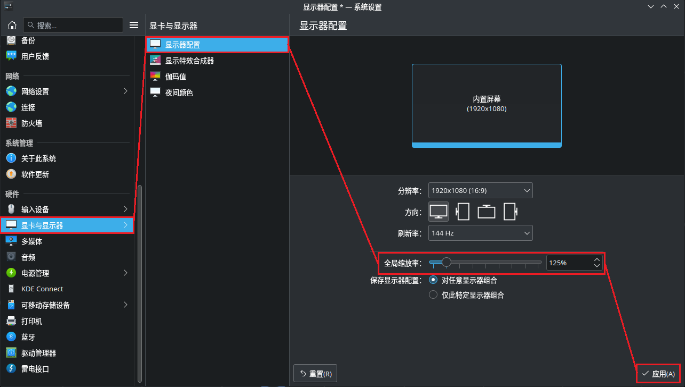

**2.4 启用夜间模式**

在 *系统设置* 中点击左侧栏的 *“硬件 - 显卡与显示器”* ，进入 *显卡与显示器设置* 。点击 *“夜间颜色”* ，在右侧的 *“夜间颜色”* 设置中，依喜好调整，然后点击 *“应用”* 按钮。

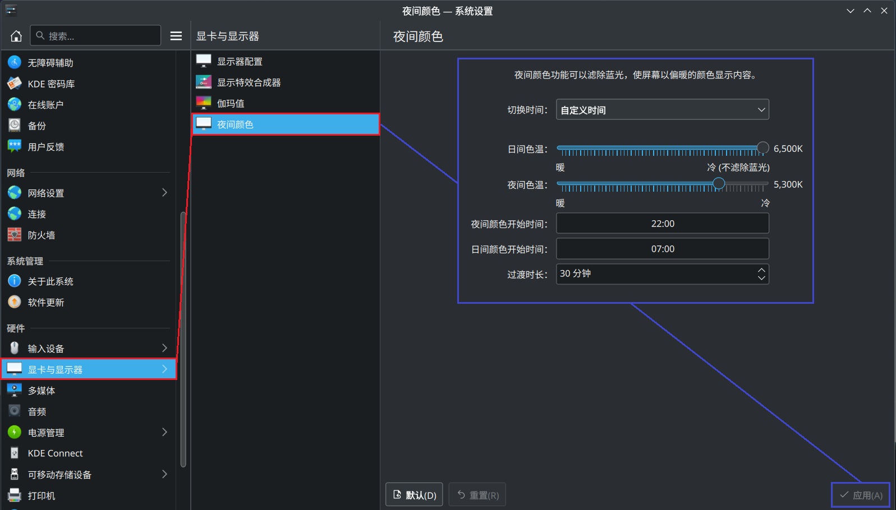

### 3. 安装与更改字体

