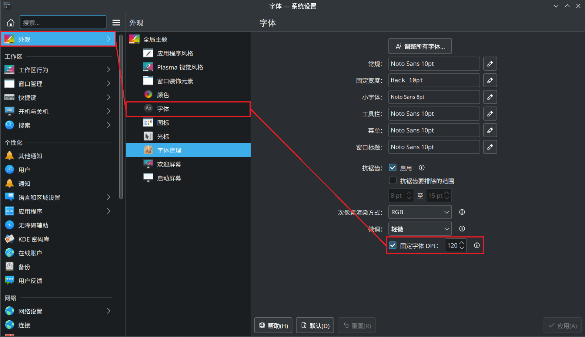
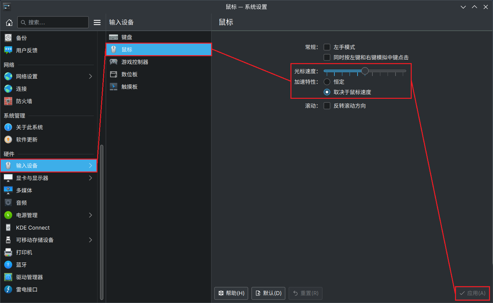
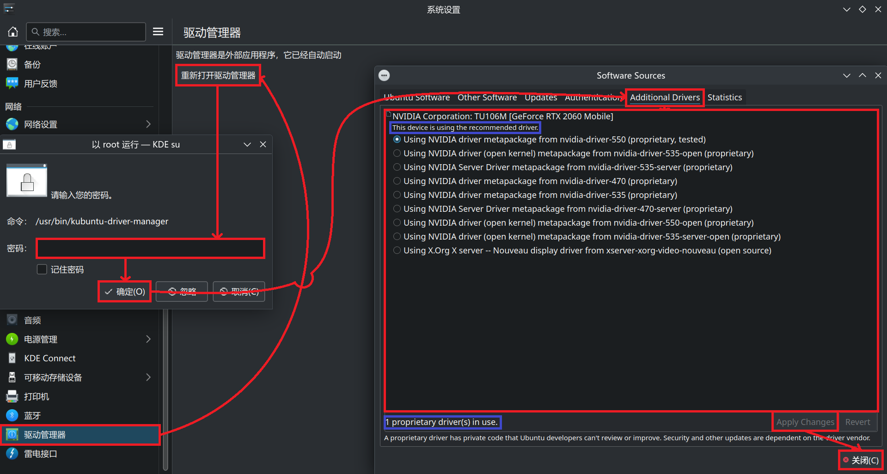
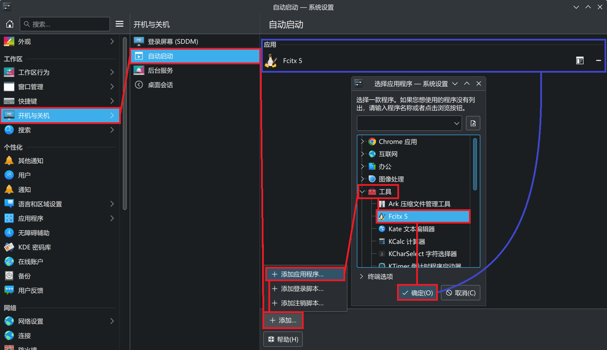
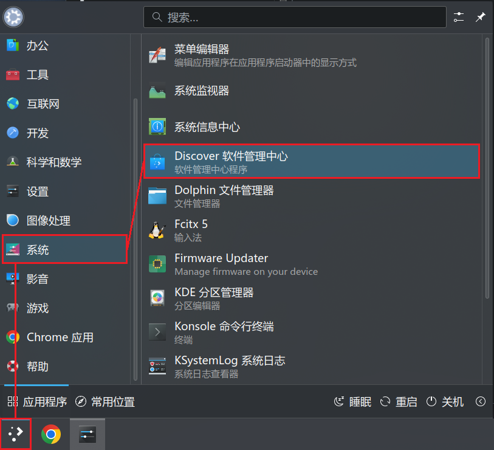
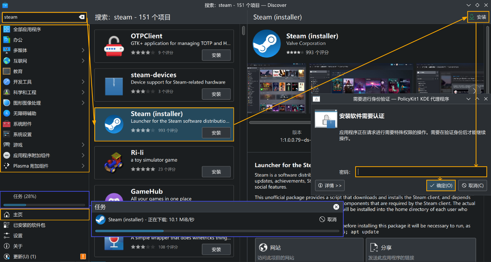
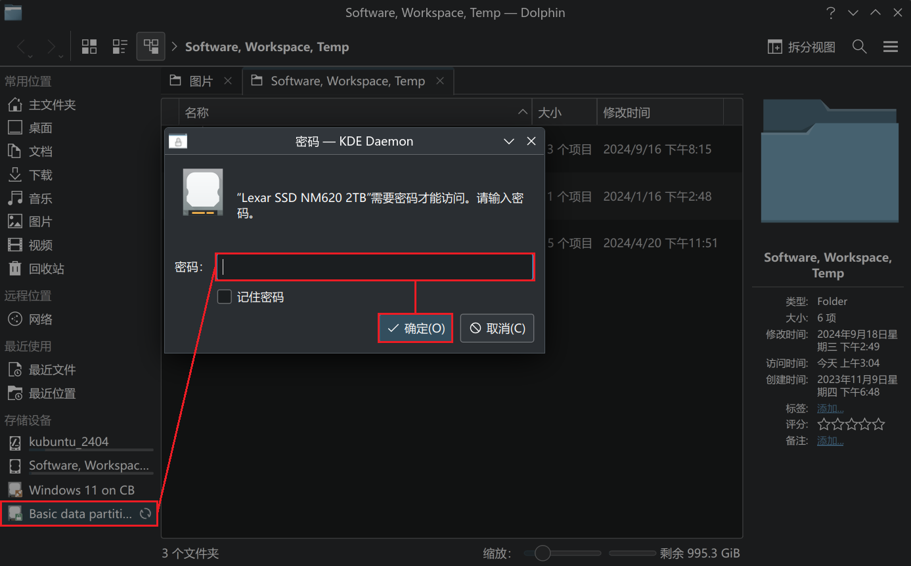
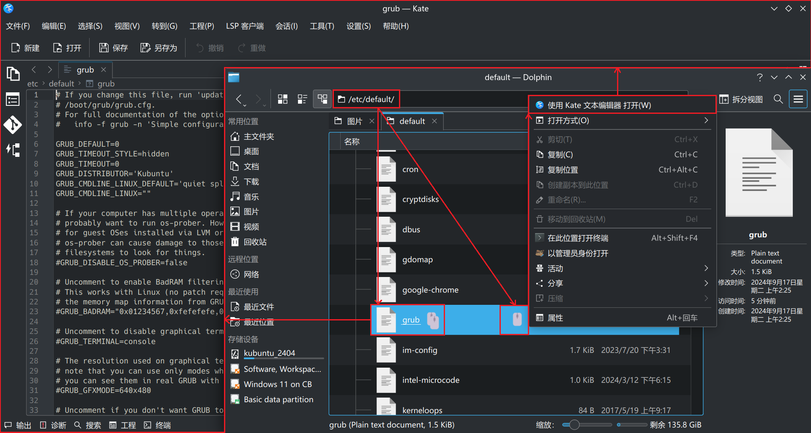

# Windows 11 + Kubuntu双系统安全启动和使用体验

*版本：1.0*

查看Github渲染器中的**目录**：使用Github Markdown渲染页面右上角的“菜单”（⋮☰）按钮。

---


网络上有很多关于使Windows 10以上的Windows系统和Linux系统多重启动的文章，第一件事便是要求关闭UEFI中的安全启动功能，甚至这算作是一项必要条件。我理解很多Linux用户对于微软主导的安全启动嗤之以鼻甚至恨之入骨（见过有的Arch Linux社区问安全启动就关帖），但是吧，我认为安全启动还是有一定可取之处的。比如说我主力平台是Windows 11，而且Bitlocker对于我来说是真的有用😂。所以还是不想在关闭安全启动的情况下，希望Linux和Windows可以共存。

在之前弃过坑的，在PC上使用Manjaro Linux并尝试安全启动，在多种方式多次失败之后（超长的挫败历程），最后只能遗憾地其装进虚拟机。之前（202405）再次尝试再次失败（在联想拯救者R9000P 2020上，MokManager死活无法录入rEFInd的签名，不知道是不是主板限制）。不过听说这几年终于有Linux发行版将其引导efi文件签入了安全启动密钥库，其中就有大名鼎鼎的Ubuntu。Arch系及其衍生发行版如Manjaro Linux极度痛恨安全启动，就别想了。由于之前使用Manjaro KDE Plasma给我留下了很深的印象，我非常想要继续在KDE Plasma上的桌面体验，于是便找到了Kubuntu——默认使用KDE Plasma桌面环境的Ubuntu分支。

（本来打算5月写的，后来躺了，开学了之后课上要求必须使用Linux被强制催更……）

## 一、准备工作

本文章将在已安装Windows 11系统 + 已启用安全启动的情况下进行说明。

**检查Windows下的安全启动状态**

如果PC是购买的OEM机器，那么一般情况下默认是开启了安全启动。对于Windows 8~11，可以使用如下方法在系统内快速确定：
按 *“Windows徽标键 + R”* 或从 *“开始菜单”* 打开 *“运行”* 窗口，输入`msinfo32`，并确定，打开 *“系统信息”* 。

在打开的 *系统信息* 页面中，向下滚动，找到 *“安全启动状态”项目* ，如果 *值* 显示为 *“启用”* ，则安全启动已启用。


### 1. 下载Kubuntu镜像

进入Kubuntu官网：[Kubuntu | Friendly Computing](https://kubuntu.org/)，直接点击 *“Download Kubuntu”* ，网页将自动下载最新的LTS版Kubuntu。


在点击后自动跳转的页面中，也可以自行下载以前版本的Kubuntu。默认情况下，上一步中自动下载的镜像是本页面中最上面的镜像，其镜像校验和在卡片中的 *“Alternative downloads, torrents, mirrors and check-sums ›”* 链接中，推荐在下载后检查一下校验和。


### 2. 烧写启动U盘

个人推荐使用 *Rufus* 这款软件进行系统盘烧写。具体操作步骤，在之前的[用树莓派躺床上玩PC游戏](../Playing%20PC%20games%20in%20bed%20with%20a%20Raspberry%20Pi%20-%20用树莓派躺床上玩PC游戏/Playing%20PC%20games%20in%20bed%20with%20a%20Raspberry%20Pi%20-%20用树莓派躺床上玩PC游戏.md)文章中的 *二、1.2* 中已经介绍过，在此不再赘述。

> Rufus可能会默认以MBR分区类型进行刷写，我还是推荐更改为GPT分区类型。

### 3. 进行必要备份

由于当下任何安装现代系统的操作都涉及到对EFI分区的读写，而且在操作过程中存在误操作将全盘擦除的风险（大佬小白都有可能湿鞋），所以提前对电脑重要数据进行备份，甚至直接进行全盘备份也是必要的，给自己留后悔药。关于全盘备份，在之前的[制作自己的Windows 7安装镜像](../Build%20your%20own%20Windows%207%20installation%20image%20-%20制作自己的Windows%207安装镜像/Build%20your%20own%20Windows%207%20installation%20image%20-%20制作自己的Windows%207安装镜像.md)文章中的 *一、4* 中已经介绍过，在此不再赘述。

### 4. 确定有足够空余存储空间

由于要安装双系统，所以需要提前保证在本地硬盘上有一定空余空间来进行Kubuntu的安装。鉴于我个人且大部分本文章的读者（我猜）都相对于Windows更加熟悉，所以我还是推荐在Windows上对本地硬盘进行操作。

对于腾出这片空余空间，一般有（不限于）以下几种情况：
1. 空间是在一开始装机的时候就提前预留的
   
   *(我一开始是给黑苹果留的，那就更是个远古的大坑了……)*
2. 空间是通过缩小Windows系统分区得来的
3. 空间是通过缩小其他分区得来的
4. 空间是通过直接删除卷得来的
5. 空间是通过添加本地物理磁盘得来的
   
对于上面2.3.，可以使用 *“计算机管理”* 中的 *“磁盘管理”* 在对应分区上进行 *“压缩卷”* 来得到，或者推荐使用[数据恢复软件，硬盘分区工具，系统备份软件 - DiskGenius官方网站](https://www.diskgenius.cn/)来进行分区压缩。对于上面的4.，可以选择一个不再需要的分区（注意不是磁盘！），直接将其删除即可。

推荐将Kubuntu与Windows安装在同一磁盘上。即，如果你像上图一样在一台PC上连接了多个物理磁盘，假设Windows安装在**磁盘2**上，那么Kubuntu也最好安装在**磁盘2**上。如果你知道该如何编辑EFI分区以及EFI文件，则可忽略本段。

## 二、进行安装

### 1. 从启动U盘引导

请根据使用的PC主板说明，或OEM机器的说明，确认在开机时进入到默认系统前，选择其他引导媒介的快捷键。该快捷键通常会使UEFI进入到 *引导选择菜单* 。

> 例如，我所使用的开源UEFI *coreboot* 使用ESC键进入引导选择菜单，华擎主板使用F11，其他品牌也有使用F1、F2、F6、F7、F8、F10、F12等键。

在进入 *引导选择菜单* 后，选择插入的 *启动U盘* 。


另一种选择是，由于本文介绍的是Windows已经安装到电脑中的情况，也可使用已经安装在Windows系统中的 *Windows Boot Manager（Windows启动管理器）* 引导进入启动U盘。

（以Windows 11为例）在PC运行中，将 *启动U盘* 插入PC，然后点击 *“开始菜单” - “电源”*，在按住键盘上的 *“Shift键”* 的同时，点击 *电源选项* 中的 *“↺重启”*。

  

之后Windows将进入Windows Boot Manager页面。点击 *“使用设备”* ，


选择插入的 *启动U盘* 。


### 2. 安装Kubuntu

*（由于饶罗翔实在是太难绷了，因此此处选择在虚拟机上安装来方便截图。具体操作和实体机上相同，实在无法同步的点会继续饶罗翔）*

在上一步的操作之后，应该可以引导到安装U盘的GRUB界面：


等待自动进入默认选项，或者使用键盘上的方向键，将高亮的选项选择到第一项 *“Try or Install Kubuntu”* ，然后按下 *回车（Enter）* 键。

稍等片刻，安装程序将进入GUI安装界面：


选择系统语言和网络连接，完成后点击 *“Install Kubuntu”* 。

> 之前有种说法是，在安装时尽量选择英语，因为一些Linux发行版在安装后会根据安装时选择的系统语言对 *主文件夹* 下的各默认用户分类文件夹使用对应的语言进行命名，如选择英语则有“Document”“Download”文件夹，选择中文则会有“文档”“下载”文件夹。一些优化或没有考虑到不同系统语言的软件可能会因为非英语用户分类文件夹名而产生问题。但就我个人近期使用经验，Manjaro Linux和Kubuntu均无这个问题；而且如果使用英文语言进行安装，则许多内置软件的中文界面包不会被系统安装程序自动安装，需要一个个地在系统安装后手动安装。因此此处的语言选项应按照具体情况选择，本文中将以 *简体中文 (中国) - Chinese (China)* 作为例子。

> 如果你可以顺畅通过网关连接到国际互联网，则我推荐在此处就连接到互联网；否则不推荐在此处联网，在系统安装完成后再联网。如果选择通过WiFi联网，点击 *“Internet Connection”* 菜单中的 *你的局域网SSID: Disconnected* ，然后输入你的 *WiFi密码* ，并点击 *“Connect”* 。

>  *“Try Kubuntu”* 选项将会将此Kubuntu启动U盘作为 *“LiveCD”* 启动，进入到一个小型的、临时的Linux环境中，类似于Windows的Windows PE系统，常用于故障恢复。

进入Kubuntu安装程序界面，点击 *“下一步”* ：


下一步，在 *“位置”* 选项卡中，设定 *“地区”* 和 *“区域”* （也可在 *地图* 上点击）。设定 *“数字和日期地域”* ，设定语言和字符集，然后点击 *“确定”* 。


下一步，在 *“键盘”* 选项卡中，选择 *键盘布局* 。


下一步，在 *“Customize（自定义）”* 选项卡中，选择 *“Installation Mode（安装模式）”* ，推荐默认 *“Normal Installation”* 。对于 *“Additional Options（附加选项）”* 中的 *“Download and install updates following installation（在安装后下载并安装更新）”* 复选框，如果在前面连入了国际互联网，则推荐在此处勾选，否则不推荐勾选。


下一步，*“分区”* 选项卡，整个安装过程中最容易没有回头路的一步。

首先，在上方的 *“选择存储器”下拉菜单* 中选择要安装Kubuntu的正确的本地磁盘，如果在上面的 *一、准备工作* 中已经留出了空余空间，那么应该在此处能够在下面的 *分区表条状图* 中看到预留的空余磁盘空间。若是，选择上方的 *“取代一个分区”* 选项，并点击下方 *选择要安装到的分区 - 当前* 条状图中的 *（灰色）空闲空间* 条。在 *之后* 条状图中， *（红色）Kubuntu_2404* 即为Kubuntu安装后应该装载到的分区。


> 在选中 *“取代一个分区”* 选项后，其下方应该出现一个下拉菜单，选择分区文件系统。一般情况下默认的ext4即可。

> 如果选中下方 *“取代一个分区”* 选项上面的 *“加密系统”* 复选框，则会使得安装后的Kubuntu系统分区被LUKS加密。这个加密类似于Windows下的Bitlocker，执行全盘加密，通过提供有效密钥来进行解密，不同的是Bitlocker在TPM下可以通过验证Windows管理员账户密钥来进行解密。Android中的User分区加密类似。

> 由于已经安装了Windows，所以PC上应已存在现有的EFI分区。该分区将会被Kubuntu自动识别，显示为最下方的 *“...处的 EFI 系统分区将被用来启动 Kubuntu”*。 

下一步，在 *“用户”* 选项卡中，输入 *“您的姓名？”“您想要使用的登陆用户名是？”“计算机名称为？”“选择一个密码来保证您的账户安全。”* 。


> 极不推荐密码留空，即使勾选 *“不询问密码自动登录”*。

下一步，在 *“摘要”* 选项卡中，最后检查一下各项设置，尤其是 *“分区”* 项是否正确。

  
*（这是虚拟机上的截图，和实机不符，仅作参考）*

检查无误后，点击 *“▶️⬇️安装”* 按钮，在弹出的 *“继续安装？”* 窗口中，点击 *“现在开始安装”* ，进行正式安装。

  

> 如果未连接到国际互联网，且在前面勾选了 *“Download and install updates following installation”* 复选框，则这一步可能将等待极长时间。

之后安装完成，在 *“结束”* 选项卡中保持默认勾选的 *“现在重启”* 复选框，点击 *“完成”* 按钮，自此Windows + Kubuntu双系统正式完成安装。之后还需要进行一些设置，不过起码U盘不用一直插着了。

  

> 若在重启过程中出现 *“Please remove the installation medium, then press ENTER:”* 字样，拔下 *启动U盘* 并按 *回车（Enter）* 键。*（在虚拟机上又忘截图了，淦）*

重启并登录后，即可进入Kubuntu的OOBE页面：

  
*（虚拟机截完图就可以删了，哦耶）*

## 三、正式使用前的一些设置

以下操作均非必须，仅按个人需求说明。

### 1. 安装Chrome浏览器

由于这篇文章是在另一台Windows PC上用VS Code写的，我习惯使用[PairDrop | Transfer Files Cross-Platform. No Setup, No Signup.](https://pairdrop.net/)来通过网页在局域网中传输少量数据，这就必须要先经过网络浏览器，我还是惯用自己习惯的浏览器。

很不幸地，KDE官方应用市场（[Discover 软件管理中心 - KDE 应用程序](https://apps.kde.org/zh-cn/discover/)）并未提供Google Chrome浏览器（可能是因为不开源？记得以前在Arch系中的AUX装过）。不过，可以通过Chrome浏览器官网安装.deb包的形式来安装。

首先，下载Chrome浏览器：
[Google Chrome - 快速安全的网络浏览器，专为您而打造](https://www.google.com/chrome/)，进入官网后，点击 *“下载 Chrome”* ，然后在弹出的控件中保持默认选项 *“64 位 .deb （适用于 Debian/Ubuntu）”* ，然后点击 *“接受并安装”* 。 


在 *Dolphin 文件管理器* 中定位到 *“下载（Download）”* 文件夹，找到下载的`google-chrome-stable_current_amd64.deb`文件，在其上 *右键 - 打开方式 - Discover 软件管理中心* ，使用 *Discover 软件管理中心* 打开该软件包。


> *Discover 软件管理中心* 可以自动解决.deb软件包的依赖问题。

在打开的 *Discover 软件管理中心* 页面中，点击右上角的 *“⬇️安装”* 按钮，在弹出的 *“需要进行身份验证 — PolicyKit1 KDE 代理程序”* 窗口中，输入在安装Ubuntu时的账户密码 *（以下统称 *“账户密码”* ）* ，然后点击 *“确定”* 按钮。


等待Discover安装Chrome软件包即可。在启动Chrome浏览器后，可能会先弹出以下的 *“KDE 密码库服务”* 弹窗：


一开始没太搞明白这个密码库是干啥的，一直放着没管，结果有一次重启之后发现开启Chrome不再弹出这个窗口，而是直接询问密码库密码。试着输入了 *账户密码* ，结果就通过了，怀疑是Chrome直接创建了一个以blowfish方式加密、使用 *账户密码* 作为密钥的密码库？

### 2. 调整主题、字体DPI、桌面缩放、夜间模式

**2.1 调整全局主题**

依次打开 *“应用程序启动器 - 设置 - 系统设置”* ，进入 *系统设置* 。点击左侧栏的 *“外观”* ，进入 *外观设置* 。在默认进入的 *“全局主题”* 设置项中，选择一个自己偏好的全局主题，此处以 *“Breeze 微风深色”* 为例。点击 *“Breeze 微风深色”* ，在弹出的 *“应用...吗？”* 窗口中，依喜好勾选自定义选项，并点击 *“确定”* 按钮。


**2.2 调整字体DPI（可选）**

DPI（Dots Per Inch，每英寸点数）是指每一英寸长度中，取样或可显示或输出点的数目。对于显示器，这个值应被定义为PPI（Pixels Per Inch，每英寸像素数）。

$$PPI = \frac{\sqrt{像素宽度（个）^2 + 像素高度（个）^2}}{屏幕斜对角长度（英寸）}$$

例如我的笔记本屏幕为1920*1080像素，15.6英寸，则结果为PPI=141.2。[DPI Calculator / PPI Calculator](https://www.sven.de/dpi/)这个网站可以快速计算出屏幕PPI。

调整显示DPI与屏幕PPI相同有助于系统显示字体更加清晰、渲染更加精确，但同时也会因为字体大小调整而带来整体UI比例上的变化。因此这一项调整是非必要的。**如果仅是想要调整字体大小或者调整UI缩放大小，请不要调整此项。字体DPI设置和UI缩放会互相覆盖。**

在 *系统设置* 中点击左侧栏的 *“外观”* ，进入 *外观设置* 。点击 *“字体”* ，在右侧的 *“字体”* 设置页面中，勾选 *“固定字体 DPI”* 并输入要设定的DPI值。



**2.3 调整桌面缩放**

**如果上一步中调整了DPI，则这一步将覆盖上一步的操作。**  
在 *系统设置* 中点击左侧栏的 *“硬件 - 显卡与显示器”* ，进入 *显卡与显示器设置* 。点击 *“显示器配置”* ，在右侧的 *“全局缩放率”* 中，调整自己偏好的缩放倍率，然后点击 *“应用”* 按钮。与Windows下调整桌面缩放类似，在更改缩放倍率后，需要 *注销并重新登录* 或 *重启* 。


**2.4 启用夜间模式**

在 *系统设置* 中点击左侧栏的 *“硬件 - 显卡与显示器”* ，进入 *显卡与显示器设置* 。点击 *“夜间颜色”* ，在右侧的 *“夜间颜色”* 设置中，依喜好调整，然后点击 *“应用”* 按钮。


### 3. 安装与更改字体

**3.1 安装字体**

&ensp;&ensp;&ensp;&ensp;**3.1.a 从文件安装字体**

许多Linux发行版使用的默认系统字体“Noto Sans”，在显示中文上，会使得字体偏窄（我都怀疑Noto Sans中是否包含有中文字体，当显示中文时是不是找的缺省字体代替了）。因此当使用中文作为系统语言时，替换系统字体还是蛮必要的。

虽然KDE官方提供了在线字体库，可以直接在系统设置内下载，但我搜了一下我喜欢的两款开源字体：“Fira Code”和“更纱黑体”都没有……因此还是从第三方下载吧。

本文以 *“更纱黑体”* 为例：进入 *“更纱黑体”* 仓库：[be5invis/Sarasa-Gothic: Sarasa Gothic / 更纱黑体 / 更紗黑體 / 更紗ゴシック / 사라사 고딕](https://github.com/be5invis/Sarasa-Gothic)，在 *“Release”* 中选择偏好的字体包下载（给选择困难的人：作为系统字体，下载`SarasaUiSC-TTF-x.x.xx.7z`）。

下载后解压到单独的文件夹，例如`/home/user/Downloads/SarasaUiSC-TTF-1.0.20/`。

在 *系统设置* 中点击左侧栏的 *“外观”* ，进入 *外观设置* 。点击 *“字体管理”* ，在右侧的 *“字体管理”* 设置页面中，点击 *“从文件安装”* 按钮。


在打开的 *“打开文件”* 窗口中导航到刚才解压的文件夹中，全选所有 *字体文件* ，然后点击 *“打开”* 按钮。


之后会弹出 *“安装位置 - 系统设置”* 窗口，选择 *“用户字体”* ——为当前用户安装字体，或是 *“系统字体”* ——使所有已存在和将来新建的用户都可以使用这些字体。如果选择 *“系统字体”* ，则需要在弹出的 *“需要进行身份验证 — PolicyKit1 KDE 代理程序”* 窗口中，输入 *“账户密码”* ，然后点击 *“确定”* 按钮。


安装完成后，在之前的 *“字体管理”* 设置页面的上方 *搜索栏* 中，输入 *“sarasa”* ，就可以搜索到刚才安装的字体。


&ensp;&ensp;&ensp;&ensp;**3.1.b 使用APT安装字体**

其实没想这么早就进入到命令行内容的，毕竟对于想从Windows丝滑过渡到Windows的新人来说，最劝退的一步就是命令行了。但说实在，Windows和Mac可能还好，但日用Linux不可能绕得过命令行，只不过是早晚的事。之前看过LTT的日用Linux代替Windows的视频，他要是把“CLI Warning”写在片头，那完播率估计只有现在的一半。

有些字体被收录到Kubuntu的官方软件仓库中，如我喜欢用的[tonsky/FiraCode: Free monospaced font with programming ligatures](https://github.com/tonsky/FiraCode)。这种收录到库中的字体，会有自动脚本帮助用户下载并安装到系统中，仅需一条命令即可。

依次打开 *“应用程序启动器 - 系统 - Konsole 命令行终端”* ，或者按下 *“Ctrl + Alt + T”* 进入 *Konsole（以下称“终端”）* 。


首先，查找你想要用的开源字体是否在软件仓库中；输入以下命令：

```Shell
apt list | grep <关键字>
```

在本例中，输入`apt list | grep fira`，按 *“回车（Enter）”* 执行：


从返回的结果来看，我们要找的字体包名为`fonts-firacode`。

在 *“终端”* 中继续输入以下命令：

```Shell
sudo apt install <字体包名>
```

在本例中，输入`sudo apt install fonts-firacode`，按 *“回车（Enter）”* 执行：


由于`apt install`是高权限操作（类似于在Windows Vista及以后的Windows中，向`%ProgramFiles%`和`%ProgramFiles(x86)%`中安装软件，默认情况下需要通过UAC管理员批准），该命令需要 *超级管理员* 权限批准。`sudo`是实现该批准的一种方法，在命令或批处理脚本前加入此命令字段可以使之后的操作获得 *超级管理员* 批准。注意：在一个 *终端会话* 中第一次使用该命令，则该命令要求提供 *当前用户* 的 *账户密码* 。**该密码在 *终端* 中输入时不会显示任何字符，包括“*（星号）”。** 在盲输完成后，按 *“回车（Enter）”* 确定。

  

*（再次打开 *“字体管理”* 设置页面，可以查找到刚才安装的字体。）*

**3.2 更改系统字体**

在 *系统设置* 中点击左侧栏的 *“外观”* ，进入 *外观设置* 。点击 *“字体”* ，在右侧的 *“字体”* 设置页面中，点击 *“调整所有字体…”* 按钮。


在弹出的 *“选择字体”* 窗口中，先勾选 *“字体”* 复选框，然后在下方选择自己偏好的字体，然后点击 *“确定”* 按钮。这里调整的字体，如果是等宽字体，则将影响上图中的所有系统字体；如果不是等宽字体，则将影响上图中除了 *固定宽度（等宽）* 以外的所有系统字体。


**3.3 字体微调（可选）**

上图的上图中蓝色框中的下拉菜单 *“微调”* ，类似于Windows中的ClearType（[Microsoft ClearType - Typography | Microsoft Learn](https://learn.microsoft.com/zh-cn/typography/cleartype/)）：通过微调字体在液晶显示屏上的对齐方式，使得字体可以渲染地更加清晰。这是一项纯靠体验改变的选项——即调成什么样，效果好不好全凭个人感觉。选择你认为清晰的一项，然后点击 *“应用”* 按钮。

### 4. 开机NumLock状态和更改光标速度

**4.1 调整开机NumLock状态**

在 *系统设置* 中点击左侧栏的 *“输入设备 - 键盘”* ，在右侧的 *“键盘”* 设置页面中，选择 *“硬件”* 选项卡，调整 *“NumLock 在 Plasma 启动时的状态”* 选项，然后点击 *“应用”* 按钮。


**4.2 更改光标速度**

在 *系统设置* 中点击左侧栏的 *“输入设备 - 鼠标”* ，在右侧的 *“鼠标”* 设置页面中，调整 *“光标速度”* 选项，然后点击 *“应用”* 按钮。



### 5. 任务栏与应用程序启动器的操作与设置

**5.1 搜索控制**

在 *系统设置* 中点击左侧栏的 *“工作区 - 搜索 - 文件搜索”* ，在右侧的 *“文件搜索”* 设置页面中，依需求勾选 *“启用文件搜索”* 选项，然后点击 *“应用”* 按钮。


在 *系统设置* 中点击左侧栏的 *“工作区 - 搜索 - Plasma 搜索”* ，在右侧的 *“Plasma 搜索”* 设置页面中，去掉勾选 *“书签”“浏览器历史记录”“浏览器标签页”“网络搜索关键词”* 复选框，依需求勾选 *“软件中心”* 复选框，然后点击 *“应用”* 按钮。


  

**5.2 固定项目到任务栏**

对于 *任务栏* 上已经固定的项目，在其 *图标* 上 *右键 - “取消固定到任务栏”* ，可以使其不再固定到 *任务栏* 上。对于没有固定到 *任务栏* 的项目，在其 *图标* 上 *右键 - “固定到任务栏”* ，可以使其固定到 *任务栏* 上。


对于没有出现在 *任务栏* 上的项目，可以通过拖拽其图标到任务栏的方式将其固定在任务栏上。不同于Windows 11（截止到编写时的23H2正式版本），任意用 *Dolphin 文件管理器* 能够双击打开的文件都可以固定到 *任务栏* 上，这意味着文件、文件夹甚至是脚本都可以固定在 *任务栏* 上。

**5.3 调整任务栏高度**

在 *任务栏* 上的空白位置上 *右键 - “进入编辑模式”* ，在弹出的 *浮动任务栏与配置面板* 上，调整 *“面板高度”* 到你偏好的高度，然后按 *退出（ESC）* 。

  
*（这里的红叉是退出配置面板，要退出编辑模式请按屏幕最上方的红叉或者按 *退出（ESC）* ，这里改完图才想起来，懒得再截了。）*

**5.4 调整系统托盘图标可见性**

点击 *任务栏* 上的 *系统托盘* 中的 *^（显示隐藏的图标）* 按钮，在弹出的 *状态和通知* 面板上，点击右上角的 *“配置系统托盘…”* 按钮。在弹出的 *系统托盘 设置* 窗口上，点击左侧栏中的 *“项目”* ，调整右侧 *“项目”* 面板中各图标的 *可见性* 设置。最后，点击 *“确定”* 按钮。

  

> 点击 *“应用”* 按钮保存当前设置但不退出 *系统托盘 设置* 面板；点击 *“确定”* 按钮保存当前设置并退出 *系统托盘 设置* 面板。

&ensp;&ensp;&ensp;&ensp;**5.4.a 打开系统托盘上的天气报告小组件（可选）**

在本步中的 *系统托盘 设置 - 项目* 面板上，滚动到列表下方，找到 *“其他 - 天气报告”* ，调整其 *可见性* 设置为 *“有作用时显示”* 或 *“总是显示”* ，然后点击 *“确定”* 按钮。

  

此时， *“天气报告”* 小组件应该显示到 *系统托盘* 上了。点击 *“天气报告”* 小组件图标，在弹出的 *“天气报告”* 小组件面板中，点击 *“设置位置…”* 或者右上角的 *“配置天气报告…”* 按钮，在弹出的 *“天气报告 设置”* 窗口中，选中左侧栏中的 *“气象站”* 按钮，在右侧的 *“气象站”* 面板中，在 *“搜索位置”* 搜索框中输入你想要搜索的城市名（英文），然后选择下方搜索结果中符合你想要搜索的城市，然后点击 *“确定”* 按钮。

  

设置成功后的 *“天气报告”* 小组件：

  

**5.5 调整数字时间小组件**

在 *任务栏* 上的 *系统托盘* 右边的 *数字时钟* 小组件上右键，选择 *“配置数字时钟…”* ；或在其上点击，在弹出的 *事件及日历* 面板上，点击右上角的 *“配置数字时钟…”* 按钮。在弹出的 *数字时钟 设置* 窗口上，点击左侧栏中的 *“外观”* 。调整右侧 *“外观”* 面板中的 *时间显示方式：* 为你偏好的方式； *“日期格式：”* 为你偏好的方式。如果下拉菜单提供的三种日期格式都不适合，可以选择 *“自定义”* 选项，参照下方的 *“[时间格式文档](https://doc.qt.io/qt-5/qml-qtqml-qt.html#formatDateTime-method)”* 来调整。

  

点击左侧栏中的 *“日历”* ，调整右侧面板中的 *可用插件：* 为你偏好的日历插件（ *“天文事件”* 主要为月相）； *“特定文化日历”* 为你偏好的历法； *“节假日”* 中，缺省情况下为当前系统语言设置中的区域的节假日，如果需要修改，勾选 *“节假日”* 面板列表中的节假日区域。最后，点击 *“确定”* 按钮。

  

  

### 6. 区域和语言设置

在 *系统设置* 中点击左侧栏的 *“个性化 - 语言和区域设置 - 区域和语言”* ，在右侧的 *“区域和语言”* 设置页面中，依需求修改语言和各项标准设置。如需修改，点击要修改的项目右侧的 *“修改…”* 按钮。最后，点击 *“确定”* 按钮。

  

以 *“货币”* 为例，在弹出的窗口中，在搜索栏中搜索区域关键字，然后在下方的搜索结果中选择需要设定为的标准，然后，点击 *“确定”* 按钮。

  

> 如果在重启之后一些软件界面的语言改变为了非之前设置的系统语言，可能是系统语言被区域设置脚本自动重置为了区域语言。重新进入 *“区域和语言设置”* 并修改系统语言即可。

### 7. 认证网络与证书设置（可选）

**本节并不适用于所有人。如果你仅连接家用网络，则可以忽略本节。**

有时需要连接一些需要账户认证才能连接的网络，比如学校、工作场所、公共场所等。这些场所有时需要输入可认证的账户密码才能够通过网关认证，在Windows、Mac、Android和iOS设备上连接时，这些设备往往会自动判断并提示用户输入账户和密码，或是打开网关认证网页。而对于一些Linux发行版，则没有提供类似的功能，需要用户手动设置；很不幸，Kubuntu就是其中之一。在连接到这些网络之前，可以先搜索该网络所属机构或场所的说明，如搜索关键字`<机构或场所名>+WiFi+Linux`，或`<机构或场所WiFi品牌名>+Linux`，下面是一个示例结果：

  

在 *系统设置* 中点击左侧栏的 *“网络 - 连接”* ，在右侧的 *“连接”* 设置页面中，选择要账户认证的WiFi网络。按说明修改各项设置，并输入账户和密码。最后，点击 *“应用”* 按钮。

  

证书设置

  

### 8. 调整电源计划和锁屏超时

**8.1 调整电源计划**

还在为了上课/开会的时候，笔记本没隔几分钟就黑屏睡眠，还总是要动不动就碰一下鼠标要它保持亮屏而苦恼吗，现在就是改变的时刻，去调整电源计划吧！

在 *系统设置* 中点击左侧栏的 *“硬件 - 电源管理 - 省电功能”* ，在右侧的 *“省电功能”* 设置页面中，点击 *“交流供电”* 和 *“电池供电”（对于笔记本用户）* 选项卡，对相应的情况进行电源计划设置。 *（这里的 *“省电设置”* 应为 *“电源计划”* ，因为我没看到哪里有电源计划任务，也没见过情景模式，而且这里的电源计划仅由主供电方式切换触发）* 只有勾选了复选框的项目会在主供电方式切换时被自动调整，如果项目没有被勾选，则其保持不变。

  

>  *“键盘背光”* 和 *“屏幕亮度”* 两项仅影响切换时，并不是持久性设置。假设从电池供电切换到外置电源供电时因电源计划设置而自动将屏幕亮度调整为了50%，则之后仍可以由用户手动调整到其他值。这两项不是固定不可变的。

**8.2 调整锁屏超时**

在 *系统设置* 中点击左侧栏的 *“工作区 - 工作区行为 - 锁屏”* ，在右侧的 *“锁屏”* 设置页面中，更改 *“自动锁定屏幕：”* 和 *“锁屏多久后需要密码：”* 。最后，点击 *“应用”* 按钮。

  

### 9. 安装驱动

一般情况下，Ubuntu及其衍生发行版会在系统安装时自动检测和安装驱动，但这些驱动仅限 **开源驱动** ，一些非开源的专利驱动不会被安装（常见的就是 *Nvidia显卡驱动* ）。如果要使这些硬件发挥最大作用，可以使用 *“驱动管理器”* 下载非Ubuntu软件源的驱动并安装。

在 *系统设置* 中点击左侧栏的 *“硬件 - 驱动管理器”* ，一般情况下，会自动弹出 *“以 root 运行”* 窗口；若没有，点击 *“驱动管理器”* 设置页面中的 *“重新打开驱动管理器”* 按钮。在 *“以 root 运行”* 窗口中的 *“密码：”* 密码框中输入 *“账户密码”* ，然后点击 *“确定”* 按钮。在弹出的 *“驱动管理器”* 窗口中，点击 *“Additional Drivers”* 选项卡，在下方的页面中应该会显示可供选装的第三方（非Ubuntu软件源）驱动，如专利驱动等。

  

如果在此处没有你想要找的驱动，有以下几种情况：

1. 你电脑上不存在非开源驱动涉及到的硬件。比如对于显卡来说，Intel、AMD官方均为Linux提供了开源驱动，所以如果你使用的这两个提供商提供的显卡（集成显卡、独立显卡），那么Ubuntu软件源中应该已经提供了能够很好支持的开源驱动。
2.  *驱动管理器* 无法检测到你想要找的硬件。比如我手上这台Chromebook的声卡驱动。这种情况就只能搜索解决方案了。
3.  *软件源* 中没有涵盖你想要找的硬件，或网络连通性问题。对于前者，如果你知道其他软件源，或者你的硬件提供商提供了第三方软件源，可以在 *“驱动管理器”* 窗口中，点击 *“Other Software”* 选项卡，点击左下角的 *“Add...”* 按钮，在弹出的 *“Add APT repository”* 窗口中，输入第三方软件源命令行，然后点击 *“确定”* 按钮。对于后者，尝试改变网络环境。
     

如果以上都无法解决你的问题，那可能需要手动安装驱动，从硬件提供商或者网络上的其他资源来安装。

### 10. 拼音输入法设置

在 *系统设置* 中点击左侧栏的 *“个性化 - 区域和语言设置 - 输入法”* ，在右侧的 *“输入法”* 设置页面中，点击列表中的 *“输入法开启 - Pinyin - 配置”* 按钮。

 

不知道是设置里的哪步出问题了，我这里的输入法设置界面只有英文。如果需要详细设置说明，还请另寻他处吧😂。

  

如果想要安装第三方输入法，可以阅读这篇文章：[再也不用为中文输入法而烦恼了 - 四叶草](https://www.fkxxyz.com/d/cloverpinyin/)。

### 11. 安装与卸载应用

**11.1 使用Discover 软件管理中心安装、更新、卸载应用**

 *（ *Discover 软件管理中心* 中只能管理那些被软件中心收录的应用，且其无法直接管理这些应用的插件与依赖包。）* 

&ensp;&ensp;&ensp;&ensp;**11.1.a 安装应用**

依次打开 *“应用程序启动器 - 系统 - Discover 软件管理中心”* ，进入 *Discover 软件管理中心* 。点击左下角的 *“主页”* 标签即可浏览Discover中的热门应用，或者在左侧的各项分类标签中进行浏览。在左上角的 *“搜索…”* 搜索框内输入关键词并按下 *回车（Enter）* 键，即可在选中的标签内进行搜索。

  

 

&ensp;&ensp;&ensp;&ensp;**11.1.b 卸载应用**

在 *Discover 软件管理中心* 中，点击左下角的 *“已安装的软件包”* 标签即可浏览系统中已被安装并被 *Discover 软件管理中心* 收录的应用。在左上角的 *“在“已安装的软件包”中搜索…”* 搜索框内输入关键词并按下 *回车（Enter）* 键，即可在这些应用中搜索。对于右方的搜索结果，点击想要卸载的应用卡片右方的 *“移除”* 按钮。 *Discover 软件管理中心* 将会自动准备卸载该应用和其全部的独立依赖软件（只被该应用依赖，而不被任何其他软件依赖的依赖软件）。如果该应用是其他软件的依赖，则会弹出 *“确认移除软件包”* 弹窗。如果其中提到的一并移除的软件包也不是你想要保留的软件包，点击 *“移除”* 按钮。在之后弹出的 *“需要进行身份验证 — PolicyKit1 KDE 代理程序”* 窗口中，输入 *“账户密码”* ，然后点击 *“确定”* 按钮， *Discover 软件管理中心* 将会开始卸载任务。此时在左下角将显示 *任务进度条* ，点击该进度条可以看到详细任务进度。

 

>  *Discover 软件管理中心* 可能无法完全卸载掉所有的依赖，即使这些依赖已经不再被任何软件（包）依赖。要更完整地卸载应用，请使用APT。对于Linux轻量用户，卸不干净也没事，这些残留不会有影响。

&ensp;&ensp;&ensp;&ensp;**11.1.c 更新应用**

在 *Discover 软件管理中心* 中，点击左下角的 *“更新(U)”* 标签即可浏览系统中可被更新的应用。**此处的应用不限于被 *Discover 软件管理中心* 收录于否，只要是 *系统软件源* 内的软件均可被检查。** 该更新列表并不是随时更新的，所以可以按右上角的 *“刷新”* 按钮来刷新更新列表。如果更新列表中有可以更新的软件（包），可以点击它们的卡片来查看详情。勾选各软件（包）卡片左边的复选框，即可将其标记为待更新软件（包）；或是点击下方的 *“全部选中”* 按钮来全选所有软件（包）。最后，点击右上角的 *“更新选中项目”* 按钮。在之后弹出的 *“需要进行身份验证 — PolicyKit1 KDE 代理程序”* 窗口中，输入 *“账户密码”* ，然后点击 *“确定”* 按钮， *Discover 软件管理中心* 将会开始更新各软件（包）。此时在左下角将显示 *任务进度条* ，点击该进度条可以看到详细任务进度。

 

> 有些应用/软件包要在应用重启/系统重启后才能使更新生效。

**11.2 使用下载的软件包安装应用**

有时， *Discover 软件管理中心* 并不能囊括我们想要下载的所有软件，尤其是那些不开源的专利软件，比如Google Chrome浏览器。具体使用下载到的软件包安装应用的方法，在本大节的1. 便介绍过了。

**11.3 使用包管理器安装、更新、卸载应用**

在本大节的3. 曾简略地提到过使用`apt`命令来安装软件包，这个命令即是Linux中最知名的几个命令之一——高级打包工具（Advanced Packaging Tools），APT。

此维基页面介绍了APT的一些基础操作：[APT - 维基百科，自由的百科全书](https://zh.wikipedia.org/zh-cn/APT)

你可能发现了，既然是APT的维基页面，为什么其中给出的所有命令都是`apt-get`？这有一篇AWS的文章解释了这一点：[apt 与 apt-get — Linux 中软件包管理工具的区别 — AWS](https://aws.amazon.com/cn/compare/the-difference-between-apt-and-apt-get/)。简而言之，如果要使用，使用`apt`便可；但如果要编写脚本文件（如.sh文件），则**或许**`apt-get`更好一点。

> 与其使用`apt upgrade`命令，我更推荐使用`apt full-upgrade`。

 

&ensp;&ensp;&ensp;&ensp;**11.3.a apt list**

维基中没有提到的另一项十分重要的`apt`命令：查看软件包列表。在 *“终端”* 中输入以下命令：

```Shell
apt list | grep <你想要查找的软件包关键字>
```

可以显示在 ***软件仓库*** 中的所有含有该关键字的软件包。在 *“终端”* 中输入以下命令：

```Shell
apt list --installed | grep <你想要查找的软件包关键字>
```

可以显示在 ***本地已经安装的*** 所有含有该关键字的软件包。

**11.4 使用网络应用程序代替一般应用程序**

什么是 ***“网络应用程序（Web Application）”*** ？摘抄一段维基页面上的文字：

> “渐进式 Web 应用” 这一术语由设计师 Frances Berriman 和 Google Chrome 工程师 Alex Russell 于 2015 年首次提出，指的是利用现代浏览器支持的新功能的应用程序，这些应用程序最初在 Web 浏览器选项卡内运行，但后来可以完全离线运行，并且无需在浏览器中输入应用程序 URL 即可启动。
> > [Web application - Wikipedia](https://en.wikipedia.org/wiki/Web_application#History)

即：这些Web应用可以像真正安装在电脑上的应用一样，可以通过图标启动，可以离线运行，可以接受更新，也可以操作本地文件。只不过载体是浏览器罢了。以 *[Microsoft 365](https://www.microsoft365.com/?auth=1)* Web应用为例：

在访问了一款可以作为Web应用安装的网页后，其在 *Chromium内核* 的浏览器中（如 *Google Chrome* 或 *Brave 浏览器* 等），在 *“地址栏”* 的右侧将显示一个 *“安装“Web应用名””* 的按钮，点击该按钮，在弹出的 *“安装应用”* 弹窗中，点击 *“安装”* 按钮。

 

在安装成功后，依次打开 *“应用程序启动器 - （Chromium内核浏览器）应用 - Microsoft 365”* ，或双击桌面上自动生成的 *“Microsoft 365”* 图标，进入 *“Microsoft 365”* Web应用。

 

每次打开Web应用，浏览器都将自动检查应用更新。

要卸载Web应用，打开 *要卸载的Web应用* ，点击右上角的 *“自定义和控制（Web应用）”* 按钮，选择 *“卸载（Web应用）”* ，在弹出的 *“要删除“（Web应用）”吗”* 弹窗中，点击 *“移除”* 按钮。

 

因为有时Web应用所能提供的功能已经足够轻量级使用，更别提有些所谓桌面应用就是网页套壳，所以有些时候与其去找一款在Linux上的Windows平替软件，不如看看这些软件是否已经提供了Web应用，逛逛Chrome应用商店也挺好的。

### 12. Linux的文件与磁盘管理

**12.1 访问本地磁盘上的已格式化、非Linux创建的分区**

现代Linux发行版，尤其是带有桌面环境的发行版中很多都内置了多种非Linux常用文件系统的驱动，如NTFS（常见于Windows）和APFS（常见于MacOS）。以我笔记本上的为例，原Windows下的D盘卷标题为“Software, Workspace, Temp”，打开 *Dolphin 文件管理器* ，在左下角的 *“存储设备”* 菜单中便可以看到它。点击该卷标题，即可访问其内容；此时， *Dolphin 文件管理器* 将会自动将该卷挂在在`/media/<username>/<卷标题>`这一路径，如图所示，其中已经显示了卷内包含的 *Windows可执行文件（.exe文件）* ，且卷属性中也显示了 *文件系统* 为`ntfs3`。

  
 *（我没有测试过Linux上的开源文件系统驱动的性能，对于我来说能读写文件就行。）* 

但仍要注意，这并不保证Linux能够访问所有使用非常见Linux文件系统的卷，即使是未经加密的：

 

**12.2 访问Bitlocker分区**

KDE中的 *Dolphin 文件管理器* 已经整合了访问Bitlocker加密的卷的功能（太屌了）：打开 *Dolphin 文件管理器* ，在左下角的 *“存储设备”* 菜单中先找到 *“Basic data partition”* ，这是所有 *Dolphin 文件管理器* 没有获取到合适访问方式的分区的默认名。点击该条目，在弹出的 *“密码 — KDE Daemon”* 窗口中，输入 ***Bitlocker解密密钥*** ，然后点击 *“确定”* 按钮。

 

如果密钥正确，则可以正确将卷解密并挂载。

  
 *（图中的Bitlocker恢复密钥ID被正确识别。）*

**12.3 KDE分区管理器**

 *KDE 分区管理器* 类似Windows中的 *磁盘管理* ，顾名思义，就是管理分区/磁盘的设置组件。依次打开 *“应用程序启动器 - 系统 - KDE 分区管理器”* ，在弹出的 *“需要进行身份验证 — PolicyKit1 KDE 代理程序”* 窗口中，输入 *“账户密码”* ，然后点击 *“确定”* 按钮。

  

在打开的 *KDE 分区管理器* 窗口中，即可使用各种分区操作了。 *KDE 分区管理器* 比 *磁盘管理* 强的其中一点是，在 *“设备”* 菜单中，可以备份（活动和非活动硬盘）和恢复（非活动硬盘）的分区表，也能看硬盘的 *SMART* 信息（虽然识别新硬件的信息这方面有所欠缺，我手上的这块联芸主控只能识别一个健康度，连温度都看不了）。

  
 *（没啥要操作的，就不多截了）* 

### 13. 在Linux上设置OneDrive

在Windows上用OneDrive用爽了，这种从家里切换到上课用的设备之间无感同步的感觉太棒了，已经离不开微软生态了咧。换了Linux之后，突然没得OneDrive用，有种由奢入俭难的感觉。还好，有人有着相同的需求：  
[abraunegg/onedrive: OneDrive Client for Linux](https://github.com/abraunegg/onedrive/tree/master)

这个开源项目中可以使Linux用户也用上OneDrive。不过，目前（2.5.0版本）还存在两个问题：1. 该项目无法像Windows上的OneDrive那样，使用个人保管库中的文件可以即时加密和解密；2. 该项目无法像OneDrive整合进Windows文件资源管理器那样自动按需保留文件，因此只能手动控制保留文件与否。

虽然我很想尝鲜下，不过还是有些疑虑，倒不是怕该项目会泄漏文件，主要是怕万一脚本把我整个云存储都清空了😂虽然感觉不至于，但毕竟文件太重要了，没办法以身试险，最后还是用了Web应用。

 

### 14. 安装Linux上的Chromebook音频驱动（可选）

**本小节仅适用于解决在Chromebook上于本地硬盘安装的Linux中音频驱动出现问题的情况。**

为了省钱买的Chromebook就得花时间解决各种问题。本来它装Windows就得想办法弄第三方声卡驱动吧，没想到装了Linux依旧不出声：

   

要解决这个问题，首先到如下仓库：[GitHub - WeirdTreeThing/chromebook-linux-audio: Script to enable audio support on many Chrome devices](https://github.com/WeirdTreeThing/chromebook-linux-audio)，用`git clone`或下载整个源码zip包均可。本节以下载源码zip包为例，下载后解压到本地路径，使用 *Dolphin 文件管理器* 导航到该路径，在`setup-audio`文件上 *右键 - “使用 Kate文本编辑器 打开”* 。在打开的 *“Kate文本编辑器”* 中，找到约55行的位置，在`ubuntu()`函数下，将
```Python
    exit()
```
改为
```Python
    #exit()
```
，然后保存并退出。

 

 

还是刚才的路径，在 *Dolphin 文件管理器* 的文件夹内空白处 *右键 - “在此位置打开终端”* 或按下 *Alt + Shift + F4* ，在这个路径下打开 *“终端”* 。

 

打开的 *“终端”* 窗口中，应该显示目前处于刚才的路径下。输入命令

```Shell
sudo ./setup-audio
```

并按下 *回车（Enter）* 键。

 

当脚本执行完毕，显示`Audio installed successfully! Reboot to finish setup.`后，重启Chromebook。

 

重启后，在 *系统设置* 中点击左侧栏的 *“硬件 - 音频”* ；或点击 *任务栏 - 系统托盘 - 音量* 按钮，在弹出的 *音频音量* 面板上，点击右上角的 *“配置音频设备…”* 按钮。在打开的 *“音频”* 设置页面中，点击 *“播放设备”* 中的 *“Speaker（扬声器）”* 右边的下拉菜单，将默认的 *“Off”* 改为 *“Default”* 。

😆幸运的是，这样Chromebook终于出声了；🥲不幸的是左右声道都只在左扬声器出声……测试了一下USB无线耳机和蓝牙耳机，均工作正常，只有内置扬声器有这个问题，估计是声卡驱动没事但是线路驱动有问题，但只要能响就行了，我也不指望去图书馆或者教室里外放，回家就用Windows了。

参考：
[sound - How to install Chromebook audio drivers in Ubuntu? - Ask Ubuntu](https://askubuntu.com/questions/1486278/how-to-install-chromebook-audio-drivers-in-ubuntu)

### 15. 修改GRUB菜单

 *GRUB 2* 是Linux上一款经典的跨平台通用引导加载器，其功能类似于Windows的 *Windows Boot Manager（Windows启动管理器）* ，可以通过该引导加载器引导进入系统。我曾经尝试过让 *Windows Boot Manager* 引导几个Linux发行版，均以失败告终；而让 *GRUB 2* 引导Windows则可以正常进入系统，两个引导加载器均是引导至.efi文件，可能我当初在 *Windows Boot Manager* 注册错了.efi文件，反正也懒得管了，有个能用的就行。

尽管尝试着去找了带GUI的修改方式—— *“Grub Customizer”* ，但搜索Kubuntu软件仓库无果，尝试网络搜索才发现该软件包已经被Ubuntu官方软件仓库撤下，这篇文章解释了一部分原因：[Easy Linux Tips Project: Grub Customizer: why you shouldn't use it](https://easylinuxtipsproject.blogspot.com/p/grub-customizer.html)。看来还是得手动改配置文件了。

假设你的Windows没有将引导.efi文件顺序的首位改回 *Windows Boot Manager* ，那么在Kubuntu中，使用 *Dolphin 文件管理器* 导航到`/etc/default`路径下，找到`grub`文件， *双击* 打开，或是在文件上 *右键 - “使用 Kate文本编辑器 打开”* 。

  

可以对该配置文件中的条目进行以下修改（部分）：

1. `GRUB_DEFAULT="xxx"` 设置默认引导项为指定 *GRUB菜单条目名称* 。在 *终端* 中输入以下命令获取所有的 *GRUB菜单条目名称* ：
   
   ```Shell
   sudo cat /boot/grub/grub.cfg | grep "menuentry '"
   ```

   并按 *回车（Enter）* 键执行命令。在`sudo`提示输入当前账户的密码时盲输 *“账户密码”* 并按 *回车（Enter）* 键确定。之后， *终端* 的返回信息将显示当前的所有 *GRUB菜单条目名称* 。

     
    *（在我的笔记本上有8个GRUB菜单条目。）* 
   
   在每个`menuentry`的一对单引号中的文本，即是一个 *GRUB菜单条目名称* 。例如，我的笔记本上安装的Windows 11的引导项，在此对应为`Windows Boot Manager (on /dev/nvme0n1p1)`。

   > 注意：若要使用该条目名称来指定默认引导项，则必须使用全长名称，不得省略。

   例：将Windows 11设置为默认引导项，则修改为`GRUB_DEFAULT="Windows Boot Manager (on /dev/nvme0n1p1)"`。
2. `GRUB_DEFAULT=saved`和`GRUB_SAVEDEFAULT=true`两项，设置每次启动的引导项为上次开机的引导项。
3. `GRUB_TIMEOUT=x`在x秒后，引导默认引导项。例：设置5秒无输入则引导至默认引导项，则修改为`GRUB_TIMEOUT=5`。
4. `GRUB_GFXMODE=640x480`GRUB显示的分辨率列表，GRUB将从前到后尝试。例：`GRUB_GFXMODE=640x480,1920x1080`，则GRUB将先尝试以640x480分辨率显示，若无法以该分辨率显示，再尝试使用1920x1080分辨率显示。 *（我的笔记本上GRUB只能用这两个分辨率，绝了）* 

> 若文件中没有出现你想要修改的条目，就新建一行并加入该条目。  

> 在任意条目前加入 *“#（井号）”* 可以将该条注释掉， *GRUB 2* 将自动以程序默认值执行。  

> 对于`GRUB_GFXMODE=`一项，如果不清楚 *GRUB 2* 可以使用哪些分辨率，可以在系统引导至GRUB界面时按 *c* 键打开GRUB的命令行模式，在该模式下输入`videoinfo`并按回车， *GRUB 2* 将显示其支持的分辨率列表。
>   
> 但开启了安全启动的电脑上，这一步是废的😓

修改后保存，在之后弹出的 *“需要进行身份验证 — PolicyKit1 KDE 代理程序”* 窗口中，输入 *“账户密码”* ，然后点击 *“确定”* 按钮。

  

要使更改后的配置文件生效，还需要最后一步：在 *终端* 中输入以下命令：
   
```Shell
sudo update-grub
```

并按 *回车（Enter）* 键执行命令。在`sudo`提示输入当前账户的密码时盲输 *“账户密码”* 并按 *回车（Enter）* 键确定。 *终端* 返回的信息若无报错且最后显示`done`，则修改生效。

  

### 16. 登录屏幕配套和行为

在自定义 *登录屏幕（SDDM）* 之后，登录屏幕居然不像进入桌面之后那样会自动将NumLock打开。一开始无头绪地折腾了一会，后来瞎点居然给弄好了。

在 *系统设置* 中点击左侧栏的 *“工作区 - 开机与关机 - 登录屏幕（SDDM）”* ，在右侧的 *登录屏幕（SDDM）* 设置页面中，可以选择一个偏好的 *登录屏幕样式* 。**这时候 *登录屏幕样式* 并未与整体外观和其他Plasma桌面设置配套**（例如开机时NumLock键状态），需要点击下方的 *“应用 Plasma 设置…”* 来使其配套。

  

 *登录屏幕* 还可以设置登录时是否自动登录，点击下方的 *“行为设置…”* 按钮，进入 *“行为设置”* 设置页面。勾选 *“自动登录：”* 复选框并选择要自动登录的用户，在下次Kubuntu启动后，便会自动登录到这个用户的账户中。最后，点击 *“确定”* 按钮。

 

### 17. 修改注销屏幕超时时间

厌倦了每次想关机/重启的时候都要弹出的30秒 *注销屏幕* 吗？在 *系统设置* 中点击左侧栏的 *“工作区 - 开机与关机 - 桌面会话”* ，在右侧的 *桌面会话* 设置页面中，取消 *“显示：”* 复选框即可。

  

或许，也可以修改这个等待的秒数，只不过没有快捷的修改设置，只能从代码下手。使用 *Dolphin 文件管理器* 导航到`/usr/share/plasma/look-and-feel/org.kde.breeze.desktop/contents/logout`路径下，找到`Logout.qml`文件， *双击* 打开，或是在文件上 *右键 - “使用 Kate文本编辑器 打开”* 。然后，在 *Kate文本编辑器* 中找到约在44行的

```qt
property real timeout: 30
```

将这个30秒改为你想要的秒数。在之后弹出的 *“需要进行身份验证 — PolicyKit1 KDE 代理程序”* 窗口中，输入 *“账户密码”* ，然后点击 *“确定”* 按钮。

 

再弹出的 *注销屏幕* 的倒计时现在都会变为新的倒计时秒数了。不过，每次系统（KDE Plasma）更新都会覆盖掉这个更改，需要再次修改才能继续生效。

参考：  
[Change the 30 second timeout for shutdown, reboot, and log off? - Help - KDE Discuss](https://discuss.kde.org/t/change-the-30-second-timeout-for-shutdown-reboot-and-log-off/1502)

### 18. 修改键盘键位映射

在用奇奇怪怪的脚本之前，先记得全盘备份。
// TODO

## 四、个性化设置、个人应用偏好、小技巧

完成上一节，你的Kubuntu终于可以进入正式使用的阶段了。下面是我的一些个人的个性化设置、应用偏好和小技巧。

### a. 个性化设置

#### 1. 修改应用程序启动器图标

打开 *“应用程序启动器”* ，点击右上角的 *“配置应用程序启动器…”* 按钮，打开 *“应用程序启动器 设置”* 窗口。点击左侧栏的 *“常规”* ，在 *“常规”* 面板中，点击 *“图标：”* 按钮，选择下拉菜单中的 *“选择…”* 项。在打开的 *“选择图标”* 窗口中，从下拉菜单中选择分类，在右上角的 *搜索框* 中搜索；如果没有想要的，点击左下角的 *“浏览…”* 按钮，选择自定义的图标文件作为应用程序启动器图标。然后，点击 *“确定”* 按钮。最后，点击 *“确定”* 按钮。

  

  

#### 2. 修改任务栏行为

// TODO

  

#### 3. 添加任务栏系统监视器小组件

// TODO

#### 4. 更改锁屏壁纸为每日一图

// TODO

  

  

#### 5. Dolphin 文件管理器永久显示标签栏

// TODO：不行，没这设置项

#### 6. 修改GRUB背景

// TODO

  

  
 *（SHODAN is watching you boot.）* 

### b. 个人应用偏好

#### 1. 富文本编辑器： VS Code on Linux

// TODO

#### 2. Office套件：Microsoft 365 Web 应用

// TODO

### c. 小技巧

#### 1. 任务栏滚轮滚动

&ensp;&ensp;&ensp;&ensp;**1.1 使用滚轮在窗口间切换**

// TODO

&ensp;&ensp;&ensp;&ensp;**1.2 使用滚轮快捷调整托盘设置**

// TODO

## 五、性能测试

// TODO

## 彩蛋

我勒个时光机啊

 