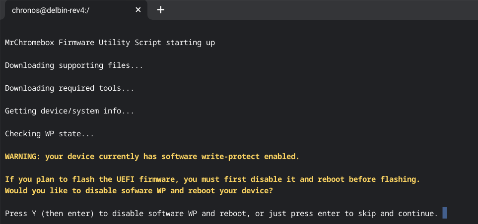
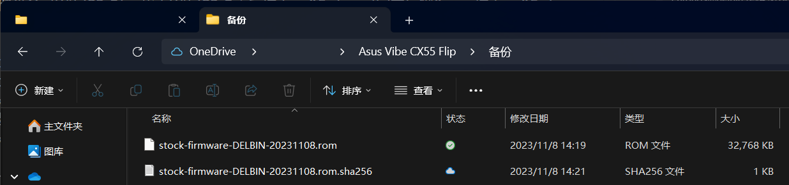
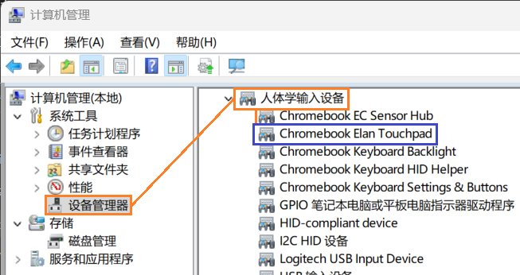

# 在Chromebook上安装Windows 11和Linux发行版

*版本：1.0*

查看Github渲染器中的**目录**：使用Github Markdown渲染页面右上角的“大纲”（⋮☰）按钮。

---


## 零、废话、介绍和确定可行性

那还得从遥远的2023年中旬说起。因为要去外地读研了，于是就想着搞个轻薄本拿来上课用。在本科的时候背着沉重的 *微星 GT83VR* 上课，这玩意加上适配器毛重6kg+，实属习武之人专属，现如今想想确实感觉没有必要。

家里有台老本子 *宏碁 TravelMate P245-MG* ，英特尔i5-4200U，4GB内存DDR3-1600，内置500G机械硬盘。打算省省钱，加了条8G的DDR3内存，换了新电池，就拿着它去上课了，反正上课也就看看PPT写写笔记啥的，用不着什么性能。清灰换了硅脂，插上新内存，整台老电脑焕然一新。

然后打开了Bitlocker，一晚上蓝屏3回，怒而拆机卸硬盘，让它吃灰去了。笔记本可以到时候再买，还省得带在身上沉。

来到美国之后，发现这边相比中国国内，是越贵的东西越便宜，越便宜的东西越贵。 *外星人* 电脑的定价在这边和中国国内的 *神舟* 、 *机械革命* 是同等的， *联想 拯救者* 是不打折的时候和中国国内一样贵，但动不动打个7折8折啥的，价格只能说是适当水平。基本上在定价高于USD$1,000的时候，美国卖的电脑比中国国内便宜；而当定价低于USD$1,000的时候，美国卖的电脑比中国国内贵。

我想着买个便宜货，也省着丢了抢了坏了心疼。但我有几个硬性要求：1. 屏幕刷新率不能低于90hz；2. 带键盘背光灯；3. 带小键盘；4. 16G及以上内存或可自行升级。花了两周找来找去最终确定在 *戴尔 灵越 15 3520* 这款机器上，以上全满足且带有支持 *DisplayPort Alternate Mode* 的 *USB Type-C* 端口，优惠价仅$341.23，非常实惠啊。

……然后就是跟 *戴尔* 拉扯的一个月，因为它们发过来的机器上没有任何 *USB Type-C* 端口，即使这明确地标明在我下单的那款机器上。客服承认是他们网站的错误但拒绝换货，理由是“带USB-C端口的那款机型已经停产了。”停产了为什么不从官网撤下？我做了两周功课最后选了戴尔结果就这？差点因为这事闹到 *BBB（Better Business Bureau，商业促进局）* 去，最后 *戴尔* 同意取消再销售费，给我全额退货退款，这事才算结束。

但我上课也不能没有电脑啊，在退货的当晚正好是 *Amazon Prime Day（亚马逊会员日）* 的最后几小时，在亚马逊的首页，一款笔记本电脑赫然写着-23%，我点进去一看，哦豁，刚好满足我之前的那些要求，配置比 *戴尔 灵越 15 3520* 高不少，唯一一点要注意的是，它是 *Chromebook* 。我听说过 *Chromebook* ，也听说过它们可以刷成 *Microsoft Windows* 系统，所以稍微做了下功课，半确定了这款能刷之后，也是在气头上，冲动消费了一把。这就是本篇的主角： *华硕 Chromebook Vibe CX55 Flip* （以下简称“CX55”）。

后来一想同样的配置，Windows笔记本起码要USD$800才能拿下，我才花了USD$550，实在非常之值。

### 什么是Chromebook？什么是ChromeOS？

就像 *Laptop PC（笔记本个人电脑）* 是运行 *Microsoft Windows* 系统的笔记本电脑、 *Macbook* 是运行 *Apple macOS/OS X* 系统的笔记本电脑一样， *Chromebook* 是运行 *Google ChromeOS* 系统的笔记本电脑。 *ChromeOS* 是 *谷歌* 于2009年开始研制的一款专有操作系统，早期基于 *Gentoo Linux* ，但之后逐渐形成了自己的Linux发行版体系。 *ChromeOS* 的设计理念是“一切基于网络应用程序（Web App）”，你基本可以将其整个系统理解为一个“轻量化的Linux平板桌面环境 + Chrome浏览器 + Android容器”，因为 *ChromeOS* 中的应用都是 *Chrome浏览器插件* 、 *Web App* 和 *Android应用* ，都是从 *Chrome 应用商店* 和 *Google Play商店* 安装的。对，和你想的一样， *ChromeOS* 只能负担轻量级办公和娱乐应用，也就是那些可以用网页解决的需求，而无法负担中型和重型的本地应用。所以， *Chromebook* 普遍配置也不高，并且由于老大难的 *英伟达* 显卡驱动问题，至今没有一款 *Chromebook* 使用 *英伟达* 显卡。不过，也因为其不用给 *微软* 付操作系统授权费，且 *谷歌* 多少有些补贴的样子，使得其总是可以在性价比上打赢同样配置的 *Windows PC* 。另外， *ChromeOS* 非常倚靠在线服务，尤其是 *谷歌* 的在线服务，即使有些 *Web App* 可以离线运行。

### 什么是Chrultrabook？

“Chrultrabook 是经过修改的 Chromebook，通过使用 MrChromebox 的 coreboot 固件，它能够运行 Windows、Linux，有时还能运行 macOS。”一开始 *Chromebook* 还只是超便宜低配上网本的代词时，就有人想到使其能够安装 *Windows* 了。毕竟更难兼容的 *macOS* 都被弄出了 *hackintosh（黑苹果）* 。那时候可能更多是爱好者在研究，不过随着 *Chromebook* 市占率在 *COVID-19* 期间爆发式地增长， *谷歌* 也看到了扩张 *Chromebook* 产品线的机遇，开始考虑和OEM厂商合作推出性能更强劲的 *Chromebook* （我这个月去逛 *Best Buy* 发现居然里面没有一款内存超过8GB的 *Chromebook* ，你可以想象那台CX55配置算多高了），这时候就吸引到了对预算有极致需求又有一定动手意愿的人（比如我）。本文为了避免过多专有名词，在之后仍称安装了其他系统的 *Chrultrabook* 为 *Chromebook* 。

以上双引号（“”）内的文字来自于：[What is a chrultrabook and who is this documentation for? | Chrultrabook Docs](https://docs.chrultrabook.com/)

### 哇听上去很不错，那我也买个Chromebook装Windows办公？

作为就这样用了一年多的我来说——别。我倒也没后悔，但多少有些bitter sweet的感觉。

首先： ***Chromebook* 没有大写锁定键和功能键。** 这是因为它在物理上就不存在这些按键，意味着没有任何硬件解决方案，除非外接键盘。 *谷歌* 的解释是“没有多少人用大写锁定了”，学什么不好非学 *苹果* 把小键盘取消， *苹果* 恶心一下消费者还有不少人自适应，你 *谷歌* 怎么也来这一套？这13个月里我用 *Chromebook* 的时候，是把 *“ChromeOS搜索键”* 映射为 *“大写锁定键”* ，把 *“右Alt键”* 映射为 *“Windows徽标键”* 来使用。其次： ***Chromebook* 不支持Windows上的TPM。** *Chromebook* 使用的是 *谷歌* 自有的TPM解决方案，该方案不与Windows联盟共享。第三： ***Chromebook* 的声卡和USB-C支持总有问题。** 对于使用Windows，其声卡和USB-C驱动常常是需要另付费的；对于使用Linux，虽然声卡和USB-C驱动可以通过开源软件解决，但CX55的声卡在Ubuntu系Linux发行版上，双声道被合并到只有左扬声器播放。

  
 *（ *“大写锁定键”* 被替换为了 *“ChromeOS搜索键”* ，同时左下角只有 *Ctrl键* 和 *Alt键* 。）* 

对于预算不是非常紧张的情况，不建议特地买Chromebook安装其他系统使用。

### 如何确认我的Chromebook是否支持安装其他系统？

首先你需要清楚，为 *Chromebook* 安装其他操作系统而造成的问题肯定不在任何厂商的保修条款中。

 *Chrultrabook Docs* 网站是最权威的、帮助人们在 *Chromebook* 上安装其他系统的网站。因为距离我购买 *Chromebook* 并折腾已经过去了一年，细节和截图也丢失了不少，而且 *Chrultrabook Docs* 网站里面描述的步骤也足够详尽，所以在后面的介绍安装 *coreboot UEFI固件* 方法时将只放网站链接（懒了，等将来如果重新安装再补）。

1. 首先，确定你的 *Chromebook* 的 *Board Name（平台代号）* ：  
   [Finding System Info | Chrultrabook Docs](https://docs.chrultrabook.com/docs/firmware/system-info.html#board-name)  
    *平台代号* 是 *谷歌* 对一类配置近似的 *Chromebook* 的内部代号，拥有相同的 *平台代号* 的 *Chromebook* 可以共享同一套驱动和优化配置，类似Android设备的 *Code Name（机型代号）* 。
2. 在 *“Supported Devices and Platforms（支持的设备和平台）”* 页面中，在 *“Firmware and OS Support（固件和操作系统支持）”* 的搜索框内搜索你的 *平台代号* ：  
   [Supported Devices and Platforms | Chrultrabook Docs](https://docs.chrultrabook.com/docs/firmware/supported-devices.html#firmware-and-os-support)  
   比如CX55的 *平台代号* 是`delbin`：  
     
   对表头的解释：  
   - Device Name（机器名称）： *Chromebook* 的商品名
   - Board Name（平台代号）： *Chromebook* 的平台代号
   - RW_LEGACY Firmware（原厂改固件支持）：对原厂固件进行小幅修改，以用于支持 *ChromeOS* 和 *Linux发行版* 双启动。好处是不会被认为修改过固件，能够保留保修，且不需要关闭固件写保护即可修改，坏处是无法安装某些 *Linux发行版* 以外的系统。
   - UEFI Firmware (Full ROM)（完全的第三方UEFI固件支持）：直接替换掉原厂固件而是用第三方的开源UEFI固件，从而支持安装任意支持UEFI引导的系统。坏处是大改固件，有几率变砖而且会丢失保修，除非能刷回来。
   - WP Method（固件写保护方式）：用于关闭固件写保护的方式，详情见下一章。
   - Windows Notes（安装Windows的备注）：安装Windows的备注。
   - Linux Notes（安装Linux发行版的备注）：安装Linux发行版的备注。
   - MacOS Notes（安装黑苹果的备注）：安装黑苹果的备注。

本文将仅介绍使用“替换原厂固件为完全的第三方UEFI固件”这种方法来安装其他操作系统。

### 如何确认我的Chromebook在安装Windows后支持哪些功能？

在上一步中，如果 *“UEFI Firmware (Full ROM)”* 处显示`✅`，则说明你的 *Chromebook* 支持安装 *Windows* 以及几乎全部的 *Linux发行版* 。如果没有显示，那文章的剩余部分也不用看了，静候佳音吧。确认之后，转到这个网页：[Windows 10 or 11 on chromebooks](https://coolstar.org/chromebook/windows.html)来确认你的Chromebook在安装Windows后支持哪些功能。在网页上按下 *“Ctrl + F”* 组合键或者选择（对于 *Google Chrome浏览器* ） *“自定义及控制Google Chrome - 查找和修改 - 查找…”* ，打开 *“查找”* 控件，在其中的文本框中输入你的 *平台代号* ：

  

对表头的解释：  
   - Chromebook Name（Chromebook商品名）： *Chromebook* 的商品名
   - Board Name（平台代号）： *Chromebook* 的平台代号
   - Chipset（CPU代号）：该 *Chromebook* 使用的CPU代号
   - Trackpad（触摸板）：安装Windows后，有触摸板驱动支持
   - Touch Screen（触摸屏）：安装Windows后，有触摸屏驱动支持（Yes），或该设备无触摸屏（N/A）
   - GPU Acceleration（显卡驱动）：安装Windows后，有显卡驱动支持（Yes），或安装补丁后支持（w/ Patch）
   - Audio（声卡驱动）：安装Windows后，有付费声卡驱动支持（Yes(Paid)），或有声卡驱动支持（Yes）
   - Audio (HDMI)（HDMI音频输出）：安装Windows后，有HDMI音频输出支持
   - USB 2/3：安装Windows后，设备的USB-A接口可用
   - USB 4：安装Windows后，设备的USB-C数据接口有付费驱动支持（Yes(Paid)），或该设备无USB-C接口（N/A）
   - SD Card（SD读卡器）：安装Windows后，有SD读卡器驱动支持（Yes），或虽有支持但BUG频出（Buggy），或该设备无SD读卡器（N/A）
   - Webcam（摄像头）：安装Windows后，有摄像头驱动支持（Yes），或无（No）

制作该表的是在 *iOS越狱* 界和 *Chrultrabook* 界均知名的人物： *CoolStar* （Github页面：[coolstar (CoolStar)](https://github.com/coolstar)）。他一人制作了很多在 *Chromebook* 上的Windows下的驱动，他对 *Chrultrabook* 社区做出了不可磨灭的贡献。他制作的大部分驱动是开源的，但一部分声卡和USB-C数据接口驱动是付费的，每设备USD$10（在不对硬件做大变更的情况下可迁移驱动），但同时只能有一个设备激活。毕竟人家也做了许多工作，需要付费也无可厚非，实在不想付钱的也可以通过外接USB-A扩展坞的方式使用。在202405，他在 *Chrultrabook* 社区中的活跃度似乎减少了，该表更新速度也在减缓。

### 如何确认我的Chromebook在安装Linux后支持哪些功能？

1. 看前面的Linux Notes。如果没具体提出存在什么问题，那就基本是没问题。
2. 使用搜索引擎搜索`你的Chromebook商品名/平台代号 + issues`，如果没有那就是没问题，如果有那大概率也是能解决的，这毕竟是Linux。
3. 向论坛提问。

### 华硕 Chromebook Vibe CX55 Flip


 *华硕* 官方的配置信息页面：[ASUS Chromebook Vibe CX55 Flip (CX5501, 11th Gen Intel) - Tech Specs｜Laptops For Home｜ASUS USA](https://www.asus.com/us/laptops/for-home/chromebook/asus-chromebook-vibe-cx55-flip-cx5501-11th-gen-intel/techspec/)，貌似只在北美售卖。

500多刀拿下二合一、144hz触摸屏、16GB内存、双全功能USB-C接口，还要啥自行车。配置这么高的 *Chromebook* ，官方是以“ *Chromebook* 游戏本”的卖点卖的，随机送了一个月的 *Xbox Game Pass Ultimate* （支持 *Xbox云游戏* ）和三个月的 *英伟达 Geforce Now* 云游戏。

然后这个玩意用了一年之后风扇有异响（响得像个拖拉机似的），拆出来发现是轴坏了。还好在保修期前一周坏的，打算走售后吧， *华硕* 售后倒是给个人送保，但是运费自理，要9刀， *Ebay* 上买一个二手散热模组也就9刀，售后修还要费时间、还有可能把它刷回 *ChromeOS* ，想想就算了，我还是自己修吧。华硕品质，坚如磐石my ass。

## 一、替换Chromebook固件为coreboot (MrChromebox) UEFI固件

就像之前说的，因为距离我购买 *Chromebook* 并折腾已经过去了一年，细节和截图也丢失了不少，而且 *Chrultrabook Docs* 网站里面描述的步骤也足够详尽，所以本章将只放网站链接（懒了，等将来如果重新安装再补）。

现在你已经确定要安装完全的第三方UEFI固件了。首先，做好备份，备份 *Chromebook* 上所有的非云端文件。其次，备齐笔记本拆机工具，释放静电。

从 *Chrultrabook Docs* 网站的 *“Firmware - Developer Mode（固件 - 开发者模式）”* 处开始，一路执行到 *“Flashing Firmware（刷写固件）”* 结束：[Developer Mode | Chrultrabook Docs](https://docs.chrultrabook.com/docs/firmware/developer-mode.html)。每当一页执行完成后，点击下方的 *“Next >（下一步 >）”* 按钮。

  

其中，关闭固件写保护的方式因设备而异，根据前一章中的 *如何确认我的Chromebook是否支持安装其他系统？- 2. WP Method* 中对应的项操作即可。对于使用`CR50`安全固件（ *谷歌H1安全芯片* 上的安全固件）的设备，除了拔电池以外，也可以使用 *“SuzyQable”*  *CCD(Closed Case Debugging)* 调试线关闭固件写保护，类似于 *高通* SoC的 *高通9001调试端口* 。

一些去年留存的图：

  
 *（我关闭CX55固件写保护的方式是拔电池，顺便把SSD也换了。 *英特尔 670P M.2 SSD* ， *华硕* 到底屯了多少这东西？）* 

  
 *（如果没有关闭固件写保护， *MrChromebox 的固件实用程序脚本* 会将显示安装UEFI固件设置项前方的`[WP]`为粉红色。）* 

  

</p>
 *（关闭了固件写保护， *MrChromebox 的固件实用程序脚本* 会将显示安装UEFI固件设置项前方的`[WP]`为绿色。输入`y`确认刷写；输入`I ACCEPT`确认责任自负；输入`Y`执行刷写脚本；插入U盘/SD卡之后按下 *“Enter（回车）键”* ；输入`1`确认第一个外部存储设备（U盘/SD卡）；拔下U盘/SD卡之后按下 *“Enter（回车）键”* ；按下 *“Enter（回车）键”* 回到主菜单。）* 

</p>
 *（ *MrChromebox 的固件实用程序脚本* 此时会在 *“FW Type:（固件类型：）”* 处显示 *“Full ROM / UEFI (pending reboot)（完整的ROM / UEFI（等待重启））”* ，此时按下 *“R键”* 重启） *Chromebook* 即可。* 

一定要将备份在外置存储设备（U盘/SD卡）的原厂固件归档，将来恢复回 *ChromeOS* 或者救砖都很有用。

  

在安装完全的第三方UEFI固件并重启后的 *Chromebook* 会先运行几分钟的自检，此时屏幕上会显示一个像“奔跑的兔子”的Logo，这就是第三方UEFI固件—— *coreboot* UEFI固件的Logo。

  

自检完成后， *coreboot* UEFI固件会提示找不到引导文件而转到 *“UEFI Shell”* 界面。别担心，这是正常的，因为 *coreboot* UEFI固件无法引导原磁盘上的 *ChromeOS* ， *ChromeOS* 暂时和这台 *Chromebook* 说再见了。

简单介绍一下 *coreboot* ：”coreboot，以前称为LinuxBIOS，是一个软件项目，旨在用轻量级固件取代大多数计算机中的专有固件（BIOS或UEFI），该固件设计用于仅执行加载和运行现代32位或64位操作系统所需的最少任务。

由于 coreboot 会初始化裸硬件，因此必须将其移植到其支持的每个芯片组和主板上。因此，coreboot 仅适用于有限数量的硬件平台和主板型号。

MrChromebox 为基于 ChromeOS 的设备开发了 coreboot 的修改版本。”

步骤中使用到的 *MrChromebox 的固件实用程序脚本* 就是 *MrChromebox* 为 *Chromebook* 编写的他移植的适用于 *Chromebook* 的 *coreboot* 固件的固件写入脚本。

以上双引号（“”）内的文字来自于：[coreboot - Wikipedia](https://en.wikipedia.org/wiki/Coreboot)

## 二、安装Windows 11和使用

### 1. 制作Windows 11安装盘、安装Windows 11

由于Windows 11安装程序内不会内置适用于大部分 *Chromebook* 的USB-C数据接口驱动，所以在安装时安装盘 **可能必须插入USB-A接口** 。如果没有多余的USB-A接口，可以使用自带的键盘进行交互（触摸板不保证可以使用），或连接USB-HUB。Windows 11安装程序中内置了适用于大部分 *Chromebook* 的无线网卡驱动。

安装Windows 11是老生常谈问题，在另一篇文章《[联想Legion Go使用体验和自定义](../Lenovo%20Legion%20Go%20Experience%20and%20Customization%20-%20联想Legion%20Go使用体验和自定义/Lenovo%20Legion%20Go%20Experience%20and%20Customization%20-%20联想Legion%20Go使用体验和自定义.md)》中的 *五、4.* 中有粗略的介绍。请按照其中的方法，去除Windows 11安装程序的强制TPM 2.0和安全启动要求。 

如果你在使用Windows 11安装盘引导时屏幕出现了如下的显示：


这就是 *“UEFI Shell”* 界面，不必惊慌，输入

```Shell
exit
```

然后按下 *“Enter（回车）键”* ， *Chromebook* 会自动重启至 *UEFI* 设置界面。在该页面下使用 *“方向键”* 导航至 *“Boot Menu（启动项菜单）”* ，然后按下 *“Enter（回车）键”* ：


进入 *“Boot Menu（启动项菜单）”* ，使用 *“方向键”* 选择你插入的Windows 11安装盘，然后按下 *“Enter（回车）键”* 即可从Windows 11安装盘引导。


### 2. 安装Windows下的驱动

由于 *谷歌* 对 *Chromebook* 的硬件设计有自己的标准，其部分硬件在非 *ChromeOS* 的操作系统下缺少对应操作系统驱动标准的驱动。因此，*Windows 10/11* 的 *Windows 更新* 无法像Windows OEM PC那样自动对 *Chromebook* 上的硬件安装所有的驱动。在 *零、* 章中介绍过的[Windows 10 or 11 on chromebooks](https://coolstar.org/chromebook/windows.html)网站，搜索过 *平台代号* 之后，点击 *Board Name（平台代号）* 列中对应的 *平台代号* 链接，即可进入对应的 *Windows for Chromebook installation guide（适用于Chromebook的Windows安装指南）* ：

> 由于 *CoolStar* 在 *Chrultrabook* 社区中的活跃度减少，部分新 *Chromebook* 可能没有对应的 *安装指南* 。比如这台CX55的型号是CX5501， *CoolStar* 并未更新 *安装指南* 中对应的数据，即使 *平台代号* 相同使得他们可以共用同一个 *安装指南* 。

在下图中，第一个蓝框内指出了该 *安装指南* 适用的 *Chromebook*  *商品名* 和 *平台代号* ；第二个蓝框内指出了该 *安装指南* 对Windows 10/11的适用情况；紫框中的前三步在本文中已经涵盖，可以跳过。


之后按照剩下的步骤一步一步走就行。

#### 2.0 使用Windows 更新自动安装部分驱动

在 *设置* 应用中，点击左侧栏 *“Windows 更新”* 按钮，或者点击 *“主页”* 设置页上右侧的 *“Windows 更新”* 按钮。在转到的设置页中，点击右侧的 *“检查更新”* 按钮。


之后，Windows 11会自动检查并更新当前系统所需要的系统更新、（与微软合作的）软件更新、系统固件更新、驱动更新等并自动安装。

</p>
 *（仍有部分驱动无法被 *Windows 更新* 安装）*  

#### 2.1 安装Visual C++运行库、CR50和EC驱动


&ensp;&ensp;&ensp;&ensp;**安装Visual C++运行库**

点击 *“Install Visual C++ Redistributable（安装Visual C++再分发支持库）”* 卡片下方 *“Download:（下载：）”* 右侧的 *“Link（链接）”* 来下载最新的 *微软Visual C++运行库* 安装程序。


&ensp;&ensp;&ensp;&ensp;**安装CR50驱动**

点击 *“Install CR50 (I2C/SPI) TPM Driver（安装CR50驱动）”* 卡片下方 *“Download:（下载：）”* 右侧的 *“Link（链接）”* 来下载 *CoolStar* CR50驱动安装程序。


&ensp;&ensp;&ensp;&ensp;**安装EC驱动**

点击 *“Install Chrome EC Driver（安装Chromebook EC驱动）”* 卡片下方 *“Download:（下载：）”* 右侧的 *“Link（链接）”* 来下载 *CoolStar* Chromebook EC驱动安装程序。


其中，
- Coreboot Table（必选）：适用于 *coreboot* UEFI固件的ACPI驱动
- Chrome EC Combo（必选）： *CoolStar* Chromebook EC驱动
- Keyboard（可选）： *Chromebook* 键盘功能键驱动
- Default Keyboard Presets (Chrome)（可选）： *Chromebook* 键盘键位重映射，见下一子节
- Default RGB Keyboard Profiles（可选）： *Chromebook* 键盘背光驱动

安装该驱动后需要手动重启以使驱动生效。

&ensp;&ensp;&ensp;&ensp;**安装EC驱动后的键位重映射**

见本小节头图中蓝色框内。

#### 2.2 安装南桥芯片组、核显、触摸板、声卡、USB-C数据接口驱动


&ensp;&ensp;&ensp;&ensp;**安装南桥芯片组驱动**

点击 *“Autoinstall Intel Chipset Drivers（自动安装英特尔芯片组驱动）”* 卡片下方 *“Download:（下载：）”* 右侧的 *“Link（链接）”* 来下载 *CoolStar* 英特尔南桥芯片组驱动安装压缩包。

下载后将其中的.ps1脚本文件解压到一个有用户权限且 **没有空格** 的路径，如`下载`文件夹下。然后在 *文件资源管理器* 中导航到该文件夹，在文件夹内空白处 *“右键 - 在终端中打开”* 。在打开的 *Windows 终端* 应用中，输入如下代码，并按下 *“Enter（回车）键”* 执行：

```Powershell
Powershell -ExecutionPolicy bypass -file .\autoinstall-intel.ps1
```


若脚本执行正常，其将先从 *英特尔* 官方软件库中下载驱动，然后自动安装：


该脚本将下载的驱动缓存文件保存在执行路径下的`CBookDriversTmp`文件夹内。安装该驱动后需要手动重启以使驱动生效。

&ensp;&ensp;&ensp;&ensp;**安装核显驱动**

点击 *“Install Intel Xe Graphics Driver（安装英特尔Xe显卡驱动）”* 卡片下方 *“Download:（下载：）”* 右侧的 *“Link（链接）”* ，进入 *英特尔* 官方 *“下载驱动程序和软件”* 支持页。点击该页内 *“选择您的产品”* 下方的 *“🖥️显卡”* 按钮，在转到的 *“搜索 - Intel.com”* 页面中，点击搜索结果中的 *“英特尔® Arc™ 和锐炬® Xe 显卡 - Windows”* 卡片中的 *“下载”* 按钮，下载并运行 *英特尔 显卡驱动安装程序* 。


> 我一开始在安装时勾选了 *“进行全新安装”* 复选框，重启后风扇就狂转不止，目前我可以确定问题出在 *英特尔 DTT* 驱动上（详情见下一小节），但尚不明确是否 *“进行全新安装”* 为该问题的导火索。


&ensp;&ensp;&ensp;&ensp;**安装触摸板驱动**

点击 *“Install Touchpad Driver（安装CR50驱动）”* 卡片下方 *“Download:（下载：）”* 右侧的 *“Link（链接）”* 来下载 *CoolStar* 触摸板驱动安装程序。其中，如果你不知道你的 *Chromebook* 中使用的是哪个厂商的触摸板，保持全选即可。


在安装后，于Windows的 *“此电脑”* 上 *“右键 - 显示更多选项 - 管理”* ，或按住 *“Shift键”* 的同时按 *“右键 - 管理”* ，进入 *“计算机管理”* 窗口，点击左侧 *“控制台树”* 中的 *“设备管理器”* 项，在右侧 *“MMC窗口”* 的树状图中，展开 *“人体学输入设备”* ，寻找其中带有`Touchpad`字样的设备。从下图可见，CX55使用的触摸板是 *Elan* 触摸板。



&ensp;&ensp;&ensp;&ensp;**购买和安装声卡和USB-C数据接口驱动**

如果你的 *Chromebook* 在 *零、如何确认我的Chromebook在安装Windows后支持哪些功能？ - Audio（声卡驱动） 和 USB 4* 中为付费驱动，则你可能需要购买这些驱动才能使用声卡和USB-C数据接口。

点击 *“CoolStar SOF (Intel) Audio（CoolStar 英特尔声卡驱动）”* 卡片或 *“Install USB 4 / Thunderbolt 4 Driver（安装USB-C数据接口驱动）”* 卡片下方的 *“here”* ，进入 *“CoolStar License Manager（CoolStar许可证管理器）”* 网站。在该网站中，点击 *“Sign Up（注册）”* 下方的 *“Sign Up with Patreon（通过Patreon注册）”* 按钮，在弹出的 *“Patreon Signup（Patreon注册）”* 控件中，点击CoolStar的Patreon链接：[CoolStar | formerly creating Chromebook drivers, Windows apps and iOS apps | Patreon](https://www.patreon.com/coolstar)。在 *CoolStar* 的Patreon页面中，选择加入 *“CoolStar SOF Audio for Intel Chromebooks”* 来单独购买 *CoolStar 英特尔声卡驱动* ，或者选择加入 *“Intel SOF + USB 4 for Chromebooks”* 来购买 *CoolStar 英特尔声卡驱动* 和 *USB-C数据接口驱动* 捆绑包。只需购买一次，购买后关闭自动付费即可。具体购买方式在此略过。


在购买完成并在 *“CoolStar许可证管理器”* 网站注册后便可进入许可证管理器个人页面。在 *“Purchased Licences（已购买的许可证）”* 页面中，点击已购买的许可证卡片。在弹出的 *“Driver Details（驱动详情）”* 窗口中，点击左栏中的 *“Download（下载）”* 按钮，下载驱动安装包。

  
 *（我已经激活过一次，所以截图里跟首次下载不一样）* 

 *CoolStar* 的付费驱动安装方式都一样，这里以 *CoolStar 英特尔声卡驱动* 为例：解压下载的驱动安装包到有用户权限的路径，如`下载`文件夹下。打开其中的`gui`文件夹，双击运行 *“GenLicense.exe”* 。在打开的 *“Generate License（生成许可证）”* 软件中，点击 *“1.”* 下的 *“Generate Unsigned License（生成未签名的许可证）”* 按钮，软件会在该文件夹下生成未签名的许可证文件（.BIN）。


回到 *“CoolStar许可证管理器”* 网站中个人页面的 *“驱动详情”* 窗口，点击 *“Register License（注册许可证）”* 卡片下的 *“Unsigned License File（未签名的许可证文件）”* 右侧的 *“选择文件”* 按钮，在弹出的 *“打开”* 文件选择窗口中打开刚才生成的未签名的许可证文件。然后在下方 *“Device Name（设备名称）”* 文本框中输入任意设备名称。最后，点击下方的 *“Submit（提交）”* 按钮，网站会将许可证文件签名并自动下载已签名的许可证文件。


回到 *“生成许可证”* 软件中，点击 *“3.”* 下的 *“Select Signed License（选择已签名的许可证）”* 按钮，在弹出的 *“Load Signed license file（加载已签名的许可证文件）”* 文件选择窗口中选择刚才下载的已签名的许可证文件。成功安装后，软件将弹窗 *“License successfully installed! Reboot to activate!（许可证文件成功安装！重启来激活！）”* ，点击 *“确定”* 按钮并重启 *Chromebook* 。


重启后回到之前解压的驱动安装包文件夹内，运行`csaudiointcsof.*-installer.exe`（USB-C数据接口驱动为`inteltcss.*-installer.exe`）。和安装触摸板驱动时相同，如果你不知道你的 *Chromebook* 中使用的是哪块音频芯片，保持全选即可。


> 部分 *Chromebook* 可能能通过安装 *“Waves MaxxAudio”* 音频优化软件来提升音质。请阅读 *CoolStar 英特尔声卡驱动* 驱动安装包中的`README.txt`中的 *“For the following devices:”* 部分。

在安装后，于Windows的 *“此电脑”* 上 *“右键 - 显示更多选项 - 管理”* ，或按住 *“Shift键”* 的同时按 *“右键 - 管理”* ，进入 *“计算机管理”* 窗口，点击左侧 *“控制台树”* 中的 *“设备管理器”* 项，在右侧 *“MMC窗口”* 的树状图中，展开 *“声音、视频和游戏控制器”* ，寻找其中除了`CoolStar SOF Audio (WDM)`字样的设备。从下图可见，CX55使用的音频芯片是 *瑞昱 ALC5682* ，其中扬声器的两个通道使用的是 *美信 98373* 解码器。


如果你的 *Chromebook* 存在 *雷电技术（Thunderbolt）* ，那么在 *设备管理器* 中继续向下寻找并展开 *“通用串行总线控制器”* ，在其中找到并双击所有 *“Intel(R) USB 3.2\* 可扩展主机控制器\*”* ，在打开的 *“Intel(R) USB 3.2\* 可扩展主机控制器\* 属性”* 窗口中，点击 *“电源管理”* 选项卡，取消勾选下面的 *“允许计算机关闭此设备的电源”* 复选框，最后，点击下方的 *“确定”* 按钮。


> 如果你的 *Chromebook* 存在 *雷电技术（Thunderbolt）* 并且你想通过它连接存在 *雷电技术（Thunderbolt）* 的 *外置显卡（eGPU）* ，请阅读 *USB-C数据接口驱动* 驱动安装包中的`README.txt`中的 *“Note, if you would like to use an eGPU:”* 部分。

> 如果你的 *Chromebook* 在安装了 *USB-C数据接口驱动* 之后仍存在问题，请阅读 *USB-C数据接口驱动* 驱动安装包中的`README.txt`中的 *“Troubleshooting”* 部分。

安装好驱动并设置完毕后，重启 *Chromebook* 。在启动后，点击 *任务栏* 中的 *快速设置* 按钮，在弹出的 *快速设置* 面板中，点击下方 *输出音频音量滑动条* 右侧的 *“🎛️>选择声音输出”* 按钮，在转到的 *“声音输出”* 面板中，选择 *“扬声器 (CoolStar SOF Audio (WDM))”* ，声音便可从 *Chromebook* 的扬声器中输出。


#### 2.3 （可选）解决使用Tiger Lake处理器的Chromebook在安装完驱动后风扇狂转的问题

说来为什么我在前面可以确切地说，风扇狂转的问题是 *英特尔 DTT* 驱动导致的呢，因为去年（卧槽2025了，那应该是前年啊）第一次装驱动的时候， *CoolStar* 还没有这个自动安装脚本，那会儿是得自己一个一个从 *英特尔* 官网去下载，这个 *英特尔 DTT* 驱动是单独列出的，装完之后风扇立马就不消停了。

这个 *英特尔 DTT* 是什么呢？“英特尔® Dynamic Tuning Technology （英特尔® DTT）……包含基于人工智能和机器学习的高级算法，以支持这些优化以获得性能、散热和电池续航时间。OEM 为其系统专门配置软件。DTT 并非旨在成为基于最终用户的软件，因为更改系统制造商设置可能会导致系统运行的风险。……OEM 决定它们将如何使用 DTT 的功能以及如何配置 DTT。”

本小节双引号（“”）内的文字来自于：[英特尔® Dynamic Tuning Technology （英特尔® DTT） 用户指南](https://www.intel.cn/content/www/cn/zh/support/articles/000058479/graphics.html)

这听上去就废物点心是吧，Reddit上更是一大帮人声讨这东西嗯降功耗墙，和 *戴尔* 笔记本固件坐一桌的玩意。就我觉得吧，就是它没出问题，卸了也比装着好。如果你需要使用到 *英特尔 Application Optimization（APO）* ，则不要卸载这些设备。

在前面提到的 *“计算机管理”* 的 *“设备管理器”*  *“MMC窗口”* 中，展开 *“系统设备”* ，寻找其中 **所有** 带有`Intel(R) Dynamic Tuning`字样的设备。依次在它们上 *“右键 - 卸载设备”* ，在弹出的 *“卸载设备”* 对话框中勾选 *“尝试删除此设备的驱动程序。”* 复选框，然后点击 *“卸载”* 按钮。全部卸载完毕后，重启启动，问题解决。


> “英特尔® DTT在以下系统上受支持：第十一代智能英特尔®处理器及更新版本、英特尔锐®炬 Xe MAX 显卡或英特尔® Arc 显卡”

#### 2.4 Chromebook上的Windows中的失效硬件

即使按本章前面的几大节中安装好了所有的驱动， *设备管理器* 中仍会存在有问题的设备。双击图标上带有 *“⚠️”* 的设备，在打开的 *“\* 属性”* 窗口中，点击 *“详细信息”* 选项卡，在其中 *“属性”* 下方的下拉菜单中选择 *“硬件 Id”* ，在 *“值”* 列表中查看第一行值。其中，`VEN_<数字>`代表了该设备的厂商，如 *“VEN_8086”* 是 *英特尔* ；`DEV_<数字>`代表了该设备的厂商内部设备序号。要查找该设备究竟是什么设备，可将这两个值在搜索引擎中搜索。


CX55的几个有问题的设备有：

- VEN_8086 DEV_9A03： *英特尔 DTT* 相关组件，如果在上一小节中卸载了 *英特尔 DTT* 驱动，可以忽略。
- VEN_INTC DEV_1040： *英特尔 DTT* 相关组件，如果在上一小节中卸载了 *英特尔 DTT* 驱动，可以忽略。
- VEN_PRP DEV_0001： *谷歌 Chromebook* 专用硬件，可能是 *廣明光電* 的原件，怀疑是 *谷歌 Chromebook* 的 *谷歌H1安全芯片* ，这个Windows用不了。
- VEN_8086 DEV_A0C5： *英特尔 串行IO I2C* 驱动，这个确实我没修明白。反正放着也没见有什么问题就不管了。

### 3. （可选）安装Windows下的工具软件

#### 3.1 OEM配套软件

OEM的Windows PC常常附带有配套的工具软件，如 *联想* 的 *Lenovo Vantage* 、 *华硕* 的 *MyASUS* 等。虽然它们并不一定可以在安装了Windows的 *Chromebook* 上运行的很好，但部分功能还是可以使用的。

CX55可以安装“[MyASUS - 在 Windows 上免費下載並安裝 | Microsoft Store](https://apps.microsoft.com/detail/9n7r5s6b0zzh?hl=zh-HK&gl=US)”。


#### 3.2 Chrultrabook-Tools

Chrultrabook-Tools是适用于运行其他操作系统的 *Chromebook* 的带有UI界面的工具软件，支持Windows和Linux发行版。仓库地址：[death7654/Chrultrabook-Tools: User-friendly configuration utility for Chromebooks running an alternate OS](https://github.com/death7654/Chrultrabook-Tools)

使用介绍，请见：[Chromebook开源神器！Chrultrabook-Tools功能介绍及下载_哔哩哔哩_bilibili](https://www.bilibili.com/video/BV1n1421D7Cx/)


对于Windows 11 24H2，如果在启动软件之后闪退，需要打开 *“WMIC”* 。在 *“设置 - 系统 - 可选功能 - 添加可选功能 - 查看功能”* 打开的 *“添加可选功能”* 窗口中，勾选 *“WMIC”* 并 *“下一步”* 和 *“添加”* 。


#### 3.3 PowerToys

 *PowerToys* 的 *“重新映射快捷键”* 可用于在 *Windows* 中重新映射 *Chromebook* 上的键盘按键。类似的操作在另一篇文章《[联想Legion Go使用体验和自定义](../Lenovo%20Legion%20Go%20Experience%20and%20Customization%20-%20联想Legion%20Go使用体验和自定义/Lenovo%20Legion%20Go%20Experience%20and%20Customization%20-%20联想Legion%20Go使用体验和自定义.md)》中的 *三、6.b* 中中已经介绍过，在此不再赘述。

## 三、安装Linux发行版和使用

安装Linux发行版的方式和其他PC大同小异，这里略过，感兴趣的可以阅读我写的以下两篇文章：

《[Windows 11 + Kubuntu双系统安全启动和使用体验](../Dual%20boot%20Windows%2011%20and%20Kubuntu%20with%20secure%20boot%20on,%20and%20experience%20-%20Windows%2011%20+%20Kubuntu双系统安全启动和使用体验/Dual%20boot%20Windows%2011%20and%20Kubuntu%20with%20secure%20boot%20on,%20and%20experience%20-%20Windows%2011%20+%20Kubuntu双系统安全启动和使用体验.md)》

《[Linux下的个人偏好应用的安装和使用体验，以及运行Windows应用](../Installation%20and%20experience%20of%20personal%20preference%20applications%20under%20Linux%20-%20Linux下的个人偏好应用的安装和使用体验/Installation%20and%20experience%20of%20personal%20preference%20applications%20under%20Linux%20-%20Linux下的个人偏好应用的安装和使用体验.md)》

本章以文章中介绍的 *Kubuntu* 发行版为例。

### 1. 安装音频和USB-C数据接口驱动

#### 1.1 安装音频驱动

为了省钱买的Chromebook就得花时间解决各种问题。本来它装Windows就得想办法弄第三方声卡驱动吧，没想到装了Linux依旧不出声：

   

要解决这个问题，首先到如下仓库：[GitHub - WeirdTreeThing/chromebook-linux-audio: Script to enable audio support on many Chrome devices](https://github.com/WeirdTreeThing/chromebook-linux-audio)，用`git clone`或下载整个源码zip包均可。本小节以下载源码zip包为例，下载后解压到本地路径，使用 *Dolphin 文件管理器* 导航到该路径，在`setup-audio`文件上 *右键 - “使用 Kate文本编辑器 打开”* 。在打开的 *“Kate文本编辑器”* 中，找到约55行的位置，在`ubuntu()`函数下，将

```Python
    exit()
```

改为

```Python
    #exit()
```

，然后保存并退出。

 

 

还是刚才的路径，在 *Dolphin 文件管理器* 的文件夹内空白处 *右键 - “在此位置打开终端”* 或按下 *Alt + Shift + F4* ，在这个路径下打开 *“终端”* 。

 

打开的 *“终端”* 窗口中，应该显示目前处于刚才的路径下。输入以下命令并执行：

```Shell
sudo ./setup-audio
```

在`sudo`提示输入当前账户的密码时盲输 *“账户密码”* 并按 *回车（Enter）键* 确定。

 

当脚本执行完毕，显示`Audio installed successfully! Reboot to finish setup.`后，重启 *Chromebook* 。

 

重启后，在 *系统设置* 中点击左侧栏的 *“硬件 - 音频”* ；或点击 *任务栏 - 系统托盘 - 音量* 按钮，在弹出的 *音频音量* 面板上，点击右上角的 *“配置音频设备…”* 按钮。在打开的 *“音频”* 设置页面中，点击 *“播放设备”* 中的 *“Speaker（扬声器）”* 右边的下拉菜单，将默认的 *“Off”* 改为 *“Default”* 。

😆幸运的是，这样 *Chromebook* 终于出声了；🥲不幸的是左右声道都只在左扬声器出声……测试了一下USB无线耳机和蓝牙耳机，均工作正常，只有内置扬声器有这个问题，估计是声卡驱动没事但是线路驱动有问题，但只要能响就行了，我也不指望去图书馆或者教室里外放，回家就用Windows了。

参考：
[sound - How to install Chromebook audio drivers in Ubuntu? - Ask Ubuntu](https://askubuntu.com/questions/1486278/how-to-install-chromebook-audio-drivers-in-ubuntu)

#### 1.2 安装USB-C数据接口驱动

见 *Chrultrabook Docs* 网站的 *“安装系统后指南”* ：[Post Install | Chrultrabook Docs](https://docs.chrultrabook.com/docs/installing/post-install.html#fixing-usb-c-on-tigerlake-and-alderlake)。

### 2. 修改键盘键位映射

在用奇奇怪怪的脚本之前，先记得全盘备份。具体方式在之前的《[制作自己的Windows 7安装镜像](../Build%20your%20own%20Windows%207%20installation%20image%20-%20制作自己的Windows%207安装镜像/Build%20your%20own%20Windows%207%20installation%20image%20-%20制作自己的Windows%207安装镜像.md)》文章中的 *一、4* 中已经介绍过，在此不再赘述。

// TODO 挖坑

参考：  
[keyboard - How to make function keys work on a Chromebook running Ubuntu? - Ask Ubuntu](https://askubuntu.com/questions/1451097/how-to-make-function-keys-work-on-a-chromebook-running-ubuntu)  
[Notes for non-standard Linux distributions | Chrultrabook Docs](https://docs.chrultrabook.com/docs/installing/distros.html#keyboard-mapping)

### 3. 无法解决的问题

个人遇到的一些无法解决的问题的集合，你不一定会遇到相同的问题，这里只是留着以后钻牛角尖用。

- 我的 *Chromebook* 在设置 *“硬件 - 电源管理 - 省电功能 - 合上笔记本盖时 - 关机”* 后，在合盖时会死机，强行重启后GRUB会进入到“上次未正常关机，关闭倒计时引导默认选项”的状态。怀疑是 *Kubuntu* 对 *Chromebook* 的ACPI支持还不够完好。

## 四、更新coreboot (MrChromebox) UEFI固件

更新coreboot (MrChromebox) UEFI固件的操作只能在Linux环境下进行。更新方法，见 *Chrultrabook Docs* 网站的 *“更新自定义固件”* ：[Updating Custom Firmware | Chrultrabook Docs](https://docs.chrultrabook.com/docs/firmware/updating-firmware.html)

如果启用了 *安全启动* ，则需要先将 *安全启动* 关闭。可在固件更新后恢复。

 *Ubuntu* 系发行版需要先按照链接中的操作安装`curl`。

   
 *（当 *“Fw Ver:（固件版本）”* 下方显示 *“Update Available（更新可用）”* 时，有新的固件可更新。）*

</p>
 *（固件更新完成后，回到 *MrChromebox 的固件实用程序脚本* 主页，此时会在 *“FW Type:（固件类型：）”* 处显示 *“Full ROM / UEFI (pending reboot)（完整的ROM / UEFI（等待重启））”* ，此时按下 *“R键”* 重启） *Chromebook* 即可。*