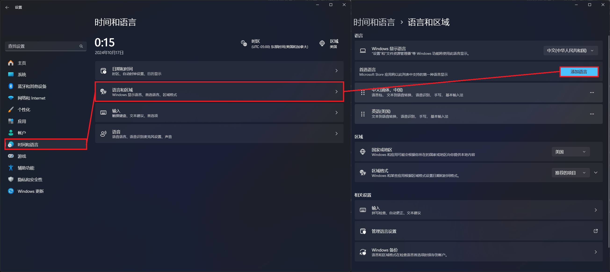
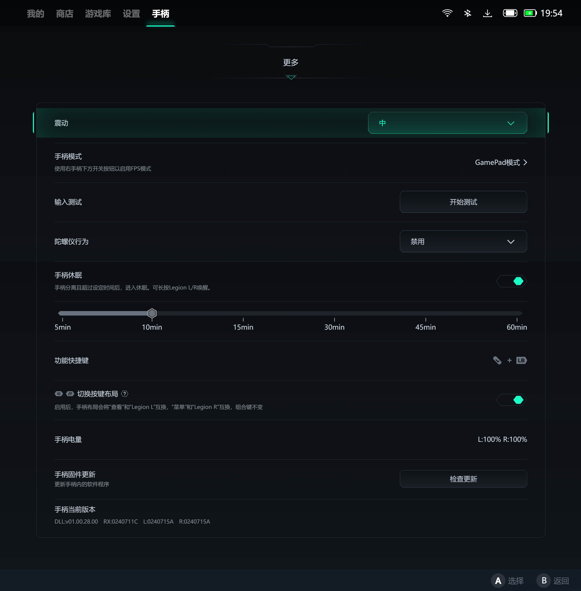
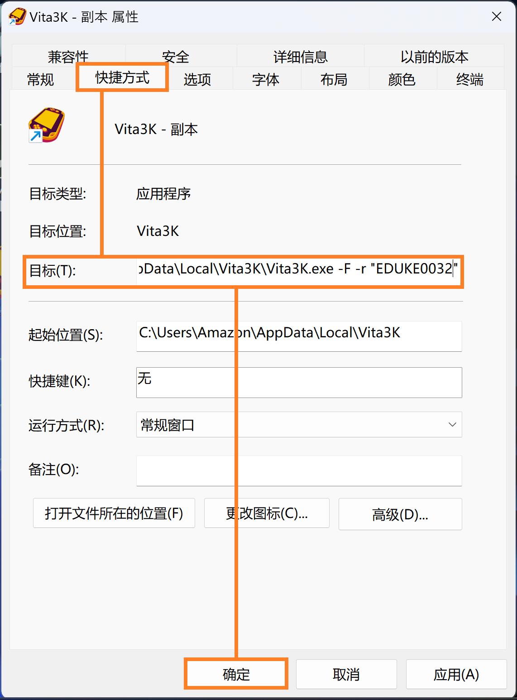
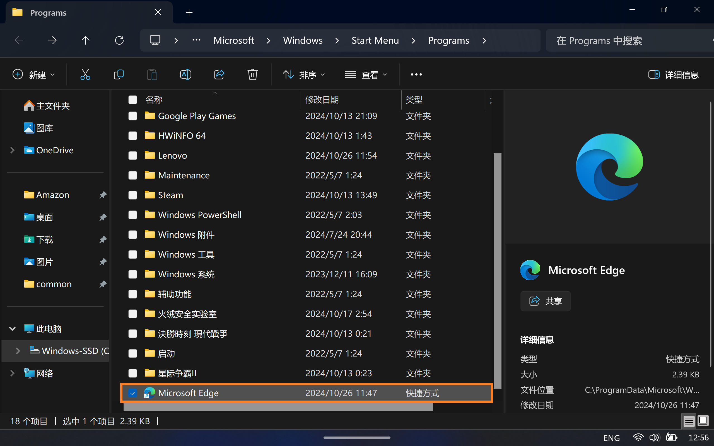
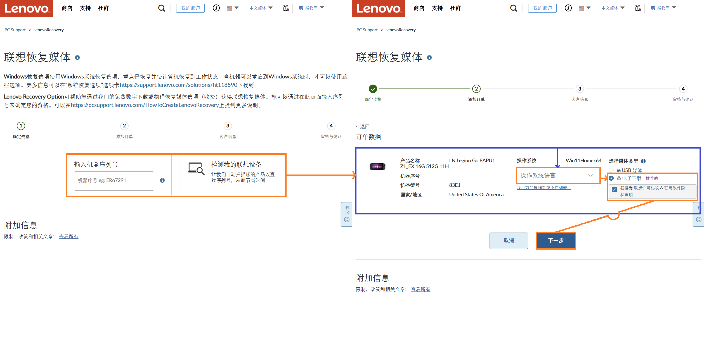
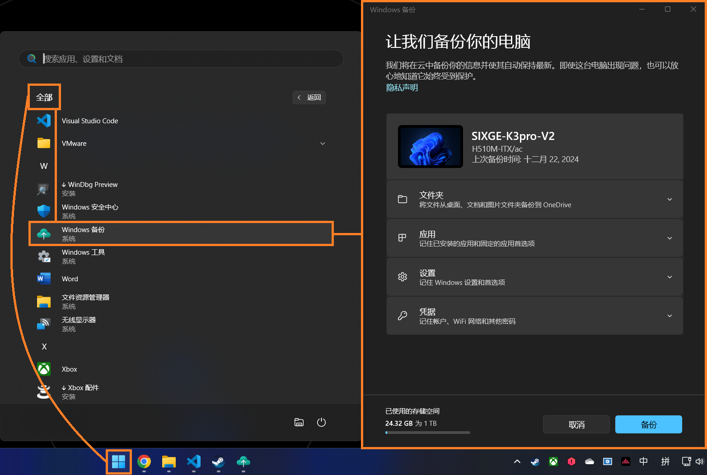

# 联想Legion Go使用体验和自定义

*版本：1.2*

查看Github渲染器中的**目录**：使用Github Markdown渲染页面右上角的“目录”（⋮☰）按钮。

---


本文仅适用于在2023年10月31日发售的Lenovo Legion Go 1 (8APU1; AMD Ryzen Z1 Extreme)。  
Lenovo Legion Go 1（以下简称为 *“Legion Go”* ）有两种不同的SoC规格： *AMD Ryzen Z1* 和 *AMD Ryzen Z1 Extreme* 。前者只提供于256G版本且仅限特定区域。  
参考：[Z1 and Z1 Extreme : r/LegionGo](https://www.reddit.com/r/LegionGo/comments/18f3kyu/z1_and_z1_extreme/)

（本来一直在联想美国官网找驱动和文档啥的，用着挺舒服，突发奇想去联想中国官网 - 拯救者掌机找一下商品支持页面看有没有提供官方壁纸当个封面啥的，结果逛了10分钟屁也没找到，干啥啥都要登录，给自己逗乐了，太幽默了，我看啊，还是lenovo.com/us/zc/适合我。）

## 零、理论规格与废话

大部分的纸面数据和对比都能从这个网站找到：[掌机列表 - 掌机圈 - 关注游戏掌机-国产掌机-安卓掌机-Windows掌机](https://zhangjiquan.com/handhelds)，下面的列表是我对自己感兴趣的几个机型的补充项目对比：


 *（部分规格由Google Gemini生成，可能不准确）*

对于这些x86掌机，从玩游戏角度，我更推荐 *ROG Ally X* ；从社区支持角度，我更推荐 *Steam deck OLED* 。那你可能问了：诶这两个都不是 *Legion Go* 啊，为什么你买了 *Legion Go* 呢。那么下面就到了废话环节了。

计划和朋友们去旅游，然后吧两周之后有个考试，打算在飞机上或者晚上在旅馆的时候看看课件，刷刷ChatGPT啥的。4个B里3个B都带了iPad，我寻思虽然我以前挺看不起iPad这种“买前生产力买后爱奇艺”的玩意，但不得不说哪怕最小的iPad，那也有8.3英寸屏幕，我手上这个iPhone 13 mini才5.4英寸，看课件跟GPT网聊实在有点憋屈。

于是呢就打算买个iPad，我觉着性能不用太强（那样太贵了），也别太弱，那么拿什么当性能锚定呢？诶，我之前一直想在iOS/iPadOS上玩 *[DEATH STRANDING DIRECTOR'S CUT on the App Store](https://apps.apple.com/us/app/death-stranding-directors-cut/id6449748961)* ，那就从 *“信息 - 兼容性 - iPad”* 找个看起来最便宜的iPad从 *Amazon Renewed* 买好了，结果一水的USD$600起，家境贫寒实在支付不起。

然后呢瞎划手机的时候突然被推送了ROG Ally X的视频，我一看这玩意和前面看的iPad价格差不太多，突然觉得诶为啥不弄个大屏x86掌机呢，这玩意可折腾性可比iPad强太多了，讲真iPhone/iPad就算越狱了也没法刷Windows刷安卓玩吧，反正我也不是死忠果粉也没被生态绑定，立马就决定跳船了。

然后看了看ROG Ally X，7寸屏幕，emmm...有点小吧，拉不开和大屏iPhone的差距啊，还是无法畅快跟LLM们网聊啊。Steam deck OLED？也是7寸啊还是800p的。诶！这个叫Legion Go的屏大，都快9寸了，接着说我在听；卧槽还能把手柄卸下来，这个玩意卡在经济舱夹板上一点都不会尴尬呢，越看越觉得卧槽，这不就是我想找的大屏x86网聊啊不是学习神器吗。正好价格也不比iPad贵（税前），那就你了，李镇狗！

## 一、开箱

趁着 *Amazon Prime Day* 从 *Amazon* 购买了开箱充新(Used - Like New: 
Screen is like new with no visible scratches. Item will come in original packaging.)的Legion Go。平常都是两日达的，这次多送了一天，估计是 *Amazon Prime Day* 订单量比平时大吧。

到手后给了个超大的箱子，足以装下拯救者笔记本了，但里面这个长方柱体才是Legion Go的快递纸箱。


打开纸箱，可以看到大大的 **LEG** 。


打开 **LEG** ，可以看到折叠起来的卡片：[Setup Guide - Legion Go 8APU1](https://download.lenovo.com/consumer/mobiles_pub/legion_go_sg.pdf)。


从 *Setup Guide - Legion Go 8APU1（快速上手指南）* 中抽出 *Legion Go 便携包* 。包下按理来说应该有 用户指南：[User Guide -Legion Go](https://download.lenovo.com/consumer/mobiles_pub/legion_go_ug_en.pdf)和 安全和保修指南：[(English) Safety and Warranty Guide - Notebook, Desktop](https://download.lenovo.com/pccbbs/mobiles_pdf/class_b_ml_swg_en.pdf)，但是我估计上次拿的大哥把用户指南给丢了，反正我是没在包装里找到。


打开 *Legion Go 便携包* ，就可以见到Legion Go的真容了（这张是补拍，已拿走塑料包装袋）。便携包中附带一个 *提带* ，方便将Legion Go从便携包中拉出。


下面用作对比的是红米K30s Ultra, 6.67寸。


对了，随机还附赠3个月的 *Xbox Game Pass Ultimate* 。


## 二、调试与测试

### 1. 跳过Windows 11 OOBE的强制联网要求

怕在30天退货期内出岔子，所以在到手的头30天内我打算先用本地账户。Windows 11 OOBE的强制联网要求，实在是老生常谈的问题，在此我觉得没有比 *Microsoft Learn* 更为权威的了：[Windows 11 setup without internet - Microsoft Q&A](https://learn.microsoft.com/en-us/answers/questions/1179311/windows-11-setup-without-internet)；微软不想主动告诉用户，但它肯定得告诉供应商。

### 2. 更改系统显示语言

Windows从古至今，永远是全新安装的系统，其系统语言可以显示地最全面——也就是说，任何在系统全新安装后新增的语言包（除了英语）都无法全面地本地化所有页面（比如开机、关机和重启更新页面，任何涉及Windows Boot Manager的页面等）。因此若想要将预装的英文界面的Windows 11更改为简体中文界面，最彻底的方式是重装系统。但就像我在上一小节说的——30天退货期内——所以还是得先在系统里调整。

以我另一台台式机上的页面为例，按下 *Windows徽标键 + I* 或者打开 *Start - All apps - Settings* ，进入到Windows 11的 *“Settings”* 应用中。

在 *Settings* 应用中，点击左侧栏 *“Time & language”* 按钮，在右侧的设置页中，点击 *“Language & region”* 按钮。在转到的设置页中，点击 *“Preferred languages”* 右侧的 *“Add a language”* 按钮。

  
 *（我实在是懒得切回英文再截一遍图了）* 

> 要更改Windows的显示语言，首先该语言包必须先被安装进系统。

在弹出的 *“Choose a language to install”* 窗口中，在搜索框中输入`Chinese`。之后，选择下面的 *“中文(中华人民共和国)”* ，点击 *“下一页”* 按钮并按提示继续（其实是懒得重走一遍截图了）。

  

如果 *“中文(新加坡)”* 和 *“中文(中华人民共和国)”* 是不可选择（灰色）状态，则为无法安装。造成一种语言无法被安装的原因一般有三种：

1. 该语言已被安装，无法重复安装。
2. 该语言被Windows零售SKU限制了安装，如一些售价较低的单语言版本或限制语言区域版本。
3. 该语言被OEM厂商限制了安装。

### 3. 进行系统更新

要接收最新的系统固件（UEFI、BIOS、EC等）更新，可以从 *Windows 更新* 处接收并更新。

还是在 *设置* 应用中，点击左侧栏 *“Windows 更新”* 按钮，或者点击 *“主页”* 设置页上右侧的 *“Windows 更新”* 按钮。在转到的设置页中，点击右侧的 *“检查更新”* 按钮。

  

之后，Windows 11会自动检查并更新当前系统所需要的系统更新、（与微软合作的）软件更新、系统固件更新、驱动更新等并自动安装。

> Legion Go使用的 *AMD Ryzen Z1 extreme APU* 的显示驱动由AMD和联想共同推出，但推送显示驱动由OEM（即联想）负责（见此AMD社区讨论贴[Graphics Drivers for Ryzen Z1 Extreme - AMD Community](https://community.amd.com/t5/pc-drivers-software/graphics-drivers-for-ryzen-z1-extreme/m-p/614065)），因此AMD官网驱动下载页面是找不到Z1 extreme的 *AMD Radeon GPU (780M)* 驱动的。一般来说，当OEM厂商会将驱动同步推送到微软更新库，因此 *“Windows 更新”* 也可以接收并更新Legion Go的显示驱动。
> 
>  *（在 *AMD Ryzen Z1 extreme APU* 的 *AMD Software: Adrenalin Edition* 软件的 *设置 - 系统* 页面中，找不到驱动更新按钮。）*

在进行固件更新时，Legion Go会重启至固件更新界面，此时不要强行关机，保持电源接入。


更新共有两个阶段，第一阶段结束后，系统会开机黑屏一段时间（大概1分钟），然后重启进入第二阶段。此时不要强行关机，保持电源接入。


### 4. 禁用Microsoft Defender

常与 *Microsoft Defender* 安全软件打交道的朋友们，可能见过其“先斩后奏”和“宁可错杀一千，不可放过一个”的特性，但最让我头疼的还是这个B吧特别特别喜欢疯狂全盘扫描。PC要是放着一会不管然后风扇狂转，那十有八九不是在系统更新就是 *Microsoft Defender* 又双叒叕开始扫起盘了。既然跟它斗智斗勇、用各种方法都没法彻底关掉它（以前跟它战斗过，我只能说实在置不起这个气），不如直接利用“安装第三方安全软件会让 *Microsoft Defender* 待机”这个特性，装个第三方杀软给它禁言好了。

本小节以安装 *火绒安全软件* 为例：

首先我得提一下， *火绒* 在用户不自己进行调试下的预设情景中，其防病毒和杀毒能力还有待进步，与国际大厂（包括 *面向企业的 Microsoft Defender* 和 *奇虎360* ）还有一段差距。我个人将 *火绒安全软件* 视作“嵌入式安全解决方案”或“ *Microsoft Defender* 禁用器”。

打开 *开始 - 所有应用 - Microsoft Store* ，进入到 *“Microsoft Store”* 应用中。在上方的搜索框中输入`huorong`，按 *“Enter（回车）键”* 发起检索。在下方的搜索结果中，选择想要的应用，点击其卡片。


在应用详情页面中，点击 *“安装”* 按钮，进行应用安装。


 *（这个安装过程就不需要再介绍了吧……）* 

> 直到最近我才明白 *Microsoft Store* 应用详情页里的这个 *“由...提供和更新”* 的意思是 *Microsoft Store* 只管装上，不管更新和卸载。

在成功安装火绒之后，打开 *系统托盘 - Windows 安全中心* 或  *设置 - 隐私和安全性 - 安全性 - Windows 安全中心* 进入到 *Windows 安全中心* ，在其中点击 *“病毒与威胁防护”* 按钮，在其页面中若出现安装的第三方安全软件提供保护，且点击 *“Microsoft Defender 防病毒选项”* 链接将其展开后， *“定期扫描”* 开关为 *“关”* ，则说明 *Microsoft Defender* 禁用成功。


### 5. 调整集成显卡共享显存设置

#### 5.1 设置多少集显专用显存为好？

对于集成显卡（英特尔：核芯显卡，AMD：Radeon Graphics），集显专用显存是与内存共享的。

  
 *（在 *“任务管理器 - 内存”* 页面中可以看到为硬件保留的内存，通常情况下是为集显保留的专用显存大小。）* 

这个集显专用显存的大小，无论设置为多少，都是动态调整的。一般逻辑是，当集显使用显存到达了这个大小，集显会继续向内存申请显存；而当没有到达这个大小时，系统也不会将未使用的专用显存释放出来。假设共有16G内存，一款游戏将占用4G显存，当集显专用显存设置为1G时，游戏在运行时仍然会占用4G显存，而在空置时系统将有15G内存可用；当集显专用显存设置为6G时，游戏在运行时会占用4G显存，而在空置时系统只有10G内存可用。

为什么前面说是“一般逻辑”？因为有一些集成显卡是不采用这个设置的：无论设置为多大的专用显存，集成显卡永远是从一个初始值动态调整；而有的游戏会读取启动时的显存容量而调整画面效果，比如启动时读取到1G显存，即使后面集成显卡能够将专用显存申请到8G，游戏仍按1G显存进行优化调整，导致画面缩水。因为不同软硬件的调度之间差别很大，所以没有一个万金油设置，只能具体情况具体分析。

那么设置成多少为好呢？如果你像我一样，主要使用场景是看剧、看课件和大屏网聊，那么设置为 *Auto（自动）* 就可以了；毕竟越多内存分配给系统（或 *Google Chrome* 浏览器），系统越流畅（日用情况下，在16G以上的内存，扩大内存大小将使提升进入边际效应）。

但如果主要使用场景是玩游戏，我搜到有几种说法：

1. “amd核显必须要分配足量的……显存拉到4g以上，甚至8g……怀疑是amd核显的显存管理机制有问题……”  
   来自于评论区 - 孤独凤凰战士：[脑洞评测：7840HS显存大小对性能影响对比_哔哩哔哩_bilibili](https://www.bilibili.com/video/BV1KC4y127zo/)
2. “但显存大小会影响Apex中枪械模型的清晰度，如果是512MB的话，会糊成橡皮泥，你改成最低2G的话，枪械模型，机瞄都会清晰很多，到也不会影响帧率。”  
   来自于评论区 - 新欤：[780M核显在4GB和512M显存下性能差异 八款游戏测试_哔哩哔哩_bilibili](https://www.bilibili.com/video/BV1dn4y1R7p7/)
3. Reddit的r/LegionGo下的一篇帖子，大部分人同意6G是较佳设置。  
   来自于：[legion go vram : r/LegionGo](https://www.reddit.com/r/LegionGo/comments/1bkbpss/legion_go_vram/)
4. “There's a new bios with 6Gb option, it will probably be the sweet spot.”  
   来自于评论区 - @whitezzpt：[Lenovo Legion GO - 3GB vs 4GB vs 8GB VRAM compared in 10 Games - YouTube](https://www.youtube.com/watch?v=pfm675bDmGM)

综上所述，设置集显专用显存为6G或许是最佳选择。

#### 5.2 进入UEFI设置界面

在关机的情况下，按住Legion Go的 *“音量+键”* 的同时按下 *“电源键”* ，进入 *“Novo Button Menu”* 。在该页面点击（或使用方向键选中并按下 *“Enter（回车）键”* ） *“BIOS Setup”* 。

  

或者，在开机并进入Windows 11系统中时，点击 *“开始菜单 - 电源”*，然后在按住键盘上的 *“Shift键”* 的同时，点击 *电源选项* 中的 *“↺重启”*。

  

之后Windows将进入到 *Windows Boot Manager（Windows启动管理器）* 页面。依次点击 *“Troubleshoot - Advanced Options - UEFI Firmware Settings - Restart”* ，重启后即可进入UEFI设置界面。

  
 *（这张图也说明了Legion Go的屏幕是原生竖屏的。）*

#### 5.3 调整UEFI设置界面为中文（可选）

进入UEFI设置界面，点击图形界面右下角的蓝色 *“More Settings >”* 按钮，进入 *高级设置页面* 。点击左侧 *“系统信息”* 按钮，在右侧更改 *“语言”* 选项为 *“中文”* 。


#### 5.4 调整集显专用显存大小

点击左侧栏 *“系统设置”* ，在右侧设置页面找到 *“共享显存”* ，点击右侧下拉菜单，选择偏好的选项。然后按下 *“F10键”* 或点击 *“退出 - 保存并退出”* ，在弹出的 *“确认”* 弹窗中点击 *“是”* 按钮。


### 6. 任务管理器置于顶层

如果玩掌机的时候游戏卡死，然后用 *“LS侧边栏”* 调出的 *任务管理器* 还被卡死的游戏遮挡了，手边还没有键盘输入 *“Ctrl + Alt + Del”* 调出 *Windows 安全界面* 来用紧急注销当前用户的方式进行强退，这就很尴尬了。

在 *任务栏* 上 *右键 - 任务管理器* ，或按下 *“Ctrl + Alt + Del”* 然后点选 *“任务管理器”* 进入 *任务管理器* 。点击左侧栏下方的 *“设置”* 按钮，然后在右边的设置页面中选中 *“常规 - 窗口管理”* 中的 *“置于顶层”* 复选框。


### 7. 调整任务栏高度

在调整屏幕缩放比例到较高值之后，Windows 11的任务栏高度也会相应地放大；更绝的是Windows 11不像以往的Windows那样可以调整任务栏高度，甚至无法调整位于桌面的位置，导致在桌面下方的任务栏占用了太多空间。


 *设定前* 

在网上搜索了很多办法，修改注册表的方式已经随着更新作废了，使用第三方修补程序还收费，最后找到这篇文章：[How To Change Taskbar Size in Windows 11? - GeeksforGeeks](https://www.geeksforgeeks.org/how-to-change-taskbar-size-in-windows-11/)，终于是找到开源的解决办法了。

首先，下载 *Windhawk* ： *Windhawk* 是一个通过注入.dll动态链接库等方式以实现对Windows个性化的开源工具，通过社区提供的模组进行调整。进入官方网站：[Windhawk](https://windhawk.net/)，点击 *“Download（下载）”* 按钮下载安装程序。


 *Windhawk* 在安装过程中和下载模组时都需要连接到Github下载支持文件。安装完成后，根据前面GeeksforGeeks文章中的 *Method 2 Step 3* 继续操作即可。

// TODO 设定后

 *Windhawk* 还有很多有用的模组，如：[Vertical Taskbar for Windows 11 - Windhawk](https://windhawk.net/mods/taskbar-vertical)，可以让Windows 11的任务栏放置在屏幕的左侧，但不兼容前面的 *“Taskbar height and icon size”* 模组；[Windows 11 Start Menu Styler - Windhawk](https://windhawk.net/mods/windows-11-start-menu-styler)，可以去掉Windows 11 *开始* 中烦人的 *“推荐的项目”* ，并将其改为类Windows 10、7、Android启动器抽屉、混合等样式（但无法恢复Windows 10 开始菜单中的磁贴）；[Windows 11 Taskbar Styler - Windhawk](https://windhawk.net/mods/windows-11-taskbar-styler)，可以更改Windows 11任务栏的样式，如全透明任务栏、类Dock任务栏等；[Better file sizes in Explorer details - Windhawk](https://windhawk.net/mods/explorer-details-better-file-sizes)，可以让 *文件资源管理器* 中显示文件大小均从`?B`改为显示`?iB`；[Force Chinese IME Mode - Windhawk](https://windhawk.net/mods/force-chinese-ime)，可以让微软拼音输入法锁定为输入中文，而不是那个脑瘫的自动切换英文；等等。

### 8. 垂直鼠标模式与分体手柄设计

我没打算拿Legion Go玩射击为主的游戏，所以这个FPS模式，我更愿称之为“垂直鼠标模式”。按住 *TrueStrike右手柄* 背部下侧的 *“释放按钮”* 并将手柄向下拉，从Legion Go上取下，然后放入随附的基座中（基座将磁吸于 *TrueStrike右手柄* 下方），拨动其底部的 *“FPS模式开关”* （下图橙色框内）至 *“FPS”* 位置，即可启用 *TrueStrike右手柄* 的垂直鼠标模式。

  
 *（蓝色框内为 *TrueStrike右手柄* 的 *IAS* 。）* 

下图大致展示了 *TrueStrike右手柄* 的垂直鼠标模式在使用右手握持时，右手的各部位与 *TrueStrike右手柄* 的接触位置。

  
 *（ *TrueStrike右手柄* 的垂直鼠标模式没有为左手握持设计。）* 

<a href="https://www.flaticon.com/free-icons/hand" title="hand icons">手标志PNG图来自于：Hand icons created by Freepik - Flaticon</a>

虽然用户手册里说可以把右摇杆帽拔下来，但我拔了一下，还没等拔下来摇杆就卡在指向边缘了，吓得我不敢拔了，拿高压气体吹了一会儿才恢复。反正也是携带中充当鼠标的替代品，不打算长时间紧握，也就没觉得太不便。磁吸底座在拿起来晃的时候有些不稳，但放在鼠标垫上使用的时候还蛮稳的。总的来说，我挺喜欢这个新奇的尝试，这不就是PC DIY界一直缺少的花活吗。要是真为FPS游戏使用，这款“鼠标”还是差的有点多；但是我觉得我完全足够为此在携带时少带一个 *罗技 MX Anywhere 2s* ，意义还是不小的。

不过使用完这个垂直鼠标模式后要想着切换回手柄模式，要不就会像Bilibili上的一位买回来之后大呼手柄失灵要避雷了（笑）。

可以购买类似于下图的 *TrueStrike手柄* 充电握把，这样可以将 *TrueStrike手柄* 组合成一个单独的外置游戏手柄，适合将Legion Go放在桌面或者外接显示设备时使用，同时也可以通过USB-C接口连接充电设备。唯一的缺点是，这个没办法放在联想附赠的 *Legion Go 便携包* 中。

  
 *（与 *Xbox 无线手柄（2020）* 对比）* 

为了节省电池电量， *TrueStrike手柄* 在脱离Legion Go主机之后将在一定时间后自动关机。超时时间可在 *Legion Space* 软件和 *Legion Space 侧边栏* 中调整，详见下面的 *三、1.a* 。在 *TrueStrike手柄* 关机后，按住 *Legion L\R键* 三秒可分别启动两个手柄，并自动连接到Legion Go主机。

这样的可分离式手柄有没有让你产生一种既视感？是的，在我搜索手柄的使用资料的时候，发现很多人提到过希望这对 *TrueStrike手柄* 可以像 *任天堂 Switch* 的 *Joycon手柄* 一样工作。以我目前搜到的资料来看—— *TrueStrike手柄* 可以分为两个手柄使用，但是有意义的应用/游戏较为有限（一些派对游戏支持）。至于能不能够将该手柄连接到其他设备，该手柄是可以通过蓝牙连接到其他PC的，但是分为了两个单独的手柄：

  

连接到另一台Kubuntu PC里并使用[Gamepad Tester - Check Controllers and Joysticks Online](https://hardwaretester.com/gamepad)测试，均显示同时连接了两个手柄；此时还不是标准X-input布局，如果想要当成两个一半的手柄合成一个使用，还得自行进行按键映射。

我能理解联想想要实现类 *Joycon手柄* 的设计，但单手柄使用的玩家也很多，在其他兼容设备上使用 *TrueStrike手柄* ，并合为一个手柄的功能估计只能靠联想以后的固件升级了，但联想会不会给升级呢？那就拭目以待吧。

参考：
[How to connect go controllers to pc? : r/LegionGo](https://www.reddit.com/r/LegionGo/comments/17p7xl6/how_to_connect_go_controllers_to_pc/)

### 9. 基准性能测试

#### 9.1 3DMark 30W TDP测试结果

 *UL 3DMark* 是这世界上最知名的 **Windows** PC性能测试软件之一，其拥有广泛的基准测试，绝大部分用户使用其中的基准测试用例来测试PC的 **游戏性能** 。 *3DMark* 是付费软件，可以通过[Steam 上的 3DMark](https://store.steampowered.com/app/223850/)获取。

以下结果是在使用65W供电、 *Legion Space* 中设置性能模式为自定义 - TDP 30W SPPT 35W FPPT 41W、电源模式为最佳性能、风扇为自定义（自动）设定下的3DMark各基准测试的结果分数：

  

仅从基准测试结果来看，当运行在1280x800分辨率时，运行效果均比在2560x1600分辨率下的效果好，但差距仅为2%~5%。使用RSR对于基准测试来说反而使得分数下降，甚至比在2560x1600分辨率下得分还要低。不过要强调的是，由于 *3DMark* 旨在控制分辨率对得分的影响，实际游戏对于不同分辨率下的优化与显示效果调控可能不如 *3DMark* ，还需要实际按体验决定在什么性能设定下使用；其次此处RSR得分意义较小，基准测试结果不能当画面看，且使用RSR后除 *AMD Software: Adrenalin Edition* 软件，其他软件测得帧数数据均不准确，所以RSR效果还得进一步研究。

#### 9.2 使用3DMark基准测试结果判断掌机性能释放

在 *3DMark* 某项图形性能测试结束并出结果后，记下其总分数、CPU分数（若有）、显卡分数（若有）。此处以 *Time Spy* 测试为例，测得一次结果截图为：


然后，点击总分下方的 *“在线比较结果”* 按钮，在转到的网页中点击上方的 *“结果”* 项，或直接打开链接：[搜索](https://www.3dmark.com/search)。然后，在 *“Search for CPU（搜索CPU）”* 中输入部分CPU关键字，如`Z1`，在下方联想结果中点击要对比的相同CPU。GPU同理，在本例中搜索`AMD ROG Ally Extreme GPU`。最后，在第三个下拉菜单中选择要对比的相同基准测试，在本例中为`3DMark Time Spy`。最后，点击 *“搜索”* 按钮。


在转到的搜索结果页中下拉，对比 *“Overall Score（总分数）”* 、 *“Graphics score（显卡分数）”* 、 *“CPU score（CPU分数）”* 。对于测得的3DMark基准测试分数，我个人的经验如下：

| 前10% | 前10%~40% | 前40%~70% | 后30% |
|:--------:|:--------:|:--------:|:--------:|
| 那是真的牛逼 | 硬件发挥正常 | 硬件发挥不正常，检查驱动版本、功耗 | 某项（些）测试子项目被跳过或运行在了集成显卡上（对于同时拥有独显和集显的设备） |


#### 9.3 Geek bench 6 30W TDP测试结果

 *Geekbench 6* 是一个我很喜欢用的广泛跨平台设备性能基准测试工具（也因为实在找不到别的类似的工具），可以跨Windows、MacOS、Linux、安卓和iOS平台；x86_64和AArch64架构进行基准测试，且对个人非盈利用途免费。

进入 *Geekbench 6* 官网[Geekbench 6 - Cross-Platform Benchmark](https://www.geekbench.com/)，点击 *“Download”* 按钮。在跳转的下载页面中，点击 *“Download for Windows”* 按钮进行下载，并安装。


安装完成后打开，勾选 *“Don't show this again（下次不要显示）”* 复选框，并点击 *“Later（之后再说）”* 按钮。 *（忘截图了，欸嘿）* 要进行CPU基准测试，点击 *“Run CPU Benchmark（运行CPU基准测试）”* 按钮并在弹出的进度窗口消失前，不要进行其他动作；要进行GPU基准测试，先从下方 *“GPU Benchmark（GPU基准测试） - GPU API:”* 处的下拉菜单中选择一种API，再点击 *“Run GPU Benchmark（运行GPU基准测试）”* 按钮，并在弹出的进度窗口消失前，不要进行其他动作。


基准测试完成后， *Geekbench 6* 将自动上传结果并打开基准测试结果网页。

以下为性能设置同 *9.1* 下的 *Geekbench 6* 测试结果：


在这两项测试时，风扇转速均不高，倒是挺出乎我意料的。

#### 9.4 使用Geek bench 6基准测试结果判断掌机性能释放

在打开的结果页右上角的搜索框 *“Search”* 中，输入结果页标题。对于Legion Go，则为`LENOVO 83E1`。然后，按下 *“Enter（回车）键”* 发起搜索。（图见上一小节）

在搜索结果中，点击右侧的 *“Results（结果）”* 栏中的选项，可以更改搜索的基准测试结果类别。 *Geekbench 6* 的结果列表并没有像 *3DMark* 那样给出结果排名，因此这里就看着和大家差不太多就行了。

诶怎么有个家伙拿了9万多分？点击任一结果卡片左方 *“System（系统）”* 下面的标题名称链接（在此处为 *“LENOVO 83E1”* ），进入详细结果页面。


好好好背着大伙偷偷接 *NVIDIA Geforce RTX 4060* 是吧。

  

### 10. 散热压力测试

#### 10.1 使用3DMark压力测试结果判断掌机性能稳定性

“性能稳定性”是个比较泛泛的词，不同的人有不同的要求。它不是用于测试硬件性能的，而是测试当前硬件设备以及性能设置是否可以使整体系统在高负载（如游戏中）稳定运行。影响性能稳定性的因素有很多，比如Windows电源计划、OEM软件性能模式、主板供电能力、电源供电能力、散热效能、后台任务占用（包括安全软件扫盘计划、系统更新、反作弊软件、Denuvo防篡改等）等。

这个不用要求太高，一般超过96%即可认为性能稳定性为佳。超不过96%，可以从上方各项影响因素中寻找导致稳定性较低的原因。

  
 *（Legion Go在和本大节 *9.1* 中的相同设定下，可以通过稳定性测试下98%的帧率稳定度。）* 

#### 10.2 使用AIDA64与Geeks3D FurMark 2压力测试结果判断掌机散热效能（不推荐）

 *AIDA64* 是一款功能强大的系统信息工具，用于监控和诊断硬件性能。它可以提供详细的系统报告并执行稳定性测试以检测潜在问题。但 *AIDA64* 并未对个人用户提供免费使用的版本；尽管其实时监控的功能已经逐渐被对个人非盈利用途免费的[HWiNFO - Free System Information, Monitoring and Diagnostics](https://www.hwinfo.com/)所取代，但其内建的统计图表功能和CPU封装压力测试功能还是难以撼动的。

 *Geeks3D FurMark 2* 是一款专门用于测试显卡稳定性和性能的基准工具，通过渲染高负荷的毛发效果来进行 GPU 压力测试。它常用于检测显卡在高温下的稳定性以及可能出现的过热问题。对于玩家来说，可能 *FurMark 1* 更为熟知一些，但 *FurMark 2* 不仅将 *FurMark 1* 升级到了Windows 64位软件，还进一步支持了Linux平台，且支持纯命令行运行。 *FurMark 2* 是免费软件。

尽管 *AIDA64* 具有对GPU进行压力测试的功能，该功能尚且无法与其他专业GPU压力测试拉开差距。真正能榨干显卡光栅性能的压力测试，还是得用 *FurMark 2* （但 *FurMark 2* 无法针对在 *AI生成帧技术* 和 *实时光线追踪技术* 下进行压力测试。要对这两项进行压力测试，请使用 *3DMark* 压力测试。）。

结合这两款软件，或许将获得Windows下的最强压力测试工具，做到真正的“烤机”。不过需要注意：这种达到“烤机”效果的压力测试，其目的为将PC的性能推至极限；但对于运行游戏来说，常常达不到（甚至远达不到）这么极限的压力，因此“烤机”性能仅能作为参考，在散热效果没有产生较大影响时，不必纠结于“烤机”性能的好坏。打个比方，假设一台PC的出厂预设性能为90%，“烤机”是冲着120%的性能释放去的，而游戏往往只占用10%~90%的性能。**对于小白来说，通过 *3DMark* 压力测试即可说明PC的性能发挥符合预期，没必要再进行“烤机”。**

&ensp;&ensp;&ensp;&ensp;**10.2.a 下载并安装**

进入 *AIDA64* 官网[Home | AIDA64](https://www.aida64.com/)，点击右上角导航栏中的 *“Downloads（下载）”* 项，然后在跳转的下载页面查看 *“Stable Downloads（稳定版本） - AIDA64 Business”* ，确定最新版本号。

和许多提供试用版本的软件一样， *AIDA64* 要求必须经电子邮件申请才能获取到下载地址。当然，也可以在网络上搜索分享的试用版本安装程序，不过在使用前，务必确认该安装程序安全，如通过反病毒软件扫描、虚拟机试运行等。

  

进入 *FurMark 2* 官网[FurMark Homepage](https://www.geeks3d.com/furmark/)，点击左上角导航栏中的 *“Downloads（下载）”* 项，然后在跳转的下载页面中点击 *“FURMARK 2 - Latest Versions（最新版本） - Windows - - v\*\*\* - win64 - (ZIP)或(SETUP)”* 链接。其中，带有 *“(ZIP)”* 的版本为压缩包免安装版本，带有 *“(SETUP)”* 的版本为需安装版本。最后，在跳转的文件下载页面中点击 *“DOWNLOAD（下载）”* 按钮，启动下载。

  

在安装并启动了 *AIDA64* 之后，默认情况下是英文的。点击右上角 *“⋮（菜单）”* 按钮，在弹出的菜单中选择 *“Preferences...（设置...）”* 菜单项，在弹出的 *设置* 窗口中，选择右侧 *“Language（语言）”* 设置页中列表中偏好的语言。本节以 *“Simplified Chinese（简体中文）”* 为例。然后，点击 *“OK”* 按钮。

  

之后会发现， *AIDA64* 的界面将会显示乱码。原因在于，AIDA64默认情况下是不开启Unicode支持的。可以调整系统设置，调整不支持Unicode的程序的默认字符集。打开 *“设置 - 时间和语言 - 语言和区域 - 管理语言设置”* 进入到 *“区域 - 管理”* 设置页面。

  

在 *区域 - 管理* 设置页面中，点击 *“非 Unicode 程序的语言 - 更改系统区域设置...”* ，在弹出的 *“区域设置”* 窗口中，更改 *“当前系统区域设置：”* 下拉菜单中的语言和区域和之前在 *AIDA64* 中设置的语言相同。然后，点击 *“确定”* 按钮，在弹出的 *“更改系统区域设置”* 窗口中，点击 *“现在重新启动”* 按钮，系统将自动重启。

  

如果下载的是 *FurMark 2* 压缩包免安装版本，直接将其中的内容解压即可。 *FurMark 2* 在Windows下带有图形界面的程序为 *“FurMark_GUI.exe”* 。 

&ensp;&ensp;&ensp;&ensp;**10.2.b 准备与进行烤机**

不打算接着详细写了，如有需要请参考以下在线内容：

 *AIDA64* CPU压力测试准备：[AIDA64使用教程-测试CPU_哔哩哔哩_bilibili](https://www.bilibili.com/video/BV1eX4y1h7Qg/)

 *FurMark 2* GPU压力测试准备：[Furmark2.0显卡烤鸡甜甜圈软件使用介绍_哔哩哔哩_bilibili](https://www.bilibili.com/video/BV1Mx4y1Y75f/)

进行烤机测试：[测试合集第八期-双烤测试_哔哩哔哩_bilibili](https://www.bilibili.com/video/BV1kP411D73T/)

#### 10.3 使用HWiNFO绘制性能图表

 *HWiNFO* 是一种用于硬件分析和监控的一体化解决方案，支持广泛的操作系统（类DOS、Microsoft Windows 95 - 11、WinPE）和指令平台（x86、x64 和 ARM64）。由于其对个人非盈利用途的使用免费，近年已逐渐蚕食 *AIDA64* 在系统性能信息监控这一领域上的市场。

进入 *HWiNFO* 官网[HWiNFO - Free System Information, Monitoring and Diagnostics](https://www.hwinfo.com/)，点击 *“Free Download（免费下载）”* 按钮或是上方导航栏中的 *“Download（下载）”* 按钮，跳转到下载页面。在下载页面中，将光标移动到下方 *“Installer（安装程序）”* 或是 *“Portable（便携式）”* 卡片中的 *“Free Download（免费下载）”* 按钮上，在弹出的下载选项中点击 *“SourceForge [Fast CDN]”* 按钮从 *SourceForge* 网站下载，或是 *“Local（\*）”* 按钮从 *HWiNFO* 网站分配的下载通道下载。

  

运行 *HWiNFO* ，在弹出的窗口中点击 *“开始”* 按钮（熟悉使用之后也可勾选 *“仅显示传感器”* 来直接进入 *传感器状态* 页面或勾选 *“仅显示概要”* 来仅进入 *系统信息* 页面），进入 *系统信息* 页面。点击上方 *“传感器”* 按钮进入 *传感器状态* 页面。

在 *传感器状态* 页面中，下方列表中的各条信息即是 *HWiNFO* 收集到的系统硬件传感器信息。点击左侧 *树状控件按钮(“>”“v”)* 可以展开或折叠子项。选中行并按下 *“Delete键”* 可以停止收集该遥测信息，或是按下 *“Insert键”* 恢复收集该遥测信息，也可作用于汇总/标题行。

调整好需要监控的遥测信息之后，可以点击右下角的 *“📄➕开始日志记录”* 按钮，选择保存的位置之后， *HWiNFO* 会对上列进行收集的遥测信息记录到.csv文件中。点击右下角的 *“📄❌停止日志记录”* 按钮，结束日志记录。

  
 *（但无论是 *HWiNFO* 还是 *AIDA64* 都无法读取到Legion Go的风扇转速）* 

日志记录完毕后，打开 *Microsoft Excel* （以 *Microsoft 365* 为例），新建工作表，点击上方功能区选项卡中的 *“数据 - 获取和转换数据 - 从文本/CSV”* 按钮，选择刚才记录的.csv日志，然后在弹出的数据解析窗口中，从 *“文件原始格式”* 下拉菜单中选择正确的文件编码，在下方的预览窗口中查看数据是否被正确解析无乱码、是否无缺列情况，最后点击 *“加载”* 按钮。

  
 *（无论怎么改编码，几个显示中文字符的数据列永远是乱码）* 

依需求酌情删除不需要的列、段数据，修改超出正常取值范围的值（如清0因读盘而造成的超长帧生成时间）。

  

修整好数据后，点击上方功能区选项卡中的 *“插入 - 图表 - 推荐的图表”* 按钮，在弹出的 *“修改图表类型”* 窗口中，选择 *“推荐的图表 - 折线图”* ，然后点击 *“确定”* 按钮。之后，新建的性能图表便会显示在工作表中。在图标空白处 *“右键 - 另存为图片…”* ，即可将单独将图表输出为图片。

  

由于不是介绍怎么调整 *Excel* 图表的文章，精修部分略过。

 *HWiNFO* 无法完全替代 *AIDA64* 的原因已经体现在其名称上了：“iNFO”，而不是“& Benchmark”。如果要实现大部平替 *AIDA64* ，还需要加入CPU压力测试软件如 *Prime95* ：[GIMPS - Free Prime95 software downloads - PrimeNet](https://www.mersenne.org/download/)、 *OCCT* ：[OCBASE/OCCT : Free, all-in-one stability, stress test, benchmark and monitoring tool for your PC](https://www.ocbase.com/)等。

### 11. SSD性能测试、管理软件与TF(Micro SD)卡槽测试

Legion Go 512GB版本使用的是一块 *西部数据 SN740* M.2 2242 SSD作为内部存储，型号为`SDDPMQD-512G-1101`，寿命为300TBW，跑测试完成之后可以达到66°C（运行温度区间为0~85°C）。（20241026更新：不是测试完成后66°C，而是这货待机就小70°C）

  

西部数据为旗下SSD产品提供了管理软件 *“Western Digital Dashboard”* ，可在此链接：[Download, Install, Test Drive and Update Firmware Using Western Digital Dashboard](https://support-en.wd.com/app/answers/detailweb/a_id/31759)进行下载。进入页面后，点击两个 *“Western Digital Dashboard”* 链接中的任一链接开始下载，然后运行安装程序进行安装。


如果在安装时选择使用中文安装，那么在看到安装程序显示 *“卸载成功！”* 便已成功安装。

  

之后便可以使用 *“Western Digital Dashboard”* 查看并管理这块 *西部数据 SN740* 了。这时候我才意识到这玩意待机就小70°C了。


要测试TF(Micro SD)卡槽，首先将TF卡插进去，可以看到卡尾端基本和机身持平：


之后再用CrystalDiskMark对TF卡中的分区进行测试，测试结果基本和以前在另一台PC上测试的结果相同，TF(Micro SD)卡槽即测试可用。

和许多x86掌机一样，该读卡器设计的意义是让用户能够扩展内部存储的空间。但暂且不说TF卡价格普遍比消费级TLC SSD高，其使用寿命还仅仅是消费级TLC SSD的1/7到1/5（来源：Google Gemini）。我之前用过的一些TF卡，在长时间通电活动下常常使用寿命不到一年半，所以这里还是建议不要使用任何TF卡作为手机/电脑的持久性存储空间扩展设备。

### 12. 音频输出测试

由于没办法在文章里插入音频，因此在这里就不加入对比了（实际狂喜）。我只能说，Legion Go的内置扬声器品质实在是有些一般，可能只比近两年淘宝性价比便携显示器里面的内置2W小破喇叭好一点。当然我也是可以理解的，毕竟手柄可拆卸的话，就没办法把扬声器放在手柄里了，也就没办法像 *ROG Ally X* 和 *Steam deck OLED* 那样将扬声器放置在两个摇杆下方并面向用户出声了。拆下手柄后，整个正面就一大块屏幕，塞下个光线传感器都不容易，哪里有空间再塞个扬声器呢。若搞分离式扬声器，多少感觉有点诡异……

因此，Legion Go选择在机身背部上方放置两个扬声器并在机身上方开口，使声音向上发出（见上一小节最后图中橙圈内）。这样除了会导致正面音质降低以外，还会和散热口发出的噪音相混合，所以如果是玩游戏并使用内置扬声器的话，那基本也就听个参与度。但我一般玩游戏的时候戴无线2.4G或者蓝牙耳机，所以这个不算是个大问题。只能说要让我做产品设计，这也是我能想到的最佳解决方案了。但如果是对掌机扬声器音质有需求的人，那就得考虑考虑这一点了。

一个折中的方案是使用第三方软件EQ来有限地改善音质，或者连接有线外置音响。对于软件EQ，我在台式机上一直使用免费的[FxSound - Windows官方下载 | 微软应用商店 | Microsoft Store](https://apps.microsoft.com/detail/xp8jk4tbq03lz4):


就算不使用第三方软件EQ，也一定要关闭 *Realtek Audio Console* 应用中这个天杀的 *Omni Speaker* ：打开 *开始 - 所有应用 - Realtek Audio Console* ，点击 *“主要”* 按钮，然后在左侧栏中点击 *“播放设备 - Speakers”* ，在右侧的设置面板中关闭 *“音效 - Omni Speaker”* 下方的开关。如果你同时使用Legion Go的扬声器播放歌曲，你就知道为什么我一定要你关掉它了。可以搭配这首歌：[Le Youth ft. Ava Max - Clap Your Hands (Official Music Video) - YouTube](https://www.youtube.com/watch?v=cvhfq3eF2gI)测试。可以根据自己的听觉感受，调整下方的 *均衡器* 设置。


> 如果找不到 *Realtek Audio Console* 应用，可以尝试勾选 *设置 - Windows 更新 - 更多选项 - 高级选项 - 其他选项 - 可选更新 - 驱动更新 - “Realtek - SoftwareComponent - \*\*\*”* 复选框并点击下方的 *“下载并安装”* 按钮，在安装完成后重启。

> 在安装了第三方软件EQ之后， *Realtek Audio Console* 的内置音效调节功能将被自动禁用。

让我有些难绷的是我在Aliexpress上看到了这些3D打印的音质增强器……只能说折腾是无止境的，但我真要弄的话可能也就粘俩瓶盖得了……

  

### 13. 显示输出测试、Miracast、坏点检测和生产力模式

#### 13.1 USB-C with DP Alt Mode 输出测试

Legion Go的机身顶部和底部均各带有一个 *USB4 40Gbps* 接口，且为全功能USB Type-C接口，支持 *Thunderbolt 3（雷电 3）* 端口、 *DisplayPort Alternate Mode 1.4（DP 交替模式 1.4）* 端口，以及支持 *USB PD 3.0* 的最高100W供电输入。要测试两个USB4接口的 *DP 交替模式* 功能是否可以正常工作，可以将支持传输速率在**10Gbps及以上**的双向USB Type-C线缆与Legion Go和支持 *DP 交替模式* 的显示设备相连，并测试显示设备的 *EDID信息* 是否能被正确读取、是否可以使用最大显示分辨率、显示刷新率以及音频输出。若均是，则 *DP 交替模式* 测试通过。同时，由于Legion Go的两个USB Type-C接口均为全功能接口，也表明了其支持 *USB-C 单线连接（USB-C Single-Cable Connection）* 或 *USB-C 一线通（USB One Cable Solution）* 。下图展示了我的Legion Go通过 *USB-C 一线通* 驱动外置便携式显示器（1920x1080, 120hz, 8-bit）。


Legion Go的两个全功能USB Type-C接口为其扩展到办公场景提供了可能。在下图中，我将我的Legion Go连接到从室友那白嫖的 *戴尔通用扩展坞 D6000* ，并使用该扩展坞连接到了以下设备：

- 1个USB2.0鼠标
- 1个USB2.0键盘
- 1个USB2.0 HUB
- 1个2560x1440, 144hz, 8-bit显示器，通过DP
- 1个1920x1080, 120hz, 8-bit显示器 + 2 x 2w扬声器，通过HDMI
- 1个3.5mm音频输出
- 1个1000M有线网络


该扩展坞的上行USB Type-C线缆支持 *USB PD 2.0* ，最高输出65W，即可在扩展更多接口的同时，向Legion Go供电。但该扩展坞在连接到第二个显示器的时候切断了上行供电，且无法通过拔下DP/HDMI线缆恢复上行供电，只能重新插拔上行USB Type-C线缆。

#### 13.2 Miracast测试

 *Miracast* 是由Wi-Fi 联盟创建的无线通信标准，旨在将视频和声音从设备（如笔记本电脑或智能手机）传输到显示接收器（如电视、显示器或投影仪）。“实际上是一根无线HDMI 电缆，使用 H.264 编解码器和模拟 HDMI 系统的数字版权管理(DRM) 层将所有内容从一个屏幕复制到另一个屏幕。”（来源：[Miracast - Wikipedia](https://en.wikipedia.org/wiki/Miracast#Technical_details)）

将一台Windows 10/11设备的屏幕通过 *Miracast* 投影到另一台Windows 10/11设备，在Windows 10/11中内建了这个功能，具体开启和投屏方式，在微软官方的文档中写的很详细：[屏幕镜像和投影到电脑或无线显示器 - Microsoft 支持](https://support.microsoft.com/zh-cn/windows/%E5%B1%8F%E5%B9%95%E9%95%9C%E5%83%8F%E5%92%8C%E6%8A%95%E5%BD%B1%E5%88%B0%E7%94%B5%E8%84%91%E6%88%96%E6%97%A0%E7%BA%BF%E6%98%BE%E7%A4%BA%E5%99%A8-5af9f371-c704-1c7f-8f0d-fa607551d09c)

但不知为何，投过来的画面感觉像是糊了一层白雾。


虽然远程输入和画面会有一些延迟，但声音可以在远程输出，且无延迟；画质会被压缩，但播放4K(物理分辨率限制在2K)视频丢帧不太严重，2K视频完全无丢帧，但在画面变化大时会有因压缩产生的涂抹感。

Miracast功能使得在旅行中位于支持Miracast投放的酒店时，可以将屏幕投放至酒店的电视中。

#### 13.3 屏幕坏点测试

还是使用本大节 *10.2* 提到的 *AIDA64* ，点击右上角 *“⋮（菜单）”* 按钮，在弹出的菜单中选择 *“工具 - 显示器检测”* ，在弹出的 *“Monitor Diagnostics（显示器检测）”* 窗口中，选择上方菜单栏中的 *“Selection（选择） - Clear Selection（清除所有选择）”* ，然后选择下方的 *“Color Tests（颜色测试）”* 选项卡，勾选在选项卡中几个格子里的测试项目复选框： *“Solid Fills（纯色填充）”* 、 *“Gradient Fills（渐变填充）”* 、 *“Color Palettes（调色板）”* 。一般来说，对于屏幕坏点测试，仅全选纯色填充即可。最后，点击 *“Run Selected Tests（运行选中的测试）”* 按钮进行显示器检测。


在显示器检测运行中，会按照前面选择的测试项目进行测试，按 *“左键”* 或 *“空格键”* 进入下一测试项目，按 *“Esc键”* 中断退出。

如果不喜欢付费软件，也可使用DeviceTests网站：[Dead Pixel & Monitor Test 🖥️ | DeviceTests](https://devicetests.com/dead-pixel-test)进行在线屏幕坏点测试。

#### 13.4 生产力模式

 *Legion Space 侧边栏* 提供了 *“生产力模式”* ，开启该模式可以使外屏成为主显示器，避免如新程序弹窗只在主屏幕中弹出、缩放有误、屏幕设置中相对位置乱动的问题。具体开启方式见 *三、1.a. Legion Space 侧边栏* 。我开了，什么变化也没有，不知道是哪里的问题，不如在显示设置里设为 *“仅在 2 上显示”* 来的直接。

不过仅在外屏显示确实解决了游玩《星际争霸2》在Legion Go的屏幕上字看不清的问题，可预见地，生产力也应该能提高吧（笑）。

  
 *（《星际争霸2》不支持多屏幕，上图为两张图片拼贴而成。）* 

### 14. 调整电源计划与续航测试

Legion Go有着在 *零、* 里几个x86掌机中最小的电池容量（仅49.2Wh，仅多于ROG Ally），同时拥有着最大的屏幕（无论是大小还是分别率），这不得让人对其续航能力产生一些担忧。由于没有拿到专业的续航测试脚本，也买不起昂贵的 *PCMark 10 Professional Edition* ，所以只能拿现有的免费软件和买过的游戏凑活测试一下这样子。至于办公续航，放到 *五、* 大节中再讨论。

#### 14.1 调整电源计划

想要调整连接电源和使用电池时的闲置关闭屏幕时间和闲置睡眠时间，可以导航到 *设置 - 系统 - 电源和电池 - 电池 - 屏幕和睡眠* 项，调整下面的四个下拉菜单。调整下方的 *“电源模式”* 下拉菜单可以调整Windows 11对系统性能的调配情况。


Windows 11 23H2并未将所有原 *控制面板* 中的设置项目移动到新的 *设置* UWP应用中。想要调整如 *“关键电池水平”* 这类高级电源设置，需要从 *控制面板* 中的 *“编辑电源计划”* 中进行设置。点击 *开始* ，在 *“开始”菜单* 上面的搜索框中输入`电池`关键字，在下面的搜索结果中，选择 *“编辑电源计划”* 并点击右侧卡片中的 *“打开”* 项。在打开的 *“控制面板 - 硬件和声音 - 电源选项 - 选择或自定义电源计划”* 页面中，可以看到只有一个活动的电源计划 *“平衡”* 。点击其右侧 *“更改计划设置”* 链接，在跳转的 *“更改计划的设置：平衡”* 页面中，可以看到其中的显示和睡眠设置与之前 *设置* UWP应用中的相同。点击 *“更改高级电源设置”* 链接。


本节仅介绍更改 *“关键电池水平”* 与相关操作。在弹出的 *“电源计划”* 窗口中，在 *“高级设置”* 选项卡中的滚动面板中向下滚动，找到 *“电池”* ，然后更改 *“关键级别电池操作”* 中的两个选项 *“使用电池”* 和 *“接通电源”* 的下拉菜单均为 *“休眠”* 项；更改 *“关键电池电量水平”* 中的两个选项 *“使用电池”* 和 *“接通电源”* 的数字输入框均不小于5%。最后，点击 *“确定”* 按钮。

  

#### 14.2 媒体持续播放续航测试

媒体持续播放续航测试使用[PotPlayer - Windows官方下载 | 微软应用商店 | Microsoft Store](https://apps.microsoft.com/detail/xp8bsbgqw2dks0)硬件解码在前台播放
`H.264+AAC，2304x1440，52.3FPS，视频57.9Mbps，音频192Kbps（静音）`视频并循环
，同时使用 *Microsoft Edge* 浏览器硬件解码在背景播放
`AV1+AAC，1920x1080，29.4~30FPS，视频128~2568Kbps（背景播放），音频127~314Kbps`
音乐视频并列表循环（来源：[「碧蓝档案OST🎵」音乐合集~Vol.1（320K）_哔哩哔哩_bilibili](https://www.bilibili.com/video/BV1Fh411s7ps/?p=2)）
。TDP输出设定在两个软件同时播放时不会卡顿、丢帧（低于3‰）的最低功率： **9W** ，开启蓝牙，不连接外设，显示分辨率2560x1600，显示刷新率144hz，自动亮度28%，扬声器35%，无非必要后台程序，电量由100%到5%自动休眠时的持续时间：

  

最终测试结果的性能图表如下：

  

**续航时间为3小时8分钟（188分钟）。** 输出功率在14.4（无干预播放）~16W（碰了下鼠标）附近，平均为14.5W。Windows 11 23H2貌似会在用户持续观看视频，无输入时将画面刷新率降到与视频帧率同步，当有输入时恢复至高刷新率，能够稍微节省电量（Literally稍微，前方高刷区间平均14.8W，后方高刷区间平均15.2W，若按节约0.7W来算理论可延长——9分钟）。还有一点有趣的是，从开始播放到结束，显存占用一直在走高。

#### 14.3 游戏续航（和简单性能）测试

在和本大节 *9.1* 中的相同设定下（关闭蓝牙，自动亮度41%，扬声器54%），使用电池运行 *《荒野大镖客：救赎与不死梦魇（2024）》* ，1600p@144hz，图形-质量预设等级-低，未开启FSR，使用和本大节 *10.3* 中介绍的方法绘制45分钟性能图表，分类结果有下列各图：

  
 *（充电速度、CPU封装功率、CPU 核心功率 (SVI3 TFN)）* 

从图中可以看出，电池在大部分时间下的输出功率在34W附近，平均为32.6W（除去日志开始和结束处没有启动游戏的时间）。以34W计，Legion Go在30W TDP下的续航时间为

$$\frac{49.2Wh \cdot (100\% - 5\%)}{34W} = 1.375h = 85min$$

约1小时25分钟。

我还发现从 *HWiNFO* 收集到的电池输出功率（负`充电速度`）大致等于`CPU封装功率` + `CPU 核心功率 (SVI3 TFN)` + 0~5W ，莫非这个0到5W是周边功率？

在13:37到13:43约6分钟的时间内，有许多性能指标进行了剧烈的变化，如下图（但我忘了当时游戏在干嘛了）：其中横轴刻度间隔为24秒，折线波谷多在8~16秒跨度。

  

虽然无法获知风扇的转速，不过通过图表可以发现，CPU SOC的温度每次在达到65°C的时候都会引起多项数值大幅变化，**猜测**联想可能将温度墙设置在65°C，在画面稳定时，触及温度墙后将会有小幅的降频，温度稍降后会恢复性能，频率调整的间隔通常在8秒左右，而恢复后的性能维持时间与许多其他因素有关。有意思的是，SSD温度从待机时的70°C上下降到了游戏中的不超过52°C。

将GPU频率缩放-100倍，并和CPU SOC温度比较：

  

发现每次GPU降频都会将频率降到持续输出时的41%左右，降频持续时间很短（8秒）。

&ensp;&ensp;&ensp;&ensp;**14.3.a 30W TDP 游戏 + 录制 续航（和简单性能）测试**

在和本大节 *9.1* 中的相同设定下（关闭蓝牙，自动亮度28%，扬声器54%），使用电池运行 *《荒野大镖客：救赎与不死梦魇（2024）》* ，1600p@144hz，图形-质量预设等级-低，未开启FSR，并在后台开启 *Microsoft Game DVR* 录制（高质量，60FPS，在录制1小时2分钟后停止），记录图表如下：

  

**续航时间为1小时10分钟（70分钟）。** 输出功率在35~36W附近，平均为33.6W。猜测可能后台录制多占用了一些性能输出。录制的视频将作为上一子节的背景播放视频。

&ensp;&ensp;&ensp;&ensp;**14.3.b 25W TDP 游戏 续航（和简单性能）测试**

在使用 *Legion Space 侧边栏* 的“野兽模式”（25W TDP）设定下（关闭蓝牙，自动亮度28%，扬声器54%），使用电池运行 *《荒野大镖客：救赎与不死梦魇（2024）》* ，1600p@144hz，图形-质量预设等级-低，未开启FSR，记录图表如下：

  

**续航时间为1小时26分钟（86分钟）。** 输出功率在30.5W附近，平均为30.1W。在“野兽模式（25W TDP）”且画面设定未改变的情况下，众数帧率却显得比30W TDP时更高了，虽然明显能看出来帧率的变化也要比30W TDP时更为剧烈。对比30W TDP时，25W TDP在温度控制上更优秀，SoC全程维持在60°C以下；而30W TDP时触温度墙达到了4次以上。而且我发现电池的变化曲线在7.3%前后会有一次跳变。

&ensp;&ensp;&ensp;&ensp;**14.3.c 均衡模式 游戏 续航（和简单性能）测试**

在使用 *Legion Space 侧边栏* 的“均衡模式”（15W TDP）设定下（关闭蓝牙，自动亮度28%，扬声器54%），使用电池运行 *《荒野大镖客：救赎与不死梦魇（2024）》* ，1600p@144hz，图形-质量预设等级-低，未开启FSR，记录图表如下：

  

**续航时间为1小时52分钟（112分钟）。** 输出功率在24.4W附近，平均为24.1W。在进一步限制输出功率的情况下，众数帧率确实下降了，在保持60FPS上也力不从心。在这次的图表中可以清晰地看到，在开始游戏后，SSD温度骤降，从待机时的70°C到维持在45°C左右，玩游戏养机了属于是。但电池输出功率明显不像前几次仅和TDP设定相差4~5W，而是来到了9W，如果不是AMD调度的问题，那么难道联想在更新 *Legion Space* 的过程中悄悄更改“均衡模式”输出到20W TDP了？而且在30W和25W的性能对比中，降低这5W并未给帧数带来负面影响，那是否是25W已经足够 图形-质量预设等级-低 运行了，在30W时可以稍微提升画面质量预设？

&ensp;&ensp;&ensp;&ensp;**14.3.d 8W TDP 游戏 续航（和简单性能）测试**

在使用 *Legion Space 侧边栏* 的“安静模式”（8W TDP）设定下（关闭蓝牙，自动亮度28%，扬声器54%），使用电池运行 *《荒野大镖客：救赎与不死梦魇（2024）》* ，1600p@144hz，图形-质量预设等级-低，未开启FSR，记录图表如下（其中有51分钟闲置：保持游戏中画面显示，但无输入）：

  

**续航时间略低于3小时19分钟（199分钟）。** 输出功率在13.6W附近，平均为13.4W（除去闲置时间）。在8W TDP的设定下，续航时间做到了均衡模式的178%，25W TDP的231%，30W TDP的284%；代价是帧数和帧生成时间两条折线产生了对调：平均帧率19.7FPS（除去闲置时间），而平均帧生成时间51.25ms（除去闲置时间）。这3小时我都是在“电竞帧数”下玩的，那叫一个究极折磨，我再也不是当初那个用 *Nvidia GeForce GT 550M* 降到720p玩《末日之战3》的孩子了。不过温度倒是控制地非常棒，SoC和SSD温度在稳定后一直未超过40°C，风扇声在手持时也基本无感。

&ensp;&ensp;&ensp;&ensp;**14.3.e 30W TDP 游戏 提升画面质量（简单性能）测试**

为了验证本子节 *14.3.c* 中的疑问，在和 *14.3.a* 中的相同设定下，充满电并连接65W供电运行 *《荒野大镖客：救赎与不死梦魇（2024）》* ，1600p@144hz，图形-质量预设等级-中，未开启FSR，无后台任务，记录图表如下：

  

频率坚持了5分钟就降了，但稳定GPU频率比 *14.3.a* 中更高，可能是因为这次没有在后台进行画面录制；即使 *14.3.a* 中有持续向硬盘写入录像的操作，但 图形-质量预设等级-中 比 低 多占用了约2400MB显存，可以说更高的游戏画面设定，需要更多地从硬盘中读取纹理，这要比录制游戏录像还要更吃硬盘性能；画面虽然有肉眼上的提升，但帧数甚至没办法保证50FPS。因此，或许 **使用25W TDP（“野兽模式”）并在不太压榨性能上限的游戏画面设定下，Legion Go才能够达到性能和损耗的平衡。** 毕竟 *西部数据 SN740* 的运行温度最高为85°C，而在上图中仅持续运行了15分钟，SSD温度就达到了85°C且维持上升趋势；且Legion Go的SSD通过 *石墨导热贴* 与 *电池组支架* 相连，这俩谁也接受不了长时间高温。

#### 14.4 Legion Go续航总结

我在 *零、* 的废话里说过，曾设想把Legion Go卡在经济舱夹板上。从媒体持续播放续航测试中可见，其续航能力大概够看两部约1个半小时的电影，或3集半美剧。 **降低刷新率对延长续航时间的效果微乎其微，除非蓝光片源，8W TDP的“安静模式”已经足够在播放视频的同时保证系统响应不卡顿。** 5W左右的周边功率貌似是无法再降低的了，因此Legion Go所能做到的最低的非游戏功率消耗应该就是13W左右，且这个功率应该无法应付办公，只能用于观看视频。

对于游戏性能，自从录完 *14.3.e* 我是再也不敢把TDP、SPPT、FPPT三条拉满再压榨性能了，起码是想办法解决SSD过热的问题之前不会再压榨了。对于帧数表现，在使用电池供电时25W TDP对于30W TDP在平均帧数上甚至还能再领先一些，虽然帧数变化不如30W TDP稳定，不过30W TDP又一直在触温度墙。 **当两种设定均能够保证目标帧数（如我的最低要求是60FPS）的情况下，更低的TDP设定无疑是更好的，其能提供显著更低的发热量和稍微长一点的续航时间。** 与其为了获得多26分钟的续航时间而忍受平均45.4FPS的112分钟游戏体验，那我还不如保持在60FPS以上爽玩86分钟。当然，这点见仁见智。

### 15. 电源键动作与滑动关机

导航到 *“设置 - 系统 - 电源 - 电源和睡眠 按钮控件 - 按电源按钮将使我的电脑”* ，在右侧下拉菜单中，选择偏好的动作。如果希望按下时保存游戏状态并关闭电源，并在再次启动时恢复，可选择 *“休眠”* 。

  
 *（从 *设置* 更改电源键动作仅限Windows 11 24H2及以后版本。）* 

>  *“休眠”* 选项并不保证所有应用都可顺利从休眠恢复。

长按3秒电源键，可以以滑动方式关机。

  

### 16. 屏幕OSD显示

 *Legion Space* 的OSD（屏上显示，On-screen Display）无法显示电量， *Steam* 和 *AMD Software: Adrenalin Edition* 也没有，这使得我在玩游戏时只能通过暂时调出 *Legion Space 侧边栏* 来查看剩余电量，而当没有连接 *TrueStrike 手柄* 时则只能通过触摸手势调出任务栏来查看。我希望可以在使用电池进行游戏时密切关注剩余电量，在前面的 *10.3* 小节已经介绍了可以检测这一数值的工具—— *HWiNFO* ，现在就剩解决将其显示在屏幕上这个需求了。

早先能够在游戏上显示FPS（Frames Per Second，每秒帧数）的工具是 *FRAPS* ，稍微暴露年龄的玩家可能还记得当年这几乎是录制游戏视频唯一的选择。但 *FRAPS* 仅能显示FPS这一数据且在2013年就停止更新了。随着 *微星 Afterburner* 软件的逐渐流行，与其绑定的 *RTSS* （Rivatuner Statistics Server，Rivatuner统计服务）也逐渐被玩家接受并广泛使用。 *RTSS* 一开始作为 *Rivatuner* ，一款显卡超频软件，的数据统计和可视化工具，后来显卡越来越难调了（API和内部优化机制的改变），但大家对可视化统计数据的需求还很高涨，导致主程序 *Rivatuner* 在2013年便停止更新，反而 *RTSS* 更新至今。

本来想要介绍使用 *HWiNFO* + *RTSS* 实现OSD的，但是在调试 *HWiNFO* 时突然发现其设置中有两个OSD选项： *“OSD”* 和 *“OSD(RTSS)”* 。如果只能使用 *RTSS* 实现OSD，那么前者显得有些多余，莫非 *HWiNFO* 自己已经能显示OSD了？

搜了一下还真是：[硬件监测软件 HWiNFO 更新 7.73 测试版：引入原生 OSD，放弃 Windows XP 支持 - IT之家](https://www.ithome.com/0/752/650.htm)在20240327的8.0正式版本， *HWiNFO* 已经完整地支持OSD显示而不需要共享给第三方软件实现了。本来想搜一下有没有类似教程，结果没搜到（截至20241224），那看来还得我来写。

首先，打开 *HWiNFO* 的 *“传感器状态”* 页面，点击右下角的 *“⚙配置传感器”* 按钮。在打开的 *“传感器设置”* 页面中，点击 *“OSD”* 选项卡。之后，按照下图进行配置：

  

0. 参照两个标⓪的橙色细边方框，这两个选项是全局设置，影响到整个OSD显示。  
   - 勾选 *“启用OSD”* 复选框将启用 *HWiNFO* 的OSD，反之不启用。
   - *“宽度”* 文本框中的数字为一行传感器数据的宽度（像素），太高会导致数据溢出屏幕，太低会让数据变为多行显示。
   - *“放大”* 文本框中的数字为OSD的放大系数。如果觉得OSD中的数据较小，推荐在下方更改字体字号而不是在此处更改放大系数。
   - *“覆盖或独立窗口”* 下拉菜单可以更改OSD是覆盖在程序界面上还是单独作为一个不可控窗口盖在程序窗口上。对于一些检测屏幕覆盖的游戏可能有用。
   - *“Custom”* 下拉菜单调整OSD在程序界面上的位置，可以是左上角、左下角、右上角和右下角。但游戏的UI一般也就位于这四个角，所以我选择将其置于正上方。选择下拉菜单中的 *“Custom（自定义）”* ，更改右侧 *“X”* 和 *“Y”* 两个数字文本框中的数字为OSD在屏幕上的起始位置。以(X,Y)的形式，屏幕左上角为(0,0)，右下角为(屏幕宽度最大像素数,屏幕高度最大像素数)。以Legion Go在2560x1440分辨率横屏下的设置，正上方为(1280,0)，正下方为(1280,1440)。
   - *“切换OSD输出”* 中，勾选 *“启用切换热键”* 复选框可以在按下指定的热键时开启/关闭OSD。
1. 参照标①的橙色细边方框，先在 *“条目”* 列表中选中想要显示在OSD的项目，如 *“Battery（电池） - 电池电量”* 。
2. 参照标②的橙色细边方框，选择该条目显示在OSD中的位置，该位置从上至下递增。如果有两个项目同时选择为同一个位置，新指定的条目会覆盖旧指定的条目。
3. 参照标③的橙色细边方框，
   - 勾选 *“在OSD中显示为：”* 复选框，来启用在OSD中显示该条目。其右侧的下拉菜单可以调整为显示数据文本还是动态图表。
   - 勾选 *“在OSD中显示标签”* 复选框，来显示该数据项的标签，如`电池电量`。不勾选则只显示数据。
   - 勾选 *“在OSD中显示单位”* 复选框，来显示该数据项的单位，如`°C`。不勾选则只显示数据。
   - 点击 *“更改字体”* 按钮来更改该行传感器数据中的文本的字体。如果觉得OSD中的数据较小，可以增大字体字号。
   - 更改 *“显示值类型：”* 下拉菜单，可以调整显示的数据为当前值、最小值、最大值还是平均值。
4. 参照标④的橙色细边方框，点击 *“文本颜色：”* 、 *“图标线条颜色：”* 、 *“图标填充颜色：”* 右侧的按钮，可以切换该数据项显示的颜色。更改它们右侧的 *“不透明度：”* 滑动块可以更改该数据项显示的透明度。

其他项目保持默认即可。如果要增加多个OSD数据项，只需重复1-4步，并在第2步时分配不同的位置。免费版 *HWiNFO* 最多能添加5个OSD数据项，这对我来说已经够用了。在开启OSD显示后，所有使用 *Direct3D（DirectX）、OpenGL、Vulkan* 进行硬件加速的程序都会显示OSD，除了游戏之外，也包含如 *PotPlayer* （下图）、UWP（非Win32打包）程序等。

  
 *（最终效果，显示在 *PotPlayer* 上。）* 

> 如果在确认OSD设置后更改屏幕缩放比例，则会使OSD显示位置发生偏移。

### * 关于强制更新显示驱动

截至编辑本小节时（202410），AMD官方的Windows驱动版本号已更新至`32.0.12011.1036`，华硕ROG Ally X的 *AMD Ryzen Z1 extreme APU* 的Windows驱动版本号更新至`32.0.11021.3002`，而联想只给Legion Go更新到`31.0.24028.1001`，与AMD官方差6个月，与华硕差4个月。因为 *AMD Ryzen Z1 extreme APU* 是基于 *AMD Ryzen 7 7840U* 之上的特供版，我尝试用7840U的驱动给Legion Go安装，驱动安装程序无法安装：


接着尝试使用ROG Ally X的驱动给Legion Go更新，结果非常不理想， *AMD Software: Adrenalin Edition* 软件会在开启时直接罢工：

  

问题是重装 *AMD Software: Adrenalin Edition* 软件也不行，只能借助[Display Driver Uninstaller (DDU) download latest version | Wagnardsoft](https://www.wagnardsoft.com/display-driver-uninstaller-DDU-)软件来彻底卸掉驱动并重新安装了。

> 无论是华硕还是联想提供的 *AMD Radeon GPU (780M)* 驱动软件，貌似安装过程都是通过复制驱动文件并在Windows设备管理器中注册的方式完成的，侧面反映出这些驱动确实是高度OEM化的。

> 20241030补充：在Bilibili上看到了安装7840U上的780M驱动教程：[ROG ALLY X 外接AMD显卡，拯救者掌机安装7840U公版驱动 | ONEXGPU、GPD G1显卡坞 Legion Go连接教程_哔哩哔哩_bilibili](https://www.bilibili.com/video/BV1Ea4y1y7vM/)，但看反应说小问题不少，那暂且先观望吧。

> 20241222补充：在20241213，联想给Legion Go更新到`32.0.11030.1`，此时AMD官方驱动版本号更新至`32.0.12033.1030`，华硕ROG Ally X的驱动版本号更新至`32.0.12011.7001`。

### * 不需要开启SAM

在 *AMD Software: Adrenalin Edition* 软件的 *“Smart Technology - AMD Smart Access Memory”* 处显示为“不支持的功能”。UEFI设置中也没有打开SAM的选项。问了ChatGPT，回答如下：

> “对于只使用集成显卡的设备， *Resized BAR(ReBAR)* （Intel）或 *Smart Access Memory(SAM) / Clever Access Memory(CAM)* （AMD）技术并不是必须启用的选项，因为集成显卡不依赖独立显存的访问管理机制，且性能影响非常有限。在这种情况下，开启这些功能不会有明显的性能提升，甚至可能没有任何影响。”


### * 提取联想预装壁纸（可选）

使用 *Windows 资源管理器* 导航至`C:\Windows\Web\Wallpaper\Lenovo\`下，里面的文件即是联想预装壁纸。


### * 预装的Windows 11无法使用Windows 安全中心

在Legion Go预装的Windows 11中的 *Windows 安全中心* 托盘图标上长期显示一个黄色箭头，而点击托盘呼出 *Windows 安全中心* 页面时，页面内一片空白，没有任何内容。通过 *设置 - 隐私和安全性 - 安全性 - Windows 安全中心 - 账户保护* 呼入 *Windows 安全中心* 页面时，页面显示如下。


我认为这可能是联想调整了预装系统的 *Windows 安全中心* 策略，猜测是通过关闭 *Microsoft Defender* 防病毒软件来减少 *Microsoft Defender* 对Legion Go续航时间的影响。但微软推 *Microsoft Defender* 的决心岂是区区OEM能控制的，据我的观察 *Microsoft Defender* 仍然会在系统空闲时进行疯狂地全盘扫描。与其通过策略关闭，还不如预装个什么Lenovo PC Manager之流给 *Microsoft Defender* 卡掉好了。

### * 屏幕校色文件（可选）

 *“屏幕校色”* 是系统调整向显示器的颜色输出以确保其与标准色彩值匹配，来保证图像的准确显示和一致性。对于Windows来说，由于显示器和驱动多种多样，不可能保证颜色输出在所有显示器上都是准确的，而使用 *屏幕校色文件* 可以告诉系统如何调整颜色映射空间，以实现最贴近真实的色彩。

一般 *屏幕校色文件* 可以通过向硬件厂商获取，比如我使用的 *戴尔 S2721DGF* 显示器，可以直接在 *戴尔驱动程序和下载* 页面获取到 *显示器驱动程序* ，该驱动安装程序会自动安装 *Dell Display Manager* 软件和 *屏幕校色文件* 到系统中并应用。如今提供显示器售卖的厂商一般都会提供对应的 *屏幕校色文件* ，而对于那些只是附带一个显示器的产品（如笔记本电脑、掌机等），则往往不提供。这种情况下就得使用专业的 *校色仪* 来校色并生成 *屏幕校色文件* 。

屏幕校色不是必须的，但如果你想要获取到Legion Go的 *屏幕校色文件* ，可以向这位Bilibili UP主：会弹钢琴的疯疯 处私信获取：[AMD·拯救者掌机！Legion Go超深度评测_哔哩哔哩_bilibili](https://www.bilibili.com/video/BV1nh4y1i7pi?t=234.1)。该校色文件的 *SHA256校验和* 为：`894a1674d1ec8feb337a66f03270cbcf5d1f975bafab75cf631be69615011cac`。

假设你已经获取到了 *屏幕校色文件* ，那么先将其安装至系统：在 *Windows 资源管理器* 中定位到该文件，然后在上面 *“右键 - 安装配置文件”* 。


以我另一台台式机上的页面为例，按下 *Windows徽标键 + I* 或者打开 *开始 - 所有应用 - 设置* ，进入到Windows 11的 *设置* 应用中。

在 *设置* 应用中，点击左侧栏 *“系统”* 按钮，在右侧的设置页中，点击 *“屏幕”* 按钮。在转到的设置页中，点击 *“亮度和颜色 - 颜色配置文件”* 右侧的下拉菜单，选择合适的颜色配置文件。


如果此处没有出现 *“颜色配置文件”* 项目，点击下方 *“相关设置 - 高级显示器设置”* ，在转到的设置页中，点击 *“显示器信息 - 显示器...的显示适配器属性”* ，在弹出的设置页面中（Legion Go为 *“Generic PnP Monitor 和 AMD Radeon Graphics 属性”* ），点击 *“颜色管理”* 选项卡，然后点击下方的 *“颜色管理...”* 按钮。在弹出的 *“颜色管理”* 页面中，点击 *“设备”* 选项卡，然后点击下方的 *“设备...”* 下拉菜单，选中 *“显示器：1. Integrated Monitor (Go Display) - AMD Radeon Graphics”* 。


然后勾选 *“使用我对此设备的设置”* 复选框。点击下方 *“与这个设备关联的配置文件”* 下方的 *“添加...”* 按钮，在弹出的 *“关联颜色配置文件”* 窗口中，选择 *“ICC 配置文件 - <屏幕校色文件>”* ，然后点击 *“确定”* 按钮。最后点击 *“关闭”* 按钮。


然后回到 *设置 - 系统 - 屏幕 - 亮度和颜色 - 颜色配置文件* ，选择刚才的颜色配置文件。

### * 关机充电显示

Legion Go可以在关机时插上电源的一刻显示当前电池电量，此功能可以在UEFI设置中开关。

  

但问题是（截至202410）也就只有这一刻会显示，之后再怎么样也无法触发了，除非把电源拔下来然后重新插上。电源灯则在关机时是完全关闭的，无论充不充电。你说Legion Go的设计者们没设计关机充电指示吧，他们给你一个3秒的电量显示；他们设计了吧，我请问就只显示插上的一刻的电量是干啥的，怕我过充？我难道不是想随时看看充到多少了？这个问题刚发售的时候就有人问了：[How-can-I-check-the-battery-during-charching - English Community - LENOVO COMMUNITY](https://forums.lenovo.com/t5/Legion-Go-and-Gaming-Hub/How-can-I-check-the-battery-during-charching/m-p/5266018)，一年了都还没解决这个问题，改一下电源灯逻辑很难吗？

## 三、在Windows 11上玩游戏

### 1. Legion Space与Steam大屏幕模式

#### a. Legion Space与侧边栏

打开 *开始 - 所有应用 - LegionSpace* ，或者按下 *“Legion L键”* （ 若切换过按键布局，则为 *View键* ），进入到 *Legion Space* 软件中。


联想给Legion Go预装了系统工具软件 *Legion Space* ，主要功能是1. 作为界面对手柄友好的综合游戏库/启动器，2. 调整掌机的硬件设置（性能模式、手柄映射等）与驱动更新。下面是一些功能介绍。

> 由于 *Legion Space* 软件更新较为勤快（相较于其OEM显示驱动更新速度），此处的介绍不保证时效性。截至编辑本小节时（202410）版本为`v1.1.2.14`。

**驱动更新**

使用手柄或触摸，依次选中/点击 *设置 - 磁盘和驱动* 。


在 *磁盘和驱动* 页面，选中/点击 *“检查更新”* 按钮。


选择想要更新/下载的驱动，选中/点击该驱动右边的 *“下载”* 按钮。如果该驱动需要重启安装，将会弹窗确认，选中/点击 *“确认”* 按钮即可。请注意：驱动安装过程并不一点是静默安装，某些驱动可能还是需要用户操作（比如点几个下一步啥的）。


> Legion Go上的 *AMD Ryzen Z1 extreme APU* 驱动只能通过 *Legion Space* 软件或者在 *”联想支持 - 联想PC支持 - 驱动及应用程序”* 中下载显卡驱动安装包更新。

20241026更新：在刚才打开 *Legion Space* 软件的时候，它自动更新了自身软件并安装了新的手柄固件。正当我想要查查这次更新了什么内容时，发现官网只有`v1.1.2.11`版本（3个月之前）的Readme，并且只有`v1.1.2.14`版本（1个月之前）的软件安装程序可供下载。稍微搜索一下网络，发现Reddit的r/LegionGo下的一篇帖子：[Legion Space Update 1.1.3.3 : r/LegionGo](https://www.reddit.com/r/LegionGo/comments/1gb85fd/comment/ltjmglg/)

  

 *（- “……如果你找到官方发布说明，请跟帖！” - “还发布说明，笑死有点幽默了”）* 

**手柄设置**

按键映射配置与快速切换。它调整按键映射的时候，UI会有2~10秒的延迟，不过也习惯了比微星的软件快多了。这里仅截取部分画面。


摇杆灯光设置


摇杆设置与扳机设置


手柄校正


20241026更新： *Legion Space* `v1.1.3.3`版本将陀螺仪设置从手柄校正中独立了出来，Legion Go可以使用内置的陀螺仪模拟左摇杆移动或右摇杆移动。


更多设置，包括更改那个逆天的 *Legion L\R键* 为 *View键* 和 *Menu键* 。



但是在开启了 *垂直鼠标模式* 之后这两个键又复原了，映射还调不了，感觉这个功能就是应付一下社区用的。

在按下 *Legion L + LB* 组合键后，将显示 *Legion Space* 服务运行时的 *TrueStrike手柄* 预设快捷键列表。

  
 *（那我缺的这个 *Xbox键* 实体按键谁给我补啊？）* 

**设置 - 通用**

由于 *Legion Space* 中的 *Legion Space 侧边栏* （以下统称“LS侧边栏”）已经涵盖了大部分的设置功能，且 *“LS侧边栏”* 的使用频率比 *Legion Space* 软件高得多（我调完手柄设置之后根本不想碰这个软件），因此本节仅截取 *“LS侧边栏”* 没有涉及的功能。


 *“开机启动Legion Space”* ：开启该开关可以在开机后直接进入 *Legion Space* 。如果更喜欢使用 *Steam大屏幕模式* 或第三方Windows游戏库，可以将此处关闭，不影响开机后使用 *Legion L\R键* 呼出 *Legion Space* 和 *“LS侧边栏”* 。

 *“电源键灯光”* ：该功能开启时，Legion Go的电源键将会亮起持久性灯光，具体灯光状态和释义见用户指南的第8页：

  

 *“优化电池充电”* ：该功能开启时，Legion Go的电池在充至80%后将停止继续充电。这对于使用场景更多是在接入电源的情况下是更合适的，因为这样可以减少内置电池因在长时间处于高压下的损耗。但由于Legion Go是 *零、* 中出现的几个大厂掌机设备中电池容量最小的、屏幕和分辨率最大的，可想而知续航必定是最令人担忧的一个。所以如果你的使用场景多是离开电源而携带使用，那么这里关掉“优化电池充电”功能换取更多续航时间更为合适。

应该为Legion Go的电池健康度担忧吗？或者换句话说，应该为任何电子设备的电池健康担忧吗？我个人的想法是，应该又不应该。当我可以简单点一个键就能延长寿命且对我的使用影响不大的时候，我乐意去点那个键；但如果说天天检查健康度，掉了1%心疼3个月，那我觉得也太强迫症了。对于非富哥的我来说，去恩造设备，坏了直接买新的不现实；但也没必要把电子设备供起来使用，毕竟它们是消耗品，得接受它们随着时间慢慢积灰、剐蹭、反应迟缓和产生损耗的现实。

 *“截图快捷方式”* ：按下该组合键便可使用 *Legion Space* 软件进行全屏截图。但这里的截图快捷组合键是写死的：更换左右 *“Legion键”* 为 *“View键”* 和 *“Menu键”* 并不会将这里的快捷键改为 *“Menu键 + Y3键”* 。而且如果玩游戏的时候突然想截图了，按这两个键还挺别扭的，更别提他这个是非系统级功能，有延迟而且有的时候不生效，还不如直接让某个键映射为 *“Share键”* 更有用。

**Legion Space 侧边栏**

我是在Legion Go发售后的一年（202410）才拿到的机器，再回看发售时搭配的早期版 *Legion Space 侧边栏* ，简直不忍直视，逻辑堪称究极逆天（[AMD·拯救者掌机！Legion Go超深度评测_哔哩哔哩_bilibili](https://www.bilibili.com/video/BV1nh4y1i7pi?t=668.4)）。

但到我上手的时候， *Legion Space* 和 *“LS侧边栏”* 已经处于一个可用的状态了，唯一让我感到难以忍受的点是按下 *Legion L键* 退出 *Legion Space* 时，它居然只是最小化而不是退出到托盘，强迫症看见它占用在任务栏难受的一批。其他倒是无可指摘。

使用 *“Legion R”键* 呼出 *“LS侧边栏”* （ 若切换过按键布局，则为 *Menu键* ），在最上方状态栏中从左至右分别显示 *“WiFi连接状态、主机与手柄连接状态、TrueStrike左手柄电量、Legion Go电量、TrueStrike右手柄电量、当前时间”* 。


 *“LS侧边栏”* 左侧为面板导航，最上方的是 *“性能”* 页面，功能有：

- 快速切换性能模式
- 查看性能监控
- 调整散热模式 
  - 安静模式：TDP 8W
  - 均衡模式：TDP 15W （怀疑实际为20W，见 *二、14.3* ）
  - 野兽（性能）模式：TDP 25W
  - 自定义模式可调整TDP、SPPT、FPPT，解释见下方。
- 调整风扇曲线
- 开关FPS限制器
- 调整电源模式（同 *“设置 - 系统 - 电源和电池 - 电源模式”* ）
- 恢复默认设定

第二个是 *“通用”* 页面，功能有：

- 调整屏幕亮度
- 调整输出音量大小
- 开关蓝牙和WiFi
- 调整屏幕分辨率设置（2560x1600原生，1280x800整数缩放）
- 调整屏幕刷新率
- 显示全局帧数监控覆盖层
- 开关AMD RSR功能

第三个是 *“手柄”* 页面，功能有：

- 快速切换手柄按键映射预设
- 显示手柄安静映射布局
- 调整手柄震动强度
- 快速切换手柄灯效预设
- 触摸板（ *TrueStrike右手柄* ）设置
- 手柄分离后休眠计时

> TDP、SPPT、FPPT  
> 
> > TDP： *AMD Ryzen Z1 extreme APU* 的SoC功耗限额（上限）。  
> > SPPT(Slow Package Power Tracking Limit)：SoC短期功耗限额，若遇到繁重任务，在短期（几分钟内）可将SoC功耗限额提高到这个值。  
> > FPPT(Fast Package Power Tracking Limit)：SoC爆发功耗限额，若遇到极繁重任务，爆发式地（几秒钟内）将SoC功耗限额提高到这个值。  
> 
> 例如，将三条无脑拉满，可以在游戏时维持几秒41W总SoC功耗、几分钟35W总SoC功耗，并长时间保持在30W。决定何时进行爆发或短期提升功耗，取决于散热和功耗调整策略；爆发和短期提升并不是一次性的，当总SoC温度降到合理范围时，可以再次进行爆发和短期提升。
> 
> > 参考：[What do these two values mean? Would love a good explanation. : r/LegionGo](https://www.reddit.com/r/LegionGo/comments/1fjc3qh/what_do_these_two_values_mean_would_love_a_good/)

>  *（不是联想，25W输出好意思叫野兽模式？我一开始寻思着野兽模式不得小超到35W结果查了才知道是25W？一开始开着野兽模式测3DMark差点吓得我要退货了）* 

> 我发现当分离使用 *TrueStrike手柄* 时， *TrueStrike右手柄* 无法在休眠计时超时后自动关闭。目前只能通过按住 *“Legion R”键* 三秒将其手动关闭。


第四个是 *“系统快设”* 页面，方便在没有外接键盘时快速使用手柄或触摸屏幕向系统发送系统级快捷键，如切换窗口等。由于 *“LS侧边栏”* 是作为全局置顶覆盖层，向系统发送 *“Alt + Tab”* 组合键不会影响 *“LS侧边栏”* 显示在最上层（它甚至可以覆盖在锁屏上）。

第五个是 *“生产力模式”* 页面，测试见 *二、13.4* 。

最后一个是 *“帮助”* 页面，有一系列按钮转到各种Legion Go相关链接。不知道是不是因为我买的是美版的缘故，这里的 *“Legion Community Forum”* 转到的是拯救者全球论坛的Legion Go版块：[Discover Powerful Gaming on the Go with Legion | Lenovo Gaming](https://gaming.lenovo.com/legion-go)。

面板导航的最下方为电源选项，进入后可操控Legion Go进行睡眠、重启、关机等电源行为。


手柄 - 查看布局（有快捷键查看预设快捷键列表，但查看手柄布局则必须进入 *“LS侧边栏”* 查看）：


> 有时 *Legion Space* 软件在允许其开机自启时不会自动启动。我猜测可能是因为检测到了 *Steam* 也被允许在Windows启动时运行，所以其自动让贤了。当然也可能是纯BUG。  
> 20241016更新：好像是我想多了，应该就是BUG。

&ensp;&ensp;&ensp;&ensp;**使用快捷方式调用Legion Space 侧边栏**

在使用Legion Go的平板模式时，即在不连接 *TrueStrike手柄* 时，由于没有 *“Legion R”键* ，便无法呼出 *Legion Space 侧边栏* 。但实际上 *Legion Space 侧边栏* 是一个可执行程序，其位置就位于 *Legion Space* 软件的安装路径下：

`C:\Program Files\Lenovo\LegionSpace\[版本号]\LegionSettingMenu.exe`

为该应用创建快捷方式即可通过按下 *“Legion R”键* 以外的方式启动 *Legion Space 侧边栏* 。
1. 创建快捷方式到 *桌面* ：参见本章的 *5.1.g* 。
2. 固定链接到 *任务栏* ：打开 *文件资源管理器* 并定位到`LegionSettingMenu.exe`，在其上按住 *“右键”* 并将其拖动到 *任务栏* ，然后松开 *“右键”* 。
   
   可以使用 *“Windows徽标 + 数字α”* 组合键将启动该链接。其中，“α”为链接固定在 *任务栏* 的左起第α位：例如，假设链接是第二位，那么就是 *“Windows徽标 + 2”* 组合键。

来源：[Open Legion Space side bar with keyboard shortcut : r/LegionGo](https://www.reddit.com/r/LegionGo/comments/1fyaj4b/open_legion_space_side_bar_with_keyboard_shortcut/)

#### b. Steam与Steam 大屏幕模式

呃…… *Steam* 需要介绍吗？[Steam — 高质量游戏平台](https://store.steampowered.com/about/)

 *Steam 大屏幕模式* 一开始是专门设计给 *Steam Machine* 、 *Steam Link* 和 *HTPC* 的，这些机器常常放置在客厅，连接电视和手柄玩游戏，类似于家用游戏主机的定位。虽然 *Steam Machine* 最后黄了， *Steam 大屏幕模式* 却造福了后来的 *Steam deck* 和各式Windows游戏主机，也正好可以活用于Legion Go。

在 *Steam* 运行时， *右键（或长按）* 系统托盘上的Steam图标，选择 *“大屏幕”* 菜单项来进入 *Steam 大屏幕模式* ；或者点击 *Steam* 桌面模式界面右上角处的 *“🖥️进入大屏幕模式”* 按钮。如果想要开机后直接进入 *Steam 大屏幕模式* ，可以选择 *“设置”* 菜单项，在打开的 *“STEAM 设置”* 窗口中点击左侧栏中的 *“界面”* 按钮，然后开启右侧设置页面中的 *“以大屏幕模式启动 Steam”* 。如果同时开启了 *Steam* 的开机启动并关闭了 *Legion Space* 的开机启动，下次重启后， *Steam* 会自动进入 *Steam 大屏幕模式* ，不需要用户手动操作。


如果想要将本地其他PC/Linux设备上已安装的 *Steam 库* 内的游戏转移到Legion Go的 *Steam 库* 中，仅需在这两个设备上同时登录 *Steam* ，然后让Legion Go下载同一游戏即可，该游戏会从局域网传输而不是互联网；传输速度将取决于局域网内速度，而不是互联网。


对于支持手柄操作的游戏，已经基本可以实现从开机到运行中无感化Windows 11了，除了有些不完全支持手柄的游戏。

  
 *（例如《爱丽丝：疯狂回归》的换装选项，只能使用鼠标/触摸点击而无法使用纯手柄操作。）* 


### 2. Android游戏

之前写过一篇文章[用树莓派躺床上玩PC游戏](../Playing%20PC%20games%20in%20bed%20with%20a%20Raspberry%20Pi%20-%20用树莓派躺床上玩PC游戏/Playing%20PC%20games%20in%20bed%20with%20a%20Raspberry%20Pi%20-%20用树莓派躺床上玩PC游戏.md)，当时设想的是用手头已有的设备串流玩PC游戏和运行在PC上的手游。结果写完文章玩了没两天就扔下吃灰了。但我躺床上拿PC玩手游的热情还没消退，这Legion Go简直就是为此而生的。

#### a. Google Play Games beta

 *Google Play Games beta* （链接：[Google Play 游戏 - 在 Windows PC 平台上畅玩手游](https://play.google.com/googleplaygames)，以下称为 *“Play Games”* ）使Android 手游登陆 PC 端，可以在谷歌的 PC 版游戏平台上畅玩精选手游，体验画面更宏大、画质更清晰的版本。

 *“Play Games”* 实现在PC上游玩Android游戏有两条途径：

1. 使用内置的Android模拟器，将游戏运行在模拟器中，换句话说也就是Google出品的Android模拟器：  
     
    *（在 *“Play Games”* 上的《明日方舟》使用的是这种方式。在初次运行时，会弹出Android Material Design样式的弹窗。）* 
2. 直接安装游戏厂商提供的Windows版本客户端：
     
    *（在 *“Play Games”* 上的《原神》使用的是这种方式。在游戏详情页面，显示 *“安装此游戏即表示您允许...对您的PC做出更改”* ，意味着其将下载一个Windows客户端并在客户端内安装。）* 

这两种方式均是通过Google账号下载，并通过 *Google Pay* 进行游戏内购买。

当然，也不是所有游戏都能在 *“Play Games”* 中游玩。常见的两种原因是：

1. 该游戏未提供Android模拟器支持，也不提供Windows版本客户端
2. 该游戏有区域限制

  
 *（这我还能说什么呢？）* 

当然了，作为 *Google Play "Games" beta* ，那肯定只是用来玩游戏的，这并不是一款通用的Android模拟器：

 

我在202311的时候就曾尝试过使用 *“Play Games”* 玩游戏，结果在当时根本安装不上，打开安装程序完全没有反应。经过一年了，它终于是能装上并进入界面了，结果还是让我碰上了问题：

如果在游戏安装过程中，系统进入睡眠、休眠等任何可能打断 *“Play Games”* 后台服务的状态，就会导致 *“Play Games”* 安装游戏的时候维持在 *“正在等待下载…”* 的状态：

  

不止我遇到这个问题，来自全世界的许多人都遇到了这个问题：[When I try to install google play games beta I get error code NUFFFFFFFF - Google Play Community](https://support.google.com/googleplay/thread/244105829/when-i-try-to-install-google-play-games-beta-i-get-error-code-nuffffffff?hl=en)

解决方案其实很简单，使用 *Windows 资源管理器* 导航到`C:\Program Files (x86)\Google`文件夹下，然后把里面的所有文件都删了就行。不会影响到 *Google Chrome浏览器* 。

重启 *“Play Games”* ，游戏可正常下载。保持下载过程中系统不要进入睡眠、休眠等可能打断 *“Play Games”* 后台服务的情况即可。

  

但由于 *“Play Games”* 上没有我喜欢玩的游戏，或者我喜欢玩的游戏都没法在上面玩，所以也就没法进行测试了。

#### b. Windows Subsystem for Android

> 由于本小节是在 *c. Android模拟器* 之后才开始写的，所以本小节中与 *c.* 中重复的部分视作已经提过，不再重复介绍。

 *适用于Windows的Android子系统* （Windows Subsystem for Android，以下简称为WSA）是 *微软* 向Windows 11中添加的一项独占功能，使用 *Hyper-V* 技术创建的、微软编译的、专用于Windows的Android虚拟机，实现在Windows 11上无感使用Android应用。此处的“无感”指的是安装在WSA中的Android应用就像其他Win32（.exe）应用一样，可以显示在 *“开始”* 中，且运行时也会显示为Windows窗口（类似于 *VMWare Workstation Pro* 中的 *Unity模式* ），而不会像其他Android虚拟机一样先显示平台或Android启动器，再在其中启动Android应用且Android应用窗口无法脱离Android虚拟机窗口。

虽然 *微软* 的官方文档中定义WSA仅是面向Android开发者设置的在Windows下的开发环境，类似于 *适用于Windows的Linux子系统* ，WSA还是展现出了 *微软* 想要扩展个人移动PC领域（如平板和轻薄本）中Windows的使用场景，剑指 *苹果* 还是 *Android* 就不好说了。不过， *微软* 在2024年3月5日正式宣布WSA停止开发并在2025年同日彻底结束支持，我个人猜想是微软并未放弃扩展个人移动PC领域的想法，不过把路线图从让Windows支持运行Android ARM应用，改为直接让整个Windows能够跑在ARM转译上了。对于微软来说这条路反而比原来还要更可行一些，毕竟让Windows装Android应用多少也是有点砸自己锅的感觉，这也是选择和没什么人用的 *亚马逊应用商店* 合作，而不与更理所应当的 *Google Play 商店* 合作的原因。商业上这么说得过去，但对于我们折腾玩家来说就挺晴天霹雳的，想到今年3月刚刷到这条消息还是在早晨赖床的时候，结果一下不困了，就难受。好在WSA留下了不少遗产，容器设计也让爱好者更容易塞入新的Android映像，相信以后会有开源项目接棒更新的。

> 你可能发现了， *“适用于Windows的Android子系统”* 并不符合 *微软* 的官方译名：“适用于 Android 的 Windows 子系统”。 *“适用于Windows的Android子系统”* 是我更正后的译名，其实更白话一点，“适用于Windows的子系统：Android容器”更合适。考量了 *韦氏词典* 对于“Subsystem”的解释：“……属于更大系统一部分的系统：气候系统的这些子系统包括大气、海洋……”，因此，Windows在此处是“更大系统”，而（微软编译的）适用于Windows的Android系统则是“子系统”。

> 本小节的截图来自于3台PC，所以截图中体现的配置上会有不同。最终应用及游戏测试均在Legion Go上完成。

&ensp;&ensp;&ensp;&ensp;**b.0 WSABuilds项目的介绍以及WSA的系统需求**

 *WSABuilds* 是一个开源项目，使用内置有 Google Play Store（MindTheGapps社区提供）和/或 Magisk 或 KernelSU（root解决方案）的，在 Windows 10 和 Windows 11 PC 上运行适用于Windows的Android子系统的预编译映像和安装脚本。仓库链接：[MustardChef/WSABuilds: Run Windows Subsystem For Android on your Windows 10 and Windows 11 PC using prebuilt binaries with Google Play Store (MindTheGapps) and/or Magisk or KernelSU (root solutions) built in.](https://github.com/MustardChef/WSABuilds)

虽然 *微软* 官方提供的WSA仅适用于Windows 11，但由于Windows 11和Windows 10使用相同的Windows NT 10内核（在不同构建版本上会有微小区别），且都能使用 *UWP* 平台，因此WSA也可以移植到Windows 10上。详细要求可见项目仓库README文档中的 *“Requirements（需求）”* 部分，这里仅提几个比较重要的要求：

- Windows 11 21H2 (22000.526)及以上，或Windows 10 20H1 (19041.264) （要求安装过服务堆栈更新和积累更新）及以上
- 4GB以上内存（最好8GB以上）
- 无处理器代数要求，但最好是8代英特尔酷睿处理器及以上或AMD锐龙Zen 2处理器及以上
- x86_64处理器或ARM处理器均可，但必须支持虚拟化，并开启虚拟化
- Windows 10/11 专业版/教育版/企业版：启用 *“Hyper-V”* 和 *“Windows 虚拟机监控程序平台”* ；Windows 10/11 家庭版：启用 *“虚拟机平台”* 和 *“Windows 虚拟机监控程序平台”* 

对于最后两项，可以通过在 *“任务管理器 - 性能 - CPU - 虚拟化：”* 处查看虚拟化开启状态；在 *“设置 - 系统 - 可选功能 - 更多 Windows 功能”* 打开的 *“打开或关闭 Windows 功能”* 窗口中，勾选相应复选框并 *“确定”* 和 *“重启”* 。

 

 

&ensp;&ensp;&ensp;&ensp;**b.1 为什么使用WSABuilds以及WSABuilds的安装**

为什么使用第三方的预编译映像和脚本，而不使用微软官方的安装方式？首先，微软官方的镜像中没有提供 *Google Play 商店* 和root权限，其次，微软官方已经停止更新WSA，意味着WSA将来的更新将全面依赖开源社区。

**全面卸载已安装的WSA**

Legion Go预装了WSA，但该WSA版本是微软官方版本。要安装 *WSABuilds* ，必须彻底卸载已经安装的WSA。具体方式可以参照该教程文章：[Uninstall Windows Subsystem for Android (WSA) in Windows 11 | Windows 11 Forum](https://www.elevenforum.com/t/uninstall-windows-subsystem-for-android-wsa-in-windows-11.2373/)

**下载WSABuilds**

点击仓库内README文件的 *“Downloads（下载）”* 部分中的链接即可进入发行版下载页面，根据系统和指令集下载即可。**请选择“PRE-RELEASE BUILDS”，因为在微软停止更新WSA之后“STABLE BUILDS”便失去了它的意义，除了怀旧。** 进入发行版下载页面后，根据 *“Difference Between Versions In This Release:（此版本之间的差异：）”* 中提示的不同，按照偏好下载。

 

**安装WSABuilds**

关于安装方式， *WSABuilds* 项目已经尽可能地向小白考虑了，其仓库内的官方文档写得已经足够使用且脚本也足够傻瓜化，因此此处不再赘述具体方式。对于需要视频安装方法的，可以看下面这个视频：[【安卓子】在你的Win10/11上安装全新的带有MagiskWSA安卓子系统_哔哩哔哩_bilibili](https://www.bilibili.com/video/BV17a4y1A76v/)

**注意：解压的文件夹在安装后不能被删除！如果要安装，将解压的文件夹放在一个合理的位置，例如`%LOCALAPPDATA%`下。**

虽然教程里没提，但我觉得还是在安装完成后重启一下比较好。

&ensp;&ensp;&ensp;&ensp;**b.3 简单设置WSA以及与子系统传输文件**

打开 *开始 - 所有应用 - 适用于 Android™ 的 Windows 子系统（下称“WSA管理”）* ，打开 *WSA管理应用* 。点击左侧栏中的 *“高级设置”* 项，在右侧 *“高级设置”* 页面中，调整各项设置。其中， *“子系统资源”* 指的是Windows是否在后台随时运行WSA。

打开下方 *“实验性功能”* 中的 *“共享用户文件夹”* 可以更方便地在Windows和WSA之间传输数据（以前我都是用ADB传的）。设定Windows上的一个文件夹，该文件夹在两个系统间共享。更改后需要重启WSA才能生效。

 

点击 *WSA管理应用* 左侧栏中的 *“系统”* 项，在右侧 *“系统”* 页面中，点击 *“文件”* 横幅右侧的 *“☐↗”* 按钮，打开WSA中的 *“文件（AOSP）”* 应用。可以看到Windows共享的文件在WSA的`内部存储空间/Windows`下出现。

 

> 如果安装了内建 *KernelSU* 或 *Magisk* 的 *WSABuilds* ，需要安装对应的管理应用。

&ensp;&ensp;&ensp;&ensp;**b.4 性能测试**

使用 *Gamepad Tester* 测试，WSA支持连接Xbox手柄。

 

// TODO

&ensp;&ensp;&ensp;&ensp;**b.5 游戏测试**

// TODO

#### c. Android模拟器

在 *蓝叠（BlueStacks）5* 和微星 *MSI App Player* 之间踌躇了好久，最后决定先试一下 *MSI App Player* ，听说是 *蓝叠（BlueStacks）5* 的换皮但是没有那么多内置广告。我之前在 *微星GS 66* 的随附软件中见过这个 *MSI App Player* ，但当时没在意，现在正好趁着这个机会试试。

因为是新机就脏测试了，反正之后怎样都要重装系统的。

&ensp;&ensp;&ensp;&ensp;**c.1 下载并安装MSI App Player**

打开链接[MSI App Player x BlueStacks](https://www.msi.com/Landing/appplayer)并点击 *“Download”* 按钮进行下载。

 

下载下来的竟然是一个zip压缩包，很难不怀疑微星直接套的驱动下载链接。解压并运行其中的安装程序。本节以当前（202410） *MSI App Player* 最新版v10.40.0.6308（内置 *蓝叠（BlueStacks）5* v5.21.151.6303）为例。

  
 *（这命名方式一看就是微星的经典驱动命名方式）* 

主界面。不支持设置为简体中文。手柄有的时候能选中控件，但点一会儿又不知道飘哪里去了，暂且认为不支持手柄操控。

  

可以在上方的搜索栏中搜索游戏和应用。对于提供 *“從 Google Play 安裝（从 Google Play 安装）”* 按钮的应用，点击该按钮将进入 *MSI App Player* 中的 *蓝叠（BlueStacks）5* Android模拟器。

首次运行Android模拟器需要再下载模拟器（所以我刚才安装的是一个……虚拟机监控程序？）。点击 *MSI App Player* 主页面的左下角 *“App Player”* 按钮也可以运行Android模拟器。

  

  

有些游戏提供额外的按钮， *“立即嘗試”* 将会转到now.gg云游戏平台， *“游玩電腦版本”* 将会转到该游戏的PC客户端下载页面。

  

类似于 *Google Play Games beta* ，在 *MSI App Player* 中的搜索框中搜索非游戏应用是搜不到的，不过可以直接转到Android模拟器中的 *Google Play* 商店中进行搜索。

  

&ensp;&ensp;&ensp;&ensp;**c.2 配置Android实例**

在首次安装了Android模拟器之后， *MSI App Player* 主页面的左下角会出现一个 *“多開管理器（多开管理器）”* 按钮。点击它进入 *MSI App Player 多開管理器（多开管理器）* 。

  

进入 *MSI App Player 多開管理器（多开管理器）* 后，默认状态下应该有一个使用“Pie 64 位元”的实例。现在从头创建一个新实例，点击左下角的 *“多開引擎（多开引擎）”* 按钮，在弹出的 *“新增多開引擎（新建多开引擎）”* 窗口中，点击 *“全新的多開引擎（全新的多开引擎）”* 选项。

  

在弹出的  *“全新的多開引擎（全新的多开引擎）”* 窗口中，在 *“選擇Android版本（选择Android版本）”* 下拉菜单中，选择需要的Android版本。

- Nougat 32位元 - Android 7 32位，适合一些老游戏/应用
- Nougat 64位元 - Android 7 64位，适合一些老游戏/应用
- Pie 64 位元 - Android 9 64位，适合绝大部分游戏/应用，默认选项
- Android 11 - Android 11，适合新游戏/应用

Android版本和App的适用性可能会有很多变数，或许没有一个万金油选项，还是需要具体情况具体分析。

选好后，点击 *“下一步”* 按钮，在弹出的进阶设置页面中，依需要设定各项设置。对于 *“ABI設定（ABI设置）”* ，如果不清楚选什么，就选 *“x86 & ARM”* 。对于 *“效能模式”* ，如果PC内存很大（闲时空余在8G以上，不含），可以选择 *“高效能”* ，否则择情选择 *“均衡”* 或 *“低記憶體消耗（低内存消耗）”* 。**注意：ABI设置和效能模式在设置确定之后变不能再更改。**

设置好后，如果之前没有下载过对应的Android版本，点击 *“立刻下載（立刻下载）”* 按钮下载对应的Android版本并创建新的实例。如果之前下载过，点击 *“新增”* 按钮。

  

回到 *MSI App Player 多開管理器（多开管理器）* ，在每个实例的右侧，有 *“啓動（启动）”* - 启动实例、 *“设置”* - 调整实例设置、 *“删除”* - 删除实例等按钮。

  

在 *“設定（设置）”* 中除了之前在创建新的实例的进阶设置页面中的效能（效能）和顯示（显示）设置，还可以在 *“圖形（图形）”* 中设置图形渲染API。

  

> 对于每个实例，其都相当于一个独立的虚拟机，下载的Android版本为虚拟机的初始镜像。当创建一个新实例，相当于是在一些设置的情况下使用选定的虚拟机初始镜像创建一个新虚拟机。因此，实例与实例之间并不共享数据，且每次新建的实例都相当于全新开机。

&ensp;&ensp;&ensp;&ensp;**c.3 启动Android实例并在模拟器内设置**

如果有多个Android实例，可以在 *MSI App Player 多開管理器（多开管理器）* 中启动；如果只有一个Android实例，则可以直接在 *MSI App Player* 主页面的左下角点击 *“App Player”* 来启动实例。

进入模拟器后，点击右上角标题栏中的 *“菜单☰”* 按钮，然后在菜单中选择 *“設定（设置）”* 。

  

在 *設定（设置）* 页面中，选择左侧栏中的 *“偏好設置（偏好设置）”* ，在右侧的设置页中，可更改 *“語言（语言）”* 下拉菜单为偏好的语言。在本例中，以 *简体中文* 为例。在 *“ESC鍵用途（ESC键用途）”* 中，关掉 *“結束全螢幕（退出全屏幕）”* 开关。ESC键在Android中有原生 *返回键* 作用，这里 *Esc键* 被作为退出全屏幕快捷键被独占还挺难受的：既然都连键盘了，为啥不用 *F11* 这个不和其他任何快捷键干扰的按键来退出全屏呢。然后，点击 *“儲存變更（保存变更）”* 按钮来保存变更并使设置生效。

  

该设置页面中还有许多可以调整的项目。在 *“性能”* 页面中，开启 *“启用高帧率”* 开关可以将帧率滑块解锁到上限240帧；开启 *“启用垂直同步(防止画面撕裂)”* 开关将会关闭 *“启用高帧率”* 开关，且将帧率上限锁定在60帧。

  

在 *“图形”* 页面中可以设置模拟机的 *图形渲染器* 、 *界面渲染器* 。如果遇到应用无法运行、报运行库错误、运行明显比其他应用缓慢、画面闪烁等问题，可以尝试更改这里面的设置。

  

在 *“手机”* 页面中可以设置模拟机的`build.prop`，该选项不会更改任何设置，除了Android应用读取到的手机型号。但我不知道这个 *“网络电信商”* 有什么作用。

  

在 *“快捷键”* 页面中可以设置对模拟机的一些操作的快捷键。如果使用有侧键的鼠标操作虚拟机，可以映射一些鼠标键到操作，会方便许多。

  

在 *“高级”* 页面中可以开启模拟机的 *ADB调试接口* 。

  

&ensp;&ensp;&ensp;&ensp;**c.4 向模拟器中安装侧载应用**

Android模拟器优秀的一点就是，他不像 *Google Play Games beta* 那样只能安装 *Google Play* 商店中的游戏，还装不全。虽然模拟器中也带了 *Google Play服务框架* ，它也允许通过侧载来安装独立的 *Android应用安装包* 。

~~在 *MSI App Player* 主页面中，点击左侧栏 *“我的游戲（我的游戏）”* 按钮，在右侧页面中的 *“安裝在 App Player（安装在 App Player）”* 选项卡中，点击 *“安裝本機 APK 檔案（安装本地 APK 文件）”* 按钮。在弹出的 *“安裝本機 APK 檔案（安装本地 APK 文件）”* 窗口中，点击 *“瀏覽本機檔案（浏览本地文件）”* 按钮（它标这么大一个虚线框我还以为可以将文件拖动到框中安装呢，结果不行）。选择要安装的本地 *.apk/.xapk* 文件后，其将在模拟器中安装。~~

~~在弹出的安装进度窗口完成后，在 *“安裝在 App Player（安装在 App Player）”* 选项卡中会显示Android应用的缩略图。~~

~~安装完成后将自动启动模拟器并启动至该应用。~~

不是，绝了，为啥在从 *MSI App Player* 主页面安装的应用会自动生成一个新的Android实例啊？那我之前调好的实例干什么用的？真绝了啊我去，什么逆天逻辑我服了。

在启动实例后，点击虚拟机右侧 *侧边工具栏* 中的 *“安装APK ☐APK”* 按键，然后选择要安装的本地 *.apk/.xapk* 文件，其将在模拟器中安装。

  

首次安装完成后将自动启动至该应用。点击输入框，可以弹出Windows *虚拟键盘* ，这点对纯掌机/平板用户还是挺友好的。

  

  
 *（在游戏《明日方舟》中可以维持全流程100+FPS（设置：高画质，60FPS；2560x1600，30W TDP））* 

任何用户安装的应用，都会显示在 *“MSI App Player 主页面 - 我的游戲（我的游戏） - 安裝在 App Player（安装在 App Player）”* 选项卡中。在此处点击应用图标即可在模拟器中启动应用。

  

&ensp;&ensp;&ensp;&ensp;**c.5 在模拟器中通过Google Play安装应用**

在打开的模拟器中，点击 *BlueStacks Launcher（蓝叠启动器）* 上的 *“系统应用 - 游戏商店”* ，即可打开 *Google Play* 商店应用。登录后即可开始搜索并下载应用。

  

~~或者，也可以在 *“MSI App Player 主页面”* 上方的 *“搜尋游戲與APP（搜索游戏与APP）”* 搜索框中直接搜索，并在应用对应的详情页面中点击 *“從 Google Play 安裝（从 Google Play 安装）”* （图示如上一子节 *c.2* ），然后进入到模拟器中并通过 *Google Play* 商店应用下载并安装应用。~~

不要通过在 *“MSI App Player 主页面”* 上方的 *“搜尋游戲與APP（搜索游戏与APP）”* 搜索框中搜索并安装应用，因为此时 *“MSI App Player”* 会弹出 *“需要特殊設定（需要特殊设置）”* 弹窗，如果点击 *“繼續（继续）”* 按钮，则**又**会像之前从 *MSI App Player* 主页面侧载安装应用一样，自动生成一个新的Android实例，并在新实例中打开 *Google Play* 商店应用下载并安装应用。就像我之前提到的，每个实例都相当于一个独立的虚拟机，也就是该逆天逻辑会让你每次安装一个新应用都要重新登录一次 *Google Play* 商店。真是绝得我哑口无言。

  

&ensp;&ensp;&ensp;&ensp;**c.6 3DMark与Geek bench 6测试**

 *3DMark* 与 *Geek bench 6* 均提供了Android和iOS平台上的版本。在Legion Go上，可以利用这一跨平台特性来测试不同Android解决方案的效率。

  

由于操作逻辑与在Windows上类似，这里直接上结果（模拟机构建：MSI App Player - Android 11 - x86_64 & AArch64（模拟） - 4核心）：

 *Geek bench 6* CPU测试结果，对比 *二、9.3* 中在实体机上运行的结果，单核性能损失8%，但多核性能却提升了（对应一半核心）12%。但由于 *Geek bench 6* 运行在x86_64上，暂不清楚对于AArch64转译的性能损失。


尝试使用 *3DMark* 与 *Geek bench 6* 的GPU测试均失败，调整图形渲染器和界面渲染器均无法正常运行。

  

&ensp;&ensp;&ensp;&ensp;**c.7 手柄操作**

模拟器中的预装启动器 *BlueStacks Launcher（蓝叠启动器）* 是不支持手柄操作的（这个Android模拟器真是处处透着反人类），要使用纯手柄进行应用间导航，需要点击 *BlueStacks Launcher（蓝叠启动器）* 上的 *“Console mode（主机模式）”* 启动 *“Console mode（主机模式）”* 应用。

  

在启动的 *“Console mode（主机模式）”* 应用中，就可以使用 *手柄方向键* 导航到 *“Switch to console mode（切换到主机模式）”* ，并按下 *手柄A键* 确认，切换到主机模式。当然，也可以直接点击该按钮。

  

切换到主机模式后，该应用将独占手柄控制，变为使用主机操作逻辑的启动器。导航到右上角 *“⏻”电源* 图标并确认，可以退出主机模式。不过该模式无法正确显示通过侧载的应用图标与名称。

  
 *（中间龙盾图标为侧载安装的《明日方舟》中国大陆版。）* 

如果想测试模拟器对连接的手柄的适配情况，可以安装这个应用：[Gamepad Tester - Google Play 上的应用](https://play.google.com/store/apps/details?id=com.chimera.saturday.evogamepadtester)。安装并打开 *Gamepad Tester* 应用，选择最左方 *“Android Gamepad”* 按钮。

  

然后便可以在该界面测试连接的手柄。我发现在启用了主机模式后，反应比从 *BlueStacks Launcher（蓝叠启动器）* 启动时更加灵敏一些。

  

在运行游戏《尘白禁区》时，当着色器预缓存结束时会跳出。切换图形渲染器未能解决这个问题。

  

在不完全支持手柄操作的《Alien Shooter 2 - 传奇》上，使用手柄操控良好。

  

本来想要进一步测试连接手柄进行游戏的表现，但是不知为何突然在一次运行后模拟器再也无法连接到手柄了，尝试了多种方式均无法恢复，最后无奈放弃使用 *MSI App Player* 游玩能够用手柄操控的游戏，也放弃了计划中寻找一个对手柄操控友好的启动器来替换 *BlueStacks Launcher（蓝叠启动器）* 的计划。

20241031更新：真绝了现在连声都不出了，这 *MSI App Player* / *蓝叠（BlueStacks）5* 还是算了吧。无奈卸载。

&ensp;&ensp;&ensp;&ensp;**c.8 模拟器获取超级用户权限**

// 估计是不会更了

#### d. 虚拟机 + Android

由于Windows上的虚拟机显卡直通实在过于抽象，因此这一步留在之后的类SteamOS/Linux系统中使用 *QEMU* 再进行尝试。

### 3. 模拟器

 *“模拟器”* 通常指通过模拟产品运行环境，来让产品在非原生设备上运行的软硬件。对于 *“模拟器”* 的合法性，一般情况下有以下说明：

- 仿真……逆向工程涉及解构软件以了解其功能……合理使用允许出于批评、评论、新闻报道、教学、学术或研究等目的复制于受版权保护的材料。
- 模拟或拥有该游戏的 ROM……在美国没有法律先例说这是非法的。没有任何公司因模拟器或 ROM 及其使用而上法庭的记录。
- 任何人不得制造、进口、向公众提供、提供或以其他方式贩卖下列任何技术、产品、服务、设备、组件或零件：……

来源：  
Google Gemini生成  
[Game On: What are ROMs and emulators, and are they legal? | The Spokesman-Review](https://www.spokesman.com/stories/2022/feb/17/game-on-what-are-roms-and-emulators-and-are-they-l/)  
[Understanding the Legal Landscape of Video Game Emulation - McNeelyLaw LLP](https://www.mcneelylaw.com/understanding-the-legal-landscape-of-video-game-emulation/)  
[17 U.S. Code § 1201 - Circumvention of copyright protection systems | U.S. Code | US Law | LII / Legal Information Institute](https://www.law.cornell.edu/uscode/text/17/1201)  

总结一下大家最关心的问题（非权威）：

- 模拟器，在出于非营利性研究目的，在允许版权方探查实现原理原创性的情况下，是合法的。在这种情况下，其分发也合法。
- ROM或受专利保护的软件，在拥有副本的合法使用权，在出于非营利性研究目的，在通过合法的工具与手段（如使用上面的模拟器）取得的可移植副本，使用上面的模拟器运行，是没有先例判定为不合法的。但在这种情况下，再分发可移植副本非法。

#### a. PPSSPP

 *PPSSPP* 是一个 PSP 模拟器，这意味着它可以运行为 *索尼 PlayStation Portal (PSP)* 制作的游戏和其他软件。

&ensp;&ensp;&ensp;&ensp;**a.1 下载并安装PPSSPP**

进入 *PPSSPP* 官网[PPSSPP - PSP emulator for Android, Windows, Linux, macOS, iOS - PPSSPP](https://www.ppsspp.org/)，点击左上角导航栏中的 *“Downloads（下载）”* 项，或者页面上方的 *“Downloads（下载）”* 按钮；然后在跳转的下载页面中点击 *“Download PPSSPP - Windows - PPSSPP free”* 链接。其中， *“ZIP file (portable)”* 版本为压缩包免安装版本， *“PPSSPP installer”* 版本为需安装版本。当然，你也可以通过点击 *“Buy PPSSPP gold”* 按钮，进入获取 *“PPSSPP 黄金版”* 的页面，捐助一些钱给开发团队。免费版除了没有 *“PPSSPP 黄金版”* 专属黄金版皮肤以外，其余功能完全相同。

  

&ensp;&ensp;&ensp;&ensp;**a.2 下载自制软件并运行**

由于我并未拥有过PSP游戏副本，因此在本小节仅介绍下载并运行 *“PSP自制软件”* 的方法。 *“PSP自制软件”* 是PSP爱好者们使用开发工具自制的PSP软件，它们没有经过 *索尼* 分发，而是对公众开放下载和使用。进入 *互联网档案馆* 的PSP自制软件合集链接：[PlayStation Portable Library: Homebrews : Free Software : Free Download, Borrow and Streaming : Internet Archive](https://archive.org/details/psp-homebrew-library?sort=-downloads)，点击 *“Sort by:（依序：）”* 栏右侧的 *“...views”* ，在 *“Weekly views（每周查看数）”* 和 *“All-time views（总查看数）”* 间切换。点击下方感兴趣的自制软件卡片，进入自制软件详情页。

  

在自制软件详情页的右侧 *“DOWNLOAD OPTIONS（下载选项）”* 中，点击 *“ZIP”* 链接，下载 *PSP自制软件包* 。 **注意：不要点击 *“Reviews（评论区）”* 中的任何下载链接！评论区并不是 *互联网档案馆* 的下载区，因此有理由认为任何带有“下载”字样的链接都是恶意链接！**

  

使用 *Windows 资源管理器* 导航至`文档\PPSSPP\PSP`下，在此处创建两个新文件夹并分别命名为`SAVEDATA`和`GAME`。

  

将刚才下载的 *PSP自制软件包* 放在`GAME`文件夹内。启动 *PPSSPP* 。 *PPSSPP* 默认支持手柄操作。在 *“载入新游戏”* 选项卡中，导航到刚才的`GAME`文件夹，然后选择里面的 *PSP自制软件包* 。

  

在 *“从ZIP文件安装游戏”* 页面中，点击/选择 *“安装”* 按钮。

  

安装游戏成功后（其实就是解压了一下），回到刚才的 *“载入新游戏”* 选项卡，点击/选择 *“↺（刷新）”* 按钮，就可以看到安装的 *PSP自制软件* 的软件缩略图了，点击/选择它来启动软件。

  

在上一步中，也可以在软件缩略图上长按/按下 *“Y键”* 进入软件详情页，点击/选择 *“启动”* 按钮来启动软件。也可以点击/选择 *“创建快捷方式”* 按钮在桌面上创建一个直接启动该软件的快捷方式。

  

哇，太好玩了。

  

&ensp;&ensp;&ensp;&ensp;**a.3 进阶调试**

官方文档总是最准确且详尽的：[Documentation & Help - PPSSPP](https://www.ppsspp.org/docs/intro/)。或者，也可以在搜索引擎中搜索如`PPSSPP 设置`之类的关键词。

#### b. You know who模拟器

由于潜在的版权问题，本节将略过。

#### c. Vita3K

 *Vita3K* 是全球首个在Windows、Linux、MacOS和Android上的实验性开源 *索尼 PlayStation Vita(PSV)* 模拟器。这一小节是我写完下面 *5.* 小节后加入的，因为我突然发现了[【不是PSV】奥丁2，但mini版！AYN Odin2 Mini 安卓掌机全面评测_哔哩哔哩_bilibili](https://www.bilibili.com/video/BV1zD421g7yB/)这么一款掌机，想起我放在家里吃灰多年的PSV，不禁折（腾）从中来。

&ensp;&ensp;&ensp;&ensp;**c.1 下载、安装并配置Vita3K**

进入 *Vita3K* 官网[Vita3K - Playstation Vita Emulator](https://vita3k.org/)，点击上方导航栏中的 *“下载”* 按钮，滚动到官网中的 *“获得对应您的构建版本！”* 处，点击 *“Windows Nightlies（Windows每夜构建版本）”* 下方的 *“立即获取GITHUB”* 按钮，进行下载。下载文件是一个后缀名为.zip的压缩包，将其解压至一不需特殊权限的路径中。

  

之后，可根据官方快速入门指南[Vita3K - Playstation Vita Emulator](https://vita3k.org/quickstart.html?lang=zh)进行配置；但官方指南不够详尽，也可根据此Bilibili视频：[【安卓/电脑】PSV模拟器Vita3K专业配置-双端演示★保姆教学](https://www.bilibili.com/video/BV1sT411S79p?t=362.0)进行配置，此处略过。

> 首次运行 *Vita3K* 时，请使用英语界面，因为模拟器此时内置字体对中文（简体/繁體）均支持不完善。进入 *Vita3K* 模拟的 *LiveArea* 后，先将光标移至 *LiveArea* 界面上方，在弹出的菜单栏中点击 *“Configuration - Settings - GUI - Font support”* 并勾选 *“Asia Region”* 复选框，然后重启 *Vita3K* 。重启并进入 *LiveArea* 后，点击 *“Settings”* 气泡进入 *设定* 应用，然后点击 *“Language - System Language”* 并在右侧选择偏好的语言，模拟器菜单将同步此设置。

&ensp;&ensp;&ensp;&ensp;**c.2 下载自制软件并运行**

虽然我拥有PSV游戏副本（ *《极品飞车：新全民公敌》* ），但是它压在远在地球另一边的箱底，所以很无奈地，此小节仍然只能介绍下载并运行 *“PSV自制软件”* 的方法。 *“PSV自制软件”* 是PSV爱好者们使用开发工具自制的PSV软件，它们没有经过 *索尼* 分发，而是对公众开放下载和使用。进入 *Vita3K* 的 *“自制程序兼容性列表”* 链接：[Vita3K - Playstation Vita Emulator](https://vita3k.org/compatibility-homebrew.html?lang=zh)，可点击搜索框下的 *“标签：”* 右侧的标签来进行筛选。点击下方列表中的某个条目，可以进入该自制软件在 *“PSV自制软件”* 上的运行报告。

  

 *VitaDB* 是一个由用户上传的 *“PSV自制软件”* 在线仓库，且推出了其可运行在PSV模拟器上的 *VitaDB Downloader* PSV应用版本；遗憾的是由于 *Vita3K* 无法支持许多 *“PSV自制软件”* 所需的渲染支持库`libshacccg.suprx`，其中也包含了 *VitaDB Downloader* ，所以该应用无法正常被 *Vita3K* 运行，下面仅以该应用作为下载 *“PSV自制软件”* 并安装的示例。进入 *VitaDB* 中的任一应用下载链接，以该应用为例：[VitaDB by Vita Nuova](https://www.rinnegatamante.eu/vitadb/#/info/877)，点击下方的 *“Download VPK”* 按钮，下载 *“VPK(Vita Package)”* ：PSV应用安装包。

  

进入 *Vita3K* 模拟的 *LiveArea* 后将光标移至 *LiveArea* 界面上方，在弹出的菜单栏中点击 *“文件 - 安装zip、vpk”* 项，在弹出的 *“请选择安装类型”* 窗口，点击 *“选择文件”* ，并在弹出的文件选择窗口中选择刚才下载的VitaDB的VPK包。

  

安装完成后， *LiveArea* 将显示刚安装好的PSV应用气泡。下面举例展示两个 *“PSV自制软件”* ：

  

 *Vita Hardware Test* （[VitaDB by Vita Nuova](http://www.rinnegatamante.eu/vitadb/#/info/177)）是一个测试PSV硬件输入的 *“PSV自制软件”* 。

  

 *EDuke32 Vita* （[VitaDB by Vita Nuova](http://www.rinnegatamante.eu/vitadb/#/info/397)）是一个将 *EDuke32* 游戏引擎移植到PSV上的 *“PSV自制软件”* ，通过它可以运行如《毁灭公爵3D》一类使用 *Build 引擎* 制作的游戏。

  

  

  

### 4. Xbox PC游戏/Microsoft Store游戏

 *Xbox* 是全球知名的主机游戏平台，隶属于 *微软* 旗下，其系统架构一向是根据 *Windows NT 内核* 深度定制，因此也使游戏开发者们在同时面向PC和Xbox平台开发时，减少了不少工作量。微软早在 *初代Xbox* 时就考虑过要融合Xbox和PC生态，如 *《光环：战斗进化》* 在2003年9月从 *初代Xbox* 移植到了 *Windows XP* ， *《光环2》* 在2007年5月从 *初代Xbox* 移植到了 *Windows Vista* ，并通过 *Games for Windows – Live* 提供经 *Windows Live账号* 的线上联机功能。如今 *Windows Live账号* 被统一的 *微软账户* 替代， *Games for Windows – Live* 被 *Xbox App* 替代，融合Xbox和PC生态的思路被 *通用 Windows 平台（UWP）* 所继承。

 *Xbox* 平台推出了订阅制的 *“Xbox Game Pass(XGP)”* ，“Xbox Game Pass Ultimate 包括網上主機多玩家遊戲和數百款高品質遊戲。在主機和電腦上與朋友一起玩遊戲，並取得 EA Play 會員資格 – 全部只要單一超低月費。”“PC Game Pass 專為電腦玩家而設計。遊玩高品質電腦遊戲，包括上市當天推出的遊戲，並尊享 EA Play 會員資格、Riot Games 禮遇、折扣優惠及更多精彩福利。” *“PC Game Pass (PGP)”* 属于XGP内的分级订阅项目，在降低价格的同时，拥有所有XGP中包含PC游戏的基础游戏，在订阅期内无限制游玩的权利。

因为微软服务经由统一的 *微软账户* 理念而实现，因此无论是Windows账户、Microsoft Store账户、Microsoft 365账户、个人版OneDrive和个人版Azure，还是Xbox账户，可以统统使用同一个微软账户登录。对于现在（202412）Windows 10/11上的 *Xbox App* ，其仅作为社区使用，安装、更新和管理游戏文件的功能由 *Microsoft Store* 提供，因此此处可以将“Xbox PC游戏”和“Microsoft Store游戏”视作同一事物；而通过 *Microsoft Store* 安装的Xbox PC游戏则均为 *UWP* 应用。

以上双引号（“”）内的文字来自于：[PC Game Pass | Xbox](https://www.xbox.com/zh-HK/xbox-game-pass/pc-game-pass)

  

// TODO：游戏截图和手柄适配

&ensp;&ensp;&ensp;&ensp;**Xbox PC游戏在非C盘下的默认安装位置**

如果调整了 *Xbox App* 中的游戏默认安装位置（打开 *Xbox App* ，调整 *“档案和设置 - 设置 - 安装选项 - 游戏安装选项 - 更改此应用程序默认情况下安装游戏的位置”* ），则其会在位置的根目录下生成四个文件夹`Program Files`、`WindowsApps`、`WpSystem`和`XboxGames`。**如果该目录下已存在重名文件夹，则文件夹会被强制配置为 *UWP 应用* 的权限配置**，如假设根目录为`D:`，其中已存在`Program Files`文件夹，则无论里面有没有用户的文件，该文件夹会被设置为限制用户读取的权限。这也是我`Program Files (UWPfree)`文件夹名称的由来。

  

### 5. 统一游戏库

在闲逛Legion Go相关的视频时，发现有人弄了统一的游戏库，即在一个游戏库内可以直接运行不同游戏库中的游戏，而不需要切换界面或使用触摸/键鼠操作，做到真正无冗杂的Windows掌机体验。下面我将尝试不同的实现方式。

#### 5.1 生成快捷方式并获取URI和运行参数

 *URI* （统一资源标识符）是用于标识资源的字符串格式，包含资源的位置或名称信息。它包括两种主要类型：URL（统一资源定位符）和URN（统一资源名称）。任何现代系统都应支持使用URI来定位文件、软件和特定的软件启动模式。 *Windows NT* 支持使用URI启动程序，对于用户来说，简单获取到URI字符串和运行参数的方式是通过复制 *桌面* / *开始* 中的快捷方式中存储的URI和运行参数。

下面将介绍之前提到过的“在Windows中游戏”的游戏库中向 *桌面* 创建快捷方式的方法。

&ensp;&ensp;&ensp;&ensp;**a. Steam**

在 *Steam* 桌面模式下，导航到 *“库”* 中，在已安装的游戏上 *“右键 - 管理 - 添加桌面快捷方式”* 。

 

>  *Steam 大屏幕模式* 下没有 *“添加桌面快捷方式”* 选项。

&ensp;&ensp;&ensp;&ensp;**b. Google Play Games beta**

由于 *“Play Games”* 上没有我喜欢玩的游戏，或者我喜欢玩的游戏都没法在上面玩，所以此处无法介绍。

&ensp;&ensp;&ensp;&ensp;**c. MSI App Player**

启动模拟器，并在 *BlueStacks Launcher（蓝叠启动器）* 中对想要创建桌面快捷方式的应用上 *“长按”* ，并在弹出的菜单中选择 *“快捷方式”* 。

 

&ensp;&ensp;&ensp;&ensp;**d. PPSSPP**

见本大节 *3.a.2* 。

&ensp;&ensp;&ensp;&ensp;**e. You know who模拟器**

由于潜在的版权问题，本节将略过。

&ensp;&ensp;&ensp;&ensp;**f. Xbox PC游戏/Microsoft Store游戏**

由 *Microsoft Store* 安装的游戏，虽然其会自动在桌面生成快捷方式，但快捷方式中并没有URI可供复制，如果强行让 *Steam* 将该快捷方式添加为非Steam游戏则会出现 *“灾难性故障”* 错误（见下图）。

 

好在早在2016年，就有人试图解决这个问题，且时至今日仍在不断更新。 *“UWPHook”* 是一个开源工具，目的很简单：一键将由 *Microsoft Store* 安装的游戏添加到 *Steam 库* 中。进入官网链接：[UWPHook by BrianLima](https://briano.dev/UWPHook/)，点击右侧栏中的 *“Download (Latest Release)（下载最新发行版本）”* 按钮，在跳转的Github仓库发行版本下载页面中，点击 *“UWPHook.exe”* 链接下载软件安装包，或者点击 *“UWPHook.zip”* 链接下载软件压缩包。

  

安装完成后运行 *“UWPHook”* ，首先弹出 *“Do you want to automatically import grid images for imported games?（你想要自动为添加的游戏添加卡片封面吗？）”* 对话框，如果你有 *“SteamGridDB API key”* ，可以点击 *“是”* 按钮；如果你不知道那是什么鬼，可以在此处点击 *“否”* 按钮，在后面的 *5.2* 小节会谈到。之后弹出 *“UWPHook”* 的设置界面，可以不用动任何东西，直接关闭即可。在之后弹出的 *“UWPHook”* 的主界面中，在界面下方的 *“Filter:（筛选：）”* 中，输入想要添加的 *Xbox PC游戏/Microsoft Store游戏/UWP应用* 关键字；在上方的筛选结果中，找到想要添加的 *Xbox PC游戏/Microsoft Store游戏/UWP应用* ，勾选其前面的复选框，然后点击下方的 *“Export selected apps to Steam（绑定选择的应用到Steam）”* 按钮。之后， *“UWPHook”* 将进行一系列绑定操作，期间可能重启Steam，当弹出 *“Your apps were successfully exported!（你的应用被成功绑定！）”* 对话框后，点击 *“确定”* 按钮退出。

  

重新打开 *Steam* ，可以在 *库* 中看到新添加的 *Xbox PC游戏/Microsoft Store游戏/UWP应用* 。查看其 *“游戏属性”* ，可以看到 *“UWPHook”* 实际上是将自己作为一个启动器来启动 *UWP应用* 。

  

这里的目标、起始位置和启动选项也可视作URI和运行参数来使用。

&ensp;&ensp;&ensp;&ensp;**g. 任意可执行程序**

使用 *Windows 资源管理器* 导航至想要创建的快捷方式的可执行程序（.exe），选中该可执行程序，

1. 在该可执行程序上 *“右键 - 显示更多选项 - 发送到 > - 桌面快捷方式”* 。（图中橙色）
2. 使用 *“右键”* 在该可执行程序上按住并拖动到 *桌面* ，此时半透明程序图标周围将显示`➡移动到 桌面`。松开 *“右键”* ，在弹出的菜单中选择 *“在当前位置创建快捷方式”* 项。（图中金色）

对创建的快捷方式重命名为合适的名称。

 

&ensp;&ensp;&ensp;&ensp;**h. Vita3K**

首先使用上面小节 *g.* 中的方法，创建 *Vita3K* 的快捷方式到 *桌面* 上。然后复制一份 *Vita3K* 的快捷方式：

1. 在按住 *Ctrl键* 的同时， *左键* 选中该快捷方式并拖动到 *桌面* 的任意空白位置，然后松开 *左键* ，再松开 *Ctrl键* 。（图中橙色）
2. 选中该快捷方式，复制，然后粘贴。

这将产生一个 *Vita3K* 快捷方式的副本。

 

启动 *Vita3K* ，在想要创建快捷方式的PSV应用气泡上按 *“右键”* （这里只能按 *“右键”* ，手柄无法操作），在弹出的菜单中选择 *“复制应用程序信息 - 标题ID”* ，此处复制到的内容记为`标题ID`。

 

回到 *桌面* ，在刚才复制的 *Vita3K* 快捷方式的副本上 *“右键 - 属性”* 或者在选中时按下 *“Alt + Enter”* 组合键，打开该快捷方式的属性。在弹出的 *“...属性”* 窗口中，选择 *“快捷方式”* 选项卡，在下面的 *“目标：”* 文本框的后方输入以下参数：

```cmd
 -F -r "<标题ID>"
```

以 *EDuke32 Vita* 为例，输入的参数用文本的方式表达出来：`空格-F空格-r英文引号EDUKE0032英文引号`。其中，` -F`参数用于控制以全屏方式打开 *Vita3K* ，若不需要全屏打开，可以将参数去掉。最后，点击 *“确定”* 按钮保存。

  

对创建的快捷方式重命名为合适的名称。

来源：[Does any1 knows how to create vita3k game's shortcuts? : r/EmulationOnPC](https://www.reddit.com/r/EmulationOnPC/comments/1c2j5ku/does_any1_knows_how_to_create_vita3k_games/)

&ensp;&ensp;&ensp;&ensp;**i. 全屏模式网页和Web App**

本子节仅介绍 *Chromium* 内核浏览器，以 *Microsoft Edge* 浏览器为例。首先找到 *开始* 中的浏览器快捷方式：定位到 *开始 - 所有应用 - Microsoft Edge* ，在 *Microsoft Edge* 上 *“右键 - 更多 - 打开文件位置”* ，

 

在弹出的 *Windows 资源管理器* 中，复制 *Microsoft Edge* 快捷方式到桌面。

 

类似于上一子节 *i.* 中添加参数的方式，在 *“目标：”* 文本框的后方输入以下参数：

```cmd
 --start-fullscreen <网址>
```

  

最后，点击 *“确定”* 按钮保存。对创建的快捷方式重命名为合适的名称。

要使全屏启动生效，必须要保证启动之前没有 *Microsoft Edge* 的进程在后台运行。打开 *Microsoft Edge* ，点击右上角的 *“...（设置及其他）”* 按钮或按下 *“Alt + F”* 组合键。在弹出的 *“设置及其他”* 菜单中，滚动到下方并点击 *“设置”* 项。在弹出的 *“设置”* 网页中，点击左上角的 *“☰（设置 菜单）”* 按钮，然后点击左侧栏中的 *“系统和性能”* 项。

 

在打开的页面中，关闭 *“系统 - 在 Microsoft Edge 关闭后继续运行后台扩展和应用”* 开关。

  

一些网页还支持作为Web App安装到系统。具体操作方式，请参考另一篇文章《[Windows 11 + Kubuntu双系统安全启动和使用体验](../Dual%20boot%20Windows%2011%20and%20Kubuntu%20with%20secure%20boot%20on,%20and%20experience%20-%20Windows%2011%20+%20Kubuntu双系统安全启动和使用体验/Dual%20boot%20Windows%2011%20and%20Kubuntu%20with%20secure%20boot%20on,%20and%20experience%20-%20Windows%2011%20+%20Kubuntu双系统安全启动和使用体验.md)》中的 *三、11.4* 。安装的Web App将自动添加快捷方式到桌面。

&ensp;&ensp;&ensp;&ensp;**j. WSA**

已安装的WSA中的Android应用会像其他安装在Windows中的应用一样显示在 *开始* 里，打开 *“开始 - 全部”* ，定位到要创建桌面快捷方式的WSA中的Android应用，在其上 *“右键 - 更多> - 打开文件位置”* ，在打开的`%APPDATA%\Microsoft\Windows\Start Menu\Programs`文件夹中，复制该快捷方式到桌面即可。

  

&ensp;&ensp;&ensp;&ensp;**z. 获取URI和运行参数**

对于添加到 *桌面* 的快捷方式，在其上 *“右键 - 属性”* 或者在选中时按下 *“Alt + Enter”* 组合键，打开该快捷方式的属性。

 

在弹出的 *“...属性”* 窗口中，选择第二个选项卡（如 *“快捷方式”* 或 *“Web 文档”* ），其中 *“目标：”* 或 *“URL：”* 文本框中的字符串即为 *URI* 字符串或 *“URI + 运行参数”* 。

 

#### 5.2 Steam实现

&ensp;&ensp;&ensp;&ensp;**向Steam 库添加非Steam游戏**

 *Steam* 的库可以添加非Steam游戏，也即PC上的本地游戏/应用。因此，可以通过将所有非Steam游戏/应用添加进 *Steam* 的库中来实现统一游戏库。

在 *Steam* 桌面模式下，点击左下角的 *“➕添加游戏”* 按钮，在弹出的菜单中选择 *“添加非 Steam 游戏…”* 。在弹出的 *“添加非 Steam 游戏”* 窗口中选择一个程序，然后点击 *“添加所选程序”* 按钮。如果没有想要添加的程序，那就**随便点一个**，然后添加。

 

之后，该游戏将会显示在 *Steam* 的库中。点击该游戏的卡片，或在左边栏中选择该游戏，在右侧的游戏详细信息页面中，点击 *“开始游戏”* 按钮右侧的 *“⚙️管理”* 按钮，然后在弹出的菜单中选择 *“属性…”* 项。

 

在弹出的游戏属性窗口中，可以进行以下设置：

 

1. 快捷方式
   - 游戏图标：设置游戏的图标，可以在本地的.tga、.png、.exe文件中提取。
   - 游戏名称：设置游戏的名称。
   - 目标：同Windows快捷方式中的 *“目标”* 。
   - 起始位置：同Windows快捷方式中的 *“起始位置”* 。
   - 启动选项：附加启动参数。如果仅使用 *“目标”* 就可以启动，那就不要动这里。
   - 在游戏中启用 Steam 叠加界面：字面意思，酌情开关。
2. 控制器（此处还在探索）
   - 控制器配置器：更改 *Steam输入* 的配置，如组合键映射
   - ...的先决替代：
      - 禁用Steam输入：禁止 *Steam输入* ，游戏将检测手柄并控制输入
      - 使用默认设置：使用 *“STEAM 设置 - 控制器”* 中的手柄输入设置
      - 启用Steam输入：强制游戏使用 *Steam输入* 而不是直接控制输入
   - 在启动器中使用桌面配置：在游戏中使用 *“STEAM 设置 - 控制器”* 中的 *“非游戏控制器布局 - 桌面布局”* 

所有设置都是立即生效。配置好后，回到 *Steam 库* 中的游戏详细信息页面，点击 *“▶ 开始游戏”* 按键，测试游戏是否可以正常经 *Steam* 启动。

&ensp;&ensp;&ensp;&ensp;**自定义游戏的卡片封面、Logo和详细信息背景**

虽然添加好非Steam游戏到 *Steam 库* 中了，但是它们在库中的卡片略显单调：

 

有没有什么方法使自行添加的游戏/应用像 *Steam* 游戏一样，具有生动的卡片封面、Logo和详细信息背景呢？在添加的非Steam游戏的卡片上 *“右键 - 管理 - 设置自定义艺术作品”* ；进入游戏详细信息页面，在上方详细信息背景上 *“右键 - 设置自定义背景”* 和 *“右键 - 设置自定义徽标”* 。在以上三项中，均可选择本地.jpg、.jpeg、.png图像。

 

如何快速获取适合非Steam游戏的这三种图像？[Home - SteamGridDB](https://www.steamgriddb.com/)是一个第三方免费的、依赖用户上传的、专门为了解决/客制化 *Steam 库* 中游戏图像的网站。进入该网站，在首页上方的搜索框中输入要自定义游戏图像的游戏的关键词，可以在下方联想结果中选择。

 

进入该游戏页面之后，可以挑选偏好的图像，并点击它跳转下载页面。其中 *“Grids”* 适配游戏卡片封面（ *“自定义艺术作品”* ）， *“Heros”* 适配游戏详细信息背景（ *“自定义背景”* ）， *“Logos”* 适配游戏详情Logo（ *“自定义徽标”* ）， *“Icons”* 适配游戏图标（ *“属性… - 快捷方式 - 游戏图标”* ）。将光标悬停在某张图像上，若右上角显示灰色 *“📃”* 图标，则会显示上传者备注。点击右下角 *“📥”* 按钮则可以直接下载图像而不跳转到下载页面中。

  

> 在主页面中，每个分类最多显示两行。如果需要看每个分类中全部用户上传的图像，点击游戏标题下方的分类标签页。  
> 该网站在高屏幕缩放比例下会产生问题。

在跳转的下载页面中，点击右侧的 *“📥DOWNLOAD（下载）”* 按钮，并跳转到图片页进行保存。由于该网站主要依靠用户上传，其中也不仅包含游戏的图像，如下图中的 *“Xbox Cloud Gaming”* 应用和 *“Amazon Prime Video”* 网站。

 

如果对添加的Logo在详细信息背景上的位置和大小不满意，可以在详细信息背景上 *“右键 - 调整徽标位置”* ，然后在调整模式中拉抻 *蓝色虚线* 调整Logo缩放大小，点击 *绿色位置锚点* 将Logo移动到背景的正上方、正中央、正下方、左下角处。最后，点击 *“完成”* 按钮保存。该分布也将同步到 *大屏幕模式* 下的库中的游戏详细信息中。

 

20241108更新：**卡片动态封面和卡片横向封面**

虽然 *Steam* 没有明说，但是我自己试了一下，它是支持动态PNG图片（.apng，Animated PNG）作为卡片封面的。在 *SteamGridDB* 中，点击上方 *“GRIDS”* 分类，在下方的筛选选项中，点击 *“Types - Animated”* 项，结果中便会仅显示卡片动态封面（APNG图像）。

  
 *（效果见下面动图）* 

前面说的更改卡片封面仅限卡片纵向封面。要修改卡片横向封面，先通过 *Steam* 运行一遍要设置卡片横向封面的游戏，退出游戏，然后在 *Steam 库* 中找到 *“最近游戏 - 今天”* 中排在首位的游戏卡片，在其上 *“右键 - 管理 - 设置自定义艺术作品”* ，然后选择下载的卡片横向封面。

 

 

&ensp;&ensp;&ensp;&ensp;**游戏库示例成果展示**

 *Steam* 桌面模式库：

 

 *Steam 大屏幕模式* 库：

 

&ensp;&ensp;&ensp;&ensp;**设置开机启动大屏幕模式**

见本大节 *1.b.* 。

#### 5.3 Legion Space实现

在本大节 *1.a.* 中我曾介绍了随Legion Go预装的 *Legion Space* 软件的一主要功能是作为界面对手柄友好的综合游戏库/启动器。虽然我一向对这种OEM软件持嗤之以鼻的态度，但是尝试一下又何妨。

> 由于 *Legion Space* 软件更新较为勤快（相较于其OEM显示驱动更新速度），此处的介绍不保证时效性。截至编辑本小节时（202410）版本为`v1.1.3.3`。下载地址：[laptops and netbooks :: legion series :: legion go 8apu1 Lenovo PC Support - Lenovo Support US](https://pcsupport.lenovo.com/us/zc/products/laptops-and-netbooks/legion-series/legion-go-8apu1/downloads/ds565675-legion-space-for-windows-11-64-bit-legion-go-8apu1?category=Software%20and%20Utilities)

打开 *开始 - 所有应用 - LegionSpace* ，或者按下 *“Legion L键”* （ 若切换过按键布局，则为 *“View键”* ），进入到 *Legion Space* 软件中。（图见本大节 *1.a.* ）

 *Legion Space* 软件的 *“游戏库”* 会自动探测一部分安装在Legion Go上的游戏，对于没有探测到的游戏，导航到 *“游戏库”* 界面右上角的 *“➕添加游戏”* 按钮，并按下 *“A键”* 选择。选择列表中出现的应用添加，并按下 *“A键”* 确认；或者导航到最下方 *“从本地添加游戏/应用程序”* 按钮，并按下 *“A键”* 选择。在弹出的打开文件窗口，直接选择桌面上的游戏快捷方式即可。

 

但 *Legion Space* 软件只能启动不带参数的可执行程序（.exe），意味着对于模拟器类游戏，其只能先打开模拟器界面，而无法通过参数直接进入游戏。且无法自定义游戏卡片名称和封面。导航到某一游戏卡片，然后按下 *“Menu键”* ，可以进入该游戏的选项界面。

 

虽然我觉得没人在看到这之后还会选择用 *Legion Space* 软件当作统一游戏库使用，但还是提一下让 *Legion Space* 软件开机自启的方法：见本大节 *1.a. 设置 - 通用* 。

#### 5.4 Playnite实现

 *Playnite* 是一个开源游戏库管理器，有一个简单的目标：为Windows上安装的所有游戏提供统一的界面。

&ensp;&ensp;&ensp;&ensp;**下载Playnite并安装、导入其他游戏库**

进入 *Playnite* 官网：[Playnite - video game library manager](https://playnite.link/)，点击下方的 *“Download（下载）”* 按钮，即可下载Playnite安装程序。

 

启动安装程序，点击 *“Options（选项）”* 控件，更改 *“Destination Folder”* 可以更改 *Playnite* 安装位置（不推荐安装在`%ProgramFiles%`或`%ProgramFiles(x86)%`下）；勾选 *“Portable（便携式）”* 复选框，则软件的配置文件和游戏数据库将被保存在程序安装文件夹内，这样方便直接将整个程序文件夹复制到其他PC而保留设置。最后，点击 *“Install（安装）”* 按钮进行安装。

  

> *Playnite* 安装程序在安装时需要从Github下载程序文件。若安装时出现问题，请检查网络连通性。

安装成功后 *Playnite* 会自动启动，首次启动 *Playnite* 将会进入 *“首次配置”* 界面。在 *“欢迎”* 页，点击 *“下一步按钮”* 。在进入的 *“库集成”* 页，勾选Legion Go上**已经安装的/预装的**游戏库（此设置将来也可在 *Playnite* 设置中更改），然后点击 *“下一步按钮”* 。在进入的 *“游戏库设置…”* 页，按需选择。如果要与在线账户连接，勾选 *“连接账户”* 复选框并点击 *“身份验证”* 按钮。之后， *Playnite* 将启动浏览器并打开对应的在线账户的连接页面。若连接成功，则会显示 *“用户已通过身份验证”* 。

 

与Steam在线账户连接还支持一次连接多个Steam账户。

 

完成设置后，即进入 *Playnite* 桌面模式主界面。

&ensp;&ensp;&ensp;&ensp;**更新Playnite游戏库资料数据**

在进行探索前，先更新 *Playnite* 游戏库数据。点击左上角的 *“Playnite”* 图标，在弹出的 *“Playnite菜单”* 中选择 *“库 - 下载资料数据…”* 项。

  

在弹出的 *“资料数据导入”* 窗口，选择 *“请选择要使用新资料数据更新资料的游戏：”* 单选框：

- 数据库中的所有游戏： 数据库中的所有游戏
- 所有当前筛选出的游戏：在 *Playnite* 库中开启 *“筛选”* 并筛选出的结果中的游戏
- 仅所选游戏：在 *Playnite* 库中选中的游戏

若勾选 *“仅下载缺失的资料数据”* 复选框，则对于已经存在数据的游戏，其数据不会被更新。这也包括了游戏库中有本地化标题的游戏，因为 *Playnite* 初始导入的是游戏的英文标题，如果一款游戏带有本地化标题（例如《命令与征服：重制版》）而复选框被勾选，则即使游戏的其他数据（如图标、封面图像等）被更新了，其标题也将维持英文（例如“Command & Conquer Remastered Collection”）。

设定好后，点击 *“下一步”* 按钮。

 

在进入的 *“请指定通过 Playnite 自动填充的字段，以及用于获取数据的源。”* 页，先点击上方的下拉菜单，在下拉菜单中勾选用于获取数据的源。 *“官方商店”* 指的是本地/在线游戏库中的游戏来自的商店的标题（ *Steam* 库支持本地化文本），而 *“IGDB”* 代表的是从 *“The Internet Game Database（互联网游戏数据库）”* （网址：[About](https://www.igdb.com/about)）获取到的对应游戏的数据。若勾选多个数据源，则数据按数据源的排列（从上至下）顺序进行获取；以上图为例，如果数据无法在 *“官方商店”* 获取，则 *Playnite* 将尝试从 *“IGDB”* 获取；通过数据源右侧的 *“🔼”* 和 *“🔽”* 按钮调整顺序。调整好数据源后，点击 *“应用到全部”* 按钮，将数据源设定应用到下面的字段中。

在下面的字段列表中，勾选/取消勾选字段右侧的复选框来调整是否更新某一字段。下拉右侧滚动条查看更多字段。勾选右下角的 *“保存为默认”* 复选框以将当前设置保存为新加入游戏的默认设置。设定好后，点击 *“下载资料数据”* 按钮。

之后， *Playnite* 将开始在后台进行游戏库数据更新工作。若库中游戏较多，则可能需要较长更新时间。

&ensp;&ensp;&ensp;&ensp;**使用Playnite桌面模式**

在更新好 *Playnite* 游戏库数据后，就可以正式开始使用 *Playnite* 了。其主界面如下：每个框中的控件名称与颜色和相对位置对应。

 

在图中，可以看到来自不同本地/在线游戏库的游戏被汇集在一起（如“3DMark”来自于 *Steam* ，而“StarCraft II”来自于 *Battle.net* ）。

 *“详情视图”* 和游戏详情：

 

 *“网格视图”* 和游戏详情：

 

 *“列表视图”* ：

 

在 *“详情视图”* 下打开导航面板和高级筛选：

 

 *“全屏模式”* ：

 

 *“全屏模式 - 游戏详情”* ：

 

&ensp;&ensp;&ensp;&ensp;**简单设置与插件**

打开 *“Playnite菜单 - 设置…”* 或在 *Playnite* 界面按下 *“F4键”* ，打开 *Playnite* 的设置界面。

在 *“通用”* 中可调整 *Playnite* 在开机时以全屏模式启动。

 

在 *“外观 - 通用”* 中可调整 *Playnite* 的应用程序字体。

 

在 *“外观 - 高级”* 中可调整 *Playnite* 的文本渲染模式和格式化模式。

 

在 *“外观 - 顶部面板”* 中可调整 *Playnite* 顶部面板显示的按钮。

 

其他设置按需调整。调整好后，点击 *“保存”* 按钮保存设置。如果弹出 *“重新启动Playnite？”* 对话框，点击 *“是”* 按钮重启 *Playnite* 。

打开 *“Playnite菜单 - 附加组件…”* 或在 *Playnite* 界面按下 *“F9键”* ，打开 *Playnite* 的 *“附加组件…”* 界面。

在左栏中的 *“更新”* 项中，可以更新已经安装的插件。在 *“扩展设置”* 项中，可以更改由插件提供的设置。

 

在 *“已安装”* 项中，可以启用或关闭某个插件，或卸载某个插件。

 

在 *“浏览”* 项中，可以按类别下载各样的插件，这些插件将极大丰富 *Playnite* 的功能、交互和美观性。在每个分类项的上方搜索框中输入关键词来根据关键词搜索指定插件。在 *“浏览 - 库”* 项中，安装这些插件可以扩展 *Playnite* 连接本地/在线游戏库的能力。

  
 *（如 *“Google Play Games on PC Library”* 插件可以让 *Playnite* 连接并显示 *Google Play Games beta* 库中的游戏。）* 

在 *“浏览 - 资料数据来源”* 项中，安装这些插件可以扩展 *Playnite* 搜索并配对游戏和资料数据的能力。选中某款插件，然后在右侧的插件详情中点击 *“安装”* 按钮， *Playnite* 将下载该插件并把该插件列入计划安装列表，并在下次启动 *Playnite* 前安装。

  
 *（如 *“SteamGridDB Metadata Provider”* 插件可以让 *Playnite* 在更新游戏库中游戏资料数据中的封面图像、图标和背景图像时由 *SteamGridDB* 提供。）* 

在 *“浏览 - 通用”* 项中，安装这些插件可以扩展 *Playnite* 一些通用的功能。

  
 *（如 *“CheckLocalizations”* 插件可以给 *Playnite* 的游戏库中游戏资料数据添加本地化信息，并提供了一些其他的辅助功能，如按照本地化信息筛选游戏库中的游戏。）* 

在 *“浏览 - 桌面模式主题”* 项中，安装这些插件可以更改 *Playnite* 的桌面模式主题。这些主题还可以添加没有被 *Playnite* 官方提供的自定义的控件、功能等。

  
 *（如 *“Helium”* 主题插件可以让 *Playnite* 的桌面模式看上去就像 *Steam* 桌面模式一样。）* 

  
 *（由于使Windows开启了高屏幕缩放比例，排版显得比较奇怪，低缩放比例下是没有问题的。）* 

在 *“浏览 - 全屏模式主题”* 项中，安装这些插件可以更改 *Playnite* 的全屏模式主题。这些主题还可以添加没有被 *Playnite* 官方提供的自定义的控件、功能等。

  
 *（如 *“DashX - XBOX Experience”* 主题插件可以让 *Playnite* 的桌面模式看上去就像 *XBOX Series* 主界面一样。）* 

安装全屏模式主题插件后，还需要打开 *Playnite* 全屏模式，导航到 *“菜单 - 设置 - 画面 - 主题”* 并选中下拉菜单中安装的主题，并应用。

  

  
 *（该全屏模式主题插件还包含启动动画。）* 

  
 *（全屏模式不受Windows高屏幕缩放比例影响。）* 

  

  
 *（要获得更加沉浸的体验，需要按照插件开始的说明进行调整，如让游戏封面容器从长方形变为正方形、自定义用户名等，我忄束负了。）* 

  

以上新安装的插件会在下一次启动 *Playnite* 时被自动应用。

&ensp;&ensp;&ensp;&ensp;**总结**

装上主题插件前的 *Playnite* 还没给我能如此高度自定义的感觉；在调整 *Playnite* 为Windows 11默认系统字体 *“Windows Yahei UI”* 后，类 *XBOX Series* 全屏模式主题插件就更沉浸了。虽说感觉整体功能性还是不如 *Steam 大屏幕模式* ，比如社交（好友动态）、讨论、指南、愿望单等功能的缺失，使我目前还是倾向于使用 *Steam 大屏幕模式* 来实现统一游戏库的设想，但 *Playnite* 着实还是惊艳了我一下。这也让我体会到 *Steam* 深深的护城河，不是某些打着反垄断旗号的游戏库可以染指的。

感谢：[Make your Legion Go even Better - YouTube](https://www.youtube.com/watch?v=7LijE9DGZkc)

### 6. 手柄按键映射

Legion Go的 *TrueStrike 手柄* 有总共22个按键，却没有 *“Xbox键”* ，也没有一个按键用于截图。我尝试使用 *Legion Space* 软件中的手柄按键映射功能，结果发现其中根本没有 *“Xbox键”* ；组合键无法使用手柄组合键，且键盘组合键中没有 *Print Screen/Prt Scr/Ptrsc键* ，意味着虽然我可以使用 *“Windows徽标 + Shift + S”* 组合键唤出 *Windows 截图工具* ，但无法使用 *“Windows徽标 + Print Screen/Prt Scr/Ptrsc”* 组合键直接进行全屏截图。

  

  

就只想要两个功能键，这俩还个个做不到，联想真是太幽默了。到网上搜索一番，发现拯救者论坛中有人在7个月前就提到过这个问题：

  
 *“等联想给你弄，希望渺茫。”（[How are we still unable to map Xbox guide button?](https://gaming.lenovo.com/legion-go/post/how-are-we-still-unable-to-map-xbox-guide-button-s00zotWltkPmZKd)）*  

不过，用户“m33ts4k0z m33ts4k0z”提到了一个词：“HandheldCompanion”。什么是“HandheldCompanion”？

#### a. Handheld Companion（掌机伴侣）

经过简单搜索发现， *Handheld Companion* 是一个旨在优化Windows掌机体验的第三方系统工具软件，拥有陀螺仪控制与映射（支持接收外部陀螺仪）、侧边快捷工具栏、映射手柄按键、按程序启动脚本、3D控制器屏显和系统参数屏显等功能。

&ensp;&ensp;&ensp;&ensp;**a.1 下载并安装Handheld Companion**

进入官方仓库发布页链接：[Releases · Valkirie/HandheldCompanion](https://github.com/Valkirie/HandheldCompanion/releases/)，点击带有 *“Latest（最新）”* 标签的发布卡片中的 *“Assets（资源） - HandheldCompanion-\*.exe
”* 链接，下载 *Handheld Companion* 安装程序。

  

运行安装程序进行安装，在安装过程中将弹出多个安装程序窗口，用于安装所有必要的软件运行库。程序要求在安装后重启PC，重启即可。重启后运行 *Handheld Companion* ，首次运行将弹出以下窗口，询问用户是否允许上传无隐私遥感数据。

  

 *Handheld Companion* 启动之后的第一观感很舒服，采用了 *Microsoft Fluent 2 Design* 设计语言，和Windows 11很搭；且该界面支持使用手柄操控。

  

点击左侧栏 *“Settings（设置）”* 项，在右侧的页面中向下滚动，找到 *“Language（语言）”* 项，在右侧的下拉菜单中选择偏好的语言。

  

点击左侧栏 *“Notification（通知）”* 项，可以看到右侧提示 *“Legion Space Tasks and Services are active（Legion Space进程和服务正在活动）”* 。因为 *Handheld Companion* 会和 *Legion Space* 冲突（显而易见的），所以此处可以点击 *“Disable Legion Space（禁用Legion Space）”* 按钮来禁用 *Legion Space* ，依个人偏好决定。

  

&ensp;&ensp;&ensp;&ensp;**a.2 使用Handheld Companion**

点击左侧栏 *“热键”* 项，在右侧的页面中，点击 *“New Hotkey”* 按钮可以新建一个热键，点击下方新建热键的右侧 *“v”* 按钮展开设置，点击 *“Press to define hotkey input（点击来定义热键输入）”* 按钮，然后按下要绑定的热键。注意此时 *Handheld Companion* 录入的是原生输入，即如果你按下的是 *Legion Space* 默认映射的 *“Xbox键”* 组合键： *“Legion L + RS”* ， *Handheld Companion* 将录入 *“Legion L + RS”* 组合键而不是 *“Xbox键”* 。

这里我以 *TrueStrike左手柄* 背部的 *“Y3”* 键绑定为Windows全屏截图快捷键 *“Windows徽标 + Print Screen/Prt Scr/Ptrsc”* 组合键为例：更改 *“Command type（指令类别）”* 下来菜单为 *“Key strokes（映射按键）”* ，设定 *“Command name（指令名称）”* 为偏好的名称，最后点击 *“Output（输出）”* 右侧的 *“Press to define hotkey output（点击来定义热键输出）”* 按钮，然后按下想要映射的组合键： *“Windows徽标 + Print Screen/Prt Scr/Ptrsc”* 。

  

 *Handheld Companion* 还可以为不支持手柄操作的界面（如桌面、即时战略类游戏等）提供类键鼠映射。点击左侧栏 *“手柄”* 项，在右侧的页面中向下滚动，找到 *“非游戏手柄布局”* ，然后进行设置。这里略过。

  

不过用了之后感觉就为了这一个功能装整个软件有点臃肿了……虽然 *Legion Space* 按键映射功能和 *“Xbox键”* 很幽默，但其他功能还是挺好用的。

#### b. Legion Space + PowerToys

兜兜转转还是想起了之前在Chromebook上装Windows 11之后用来在Windows 11上重映射按键的工具—— *Microsoft PowerToys* 。 *PowerToys* 是一系列用在Windows上的小工具集合，原本是开源的，后来被微软收编为旗下软件但代码仍为开源。

 *PowerToys* 可从 *Microsoft Store* 安装：[Microsoft PowerToys - Windows官方下载 | 微软应用商店 | Microsoft Store](https://apps.microsoft.com/detail/xp89dcgq3k6vld)。安装后转到 *PowerToys* 设置，在左侧栏向下滚动并选择 *“键盘管理器”* 项，在右侧的页面中点击 *“重新映射快捷键”* 项，在弹出的 *“重新映射快捷键”* 窗口中，先点击下方的 *“➕ 添加快捷方式重新映射”* ，在上方新增的卡片中，点击 *“选择 - 快捷键：”* 右侧的 *“✏️”* 按钮，在弹出的 *“选择快捷方式中的键”* 页面中，按下想要绑定的、不与其他应用和系统快捷键冲突的组合键（如 *“Windows徽标 + Alt + 字母”* 组合键）作为 *“中间快捷键”* ，一会儿解释；然后，点击 *“选择 - 映射到： - 操作”* 右侧的下拉菜单，选择 *“发送键/快捷键”* ，然后点击下方 *“快捷键：”* 右侧的 *“✏️”* 按钮，在弹出的 *“选择快捷方式中的键”* 页面中，按下要映射的键，如 *“Windows徽标 + Print Screen/Prt Scr/Ptrsc”* 组合键。

  

上面提到的 *“中间快捷键”* 的作用是，既然 *Legion Space* 的按键映射功能中没有需要按下的键，但它起码已经有很多键能按了，其中还包括了 *“Windows徽标键”* ，那可以先让 *Legion Space* 将 *TrueStrike手柄* 中的功能键映射到一个作“中间人”的快捷键中，然后通过 *PowerToys* 接收到这个“中间人”，而使用 *PowerToys* 去映射更为丰富的按键，甚至触发复杂操作。

现在打开 *Legion Space* 并将 *TrueStrike左手柄* 背部的 *“Y3”* 键绑定为 *“Windows徽标 + Alt + S”* 组合键，便可以触发 *PowerToys* 发送 *“Windows徽标 + Print Screen/Prt Scr/Ptrsc”* 组合键，以触发Windows全屏截图。虽然拐来拐去的，起码我的设想实现了，而且 *Legion Space* 也避免了被禁用的命运。但使用 *TrueStrike手柄* 功能键发送 *“Xbox键”* 的设想还是没实现，因为虽然 *PowerToys* 可以检测到按下 *“Xbox键”* 为 *“VK 7键”* ，但无法将其发送至系统。

## 四、更换内置SSD、贴膜、自制脚垫

我这款Legion Go自带的 *西部数据SN740 512G M.2 2242 SSD* 容量太小了，尤其是在想要装双系统的情况下。从 *Aliexpress* 上买了块 *西部数据SN740 2TB M.2 2230 SSD* ，打开 *CrystalDiskInfo* 一看，心凉半截，OEM盘0通电次数0小时通电时间，很难不怀疑是被清零过。插到台式机上测了一下，好家伙待机53°C，一跑测试马上跳90+°C，跑的过程中两次突破105°C直接把主控干重启两次，喜提两次0A（这还是在台式机里）（20241226更新：放到Legion Go里未合后盖测试，最高87°C，再次喜提三次0A，但未触发主控重启）：

  

要更换内置SSD，可以参考联想官方的硬件维护手册（只有英文版）：[Hardware Maintenance Manual](https://download.lenovo.com/consumer/mobiles_pub/legion_go_hmm.pdf)。或者也可以参考这个视频：[小秋拆机 联想拯救者LEGION Go掌机拆机视频掌上游戏机拆机_哔哩哔哩_bilibili](https://www.bilibili.com/video/BV14N411G7QK/)。

**在不连接外置电源时**，按照 *二、5.2* 中介绍的方式进入Legion Go的UEFI设置界面，点击左侧栏 *“系统设置”* ，在右侧设置页面找到 *“临时禁用电池”* ，点击右侧 *“[进入]”* 下拉菜单，然后在弹出的 *“确认”* 弹窗中点击 *“是”* 按钮。Legion Go将会临时禁用电池与主板的供电连接，因此也避免了拆机时拔下电源排线的操作（但仍应避免静电），在下次接入外置电源时恢复电池供电。 **要求BIOS版本在`N3CN28WW(V1.10)`及以上。** 此时再按 *“电源键”* ，应该不会有任何反应。


我自己的经验是，Legion Go背部下方的凹槽处最容易撬开，反而视频里提到的从出风口撬是最难的。


在Legion Go内部视图（背部视角）的右侧，可以见到被石墨导热贴盖住的 *西部数据SN740 512G M.2 2242 SSD* 。该SSD被一层 *Mylar* 抗干扰薄膜覆盖，然后贴在上面的石墨导热片将热量传导到电池组支架上。我猜测电池组支架的作用是为了加强结构强度，但我觉得省下支架的空间增大电池容量或许是更好的选择，毕竟Legion Go有着x86掌机里数一数二的身板，但这个电池容量太，呃，对，“反直觉”了。

 

话说就这么一个小抗干扰薄膜要卖15.44刀税前，真是赚钱啊。


卸下的 *西部数据SN740 512G M.2 2242 SSD* （上）与买来的 *西部数据SN740 2TB M.2 2230 SSD* （下，加了2230 to 2242延长片）对比。这块2242的SSD是西数给联想的OEM定制款，应该是没有零售的。

 

把原装的 *Mylar* 撕下来给2T的SN740贴上，然后联想装的这个M.2 SSD固定螺丝太容易刮花了，找了以前也不知道买啥剩下的M.2 SSD固定螺丝换上；因为螺丝比联想给的长而且延长片预留孔位稍大，还加了个垫片。把石墨导热贴贴回，还在电池组支架上贴了以前给 *微星 GT83VR* 贴剩下的 *莱尔德380导热贴* ，希望可以将热量传导给背部外壳辅助散热。


再扣上后盖的前一刻，又调整了下位置。


因为屏幕在强光直射下泛光有些严重（镜面屏特性），所以贴了个防眩光膜（磨砂膜）。这个膜还是之前给 *华硕 Chromebook Vibe CX55 Flip* 贴剩下的， *Amazon* 上最少都是三张一包，15.6寸的防眩光膜的短边正好适合9寸屏幕的长边，就纵着裁了；第一次飘了，用剪刀剪的，结果剪个S型的边，第二次老老实实上工具刀裁的（第一次的失败结果在图中左侧）。


本来想从 *Aliexpress* 上找个保护套，后来一想SSD需要贴合外壳散热就算了，套上还捂着。用之前给工控机贴脚贴剩的一点边角料粘在Legion Go底部和桌子的接触点上了：


## 五、更换SSD后的文件操作，和安装类SteamOS双系统

由于更换了SSD，来回搬文件是没跑了；我买的Legion Go是美版，预装的英文版Windows 11还存在中文化不完全的问题（从Windows NT时代就落下的屎山），又因买回来之后没来得及办公，所以换完SSD之后直接重装系统根本不带犹豫的。

### 1. 整盘备份/恢复，和获取恢复镜像

关于全盘备份，在之前的《[制作自己的Windows 7安装镜像](../Build%20your%20own%20Windows%207%20installation%20image%20-%20制作自己的Windows%207安装镜像/Build%20your%20own%20Windows%207%20installation%20image%20-%20制作自己的Windows%207安装镜像.md)》文章中的 *一、4* 中已经介绍过，在此不再赘述。

联想提供了Legion Go的 *恢复镜像* ，对于购买了Legion Go的用户，可以在其官方产品支持页面免费获取。进入该页面：[laptops and netbooks :: legion series :: legion go 8apu1 - Lenovo Support US](https://pcsupport.lenovo.com/us/zc/products/laptops-and-netbooks/legion-series/legion-go-8apu1/downloads/)，点击左侧栏 *“驱动及应用程序”* 项，在右侧的 *“驱动及应用程序”* 页面中点击 *“获取恢复介质 - 立即订购”* 按钮。在跳转的 *“恢复媒体系统计划支持”* 页面中，点击 *“点击继续”* 按钮。


在跳转的 *“联想恢复媒体”* 页面中，在 *“1. 确定资格”* 处，输入机器的序列号（SN号）并点击 *“提交”* 按钮；或者点击 *“检测我的联想设备”* 按钮。Legion Go的SN号打印在背部支架的里面，打开支架即可看到。之后，在跳转的页面中，在 *“2. 添加订单 - 订单数据”* 处，检查是否是正确的设备。若是，更改 *“操作系统”* 下方的 *“操作系统语言”* 下拉菜单为偏好的语言，然后勾选右侧出现的 *“选择媒体类型”* 中的 *“📥电子下载”* 单选框，并勾选 *“我接受 联想许可协议 & 联想软件隐私声明”* 复选框。然后，点击 *“下一步”* 按钮。



在这一步中，要继续，必须登录 *联想账户* 。在登陆联想账户之后，跳转到 *“3. Customer Info（客户信息）”* 页面中。在 *“Customer Information（客户信息）”* 表单中输入对应的信息，然后点击 *“Submit（提交）”* 按钮。之后，在跳转的页面中，在 *“4. Review & Confirmation（审核与确认） - Order Summary（订单摘要）”* 处，点击 *“Digital Download（电子下载）”* 按钮。


之后便会下载一个名为`USBRecoveryCreator.exe`的工具软件。根据联想官方支持说明：[Lenovo数字下载恢复服务 (DDRS) - 下载创建Lenovo USB恢复密钥所需的文件 - Lenovo Support US](https://support.lenovo.com/us/zc/solutions/ht103653)操作即可。

> 联想官方提供的 *恢复镜像* 仅在提交订单的72小时内有效。逾期将需要再次提交订单。  
> 该工具软件将会把文件下载到第四步——选择的下载目录中。  
> 如果下载进度很抽象地卡在99%，关闭工具软件并重新操作，已下载的文件不需要重新下载。  
> 最后指望联想能干成什么事是我幽默了。哥们自己分完区之后找不到分过的区了。我那么大一个盘符还给我干没了。  
> 

但由于我本来就想换掉出厂预装的Windows 11，所以也就没想着备份，因此这节我就不适用了。

### 2. Windows同步，或系统迁移

如果不想重装系统而是只做系统迁移，或是仅备份重要设置和文件，在重新安装系统后再将它们恢复，可以使用Windows自带的同步工具： *Windows 备份* 和 *Microsoft Onedrive - 个人* 。

非企业版的Windows 10和11都预装了 *Onedrive - 个人* ，如果在OOBE时使用了 *微软账户* 登录，则用户文件将自动在该 *微软账户* 下的 *Onedrive - 个人* 云空间中备份，且可以跨设备备份。在重装系统后，于OOBE时再次使用 *微软账户* 登录，则用户文件将会自动恢复。

对于那些不是用户文件的设置、注册表项、微软拼音设置、Windows凭据等，则可以通过依次打开 *“开始 - 全部 - Windows 备份”* ，启动 *Windows 备份* 应用。该应用作用类似于 *Onedrive - 个人* 。 ~~但只有在重装后的第一次启动会显示恢复选项。~~ 目前恢复的时机还有点迷，还需要再观察。



如果想要保留Legion Go上预装的Windows 11，将其迁移到另一块SSD上，依旧推荐使用《[制作自己的Windows 7安装镜像](../Build%20your%20own%20Windows%207%20installation%20image%20-%20制作自己的Windows%207安装镜像/Build%20your%20own%20Windows%207%20installation%20image%20-%20制作自己的Windows%207安装镜像.md)》文章中的 *一、4* 中推荐过的 *DiskGenius* 软件，可以参考官方的操作说明：[迁移Windows系统到ssd固态硬盘或其他硬盘，DiskGenius特色功能介绍](https://www.diskgenius.cn/exp/system-migration.php)。 **极不推荐热迁移！迁移系统请通过 *Windows PE* 环境！** 因此，为Legion Go系统迁移需要1个闲置U盘、1个SSD硬盘盒和1个USB HUD。（如果硬盘盒和U盘均可通过USB Type-C连接Legion Go则不需要USB HUD，但要考虑Windows PE工具包是否支持触摸屏和触摸键盘或触摸板或HID设备，若都不支持，则仍需要USB HUD和键鼠。）

### 3. 安装前碎碎念

由于目前在Windows下挂载 *EXT4* 文件系统没有成熟的免费方案，但反过来，在Linux下挂载 *NTFS* 文件系统已经存在成熟的开源方案（[NTFS - Arch Linux 中文维基](https://wiki.archlinuxcn.org/wiki/NTFS)），因此如果想要双系统而本地存储空间紧张，最好的方式是分出三个（或以上）分区，保证两个系统分区（较小）和一个共享分区（较大），即两个系统都能够进行读写的分区，如NTFS分区。

// TODO：换SSD后

### 4. 关闭安全启动

 *“关闭安全启动”* 对于我来说算是一个违背祖宗的决定，如果你看过我之前的文章就知道，我一向是推荐打开 *安全启动* 和 *HVCI* 甚至是 *Bitlocker* 的，因为数据安全和隐私数据保护非常重要。什么你说开启 *Bitlocker* 怎么做数据恢复，数据就不是用来恢复的啊，数据是用来备份的好不啦。但是安全启动确实会影响到一些Linux发行版的引导，如著名的 *Arch Linux* 和其衍生发行版就一向跟 *安全启动* 不对付。目前原生支持的Linux社区发行版有： *Fedora* 、部分 *Debian* 发行版、 *Ubuntu* 及其衍生发行版、 *openSUSE* 等。因为要在Legion Go上安装各种Linux发行版，我还计划尝试一下 *ChromeOS Flex* ，也不打算在上面存放什么重要数据， *Bitlocker* 也可以在无TPM的机器上实施（已在Chromebook上的Windows 11验证），所以最后还是决定关掉Legion Go上的 *安全启动* 。

微软为 *Windows 11* 加入了强制性的 *安全启动* 要求，这也意味着默认情况下如果关闭 *安全启动* ， *Windows 11 安装程序* 会直接拒绝进行安装。在之前的《[用树莓派躺床上玩PC游戏](../Playing%20PC%20games%20in%20bed%20with%20a%20Raspberry%20Pi%20-%20用树莓派躺床上玩PC游戏/Playing%20PC%20games%20in%20bed%20with%20a%20Raspberry%20Pi%20-%20用树莓派躺床上玩PC游戏.md)》文章中的 *二、1.2* 中介绍过 *Rufus* 这款启动盘烧写软件，其内置了绕过 *Windows 11 安装程序* 的 *安全启动* 强制要求的功能。按文章中的说明烧录Windows 11安装盘，在点击 *“开始”* 按钮后，在弹出的 *“Windows 用户体验”* 窗口中，勾选 *“自定义 Windows 安装？”* 下的 *“移除对 4GB+ 内存、安全引导和 TPM 2.0 的要求”* 和 *“禁止数据收集（跳过隐私设置）”* 复选框，其他按需勾选，最后点击 *“确定”* 按钮。

  

这样制作的Windows 11安装盘便不会再要求 *安全启动* 处于启用状态。

> 对于Windows 11，因其对用户组权限设置的调整，如果决定使用本地账户登录而不是微软账户，则请维持这一点，因为如果先使用本地账户登录然后切换到微软账户，会使当前账户丢失管理员账户身份，直到切回或更改登录的账户，反之亦然。

按照 *二、5.2* 中介绍的方式进入Legion Go的UEFI设置界面，点击左侧栏 *“安全设置”* ，在右侧设置页面找到 *“安全启动”* ，点击右侧下拉菜单，选择 *“关闭”* 。然后按下 *“F10键”* 或点击 *“退出 - 保存并退出”* ，在弹出的 *“确认”* 弹窗中点击 *“是”* 按钮。


### 5. 安装Windows 11

老生常谈问题，就不细讲了。这里说一下我分配系统分区大小的一般计算公式：

对于像下图这种，整个磁盘是空盘（未分配空间）的情况下， *Windows NT 6.2* 及以上的Windows安装程序（在GPT + UEFI模式下）会将第一个分配的分区视作启动分区，创建共三个分区：`EFI分区`、`MSR分区`和`Windows启动分区`。因此，此处的大小是这三个分区的总大小。

首先确定C盘（`Windows启动分区`）的大小。我一般是以下公式计算：

要装机的PC的 C盘大小 ≈ (另一台PC C盘的已用大小 - 另一台PC C盘的页面交换空间 + 要装机的PC的内存大小) × 2

这里另一台PC C盘的已用大小包含了Windows 11系统文件、我日常使用的装在C盘的软件、一些程序文档和另一台PC C盘的页面交换空间。因此，只要减去另一台PC C盘的页面交换空间，剩下的就差不多是我日常使用所需的C盘空间。另一台PC C盘的页面交换空间，即C盘根目录下的`hiberfil.sys`、`pagefile.sys`和`swapfile.sys`的总大小。该三个文件控制了Windows的休眠/快速启动转储页面空间、虚拟内存页面空间和交换页面空间。它们的总大小默认情况下由Windows自动控制，但会在4GB~内存总大小之间频繁改变，但不会超过内存总大小。比如我另一台PC *“SIXGE-K3pro-V2”* 的内存是64GB，那么这三个文件的大小就在4~64之间改变。同理，加入要装机的PC的内存大小也是因为要装机的PC的 C盘中也会包含这3个文件，这里就以顶格计算了。

以我为例，Legion Go的 C盘大小 ≈ ( *“SIXGE-K3pro-V2”* C盘的已用大小：133GB -  *“SIXGE-K3pro-V2”* C盘的页面交换空间：64GB + Legion Go的内存大小：16GB) × 2 = (133-64+16)×2 ≈ 160GB，取160是觉得数比170好看。

`Windows启动分区`的大小确定了之后，再加上`EFI分区`和`MSR分区`就是要分配系统分区的大小了。Windows安装程序固定给`EFI分区`分100MB空间，而`MSR分区`则在600到900MB不等，这里取近中间值800MB，那么就有：

分配系统分区的大小 = 100MB + 800MB + 160GB * 1,024MB/GB = 164,740MB


你看装完后是不是差不多160GB，比159GB好看吧。


一般情况下我给16GB内存的PC都是分160GB给系统盘，32GB的分200GB给系统盘，64GB的分256GB给系统盘。

但是目前的Windows 11 24H2安装程序没有内置 *联发科RZ 616 无线网卡* 的驱动，需要在OOBE时登录微软账户的需要注意，提前准备驱动包在安装盘中或者连接扩展坞。


### 6. 安装类SteamOS的Linux发行版

// TODO

## 五、携带办公体验

办公续航时间体验

// TODO 坑