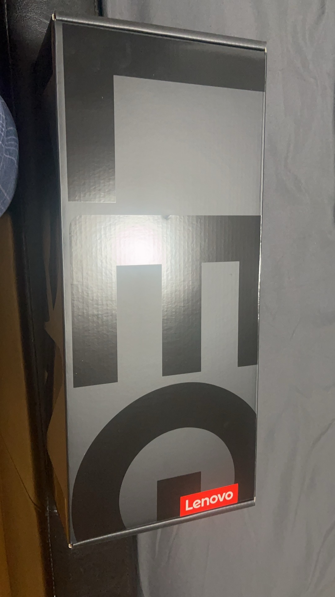
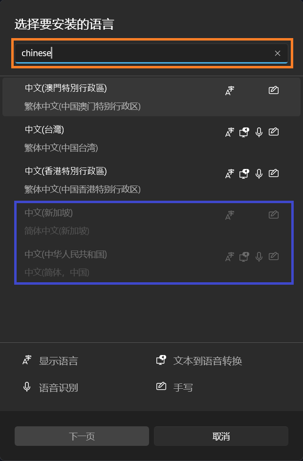
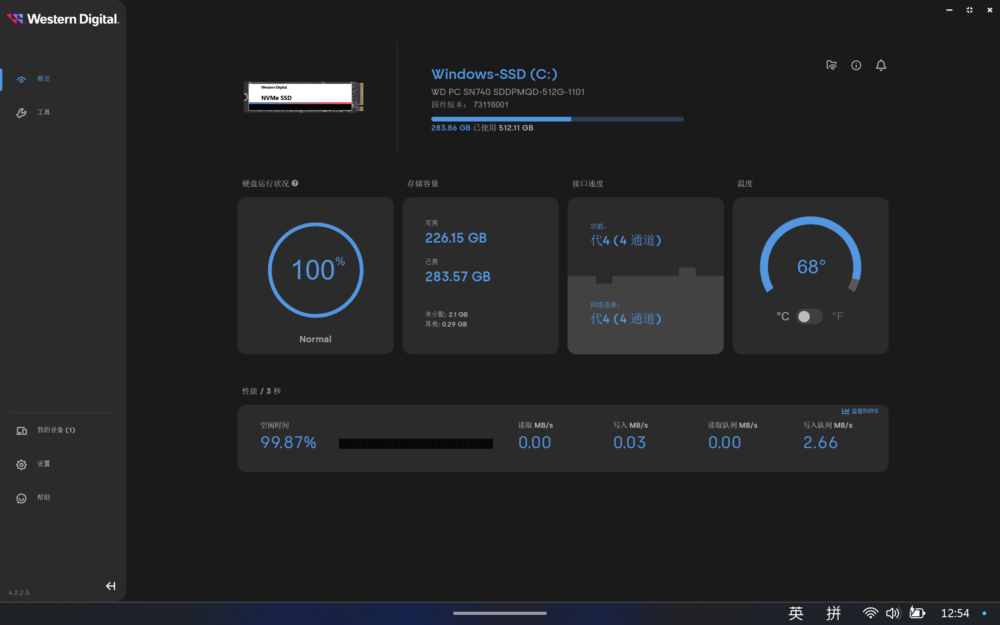
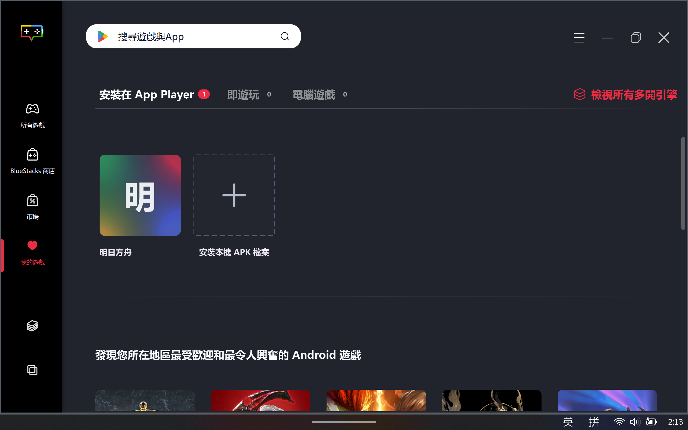
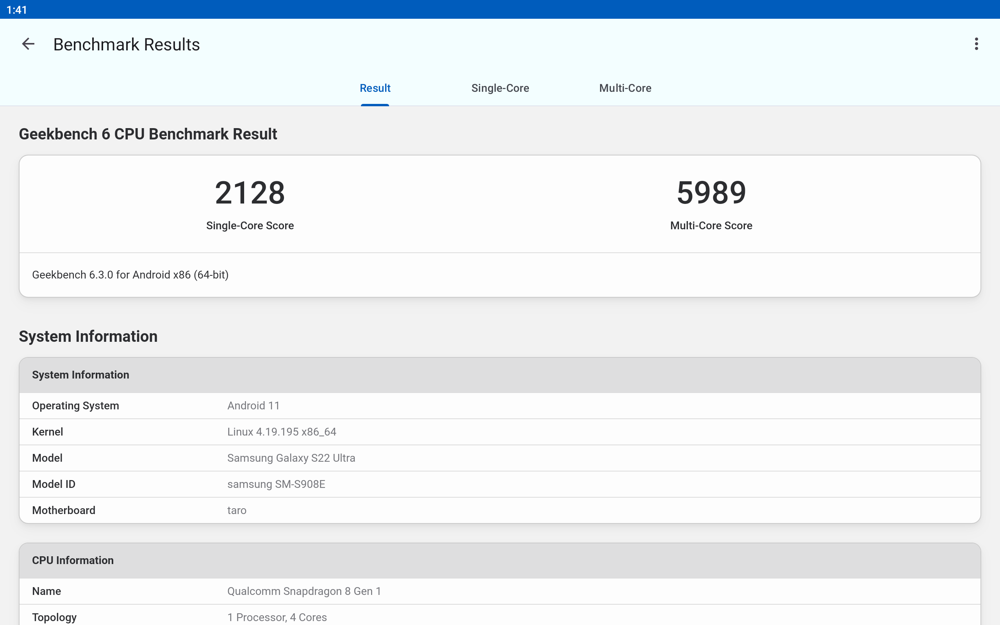
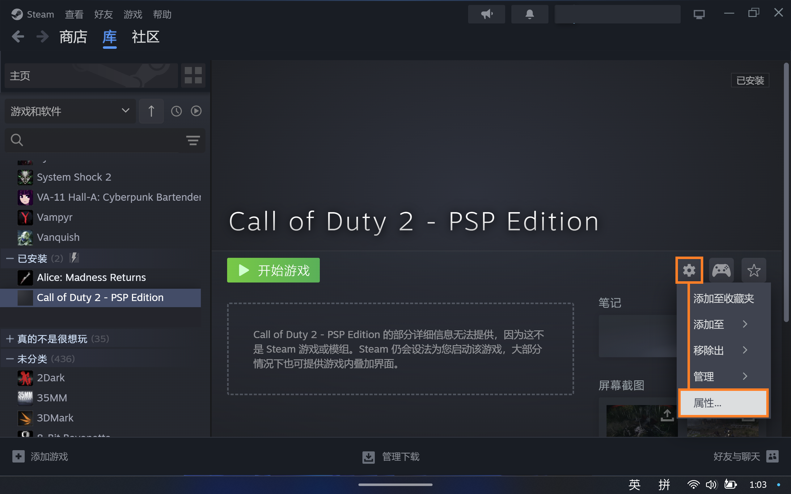
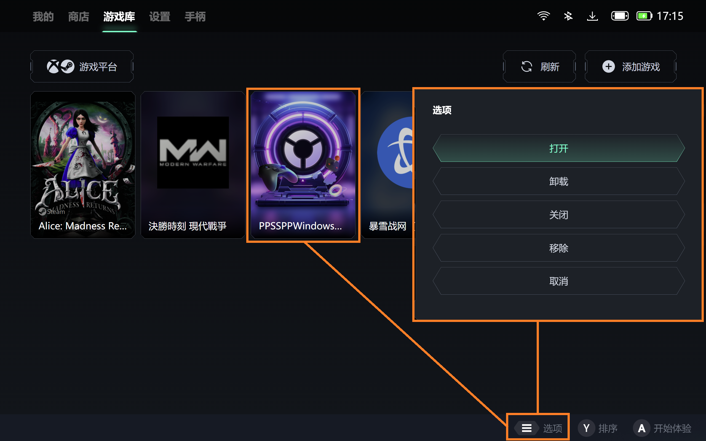
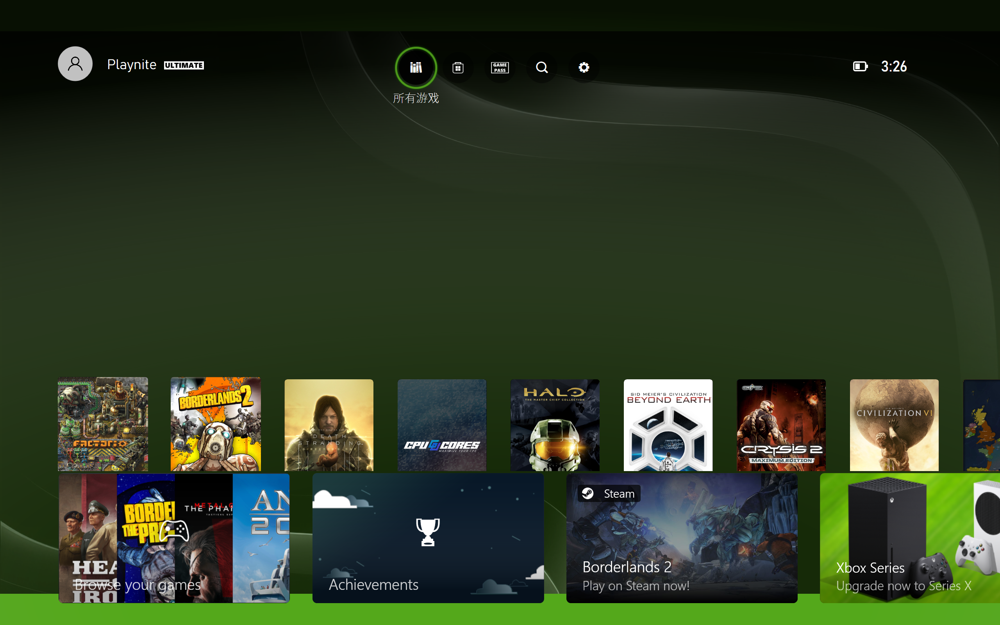

# 联想Legion Go使用体验和自定义

*版本：1.0*

查看Github渲染器中的**目录**：使用Github Markdown渲染页面右上角的“目录”（⋮☰）按钮。

---


本文仅适用于在2023年10月31日发售的Lenovo Legion Go 1 (8APU1; AMD Ryzen Z1 Extreme)。  
Lenovo Legion Go 1（以下简称为 *“Legion Go”* ）有两种不同的SoC规格： *AMD Ryzen Z1* 和 *AMD Ryzen Z1 Extreme* 。前者只提供于256G版本且仅限特定区域。  
参考：[Z1 and Z1 Extreme : r/LegionGo](https://www.reddit.com/r/LegionGo/comments/18f3kyu/z1_and_z1_extreme/)

（本来一直在联想美国官网找驱动和文档啥的，用着挺舒服，突发奇想去联想中国官网 - 拯救者掌机找一下商品支持页面看有没有提供官方壁纸当个封面啥的，结果逛了10分钟屁也没找到，干啥啥都要登录，给自己逗乐了，太幽默了，我看啊，还是lenovo.com/us/zc/适合我。）

## 零、理论规格与废话

大部分的纸面数据和对比都能从这个网站找到：[掌机列表 - 掌机圈 - 关注游戏掌机-国产掌机-安卓掌机-Windows掌机](https://zhangjiquan.com/handhelds)，下面的列表是我对自己感兴趣的几个机型的补充项目对比：


 *（部分规格由Google Gemini生成，可能不准确）*

对于这些x86掌机，从玩游戏角度，我更推荐 *ROG Ally X* ；从社区支持角度，我更推荐 *Steam deck OLED* 。那你可能问了：诶这两个都不是 *Legion Go* 啊，为什么你买了 *Legion Go* 呢。那么下面就到了废话环节了。

计划和朋友们去旅游，然后吧两周之后有个考试，打算在飞机上或者晚上在旅馆的时候看看课件，刷刷ChatGPT啥的。4个B里3个B都带了iPad，我寻思虽然我以前挺看不起iPad这种“买前生产力买后爱奇艺”的玩意，但不得不说哪怕最小的iPad，那也有8.3英寸屏幕，我手上这个iPhone 13 mini才5.4英寸，看课件跟GPT网聊实在有点憋屈。

于是呢就打算买个iPad，我觉着性能不用太强（那样太贵了），也别太弱，那么拿什么当性能锚定呢？诶，我之前一直想在iOS/iPadOS上玩 *[DEATH STRANDING DIRECTOR'S CUT on the App Store](https://apps.apple.com/us/app/death-stranding-directors-cut/id6449748961)* ，那就从 *“信息 - 兼容性 - iPad”* 找个看起来最便宜的iPad从 *Amazon Renewed* 买好了，结果一水的USD$600起，家境贫寒实在支付不起。

然后呢瞎划手机的时候突然被推送了ROG Ally X的视频，我一看这玩意和前面看的iPad价格差不太多，突然觉得诶为啥不弄个大屏x86掌机呢，这玩意可折腾性可比iPad强太多了，讲真iPhone/iPad就算越狱了也没法刷Windows刷安卓玩吧，反正我也不是死忠果粉也没被生态绑定，立马就决定跳船了。

然后看了看ROG Ally X，7寸屏幕，emmm...有点小吧，拉不开和大屏iPhone的差距啊，还是无法畅快跟LLM们网聊啊。Steam deck OLED？也是7寸啊还是800p的。诶！这个叫Legion Go的屏大，都快9寸了，接着说我在听；卧槽还能把手柄卸下来，这个玩意卡在经济舱夹板上一点都不会尴尬呢，越看越觉得卧槽，这不就是我想找的大屏x86网聊啊不是学习神器吗。正好价格也不比iPad贵（税前），那就你了，李镇狗！

## 一、开箱

趁着 *Amazon Prime Day* 从 *Amazon* 购买了开箱充新(Used - Like New: 
Screen is like new with no visible scratches. Item will come in original packaging.)的Legion Go。平常都是两日达的，这次多送了一天，估计是 *Amazon Prime Day* 订单量比平时大吧。

到手后给了个超大的箱子，足以装下拯救者笔记本了，但里面这个长方柱体才是Legion Go的快递纸箱。


打开纸箱，可以看到大大的 **LEG** 。



打开 **LEG** ，可以看到折叠起来的卡片：[Setup Guide - Legion Go 8APU1](https://download.lenovo.com/consumer/mobiles_pub/legion_go_sg.pdf)。


从 *Setup Guide - Legion Go 8APU1（快速上手指南）* 中抽出 *Legion Go 便携包* 。包下按理来说应该有 用户指南：[User Guide -Legion Go](https://download.lenovo.com/consumer/mobiles_pub/legion_go_ug_en.pdf)和 安全和保修指南：[(English) Safety and Warranty Guide - Notebook, Desktop](https://download.lenovo.com/pccbbs/mobiles_pdf/class_b_ml_swg_en.pdf)，但是我估计上次拿的大哥把用户指南给丢了，反正我是没在包装里找到。


打开 *Legion Go 便携包* ，就可以见到Legion Go的真容了（这张是补拍，已拿走塑料包装袋）。便携包中附带一个 *提带* ，方便将Legion Go从便携包中拉出。


下面用作对比的是红米K30s Ultra, 6.67寸。


对了，随机还附赠3个月的 *Xbox Game Pass Ultimate* 。


## 二、调试与测试

### 1. 跳过Windows 11 OOBE的强制联网要求

怕在30天退货期内出岔子，所以在到手的头30天内我打算先用本地账户。Windows 11 OOBE的强制联网要求，实在是老生常谈的问题，在此我觉得没有比 *Microsoft Learn* 更为权威的了：[Windows 11 setup without internet - Microsoft Q&A](https://learn.microsoft.com/en-us/answers/questions/1179311/windows-11-setup-without-internet)；微软不想主动告诉用户，但它肯定得告诉供应商。

### 2. 更改系统显示语言

Windows从古至今，永远是全新安装的系统，其系统语言可以显示地最全面——也就是说，任何在系统全新安装后新增的语言包（除了英语）都无法全面地本地化所有页面（比如开机、关机和重启更新页面，任何涉及Windows Boot Manager的页面等）。因此若想要将预装的英文界面的Windows 11更改为简体中文界面，最彻底的方式是重装系统。但就像我在上一小节说的——30天退货期内——所以还是得先在系统里调整。

以我另一台台式机上的页面为例，按下 *Windows徽标键 + I* 或者打开 *Start - All apps - Settings* ，进入到Windows 11的 *“Settings”* 应用中。

在 *Settings* 应用中，点击左侧栏 *“Time & language”* 按钮，在右侧的设置页中，点击 *“Language & region”* 按钮。在转到的设置页中，点击 *“Preferred languages”* 右侧的 *“Add a language”* 按钮。

  
 *（我实在是懒得切回英文再截一遍图了）* 

> 要更改Windows的显示语言，首先该语言包必须先被安装进系统。

在弹出的 *“Choose a language to install”* 窗口中，在搜索框中输入`Chinese`。之后，选择下面的 *“中文(中华人民共和国)”* ，点击 *“下一页”* 按钮并按提示继续（其实是懒得重走一遍截图了）。

  

如果 *“中文(新加坡)”* 和 *“中文(中华人民共和国)”* 是不可选择（灰色）状态，则为无法安装。造成一种语言无法被安装的原因一般有三种：

1. 该语言已被安装，无法重复安装。
2. 该语言被Windows零售SKU限制了安装，如一些售价较低的单语言版本或限制语言区域版本。
3. 该语言被OEM厂商限制了安装。

### 3. 进行系统更新

要接收最新的系统固件（UEFI、BIOS、EC等）更新，可以从 *Windows 更新* 处接收并更新。

还是在 *设置* 应用中，点击左侧栏 *“Windows 更新”* 按钮，或者点击 *“主页”* 设置页上右侧的 *“Windows 更新”* 按钮。在转到的设置页中，点击右侧的 *“检查更新”* 按钮。

  

之后，Windows 11会自动检查并更新当前系统所需要的系统更新、（与微软合作的）软件更新、系统固件更新、驱动更新等并自动安装。

> Legion Go使用的 *AMD Ryzen Z1 extreme APU* 的显示驱动由AMD和联想共同推出，但推送显示驱动由OEM（即联想）负责（见此AMD社区讨论贴[Graphics Drivers for Ryzen Z1 Extreme - AMD Community](https://community.amd.com/t5/pc-drivers-software/graphics-drivers-for-ryzen-z1-extreme/m-p/614065)），因此AMD官网驱动下载页面是找不到Z1 extreme的 *AMD Radeon GPU (780M)* 驱动的。一般来说，当OEM厂商会将驱动同步推送到微软更新库，因此 *“Windows 更新”* 也可以接收并更新Legion Go的显示驱动。
> 
>  *（在 *AMD Ryzen Z1 extreme APU* 的 *AMD Software: Adrenalin Edition* 软件的 *设置 - 系统* 页面中，找不到驱动更新按钮。）*

在进行固件更新时，Legion Go会重启至固件更新界面，此时不要强行关机，保持电源接入。


更新共有两个阶段，第一阶段结束后，系统会开机黑屏一段时间（大概1分钟），然后重启进入第二阶段。此时不要强行关机，保持电源接入。


### 4. 禁用Microsoft Defender

常与 *Microsoft Defender* 安全软件打交道的朋友们，可能见过其“先斩后奏”和“宁可错杀一千，不可放过一个”的特性，但最让我头疼的还是这个B吧特别特别喜欢疯狂全盘扫描。PC要是放着一会不管然后风扇狂转，那十有八九不是在系统更新就是 *Microsoft Defender* 又双叒叕开始扫起盘了。既然跟它斗智斗勇、用各种方法都没法彻底关掉它（以前跟它战斗过，我只能说实在置不起这个气），不如直接利用“安装第三方安全软件会让 *Microsoft Defender* 待机”这个特性，装个第三方杀软给它禁言好了。

本小节以安装 *火绒安全软件* 为例：

首先我得提一下， *火绒* 在用户不自己进行调试下的预设情景中，其防病毒和杀毒能力还有待进步，与国际大厂（包括 *面向企业的 Microsoft Defender* 和 *奇虎360* ）还有一段差距。我个人将 *火绒安全软件* 视作“嵌入式安全解决方案”或“ *Microsoft Defender* 禁用器”。

打开 *开始 - 所有应用 - Microsoft Store* ，进入到 *“Microsoft Store”* 应用中。在上方的搜索框中输入`huorong`，按 *“Enter（回车）键”* 发起检索。在下方的搜索结果中，选择想要的应用，点击其卡片。


在应用详情页面中，点击 *“安装”* 按钮，进行应用安装。


 *（这个安装过程就不需要再介绍了吧……）* 

> 直到最近我才明白 *Microsoft Store* 应用详情页里的这个 *“由...提供和更新”* 的意思是 *Microsoft Store* 只管装上，不管更新和卸载。

在成功安装火绒之后，打开 *系统托盘 - Windows 安全中心* 或  *设置 - 隐私和安全性 - 安全性 - Windows 安全中心* 进入到 *Windows 安全中心* ，在其中点击 *“病毒与威胁防护”* 按钮，在其页面中若出现安装的第三方安全软件提供保护，且点击 *“Microsoft Defender 防病毒选项”* 链接将其展开后， *“定期扫描”* 开关为 *“关”* ，则说明 *Microsoft Defender* 禁用成功。


### 5. 调整集成显卡共享显存设置

#### 5.1 设置多少集显专用显存为好？

对于集成显卡（英特尔：核芯显卡，AMD：Radeon Graphics），集显专用显存是与内存共享的。

  
 *（在 *“任务管理器 - 内存”* 页面中可以看到为硬件保留的内存，通常情况下是为集显保留的专用显存大小。）* 

这个集显专用显存的大小，无论设置为多少，都是动态调整的。一般逻辑是，当集显使用显存到达了这个大小，集显会继续向内存申请显存；而当没有到达这个大小时，系统也不会将未使用的专用显存释放出来。假设共有16G内存，一款游戏将占用4G显存，当集显专用显存设置为1G时，游戏在运行时仍然会占用4G显存，而在空置时系统将有15G内存可用；当集显专用显存设置为6G时，游戏在运行时会占用4G显存，而在空置时系统只有10G内存可用。

为什么前面说是“一般逻辑”？因为有一些集成显卡是不采用这个设置的：无论设置为多大的专用显存，集成显卡永远是从一个初始值动态调整；而有的游戏会读取启动时的显存容量而调整画面效果，比如启动时读取到1G显存，即使后面集成显卡能够将专用显存申请到8G，游戏仍按1G显存进行优化调整，导致画面缩水。因为不同软硬件的调度之间差别很大，所以没有一个万金油设置，只能具体情况具体分析。

那么设置成多少为好呢？如果你像我一样，主要使用场景是看剧、看课件和大屏网聊，那么设置为 *Auto（自动）* 就可以了；毕竟越多内存分配给系统（或 *Google Chrome* 浏览器），系统越流畅（日用情况下，在16G以上的内存，扩大内存大小将使提升进入边际效应）。

但如果主要使用场景是玩游戏，我搜到有几种说法：

1. “amd核显必须要分配足量的……显存拉到4g以上，甚至8g……怀疑是amd核显的显存管理机制有问题……”  
   来自于评论区 - 孤独凤凰战士：[脑洞评测：7840HS显存大小对性能影响对比_哔哩哔哩_bilibili](https://www.bilibili.com/video/BV1KC4y127zo/)
2. “但显存大小会影响Apex中枪械模型的清晰度，如果是512MB的话，会糊成橡皮泥，你改成最低2G的话，枪械模型，机瞄都会清晰很多，到也不会影响帧率。”  
   来自于评论区 - 新欤：[780M核显在4GB和512M显存下性能差异 八款游戏测试_哔哩哔哩_bilibili](https://www.bilibili.com/video/BV1dn4y1R7p7/)
3. Reddit的r/LegionGo下的一篇帖子，大部分人同意6G是较佳设置。  
   来自于：[legion go vram : r/LegionGo](https://www.reddit.com/r/LegionGo/comments/1bkbpss/legion_go_vram/)
4. “There's a new bios with 6Gb option, it will probably be the sweet spot.”  
   来自于评论区 - @whitezzpt：[Lenovo Legion GO - 3GB vs 4GB vs 8GB VRAM compared in 10 Games - YouTube](https://www.youtube.com/watch?v=pfm675bDmGM)

综上所述，设置集显专用显存为6G或许是最佳选择。

#### 5.2 进入UEFI设置界面

在关机的情况下，按住Legion Go的 *“音量+键”* 的同时按下 *“电源键”* ，进入 *“Novo Button Menu”* 。在该页面点击 *“BIOS Setup”* 。

或者，在开机并进入Windows 11系统中时，点击 *“开始菜单 - 电源”*，然后在按住键盘上的 *“Shift键”* 的同时，点击 *电源选项* 中的 *“↺重启”*。

  

之后Windows将进入到 *Windows Boot Manager（Windows启动管理器）* 页面。依次点击 *“Troubleshoot - Advanced Options - UEFI Firmware Settings - Restart”* ，重启后即可进入UEFI设置界面。

  
 *（这张图也说明了Legion Go的屏幕是原生竖屏的。）*

#### 5.3 调整UEFI设置界面为中文（可选）

进入UEFI设置界面，点击图形界面右下角的蓝色 *“More Settings >”* 按钮，进入 *高级设置页面* 。点击左侧 *“系统信息”* 按钮，在右侧更改 *“语言”* 选项为 *“中文”* 。


#### 5.4 调整集显专用显存大小

点击左侧栏 *“系统设置”* ，在右侧设置页面找到 *“共享显存”* ，点击右侧下拉菜单，选择偏好的选项。然后按下 *“F10键”* 或点击 *“退出 - 保存并退出”* ，在弹出的 *“确认”* 弹窗中点击 *“是”* 按钮。


### 6. 任务管理器置于顶层

如果玩掌机的时候游戏卡死，然后用 *“LS侧边栏”* 调出的 *任务管理器* 还被卡死的游戏遮挡了，手边还没有键盘输入 *“Ctrl + Alt + Del”* 调出 *Windows 安全界面* 来用紧急注销当前用户的方式进行强退，这就很尴尬了。

在 *任务栏* 上 *右键 - 任务管理器* ，或按下 *“Ctrl + Alt + Del”* 然后点选 *“任务管理器”* 进入 *任务管理器* 。点击左侧栏下方的 *“设置”* 按钮，然后在右边的设置页面中选中 *“常规 - 窗口管理”* 中的 *“置于顶层”* 复选框。


### 7. 调整任务栏高度

// TODO：在11月11日之后

[How To Change Taskbar Size in Windows 11? - GeeksforGeeks](https://www.geeksforgeeks.org/how-to-change-taskbar-size-in-windows-11/)

### 8. 垂直鼠标模式与分体手柄设计

我没打算拿Legion Go玩射击为主的游戏，所以这个FPS模式，我更愿称之为“垂直鼠标模式”。按住 *TrueStrike右手柄* 背部下侧的 *“释放按钮”* 并将手柄向下拉，从Legion Go上取下，然后放入随附的基座中（基座将磁吸于 *TrueStrike右手柄* 下方），拨动其底部的 *“FPS模式开关”* （下图橙色框内）至 *“FPS”* 位置，即可启用 *TrueStrike右手柄* 的垂直鼠标模式。

  
 *（蓝色框内为 *TrueStrike右手柄* 的 *IAS* 。）* 

下图大致展示了 *TrueStrike右手柄* 的垂直鼠标模式在使用右手握持时，右手的各部位与 *TrueStrike右手柄* 的接触位置。

  
 *（ *TrueStrike右手柄* 的垂直鼠标模式没有为左手握持设计。）* 

<a href="https://www.flaticon.com/free-icons/hand" title="hand icons">手标志PNG图来自于：Hand icons created by Freepik - Flaticon</a>

虽然用户手册里说可以把右摇杆帽拔下来，但我拔了一下，还没等拔下来摇杆就卡在指向边缘了，吓得我不敢拔了，拿高压气体吹了一会儿才恢复。反正也是携带中充当鼠标的替代品，不打算长时间紧握，也就没觉得太不便。磁吸底座在拿起来晃的时候有些不稳，但放在鼠标垫上使用的时候还蛮稳的。总的来说，我挺喜欢这个新奇的尝试，这不就是PC DIY界一直缺少的花活吗。要是真为FPS游戏使用，这款“鼠标”还是差的有点多；但是我觉得我完全足够为此在携带时少带一个 *罗技 MX Anywhere 2s* ，意义还是不小的。

不过使用完这个垂直鼠标模式后要想着切换回手柄模式，要不就会像Bilibili上的一位买回来之后大呼手柄失灵要避雷了（笑）。

可以购买类似于下图的 *TrueStrike手柄* 充电握把，这样可以将 *TrueStrike手柄* 组合成一个单独的外置游戏手柄，适合将Legion Go放在桌面或者外接显示设备时使用，同时也可以通过USB-C接口连接充电设备。唯一的缺点是，这个没办法放在联想附赠的 *Legion Go 便携包* 中。

  
 *（与 *Xbox 无线手柄（2020）* 对比）* 

为了节省电池电量， *TrueStrike手柄* 在脱离Legion Go主机之后将在一定时间后自动关机。超时时间可在 *Legion Space* 软件和 *Legion Space 侧边栏* 中调整，详见下面的 *三、1.a* 。在 *TrueStrike手柄* 关机后，按住 *Legion L\R键* 三秒可分别启动两个手柄，并自动连接到Legion Go主机。

这样的可分离式手柄有没有让你产生一种既视感？是的，在我搜索手柄的使用资料的时候，发现很多人提到过希望这对 *TrueStrike手柄* 可以像 *任天堂 Switch* 的 *Joycon手柄* 一样工作。以我目前搜到的资料来看—— *TrueStrike手柄* 可以分为两个手柄使用，但是有意义的应用/游戏较为有限（一些派对游戏支持）。至于能不能够将该手柄连接到其他设备，该手柄是可以通过蓝牙连接到其他PC的，但是分为了两个单独的手柄：

  

连接到另一台Kubuntu PC里并使用[Gamepad Tester - Check Controllers and Joysticks Online](https://hardwaretester.com/gamepad)测试，均显示同时连接了两个手柄；此时还不是标准X-input布局，如果想要当成两个一半的手柄合成一个使用，还得自行进行按键映射。

我能理解联想想要实现类 *Joycon手柄* 的设计，但单手柄使用的玩家也很多，在其他兼容设备上使用 *TrueStrike手柄* ，并合为一个手柄的功能估计只能靠联想以后的固件升级了，但联想会不会给升级呢？那就拭目以待吧。

参考：
[How to connect go controllers to pc? : r/LegionGo](https://www.reddit.com/r/LegionGo/comments/17p7xl6/how_to_connect_go_controllers_to_pc/)

### 9. 基准性能测试

#### 9.1 3DMark 30W TDP测试结果

 *UL 3DMark* 是这世界上最知名的 **Windows** PC性能测试软件之一，其拥有广泛的基准测试，绝大部分用户使用其中的基准测试用例来测试PC的 **游戏性能** 。 *3DMark* 是 *付费软件* ，可以通过[Steam 上的 3DMark](https://store.steampowered.com/app/223850/)获取。

以下结果是在使用65W供电、 *Legion Space* 中设置性能模式为自定义 - TDP 30W SPPT 35W FPPT 41W、电源模式为性能、风扇为自定义（自动）设定下的3DMark各基准测试的结果分数：

  

仅从基准测试结果来看，当运行在1280x800分辨率时，运行效果均比在2560x1600分辨率下的效果好，但差距仅为2%~5%。使用RSR对于基准测试来说反而使得分数下降，甚至比在2560x1600分辨率下得分还要低。不过要强调的是，由于 *3DMark* 旨在控制分辨率对得分的影响，实际游戏对于不同分辨率下的优化与显示效果调控可能不如 *3DMark* ，还需要实际按体验决定在什么性能设定下使用；其次此处RSR得分意义较小，基准测试结果不能当画面看，且使用RSR后除 *AMD Software: Adrenalin Edition* 软件，其他软件测得帧数数据均不准确，所以RSR效果还得进一步研究。

#### 9.2 使用3DMark基准测试结果判断掌机性能释放

在 *3DMark* 某项图形性能测试结束并出结果后，记下其总分数、CPU分数（若有）、显卡分数（若有）。此处以 *Time Spy* 测试为例，测得一次结果截图为：


然后，点击总分下方的 *“在线比较结果”* 按钮，在转到的网页中点击上方的 *“结果”* 项，或直接打开链接：[搜索](https://www.3dmark.com/search)。然后，在 *“Search for CPU（搜索CPU）”* 中输入部分CPU关键字，如`Z1`，在下方联想结果中点击要对比的相同CPU。GPU同理，在本例中搜索`AMD ROG Ally Extreme GPU`。最后，在第三个下拉菜单中选择要对比的相同基准测试，在本例中为`3DMark Time Spy`。最后，点击 *“搜索”* 按钮。


在转到的搜索结果页中下拉，对比 *“Overall Score（总分数）”* 、 *“Graphics score（显卡分数）”* 、 *“CPU score（CPU分数）”* 。对于测得的3DMark基准测试分数，我个人的经验如下：

| 前10% | 前10%~40% | 前40%~70% | 后30% |
|:--------:|:--------:|:--------:|:--------:|
| 那是真的牛逼 | 硬件发挥正常 | 硬件发挥不正常，检查驱动版本、功耗 | 某项（些）测试子项目被跳过或运行在了集成显卡上（对于同时拥有独显和集显的设备） |


#### 9.3 Geek bench 6 30W TDP测试结果

 *Geekbench 6* 是一个我很喜欢用的广泛跨平台设备性能基准测试工具（也因为实在找不到别的类似的工具），可以跨Windows、MacOS、Linux、安卓和iOS平台；x86_64和AArch64架构进行基准测试，且对个人非盈利用途免费。

进入 *Geekbench 6* 官网[Geekbench 6 - Cross-Platform Benchmark](https://www.geekbench.com/)，点击 *“Download”* 按钮。在跳转的下载页面中，点击 *“Download for Windows”* 按钮进行下载，并安装。


安装完成后打开，勾选 *“Don't show this again（下次不要显示）”* 复选框，并点击 *“Later（之后再说）”* 按钮。 *（忘截图了，欸嘿）* 要进行CPU基准测试，点击 *“Run CPU Benchmark（运行CPU基准测试）”* 按钮并在弹出的进度窗口消失前，不要进行其他动作；要进行GPU基准测试，先从下方 *“GPU Benchmark（GPU基准测试） - GPU API:”* 处的下拉菜单中选择一种API，再点击 *“Run GPU Benchmark（运行GPU基准测试）”* 按钮，并在弹出的进度窗口消失前，不要进行其他动作。


基准测试完成后， *Geekbench 6* 将自动上传结果并打开基准测试结果网页。

以下为性能设置同 *9.1* 下的 *Geekbench 6* 测试结果：


在这两项测试时，风扇转速均不高，倒是挺出乎我意料的。

#### 9.4 使用Geek bench 6基准测试结果判断掌机性能释放

在打开的结果页右上角的搜索框 *“Search”* 中，输入结果页标题。对于Legion Go，则为`LENOVO 83E1`。然后，按下 *“Enter（回车）键”* 发起搜索。（图见上一小节）

在搜索结果中，点击右侧的 *“Results（结果）”* 栏中的选项，可以更改搜索的基准测试结果类别。 *Geekbench 6* 的结果列表并没有像 *3DMark* 那样给出结果排名，因此这里就看着和大家差不太多就行了。

诶怎么有个家伙拿了9万多分？点击任一结果卡片左方 *“System（系统）”* 下面的标题名称链接（在此处为 *“LENOVO 83E1”* ），进入详细结果页面。


好好好背着大伙偷偷接 *NVIDIA Geforce RTX 4060* 是吧。

  

### 10. 散热压力测试

#### 10.1 使用3DMark压力测试结果判断掌机性能稳定性

“性能稳定性”是个比较泛泛的词，不同的人有不同的要求。它不是用于测试硬件性能的，而是测试当前硬件设备以及性能设置是否可以使整体系统在高负载（如游戏中）稳定运行。影响性能稳定性的因素有很多，比如Windows电源计划、OEM软件性能模式、主板供电能力、电源供电能力、散热效能、后台任务占用（包括安全软件扫盘计划、系统更新、反作弊软件、Denuvo防篡改等）等。

这个不用要求太高，一般超过96%即可认为性能稳定性为佳。超不过96%，可以从上方各项影响因素中寻找导致稳定性较低的原因。

  
 *（Legion Go在和本节 *9.1* 中的相同设定下，可以通过稳定性测试下98%的帧率稳定度。）* 

#### 10.2 使用AIDA64与Geeks3D FurMark 2压力测试结果判断掌机散热效能（不推荐）

 *AIDA64* 是一款功能强大的系统信息工具，用于监控和诊断硬件性能。它可以提供详细的系统报告并执行稳定性测试以检测潜在问题。但 *AIDA64* 并未对个人用户提供免费使用的版本；尽管其实时监控的功能已经逐渐被对个人非盈利用途免费的[HWiNFO - Free System Information, Monitoring and Diagnostics](https://www.hwinfo.com/)所取代，但其内建的统计图表功能和CPU封装压力测试功能还是难以撼动的。

 *Geeks3D FurMark 2* 是一款专门用于测试显卡稳定性和性能的基准工具，通过渲染高负荷的毛发效果来进行 GPU 压力测试。它常用于检测显卡在高温下的稳定性以及可能出现的过热问题。对于玩家来说，可能 *FurMark 1* 更为熟知一些，但 *FurMark 2* 不仅将 *FurMark 1* 升级到了Windows 64位软件，还进一步支持了Linux平台，且支持纯命令行运行。 *FurMark 2* 是免费软件。

尽管 *AIDA64* 具有对GPU进行压力测试的功能，该功能尚且无法与其他专业GPU压力测试拉开差距。真正能榨干显卡光栅性能的压力测试，还是得用 *FurMark 2* （但 *FurMark 2* 无法针对在 *AI生成帧技术* 和 *实时光线追踪技术* 下进行压力测试。要对这两项进行压力测试，请使用 *3DMark* 压力测试。）。

结合这两款软件，你或许将获得Windows下的最强压力测试工具，做到真正的“烤机”。不过需要注意：这种达到“烤机”效果的压力测试，其目的为将PC的性能推至极限；但对于运行游戏来说，常常达不到（甚至远达不到）这么极限的压力，因此“烤机”性能仅能作为参考，在散热效果没有产生较大影响时，不必纠结于“烤机”性能的好坏。打个比方，假设一台PC的出厂预设性能为90%，“烤机”是冲着120%的性能释放去的，而游戏往往只占用10%~90%的性能。**对于小白来说，通过 *3DMark* 压力测试即可说明PC的性能发挥符合预期，没必要再进行“烤机”。**

&ensp;&ensp;&ensp;&ensp;**10.2.a 下载并安装**

进入 *AIDA64* 官网[Home | AIDA64](https://www.aida64.com/)，点击右上角导航栏中的 *“Downloads（下载）”* 项，然后在跳转的下载页面查看 *“Stable Downloads（稳定版本） - AIDA64 Business”* ，确定最新版本号。

和许多提供试用版本的软件一样， *AIDA64* 要求必须经电子邮件申请才能获取到下载地址。当然，你也可以在网络上搜索分享的试用版本安装程序，不过在使用前，务必确认该安装程序安全，如通过反病毒软件扫描、虚拟机试运行等。

  

进入 *FurMark 2* 官网[FurMark Homepage](https://www.geeks3d.com/furmark/)，点击左上角导航栏中的 *“Downloads（下载）”* 项，然后在跳转的下载页面中点击 *“FURMARK 2 - Latest Versions（最新版本） - Windows - - v\*\*\* - win64 - (ZIP)或(SETUP)”* 链接。其中，带有 *“(ZIP)”* 的版本为压缩包免安装版本，带有 *“(SETUP)”* 的版本为需安装版本。最后，在跳转的文件下载页面中点击 *“DOWNLOAD（下载）”* 按钮，启动下载。

  

在安装并启动了 *AIDA64* 之后，默认情况下是英文的。点击右上角 *“⋮（菜单）”* 按钮，在弹出的菜单中选择 *“Preferences...（设置...）”* 菜单项，在弹出的 *设置* 窗口中，选择右侧 *“Language（语言）”* 设置页中列表中偏好的语言。本节以 *“Simplified Chinese（简体中文）”* 为例。然后，点击 *“OK”* 按钮。

  

之后你会发现， *AIDA64* 的界面将会显示乱码。原因在于，AIDA64默认情况下是不开启Unicode支持的。可以调整系统设置，调整不支持Unicode的程序的默认字符集。打开 *设置 - 时间和语言 - 语言和区域 - 管理语言设置* 进入到 *区域 - 管理* 设置页面。

  

在 *区域 - 管理* 设置页面中，点击 *“非 Unicode 程序的语言 - 更改系统区域设置...”* ，在弹出的 *“区域设置”* 窗口中，更改 *“当前系统区域设置：”* 下拉菜单中的语言和区域和之前在 *AIDA64* 中设置的语言相同。然后，点击 *“确定”* 按钮，在弹出的 *“更改系统区域设置”* 窗口中，点击 *“现在重新启动”* 按钮，系统将自动重启。

  

如果下载的是 *FurMark 2* 压缩包免安装版本，直接将其中的内容解压即可。 *FurMark 2* 在Windows下带有图形界面的程序为 *“FurMark_GUI.exe”* 。 

&ensp;&ensp;&ensp;&ensp;**10.2.b 准备与进行烤机**

不打算接着详细写了，如有需要请参考以下在线内容：

 *AIDA64* CPU压力测试准备：[AIDA64使用教程-测试CPU_哔哩哔哩_bilibili](https://www.bilibili.com/video/BV1eX4y1h7Qg/)

 *FurMark 2* GPU压力测试准备：[Furmark2.0显卡烤鸡甜甜圈软件使用介绍_哔哩哔哩_bilibili](https://www.bilibili.com/video/BV1Mx4y1Y75f/)

进行烤机测试：[测试合集第八期-双烤测试_哔哩哔哩_bilibili](https://www.bilibili.com/video/BV1kP411D73T/)

### 11. SSD性能测试、管理软件与TF(Micro SD)卡槽测试

Legion Go 512GB版本使用的是一块 *西部数据 SN740* M.2 2242 SSD作为内部存储，型号为`SDDPMQD-512G-1101`，寿命为300TBW，跑测试完成之后可以达到66°C（运行温度区间为0~85°C）。（20241026更新：不是测试完成后66°C，而是这货待机就小70°C）

  

西部数据为旗下SSD产品提供了管理软件 *“Western Digital Dashboard”* ，可在此链接：[Download, Install, Test Drive and Update Firmware Using Western Digital Dashboard](https://support-en.wd.com/app/answers/detailweb/a_id/31759)进行下载。进入页面后，点击两个 *“Western Digital Dashboard”* 链接中的任一链接开始下载，然后运行安装程序进行安装。


如果你在安装时选择使用中文安装，那么在看到安装程序显示 *“卸载成功！”* 便已成功安装。

  

之后便可以使用 *“Western Digital Dashboard”* 查看并管理这块 *西部数据 SN740* 了。这时候我才意识到这玩意待机就小70°C了。



要测试TF(Micro SD)卡槽，首先将TF卡插进去，可以看到卡尾端基本和机身持平：


之后再用CrystalDiskMark对TF卡中的分区进行测试，测试结果基本和以前在另一台PC上测试的结果相同，TF(Micro SD)卡槽即测试可用。

和许多x86掌机一样，该读卡器设计的意义是让用户能够扩展内部存储的空间。但暂且不说TF卡价格普遍比消费级TLC SSD高，其使用寿命还仅仅是消费级TLC SSD的1/7到1/5（来源：Google Gemini）。我之前用过的一些TF卡，在长时间通电活动下常常使用寿命不到一年半，所以这里还是建议不要使用任何TF卡作为手机/电脑的持久性存储空间扩展设备。

### 12. 音频输出测试

由于没办法在文章里插入音频，因此在这里就不加入对比了（实际狂喜）。我只能说，Legion Go的内置扬声器品质实在是有些一般，可能只比近两年淘宝性价比便携显示器里面的内置2W小破喇叭好一点。当然我也是可以理解的，毕竟手柄可拆卸的话，就没办法把扬声器放在手柄里了，也就没办法像 *ROG Ally X* 和 *Steam deck OLED* 那样将扬声器放置在两个摇杆下方并面向用户出声了。拆下手柄后，整个正面就一大块屏幕，塞下个光线传感器都不容易，哪里有空间再塞个扬声器呢。若搞分离式扬声器，多少感觉有点诡异……

因此，Legion Go选择在机身背部上方放置两个扬声器并在机身上方开口，使声音向上发出（见上一小节最后图中橙圈内）。这样除了会导致正面音质降低以外，还会和散热口发出的噪音相混合，所以如果是玩游戏并使用内置扬声器的话，那基本也就听个参与度。但我一般玩游戏的时候戴2.4G或者蓝牙耳机，所以这个不算是个大问题。只能说要让我做产品设计，这也是我能想到的最佳解决方案了。但如果是对掌机扬声器音质有需求的人，那就得考虑考虑这一点了。

一个折中的方案是使用第三方软件EQ来有限地改善音质，或者连接有线外置音响。对于软件EQ，我在台式机上一直使用[FxSound - Windows官方下载 | 微软应用商店 | Microsoft Store](https://apps.microsoft.com/detail/xp8jk4tbq03lz4):


就算不使用第三方软件EQ，也一定要关闭 *Realtek Audio Console* 应用中这个天杀的 *Omni Speaker* ：打开 *开始 - 所有应用 - Realtek Audio Console* ，点击 *“主要”* 按钮，然后在左侧栏中点击 *“播放设备 - Speakers”* ，在右侧的设置面板中关闭 *“音效 - Omni Speaker”* 下方的开关。如果你同时使用Legion Go的扬声器播放歌曲，你就知道为什么我一定要你关掉它了。可以搭配这首歌：[Le Youth ft. Ava Max - Clap Your Hands (Official Music Video) - YouTube](https://www.youtube.com/watch?v=cvhfq3eF2gI)测试。可以根据自己的听觉感受，调整下方的 *均衡器* 设置。


> 如果找不到 *Realtek Audio Console* 应用，可以尝试勾选 *设置 - Windows 更新 - 更多选项 - 高级选项 - 其他选项 - 可选更新 - 驱动更新 - “Realtek - SoftwareComponent - \*\*\*”* 复选框并点击下方的 *“下载并安装”* 按钮，在安装完成后重启。

> 在安装了第三方软件EQ之后， *Realtek Audio Console* 的内置音效调节功能将被自动禁用。

让我有些难绷的是我在Aliexpress上看到了这些3D打印的音质增强器……只能说折腾是无止境的，但我真要弄的话可能也就粘俩瓶盖得了……

  

### 13. 显示输出测试与Miracast

#### 13.1 USB-C with DP Alt Mode 输出测试

Legion Go的机身顶部和底部均各带有一个 *USB4 40Gbps* 接口，且为全功能USB Type-C接口，支持 *Thunderbolt 3（雷电 3）* 端口、 *DisplayPort Alternate Mode 1.4（DP 交替模式 1.4）* 端口，以及支持 *USB PD 3.0* 的最高100W供电输入。要测试两个USB4接口的 *DP 交替模式* 功能是否可以正常工作，可以将支持传输速率在**10Gbps及以上**的双向USB Type-C线缆与Legion Go和支持 *DP 交替模式* 的显示设备相连，并测试显示设备的 *EDID信息* 是否能被正确读取、是否可以使用最大显示分辨率、显示刷新率以及音频输出。若均是，则 *DP 交替模式* 测试通过。同时，由于Legion Go的两个USB Type-C接口均为全功能接口，也表明了其支持 *USB-C 单线连接（USB-C Single-Cable Connection）* 或 *USB-C 一线通（USB One Cable Solution）* 。下图展示了我的Legion Go通过 *USB-C 一线通* 驱动外置便携式显示器（1920x1080, 120hz, 8-bit）。


Legion Go的两个全功能USB Type-C接口为其扩展到办公场景提供了可能。在下图中，我将我的Legion Go连接到从室友那白嫖的 *戴尔通用扩展坞 D6000* ，并使用该扩展坞连接到了以下设备：

- 1个USB2.0鼠标
- 1个USB2.0键盘
- 1个USB2.0 HUB
- 1个2560x1440, 144hz, 8-bit显示器，通过DP
- 1个1920x1080, 120hz, 8-bit显示器 + 2 x 2w扬声器，通过HDMI
- 1个3.5mm音频输出
- 1个1000M有线网络


该扩展坞的上行USB Type-C线缆支持 *USB PD 2.0* ，最高输出65W，即可在扩展更多接口的同时，向Legion Go供电。但该扩展坞在连接到第二个显示器的时候切断了上行供电，且无法通过拔下DP/HDMI线缆恢复上行供电，只能重新插拔上行USB Type-C线缆。

#### 13.2 Miracast测试

 *Miracast* 是由Wi-Fi 联盟创建的无线通信标准，旨在将视频和声音从设备（如笔记本电脑或智能手机）传输到显示接收器（如电视、显示器或投影仪）。“实际上是一根无线HDMI 电缆，使用 H.264 编解码器和模拟 HDMI 系统的数字版权管理(DRM) 层将所有内容从一个屏幕复制到另一个屏幕。”（来源：[Miracast - Wikipedia](https://en.wikipedia.org/wiki/Miracast#Technical_details)）

将一台Windows 10/11设备的屏幕通过 *Miracast* 投影到另一台Windows 10/11设备，在Windows 10/11中内建了这个功能，具体开启和投屏方式，在微软官方的文档中写的很详细：[屏幕镜像和投影到电脑或无线显示器 - Microsoft 支持](https://support.microsoft.com/zh-cn/windows/%E5%B1%8F%E5%B9%95%E9%95%9C%E5%83%8F%E5%92%8C%E6%8A%95%E5%BD%B1%E5%88%B0%E7%94%B5%E8%84%91%E6%88%96%E6%97%A0%E7%BA%BF%E6%98%BE%E7%A4%BA%E5%99%A8-5af9f371-c704-1c7f-8f0d-fa607551d09c)

但不知为何，投过来的画面感觉像是糊了一层白雾。


虽然远程输入和画面会有一些延迟，但声音可以在远程输出，且无延迟；画质会被压缩，但播放4K(物理分辨率限制在2K)视频丢帧不太严重，2K视频完全无丢帧，但在画面变化大时会有因压缩产生的涂抹感。

Miracast功能使得在旅行中位于支持Miracast投放的酒店时，可以将屏幕投放至酒店的电视中。

### 14. 续航测试

Legion Go有着在 *零、* 里几个x86掌机中最小的电池容量（仅49.2Wh，仅多于ROG Ally），同时拥有着最大的屏幕（无论是大小还是分别率），这不得让人对其续航能力产生一些担忧。由于没有拿到专业的续航测试脚本，也买不起昂贵的 *PCMark 10 Professional Edition* ，所以只能拿现有的免费软件和买过的游戏凑活测试一下这样子。

#### 14.1 媒体持续播放续航测试

使用[PotPlayer - Windows官方下载 | 微软应用商店 | Microsoft Store](https://apps.microsoft.com/detail/xp8bsbgqw2dks0)硬解 + *Google Chrome* 浏览器背景播放续航测试结果：

// TODO

#### 14.2 游戏续航测试

// TODO 30W 25W 15W

### * 关于强制更新显示驱动

截至编辑本小节时（202410），AMD官方的Windows驱动版本号已更新至`32.0.12011.1036`，华硕ROG Ally X的 *AMD Ryzen Z1 extreme APU* 的Windows驱动版本号更新至`32.0.11021.3002`，而联想只给Legion Go更新到`31.0.24028.1001`，与AMD官方差6个月，与华硕差4个月。因为 *AMD Ryzen Z1 extreme APU* 是基于 *AMD Ryzen 7 7840U* 之上的特供版，我尝试用7840U的驱动给Legion Go安装，驱动安装程序无法安装：


接着尝试使用ROG Ally X的驱动给Legion Go更新，结果非常不理想， *AMD Software: Adrenalin Edition* 软件会在开启时直接罢工：

  

问题是重装 *AMD Software: Adrenalin Edition* 软件也不行，只能借助[Display Driver Uninstaller (DDU) download latest version | Wagnardsoft](https://www.wagnardsoft.com/display-driver-uninstaller-DDU-)软件来彻底卸掉驱动并重新安装了。

> 无论是华硕还是联想提供的 *AMD Radeon GPU (780M)* 驱动软件，貌似安装过程都是通过复制驱动文件并在Windows设备管理器中注册的方式完成的，侧面反映出这些驱动确实是高度OEM化的。

> 20241030补充：在Bilibili上看到了安装7840U上的780M驱动教程：[ROG ALLY X 外接AMD显卡，拯救者掌机安装7840U公版驱动 | ONEXGPU、GPD G1显卡坞 Legion Go连接教程_哔哩哔哩_bilibili](https://www.bilibili.com/video/BV1Ea4y1y7vM/)，但看反应说小问题不少，那暂且先观望吧。

### * 不需要开启SAM

在 *AMD Software: Adrenalin Edition* 软件的 *“Smart Technology - AMD Smart Access Memory”* 处显示为“不支持的功能”。UEFI设置中也没有打开SAM的选项。问了ChatGPT，回答如下：

> “对于只使用集成显卡的设备， *Resized BAR(ReBAR)* （Intel）或 *Smart Access Memory(SAM) / Clever Access Memory(CAM)* （AMD）技术并不是必须启用的选项，因为集成显卡不依赖独立显存的访问管理机制，且性能影响非常有限。在这种情况下，开启这些功能不会有明显的性能提升，甚至可能没有任何影响。”


### * 提取联想预装壁纸（可选）

使用 *Windows 资源管理器* 导航至`C:\Windows\Web\Wallpaper\Lenovo\`下，里面的文件即是联想预装壁纸。


### * 预装的Windows 11无法使用Windows 安全中心

在Legion Go预装的Windows 11中的 *Windows 安全中心* 托盘图标上长期显示一个黄色箭头，而点击托盘呼出 *Windows 安全中心* 页面时，页面内一片空白，没有任何内容。通过 *设置 - 隐私和安全性 - 安全性 - Windows 安全中心 - 账户保护* 呼入 *Windows 安全中心* 页面时，页面显示如下。


我认为这可能是联想调整了预装系统的 *Windows 安全中心* 策略，猜测是通过关闭 *Microsoft Defender* 防病毒软件来减少 *Microsoft Defender* 对Legion Go续航时间的影响。但微软推 *Microsoft Defender* 的决心岂是区区OEM能控制的，据我的观察 *Microsoft Defender* 仍然会在系统空闲时进行疯狂地全盘扫描。与其通过策略关闭，还不如预装个什么Lenovo PC Manager之流给 *Microsoft Defender* 卡掉好了。

### * 屏幕校色文件（可选）

 *“屏幕校色”* 是系统调整向显示器的颜色输出以确保其与标准色彩值匹配，来保证图像的准确显示和一致性。对于Windows来说，由于显示器和驱动多种多样，不可能保证颜色输出在所有显示器上都是准确的，而使用 *屏幕校色文件* 可以告诉系统如何调整颜色映射空间，以实现最贴近真实的色彩。

一般 *屏幕校色文件* 可以通过向硬件厂商获取，比如我使用的 *戴尔 S2721DGF* 显示器，可以直接在 *戴尔驱动程序和下载* 页面获取到 *显示器驱动程序* ，该驱动安装程序会自动安装 *Dell Display Manager* 软件和 *屏幕校色文件* 到系统中并应用。如今提供显示器售卖的厂商一般都会提供对应的 *屏幕校色文件* ，而对于那些只是附带一个显示器的产品（如笔记本电脑、掌机等），则往往不提供。这种情况下就得使用专业的 *校色仪* 来校色并生成 *屏幕校色文件* 。

屏幕校色不是必须的，但如果你想要获取到Legion Go的 *屏幕校色文件* ，可以向这位Bilibili UP主：会弹钢琴的疯疯 处私信获取：[AMD·拯救者掌机！Legion Go超深度评测_哔哩哔哩_bilibili](https://www.bilibili.com/video/BV1nh4y1i7pi?t=234.1)。该校色文件的 *SHA256校验和* 为：`894a1674d1ec8feb337a66f03270cbcf5d1f975bafab75cf631be69615011cac`。

假设你已经获取到了 *屏幕校色文件* ，那么先将其安装至系统：在 *Windows 资源管理器* 中定位到该文件，然后在上面 *“右键 - 安装配置文件”* 。


以我另一台台式机上的页面为例，按下 *Windows徽标键 + I* 或者打开 *开始 - 所有应用 - 设置* ，进入到Windows 11的 *设置* 应用中。

在 *设置* 应用中，点击左侧栏 *“系统”* 按钮，在右侧的设置页中，点击 *“屏幕”* 按钮。在转到的设置页中，点击 *“亮度和颜色 - 颜色配置文件”* 右侧的下拉菜单，选择合适的颜色配置文件。


如果此处没有出现 *“颜色配置文件”* 项目，点击下方 *“相关设置 - 高级显示器设置”* ，在转到的设置页中，点击 *“显示器信息 - 显示器...的显示适配器属性”* ，在弹出的设置页面中（Legion Go为 *“Generic PnP Monitor 和 AMD Radeon Graphics 属性”* ），点击 *“颜色管理”* 选项卡，然后点击下方的 *“颜色管理...”* 按钮。在弹出的 *“颜色管理”* 页面中，点击 *“设备”* 选项卡，然后点击下方的 *“设备...”* 下拉菜单，选中 *“显示器：1. Integrated Monitor (Go Display) - AMD Radeon Graphics”* 。


然后勾选 *“使用我对此设备的设置”* 复选框。点击下方 *“与这个设备关联的配置文件”* 下方的 *“添加...”* 按钮，在弹出的 *“关联颜色配置文件”* 窗口中，选择 *“ICC 配置文件 - <屏幕校色文件>”* ，然后点击 *“确定”* 按钮。最后点击 *“关闭”* 按钮。


然后回到 *设置 - 系统 - 屏幕 - 亮度和颜色 - 颜色配置文件* ，选择刚才的颜色配置文件。

### * 关机充电显示

Legion Go可以在关机时插上电源的一刻显示当前电池电量，此功能可以在UEFI设置中开关。

  

但问题是（截至202410）也就只有这一刻会显示，之后再怎么样也无法触发了，除非把电源拔下来然后重新插上。电源灯则在关机时是完全关闭的，无论充不充电。你说Legion Go的设计者们没设计关机充电指示吧，他们给你一个3秒的电量显示；他们设计了吧，我请问就只显示插上的一刻的电量是干啥的，怕我过充？我难道不是想随时看看充到多少了？这个问题刚发售的时候就有人问了：[How-can-I-check-the-battery-during-charching - English Community - LENOVO COMMUNITY](https://forums.lenovo.com/t5/Legion-Go-and-Gaming-Hub/How-can-I-check-the-battery-during-charching/m-p/5266018)，一年了都还没解决这个问题，改一下电源灯逻辑很难吗？

## 三、在Windows 11上玩游戏

### 1. Legion Space与Steam大屏幕模式

#### a. Legion Space与侧边栏

打开 *开始 - 所有应用 - LegionSpace* ，或者按下 *“Legion L键”* （ 若切换过按键布局，则为 *View键* ），进入到 *Legion Space* 软件中。


联想给Legion Go预装了系统工具软件 *Legion Space* ，主要功能是1. 作为界面对手柄友好的综合游戏库/启动器，2. 调整掌机的硬件设置（性能模式、手柄映射等）与驱动更新。下面是一些功能介绍。

> 由于 *Legion Space* 软件更新较为勤快（相较于其OEM显示驱动更新速度），此处的介绍不保证时效性。截至编辑本小节时（202410）版本为`v1.1.2.14`。

**驱动更新**

使用手柄或触摸，依次选中/点击 *设置 - 磁盘和驱动* 。


在 *磁盘和驱动* 页面，选中/点击 *“检查更新”* 按钮。


选择想要更新/下载的驱动，选中/点击该驱动右边的 *“下载”* 按钮。如果该驱动需要重启安装，将会弹窗确认，选中/点击 *“确认”* 按钮即可。请注意：驱动安装过程并不一点是静默安装，某些驱动可能还是需要用户操作（比如点几个下一步啥的）。


20241026更新：在刚才打开 *Legion Space* 软件的时候，它自动更新了自身软件并安装了新的手柄固件。正当我想要查查这次更新了什么内容时，发现官网只有`v1.1.2.11`版本（3个月之前）的Readme，并且只有`v1.1.2.14`版本（1个月之前）的软件安装程序可供下载。稍微搜索一下网络，发现Reddit的r/LegionGo下的一篇帖子：[Legion Space Update 1.1.3.3 : r/LegionGo](https://www.reddit.com/r/LegionGo/comments/1gb85fd/comment/ltjmglg/)

  

 *（- “……如果你找到官方发布说明，请跟帖！” - “还发布说明，笑死有点幽默了”）* 

**手柄设置**

按键映射配置与快速切换。它调整按键映射的时候，UI会有2~3秒的延迟，不过也习惯了比微星的软件快多了。这里仅截取部分画面。


摇杆灯光设置


摇杆设置与扳机设置


手柄校正


20241026更新： *Legion Space* `v1.1.3.3`版本将陀螺仪设置从手柄校正中独立了出来，Legion Go可以使用内置的陀螺仪模拟左摇杆移动或右摇杆移动。


更多设置，包括更改那个逆天的 *Legion L\R键* 为 *View键* 和 *Menu键* 。


但是在开启了 *垂直鼠标模式* 之后这两个键又复原了，映射还调不了，感觉这个功能就是应付一下社区用的。

**设置 - 通用**

由于 *Legion Space* 中的 *Legion Space 侧边栏* （以下统称“LS侧边栏”）已经涵盖了大部分的设置功能，且 *“LS侧边栏”* 的使用频率比 *Legion Space* 软件高得多（我调完手柄设置之后根本不想碰这个软件），因此本节仅截取 *“LS侧边栏”* 没有涉及的功能。


 *“开机启动Legion Space”* ：开启该开关可以在开机后直接进入 *Legion Space* 。如果更喜欢使用 *Steam大屏幕模式* 或第三方Windows游戏库，可以将此处关闭，不影响开机后使用 *Legion L\R键* 呼出 *Legion Space* 和 *“LS侧边栏”* 。

 *“电源键灯光”* ：该功能开启时，Legion Go的电源键将会亮起持久性灯光，具体灯光状态和释义见用户指南的第8页：

  

 *“优化电池充电”* ：该功能开启时，Legion Go的电池在充至80%后将停止继续充电。这对于使用场景更多是在接入电源的情况下是更合适的，因为这样可以减少内置电池因在长时间处于高压下的损耗。但由于Legion Go是 *零、* 中出现的几个大厂掌机设备中电池容量最小的、屏幕和分辨率最大的，可想而知续航必定是最令人担忧的一个。所以如果你的使用场景多是离开电源而携带使用，那么这里关掉“优化电池充电”功能换取更多续航时间更为合适。

应该为Legion Go的电池健康度担忧吗？或者换句话说，应该为任何电子设备的电池健康担忧吗？我个人的想法是，应该又不应该。当我可以简单点一个键就能延长寿命且对我的使用影响不大的时候，我乐意去点那个键；但如果说天天检查健康度，掉了1%心疼3个月，那我觉得也太强迫症了。对于非富哥的我来说，去恩造设备，坏了直接买新的不现实；但也没必要把电子设备供起来使用，毕竟它们是消耗品，得接受它们随着时间慢慢积灰、剐蹭、反应迟缓和产生损耗的现实。

 *“截图快捷方式”* ：按下该组合键便可使用 *Legion Space* 软件进行全屏截图。但这里的截图快捷组合键是写死的：更换左右 *“Legion键”* 为 *“View键”* 和 *“Menu键”* 并不会将这里的快捷键改为 *“Menu键 + Y3键”* 。而且如果玩游戏的时候突然想截图了，按这两个键还挺别扭的，更别提他这个是非系统级功能，有延迟而且有的时候不生效，还不如直接让某个键映射为 *“Share键”* 更有用。

**Legion Space 侧边栏**

我是在Legion Go发售后的一年（202410）才拿到的机器，再回看发售时搭配的早期版 *Legion Space 侧边栏* ，简直不忍直视，逻辑堪称究极逆天（[AMD·拯救者掌机！Legion Go超深度评测_哔哩哔哩_bilibili](https://www.bilibili.com/video/BV1nh4y1i7pi?t=668.4)）。

但到我上手的时候， *Legion Space* 和 *“LS侧边栏”* 已经处于一个可用的状态了，唯一让我感到难以忍受的点是按下 *Legion L键* 退出 *Legion Space* 时，它居然只是最小化而不是退出到托盘，强迫症看见它占用在任务栏难受的一批。其他倒是无可指摘。

使用 *Legion R键* 呼出 *“LS侧边栏”* （ 若切换过按键布局，则为 *Menu键* ），在最上方状态栏中从左至右分别显示 *“WiFi连接状态、主机与手柄连接状态、TrueStrike左手柄电量、Legion Go电量、TrueStrike右手柄电量、当前时间”* 。


 *“LS侧边栏”* 左侧为面板导航，最上方的是 *“性能”* 页面，功能有：

- 快速切换性能模式
- 查看性能监控
- 调整散热模式 
  - 安静模式：TDP 8W
  - 均衡模式：TDP 15W
  - 野兽（性能）模式：TDP 25W
  - 自定义模式可调整TDP、SPPT、FPPT，解释见下方。
- 调整风扇曲线
- 开关FPS限制器
- 调整电源模式
- 恢复默认设定

第二个是 *“通用”* 页面，功能有：

- 调整屏幕亮度
- 调整输出音量大小
- 开关蓝牙和WiFi
- 调整屏幕分辨率设置（2560x1600原生，1280x800整数缩放）
- 调整屏幕刷新率
- 显示全局帧数监控覆盖层
- 开关AMD RSR功能

第三个是 *“手柄”* 页面，功能有：

- 快速切换手柄按键映射预设
- 显示手柄安静映射布局
- 调整手柄震动强度
- 快速切换手柄灯效预设
- 触摸板（ *TrueStrike右手柄* ）设置
- 手柄分离后休眠计时

> TDP、SPPT、FPPT  
> 
> > TDP： *AMD Ryzen Z1 extreme APU* 的SoC功耗限额（上限）。  
> > SPPT(Slow Package Power Tracking Limit)：SoC短期功耗限额，若遇到繁重任务，在短期（几分钟内）可将SoC功耗限额提高到这个值。  
> > FPPT(Fast Package Power Tracking Limit)：SoC爆发功耗限额，若遇到极繁重任务，爆发式地（几秒钟内）将SoC功耗限额提高到这个值。  
> 
> 例如，将三条无脑拉满，可以在游戏时维持几秒41W总SoC功耗、几分钟35W总SoC功耗，并长时间保持在30W。决定何时进行爆发或短期提升功耗，取决于散热和功耗调整策略；爆发和短期提升并不是一次性的，当总SoC温度降到合理范围时，可以再次进行爆发和短期提升。
> 
> > 参考：[What do these two values mean? Would love a good explanation. : r/LegionGo](https://www.reddit.com/r/LegionGo/comments/1fjc3qh/what_do_these_two_values_mean_would_love_a_good/)

>  *（不是联想，25W输出好意思叫野兽模式？我一开始寻思着野兽模式不得小超到35W结果查了才知道是25W？一开始开着野兽模式测3DMark差点吓得我要退货了）* 


第四个是 *“系统快设”* 页面，方便在没有外接键盘时快速使用手柄或触摸屏幕向系统发送系统级快捷键，如切换窗口等。由于 *“LS侧边栏”* 是作为全局置顶覆盖层，向系统发送 *“Alt + Tab”* 组合快捷键不会影响 *“LS侧边栏”* 显示在最上层（它甚至可以覆盖在锁屏上）。

第五个是 *“生产力模式”* 页面，这个还没测试。// TODO

最后一个是 *“帮助”* 页面，有一系列按钮转到各种Legion Go相关链接。不知道是不是因为我买的是美版的缘故，这里的 *“Legion Community Forum”* 转到的是拯救者全球论坛的Legion Go版块：[Discover Powerful Gaming on the Go with Legion | Lenovo Gaming](https://gaming.lenovo.com/legion-go)。

面板导航的最下方为电源选项，进入后可操控Legion Go进行睡眠、重启、关机等电源行为。


手柄 - 查看布局：


> 有时 *Legion Space* 软件在允许其开机自启时不会自动启动。我猜测可能是因为检测到了 *Steam* 也被允许在Windows启动时运行，所以其自动让贤了。当然也可能是纯BUG。  
> 20241016更新：好像是我想多了，应该就是BUG。

#### b. Steam与Steam 大屏幕模式

呃……Steam需要介绍吗？[Steam — 高质量游戏平台](https://store.steampowered.com/about/)

 *Steam 大屏幕模式* 一开始是专门设计给 *Steam Machine* 、 *Steam Link* 和 *HTPC* 的，这些机器常常放置在客厅，连接电视和手柄玩游戏，类似于家用游戏主机的定位。虽然 *Steam Machine* 最后黄了， *Steam 大屏幕模式* 却造福了后来的 *Steam deck* 和各式Windows游戏主机，也正好可以活用于Legion Go。

在 *Steam* 运行时， *右键（或长按）* 系统托盘上的Steam图标，选择 *“大屏幕”* 菜单项来进入 *Steam 大屏幕模式* ；或者点击 *Steam* 桌面模式界面右上角处的 *“🖥️进入大屏幕模式”* 按钮。如果想要开机后直接进入 *Steam 大屏幕模式* ，可以选择 *“设置”* 菜单项，在打开的 *“STEAM 设置”* 窗口中点击左侧栏中的 *“界面”* 按钮，然后开启右侧设置页面中的 *“以大屏幕模式启动 Steam”* 。如果同时开启了 *Steam* 的开机启动并关闭了 *Legion Space* 的开机启动，下次重启后， *Steam* 会自动进入 *Steam 大屏幕模式* ，不需要用户手动操作。


如果你想要将本地其他PC/Linux设备上已安装的 *Steam 库* 内的游戏转移到Legion Go的 *Steam 库* 中，仅需在这两个设备上同时登录 *Steam* ，然后让Legion Go下载同一游戏即可，该游戏会从局域网传输而不是互联网；传输速度将取决于局域网内速度，而不是互联网。


对于支持手柄操作的游戏，已经基本可以实现从开机到运行中无感化Windows 11了，除了有些不完全支持手柄的游戏。

  
 *（例如《爱丽丝：疯狂回归》的换装选项，只能使用鼠标/触摸点击而无法使用纯手柄操作。）* 


### 2. Android游戏

之前写过一篇文章[用树莓派躺床上玩PC游戏](../Playing%20PC%20games%20in%20bed%20with%20a%20Raspberry%20Pi%20-%20用树莓派躺床上玩PC游戏/Playing%20PC%20games%20in%20bed%20with%20a%20Raspberry%20Pi%20-%20用树莓派躺床上玩PC游戏.md)，当时设想的是用手头已有的设备串流玩PC游戏和运行在PC上的手游。结果写完文章玩了没两天就扔下吃灰了。但我躺床上拿PC玩手游的热情还没消退，这Legion Go简直就是为此而生的。

#### a. Google Play Games beta

 *Google Play Games beta* （链接：[Google Play 游戏 - 在 Windows PC 平台上畅玩手游](https://play.google.com/googleplaygames)，以下称为 *“Play Games”* ）使Android 手游登陆 PC 端，可以在谷歌的 PC 版游戏平台上畅玩精选手游，体验画面更宏大、画质更清晰的版本。

 *“Play Games”* 实现在PC上游玩Android游戏有两条途径：

1. 使用内置的Android模拟器，将游戏运行在模拟器中，换句话说也就是Google出品的Android模拟器：  
     
    *（在 *“Play Games”* 上的《明日方舟》使用的是这种方式。在初次运行时，会弹出Android Material Design样式的弹窗。）* 
2. 直接安装游戏厂商提供的Windows版本客户端：
     
    *（在 *“Play Games”* 上的《原神》使用的是这种方式。在游戏详情页面，显示 *“安装此游戏即表示您允许...对您的PC做出更改”* ，意味着其将下载一个Windows客户端并在客户端内安装。）* 

这两种方式均是通过Google账号下载，并通过 *Google Pay* 进行游戏内购买。

当然，也不是所有游戏都能在 *“Play Games”* 中游玩。常见的两种原因是：

1. 该游戏未提供Android模拟器支持，也不提供Windows版本客户端
2. 该游戏有区域限制

  
 *（这我还能说什么呢？）* 

当然了，作为 *Google Play "Games" beta* ，那肯定只是用来玩游戏的，这并不是一款通用的Android模拟器：

 

我在202311的时候就曾尝试过使用 *“Play Games”* 玩游戏，结果在当时根本安装不上，打开安装程序完全没有反应。经过一年了，它终于是能装上并进入界面了，结果还是让我碰上了问题：

如果在游戏安装过程中，系统进入睡眠、休眠等任何可能打断 *“Play Games”* 后台服务的状态，就会导致 *“Play Games”* 安装游戏的时候维持在 *“正在等待下载…”* 的状态：

  

不止我遇到这个问题，来自全世界的许多人都遇到了这个问题：[When I try to install google play games beta I get error code NUFFFFFFFF - Google Play Community](https://support.google.com/googleplay/thread/244105829/when-i-try-to-install-google-play-games-beta-i-get-error-code-nuffffffff?hl=en)

解决方案其实很简单，使用 *Windows 资源管理器* 导航到`C:\Program Files (x86)\Google`文件夹下，然后把里面的所有文件都删了就行。不会影响到 *Google Chrome浏览器* 。

重启 *“Play Games”* ，游戏可正常下载。保持下载过程中系统不要进入睡眠、休眠等可能打断 *“Play Games”* 后台服务的情况即可。

  

但由于 *“Play Games”* 上没有我喜欢玩的游戏，或者我喜欢玩的游戏都没法在上面玩，所以也就没法进行测试了。

#### b. Windows Subsystem for Android

// TODO：在11月11日之后

[MustardChef/WSABuilds: Run Windows Subsystem For Android on your Windows 10 and Windows 11 PC using prebuilt binaries with Google Play Store (MindTheGapps) and/or Magisk or KernelSU (root solutions) built in.](https://github.com/MustardChef/WSABuilds)

#### c. Android模拟器

在 *蓝叠（BlueStacks）5* 和微星 *MSI App Player* 之间踌躇了好久，最后决定先试一下 *MSI App Player* ，听说是 *蓝叠（BlueStacks）5* 的换皮但是没有那么多内置广告。我之前在 *微星GS 66* 的随附软件中见过这个 *MSI App Player* ，但当时没在意，现在正好趁着这个机会试试。

因为是新机就脏测试了，反正之后怎样都要重装系统的。

&ensp;&ensp;&ensp;&ensp;**c.1 下载并安装MSI App Player**

打开链接[MSI App Player x BlueStacks](https://www.msi.com/Landing/appplayer)并点击 *“Download”* 按钮进行下载。

 

下载下来的竟然是一个zip压缩包，很难不怀疑微星直接套的驱动下载链接。解压并运行其中的安装程序。本节以当前（202410） *MSI App Player* 最新版v10.40.0.6308（内置 *蓝叠（BlueStacks）5* v5.21.151.6303）为例。

  
 *（这命名方式一看就是微星的经典驱动命名方式）* 

主界面。不支持设置为简体中文。手柄有的时候能选中控件，但点一会儿又不知道飘哪里去了，暂且认为不支持手柄操控。

  

可以在上方的搜索栏中搜索游戏和应用。对于提供 *“從 Google Play 安裝（从 Google Play 安装）”* 按钮的应用，点击该按钮将进入 *MSI App Player* 中的 *蓝叠（BlueStacks）5* Android模拟器。

首次运行Android模拟器需要再下载模拟器（所以我刚才安装的是一个……虚拟机监控程序？）。点击 *MSI App Player* 主页面的左下角 *“App Player”* 按钮也可以运行Android模拟器。

  

  

有些游戏提供额外的按钮， *“立即嘗試”* 将会转到now.gg云游戏平台， *“游玩電腦版本”* 将会转到该游戏的PC客户端下载页面。

  

类似于 *Google Play Games beta* ，在 *MSI App Player* 中的搜索框中搜索非游戏应用是搜不到的，不过可以直接转到Android模拟器中的 *Google Play* 商店中进行搜索。

  

&ensp;&ensp;&ensp;&ensp;**c.2 配置Android实例**

在首次安装了Android模拟器之后， *MSI App Player* 主页面的左下角会出现一个 *“多開管理器（多开管理器）”* 按钮。点击它进入 *MSI App Player 多開管理器（多开管理器）* 。

  

进入 *MSI App Player 多開管理器（多开管理器）* 后，默认状态下应该有一个使用“Pie 64 位元”的实例。现在从头创建一个新实例，点击左下角的 *“多開引擎（多开引擎）”* 按钮，在弹出的 *“新增多開引擎（新建多开引擎）”* 窗口中，点击 *“全新的多開引擎（全新的多开引擎）”* 选项。

  

在弹出的  *“全新的多開引擎（全新的多开引擎）”* 窗口中，在 *“選擇Android版本（选择Android版本）”* 下拉菜单中，选择需要的Android版本。

- Nougat 32位元 - Android 7 32位，适合一些老游戏/应用
- Nougat 64位元 - Android 7 64位，适合一些老游戏/应用
- Pie 64 位元 - Android 9 64位，适合绝大部分游戏/应用，默认选项
- Android 11 - Android 11，适合新游戏/应用

Android版本和App的适用性可能会有很多变数，或许没有一个万金油选项，还是需要具体情况具体分析。

选好后，点击 *“下一步”* 按钮，在弹出的进阶设置页面中，依需要设定各项设置。对于 *“ABI設定（ABI设置）”* ，如果不清楚选什么，就选 *“x86 & ARM”* 。对于 *“效能模式”* ，如果PC内存很大（闲时空余在8G以上，不含），可以选择 *“高效能”* ，否则择情选择 *“均衡”* 或 *“低記憶體消耗（低内存消耗）”* 。**注意：ABI设置和效能模式在设置确定之后变不能再更改。**

设置好后，如果之前没有下载过对应的Android版本，点击 *“立刻下載（立刻下载）”* 按钮下载对应的Android版本并创建新的实例。如果之前下载过，点击 *“新增”* 按钮。

  

回到 *MSI App Player 多開管理器（多开管理器）* ，在每个实例的右侧，有 *“啓動（启动）”* - 启动实例、 *“设置”* - 调整实例设置、 *“删除”* - 删除实例等按钮。

  

在 *“設定（设置）”* 中除了之前在创建新的实例的进阶设置页面中的效能（效能）和顯示（显示）设置，还可以在 *“圖形（图形）”* 中设置图形渲染API。

  

> 对于每个实例，其都相当于一个独立的虚拟机，下载的Android版本为虚拟机的初始镜像。当创建一个新实例，相当于是在一些设置的情况下使用选定的虚拟机初始镜像创建一个新虚拟机。因此，实例与实例之间并不共享数据，且每次新建的实例都相当于全新开机。

&ensp;&ensp;&ensp;&ensp;**c.3 启动Android实例并在模拟器内设置**

如果你有多个Android实例，可以在 *MSI App Player 多開管理器（多开管理器）* 中启动；如果你只有一个Android实例，则可以直接在 *MSI App Player* 主页面的左下角点击 *“App Player”* 来启动实例。

进入模拟器后，点击右上角标题栏中的 *“菜单☰”* 按钮，然后在菜单中选择 *“設定（设置）”* 。

  

在 *設定（设置）* 页面中，选择左侧栏中的 *“偏好設置（偏好设置）”* ，在右侧的设置页中，可更改 *“語言（语言）”* 下拉菜单为你偏好的语言。在本例中，以 *简体中文* 为例。在 *“ESC鍵用途（ESC键用途）”* 中，关掉 *“結束全螢幕（退出全屏幕）”* 开关。ESC键在Android中有原生 *返回键* 作用，这里 *Esc键* 被作为退出全屏幕快捷键被独占还挺难受的：既然都连键盘了，为啥不用 *F11* 这个不和其他任何快捷键干扰的按键来退出全屏呢。然后，点击 *“儲存變更（保存变更）”* 按钮来保存变更并使设置生效。

  

该设置页面中还有许多可以调整的项目。在 *“性能”* 页面中，开启 *“启用高帧率”* 开关可以将帧率滑块解锁到上限240帧；开启 *“启用垂直同步(防止画面撕裂)”* 开关将会关闭 *“启用高帧率”* 开关，且将帧率上限锁定在60帧。

  

在 *“图形”* 页面中可以设置模拟机的 *图形渲染器* 、 *界面渲染器* 。如果遇到应用无法运行、报运行库错误、运行明显比其他应用缓慢、画面闪烁等问题，可以尝试更改这里面的设置。

  

在 *“手机”* 页面中可以设置模拟机的`build.prop`，该选项不会更改任何设置，除了Android应用读取到的手机型号。但我不知道这个 *“网络电信商”* 有什么作用。

  

在 *“快捷键”* 页面中可以设置对模拟机的一些操作的快捷键。如果使用有侧键的鼠标操作虚拟机，可以映射一些鼠标键到操作，会方便许多。

  

在 *“高级”* 页面中可以开启模拟机的 *ADB调试接口* 。

  

&ensp;&ensp;&ensp;&ensp;**c.4 向模拟器中安装侧载应用**

Android模拟器优秀的一点就是，他不像 *Google Play Games beta* 那样只能安装 *Google Play* 商店中的游戏，还装不全。虽然模拟器中也带了 *Google Play服务框架* ，它也允许通过侧载来安装独立的 *Android应用安装包* 。

~~在 *MSI App Player* 主页面中，点击左侧栏 *“我的游戲（我的游戏）”* 按钮，在右侧页面中的 *“安裝在 App Player（安装在 App Player）”* 选项卡中，点击 *“安裝本機 APK 檔案（安装本地 APK 文件）”* 按钮。在弹出的 *“安裝本機 APK 檔案（安装本地 APK 文件）”* 窗口中，点击 *“瀏覽本機檔案（浏览本地文件）”* 按钮（它标这么大一个虚线框我还以为可以将文件拖动到框中安装呢，结果不行）。选择要安装的本地 *.apk/.xapk* 文件后，其将在模拟器中安装。~~

~~在弹出的安装进度窗口完成后，在 *“安裝在 App Player（安装在 App Player）”* 选项卡中会显示Android应用的缩略图。~~

~~安装完成后将自动启动模拟器并启动至该应用。~~

不是，绝了，为啥在从 *MSI App Player* 主页面安装的应用会自动生成一个新的Android实例啊？那我之前调好的实例干什么用的？真绝了啊我去，什么逆天逻辑我服了。

在启动实例后，点击虚拟机右侧 *侧边工具栏* 中的 *“安装APK ☐APK”* 按键，然后选择要安装的本地 *.apk/.xapk* 文件，其将在模拟器中安装。

  

首次安装完成后将自动启动至该应用。点击输入框，可以弹出Windows *虚拟键盘* ，这点对纯掌机/平板用户还是挺友好的。

  

  
 *（在游戏《明日方舟》中可以维持全流程100+FPS（设置：高画质，60FPS；2560x1600，30W TDP））* 

任何用户安装的应用，都会显示在 *“MSI App Player 主页面 - 我的游戲（我的游戏） - 安裝在 App Player（安装在 App Player）”* 选项卡中。在此处点击应用图标即可在模拟器中启动应用。

  

&ensp;&ensp;&ensp;&ensp;**c.5 在模拟器中通过Google Play安装应用**

在打开的模拟器中，点击 *BlueStacks Launcher（蓝叠启动器）* 上的 *“系统应用 - 游戏商店”* ，即可打开 *Google Play* 商店应用。登录后即可开始搜索并下载应用。

  

~~或者，也可以在 *“MSI App Player 主页面”* 上方的 *“搜尋游戲與APP（搜索游戏与APP）”* 搜索框中直接搜索，并在应用对应的详情页面中点击 *“從 Google Play 安裝（从 Google Play 安装）”* （图示如上一子节 *c.2* ），然后进入到模拟器中并通过 *Google Play* 商店应用下载并安装应用。~~

不要通过在 *“MSI App Player 主页面”* 上方的 *“搜尋游戲與APP（搜索游戏与APP）”* 搜索框中搜索并安装应用，因为此时 *“MSI App Player”* 会弹出 *“需要特殊設定（需要特殊设置）”* 弹窗，如果点击 *“繼續（继续）”* 按钮，则**又**会像之前从 *MSI App Player* 主页面侧载安装应用一样，自动生成一个新的Android实例，并在新实例中打开 *Google Play* 商店应用下载并安装应用。就像我之前提到的，每个实例都相当于一个独立的虚拟机，也就是该逆天逻辑会让你每次安装一个新应用都要重新登录一次 *Google Play* 商店。真是绝得我哑口无言。

  

&ensp;&ensp;&ensp;&ensp;**c.6 3DMark与Geek bench 6测试**

 *3DMark* 与 *Geek bench 6* 均提供了Android和iOS平台上的版本。在Legion Go上，可以利用这一跨平台特性来测试不同Android解决方案的效率。

  

由于操作逻辑与在Windows上类似，这里直接上结果（模拟机构建：MSI App Player - Android 11 - x86_64 & AArch64（模拟） - 4核心）：

 *Geek bench 6* CPU测试结果，对比 *二、9.3* 中在实体机上运行的结果，单核性能损失8%，但多核性能却提升了（对应一半核心）12%。但由于 *Geek bench 6* 运行在x86_64上，暂不清楚对于AArch64转译的性能损失。



尝试使用 *3DMark* 与 *Geek bench 6* 的GPU测试均失败，调整图形渲染器和界面渲染器均无法正常运行。

  

&ensp;&ensp;&ensp;&ensp;**c.7 手柄操作**

模拟器中的预装启动器 *BlueStacks Launcher（蓝叠启动器）* 是不支持手柄操作的（这个Android模拟器真是处处透着反人类），要使用纯手柄进行应用间导航，需要点击 *BlueStacks Launcher（蓝叠启动器）* 上的 *“Console mode（主机模式）”* 启动 *“Console mode（主机模式）”* 应用。

  

在启动的 *“Console mode（主机模式）”* 应用中，就可以使用 *手柄方向键* 导航到 *“Switch to console mode（切换到主机模式）”* ，并按下 *手柄A键* 确认，切换到主机模式。当然，也可以直接点击该按钮。

  

切换到主机模式后，该应用将独占手柄控制，变为使用主机操作逻辑的启动器。导航到右上角 *“⏻”电源* 图标并确认，可以退出主机模式。不过该模式无法正确显示通过侧载的应用图标与名称。

  
 *（中间龙盾图标为侧载安装的《明日方舟》中国大陆版。）* 

如果你想测试模拟器对连接的手柄的适配情况，可以安装这个应用：[Gamepad Tester - Google Play 上的应用](https://play.google.com/store/apps/details?id=com.chimera.saturday.evogamepadtester)。安装并打开 *Gamepad Tester* 应用，选择最左方 *“Android Gamepad”* 按钮。

  

然后便可以在该界面测试连接的手柄。我发现在启用了主机模式后，反应比从 *BlueStacks Launcher（蓝叠启动器）* 启动时更加灵敏一些。

  

在运行游戏《尘白禁区》时，当着色器预缓存结束时会跳出。切换图形渲染器未能解决这个问题。

  

在不完全支持手柄操作的《Alien Shooter 2 - 传奇》上，使用手柄操控良好。

  

本来想要进一步测试连接手柄进行游戏的表现，但是不知为何突然在一次运行后模拟器再也无法连接到手柄了，尝试了多种方式均无法恢复，最后无奈放弃使用 *MSI App Player* 游玩能够用手柄操控的游戏，也放弃了计划中寻找一个对手柄操控友好的启动器来替换 *BlueStacks Launcher（蓝叠启动器）* 的计划。

20241031更新：真绝了现在连声都不出了，这 *MSI App Player* / *蓝叠（BlueStacks）5* 还是算了吧。无奈卸载。

&ensp;&ensp;&ensp;&ensp;**c.8 模拟器获取超级用户权限**

// 估计是不会更了

#### d. 虚拟机 + Android

由于Windows上的虚拟机显卡直通实在过于抽象，因此这一步留在之后的类SteamOS/Linux系统中使用 *QEMU* 再进行尝试。

### 3. 模拟器

 *“模拟器”* 通常指通过模拟产品运行环境，来让产品在非原生设备上运行的软硬件。对于 *“模拟器”* 的合法性，一般情况下有以下说明：

- 仿真……逆向工程涉及解构软件以了解其功能……合理使用允许出于批评、评论、新闻报道、教学、学术或研究等目的复制于受版权保护的材料。
- 模拟或拥有该游戏的 ROM……在美国没有法律先例说这是非法的。没有任何公司因模拟器或 ROM 及其使用而上法庭的记录。
- 任何人不得制造、进口、向公众提供、提供或以其他方式贩卖下列任何技术、产品、服务、设备、组件或零件：……

来源：  
Google Gemini生成  
[Game On: What are ROMs and emulators, and are they legal? | The Spokesman-Review](https://www.spokesman.com/stories/2022/feb/17/game-on-what-are-roms-and-emulators-and-are-they-l/)  
[Understanding the Legal Landscape of Video Game Emulation - McNeelyLaw LLP](https://www.mcneelylaw.com/understanding-the-legal-landscape-of-video-game-emulation/)  
[17 U.S. Code § 1201 - Circumvention of copyright protection systems | U.S. Code | US Law | LII / Legal Information Institute](https://www.law.cornell.edu/uscode/text/17/1201)  

总结一下大家最关心的问题（非权威）：

- 模拟器，在出于非营利性研究目的，在允许版权方探查实现原理原创性的情况下，是合法的。在这种情况下，其分发也合法。
- ROM或受专利保护的软件，在拥有副本的合法使用权，在出于非营利性研究目的，在通过合法的工具与手段（如使用上面的模拟器）取得的可移植副本，使用上面的模拟器运行，是没有先例判定为不合法的。但在这种情况下，再分发可移植副本非法。

#### a. PPSSPP

 *PPSSPP* 是一个 PSP 模拟器，这意味着它可以运行为 *索尼 PlayStation Portal (PSP)* 制作的游戏和其他软件。

&ensp;&ensp;&ensp;&ensp;**a.1 下载并安装PPSSPP**

进入 *PPSSPP* 官网[PPSSPP - PSP emulator for Android, Windows, Linux, macOS, iOS - PPSSPP](https://www.ppsspp.org/)，点击左上角导航栏中的 *“Downloads（下载）”* 项，或者页面上方的 *“Downloads（下载）”* 按钮；然后在跳转的下载页面中点击 *“Download PPSSPP - Windows - PPSSPP free”* 链接。其中， *“ZIP file (portable)”* 版本为压缩包免安装版本， *“PPSSPP installer”* 版本为需安装版本。当然，你也可以通过点击 *“Buy PPSSPP gold”* 按钮，进入获取 *“PPSSPP 黄金版”* 的页面，捐助一些钱给开发团队。免费版除了没有 *“PPSSPP 黄金版”* 专属黄金版皮肤以外，其余功能完全相同。

  

&ensp;&ensp;&ensp;&ensp;**a.2 下载自制软件并运行**

由于我并未拥有过PSP游戏副本，因此在本小节仅介绍下载并运行 *“PSP自制软件”* 的方法。 *“PSP自制软件”* 是PSP爱好者们使用开发工具自制的PSP软件，它们没有经过 *索尼* 分发，而是对公众开放下载和使用。进入 *互联网档案馆* 的PSP自制软件合集链接：[PlayStation Portable Library: Homebrews : Free Software : Free Download, Borrow and Streaming : Internet Archive](https://archive.org/details/psp-homebrew-library?sort=-downloads)，点击 *“Sort by:（依序：）”* 栏右侧的 *“...views”* ，在 *“Weekly views（每周查看数）”* 和 *“All-time views（总查看数）”* 间切换。点击下方感兴趣的自制软件卡片，进入自制软件详情页。

  

在自制软件详情页的右侧 *“DOWNLOAD OPTIONS（下载选项）”* 中，点击 *“ZIP”* 链接，下载 *PSP自制软件包* 。 **注意：不要点击 *“Reviews（评论区）”* 中的任何下载链接！评论区并不是 *互联网档案馆* 的下载区，因此有理由认为任何带有“下载”字样的链接都是恶意链接！**

  

使用 *Windows 资源管理器* 导航至`文档\PPSSPP\PSP`下，在此处创建两个新文件夹并分别命名为`SAVEDATA`和`GAME`。

  

将刚才下载的 *PSP自制软件包* 放在`GAME`文件夹内。启动 *PPSSPP* 。 *PPSSPP* 默认支持手柄操作。在 *“载入新游戏”* 选项卡中，导航到刚才的`GAME`文件夹，然后选择里面的 *PSP自制软件包* 。

  

在 *“从ZIP文件安装游戏”* 页面中，点击/选择 *“安装”* 按钮。

  

安装游戏成功后（其实就是解压了一下），回到刚才的 *“载入新游戏”* 选项卡，点击/选择 *“↺（刷新）”* 按钮，就可以看到安装的 *PSP自制软件* 的软件缩略图了，点击/选择它来启动软件。

  

在上一步中，也可以在软件缩略图上长按/按下 *“Y键”* 进入软件详情页，点击/选择 *“启动”* 按钮来启动软件。也可以点击/选择 *“创建快捷方式”* 按钮在桌面上创建一个直接启动该软件的快捷方式。

  

哇，太好玩了。

  

&ensp;&ensp;&ensp;&ensp;**a.3 进阶调试**

官方文档总是最准确且详尽的：[Documentation & Help - PPSSPP](https://www.ppsspp.org/docs/intro/)。或者，也可以在搜索引擎中搜索如`PPSSPP 设置`之类的关键词。

#### b. You know who模拟器

由于潜在的版权问题，本节将略过。

#### c. Vita3K

 *Vita3K* 是全球首个在Windows、Linux、MacOS和Android上的实验性开源 *索尼 PlayStation Vita(PSV)* 模拟器。这一小节是我写完下面 *5.* 小节后加入的，因为我突然发现了[【不是PSV】奥丁2，但mini版！AYN Odin2 Mini 安卓掌机全面评测_哔哩哔哩_bilibili](https://www.bilibili.com/video/BV1zD421g7yB/)这么一款掌机，想起我放在家里吃灰多年的PSV，不禁折（腾）从中来。

&ensp;&ensp;&ensp;&ensp;**c.1 下载、安装并配置Vita3K**

进入 *Vita3K* 官网[Vita3K - Playstation Vita Emulator](https://vita3k.org/)，点击上方导航栏中的 *“下载”* 按钮，滚动到官网中的 *“获得对应您的构建版本！”* 处，点击 *“Windows Nightlies（Windows每夜构建版本）”* 下方的 *“立即获取GITHUB”* 按钮，进行下载。下载文件是一个后缀名为.zip的压缩包，将其解压至一不需特殊权限的路径中。

  

之后，可根据官方快速入门指南[Vita3K - Playstation Vita Emulator](https://vita3k.org/quickstart.html?lang=zh)进行配置；但官方指南不够详尽，也可根据此Bilibili视频：[【安卓/电脑】PSV模拟器Vita3K专业配置-双端演示★保姆教学](https://www.bilibili.com/video/BV1sT411S79p?t=362.0)进行配置，此处略过。

> 首次运行 *Vita3K* 时，请使用英语界面，因为模拟器此时内置字体对中文（简体/繁體）均支持不完善。进入 *Vita3K* 模拟的 *LiveArea* 后，先将光标移至 *LiveArea* 界面上方，在弹出的菜单栏中点击 *“Configuration - Settings - GUI - Font support”* 并勾选 *“Asia Region”* 复选框，然后重启 *Vita3K* 。重启并进入 *LiveArea* 后，点击 *“Settings”* 气泡进入 *设定* 应用，然后点击 *“Language - System Language”* 并在右侧选择偏好的语言，模拟器菜单将同步此设置。

&ensp;&ensp;&ensp;&ensp;**c.2 下载自制软件并运行**

虽然我拥有PSV游戏副本（ *《极品飞车：新全民公敌》* ），但是它压在远在地球另一边的箱底，所以很无奈地，此小节仍然只能介绍下载并运行 *“PSV自制软件”* 的方法。 *“PSV自制软件”* 是PSV爱好者们使用开发工具自制的PSV软件，它们没有经过 *索尼* 分发，而是对公众开放下载和使用。进入 *Vita3K* 的 *“自制程序兼容性列表”* 链接：[Vita3K - Playstation Vita Emulator](https://vita3k.org/compatibility-homebrew.html?lang=zh)，可点击搜索框下的 *“标签：”* 右侧的标签来进行筛选。点击下方列表中的某个条目，可以进入该自制软件在 *“PSV自制软件”* 上的运行报告。

  

 *VitaDB* 是一个由用户上传的 *“PSV自制软件”* 在线仓库，且推出了其可运行在PSV模拟器上的 *VitaDB Downloader* PSV应用版本；遗憾的是由于 *Vita3K* 无法支持许多 *“PSV自制软件”* 所需的渲染支持库`libshacccg.suprx`，其中也包含了 *VitaDB Downloader* ，所以该应用无法正常被 *Vita3K* 运行，下面仅以该应用作为下载 *“PSV自制软件”* 并安装的示例。进入 *VitaDB* 中的任一应用下载链接，以该应用为例：[VitaDB by Vita Nuova](https://www.rinnegatamante.eu/vitadb/#/info/877)，点击下方的 *“Download VPK”* 按钮，下载 *“VPK(Vita Package)”* ：PSV应用安装包。

  

进入 *Vita3K* 模拟的 *LiveArea* 后将光标移至 *LiveArea* 界面上方，在弹出的菜单栏中点击 *“文件 - 安装zip、vpk”* 项，在弹出的 *“请选择安装类型”* 窗口，点击 *“选择文件”* ，并在弹出的文件选择窗口中选择刚才下载的VitaDB的VPK包。

  

安装完成后， *LiveArea* 将显示刚安装好的PSV应用气泡。下面举例展示两个 *“PSV自制软件”* ：

  

 *Vita Hardware Test* （[VitaDB by Vita Nuova](http://www.rinnegatamante.eu/vitadb/#/info/177)）是一个测试PSV硬件输入的 *“PSV自制软件”* 。

  

 *EDuke32 Vita* （[VitaDB by Vita Nuova](http://www.rinnegatamante.eu/vitadb/#/info/397)）是一个将 *EDuke32* 游戏引擎移植到PSV上的 *“PSV自制软件”* ，通过它可以运行如《毁灭公爵3D》一类使用 *Build 引擎* 制作的游戏。

  

  

  

### 4. Xbox 游戏/Microsoft 商店游戏

// TODO：在11月11日之后

### 5. 统一游戏库

在闲逛Legion Go相关的视频时，发现有人弄了统一的游戏库，即在一个游戏库内可以直接运行不同游戏库中的游戏，而不需要切换界面或使用触摸/键鼠操作，做到真正无冗杂的Windows掌机体验。下面我将尝试不同的实现方式。

#### 5.1 生成快捷方式并获取URI和运行参数

 *URI* （统一资源标识符）是用于标识资源的字符串格式，包含资源的位置或名称信息。它包括两种主要类型：URL（统一资源定位符）和URN（统一资源名称）。任何现代系统都应支持使用URI来定位文件、软件和特定的软件启动模式。 *Windows NT* 支持使用URI启动程序，对于用户来说，简单获取到URI字符串和运行参数的方式是通过复制 *桌面* / *开始* 中的快捷方式中存储的URI和运行参数。

下面将介绍之前提到过的“在Windows中游戏”的游戏库中向 *桌面* 创建快捷方式的方法。

&ensp;&ensp;&ensp;&ensp;**a. Steam**

在 *Steam* 桌面模式下，导航到 *“库”* 中，在已安装的游戏上 *“右键 - 管理 - 添加桌面快捷方式”* 。

 

>  *Steam 大屏幕模式* 下没有 *“添加桌面快捷方式”* 选项。

&ensp;&ensp;&ensp;&ensp;**b. Google Play Games beta**

由于 *“Play Games”* 上没有我喜欢玩的游戏，或者我喜欢玩的游戏都没法在上面玩，所以此处无法介绍。

&ensp;&ensp;&ensp;&ensp;**c. MSI App Player**

启动模拟器，并在 *BlueStacks Launcher（蓝叠启动器）* 中对想要创建桌面快捷方式的应用上 *“长按”* ，并在弹出的菜单中选择 *“快捷方式”* 。

 

&ensp;&ensp;&ensp;&ensp;**d. PPSSPP**

见本大节 *3.a.2* 。

&ensp;&ensp;&ensp;&ensp;**e. You know who模拟器**

由于潜在的版权问题，本节将略过。

&ensp;&ensp;&ensp;&ensp;**f. Xbox 游戏/Microsoft 商店游戏**

[UWPHook by BrianLima](https://briano.dev/UWPHook/)

// TODO：在11月11日之后

&ensp;&ensp;&ensp;&ensp;**g. 任意可执行程序**

使用 *Windows 资源管理器* 导航至想要创建的快捷方式的可执行程序（.exe），选中该可执行程序，

1. 在该可执行程序上 *“右键 - 显示更多选项 - 发送到 > - 桌面快捷方式”* 。（图中橙色）
2. 使用 *“右键”* 在该可执行程序上按住并拖动到 *桌面* ，此时半透明程序图标周围将显示`➡移动到 桌面`。松开 *“右键”* ，在弹出的菜单中选择 *“在当前位置创建快捷方式”* 项。（图中金色）

对创建的快捷方式重命名为合适的名称。

 

&ensp;&ensp;&ensp;&ensp;**h. Vita3K**

首先使用上面小节 *g.* 中的方法，创建 *Vita3K* 的快捷方式到 *桌面* 上。然后复制一份 *Vita3K* 的快捷方式：

1. 在按住 *Ctrl键* 的同时， *左键* 选中该快捷方式并拖动到 *桌面* 的任意空白位置，然后松开 *左键* ，再松开 *Ctrl键* 。（图中橙色）
2. 选中该快捷方式，复制，然后粘贴。

这将产生一个 *Vita3K* 快捷方式的副本。

 

启动 *Vita3K* ，在想要创建快捷方式的PSV应用气泡上按 *“右键”* （这里只能按 *“右键”* ，手柄无法操作），在弹出的菜单中选择 *“复制应用程序信息 - 标题ID”* ，此处复制到的内容记为`标题ID`。

 

回到 *桌面* ，在刚才复制的 *Vita3K* 快捷方式的副本上 *“右键 - 属性”* 或者在选中时按下 *“Alt + Enter”* 组合键，打开该快捷方式的属性。在弹出的 *“...属性”* 窗口中，选择 *“快捷方式”* 选项卡，在下面的 *“目标：”* 文本框的后方输入以下参数：

```cmd
 -F -r "<标题ID>"
```

以 *EDuke32 Vita* 为例，输入的参数用文本的方式表达出来：`空格-F空格-r英文引号EDUKE0032英文引号`。其中，` -F`参数用于控制以全屏方式打开 *Vita3K* ，若不需要全屏打开，可以将参数去掉。最后，点击 *“确定”* 按钮保存。

  

对创建的快捷方式重命名为合适的名称。

来源：[Does any1 knows how to create vita3k game's shortcuts? : r/EmulationOnPC](https://www.reddit.com/r/EmulationOnPC/comments/1c2j5ku/does_any1_knows_how_to_create_vita3k_games/)

&ensp;&ensp;&ensp;&ensp;**z. 获取URI和运行参数**

对于添加到 *桌面* 的快捷方式，在其上 *“右键 - 属性”* 或者在选中时按下 *“Alt + Enter”* 组合键，打开该快捷方式的属性。

 

在弹出的 *“...属性”* 窗口中，选择第二个选项卡（如 *“快捷方式”* 或 *“Web 文档”* ），其中 *“目标：”* 或 *“URL：”* 文本框中的字符串即为 *URI* 字符串或 *“URI + 运行参数”* 。

 

#### 5.2 Steam实现

&ensp;&ensp;&ensp;&ensp;**向Steam 库添加非Steam游戏**

 *Steam* 的库可以添加非Steam游戏，也即PC上的本地游戏/应用。因此，可以通过将所有非Steam游戏/应用添加进 *Steam* 的库中来实现统一游戏库。

在 *Steam* 桌面模式下，点击左下角的 *“➕添加游戏”* 按钮，在弹出的菜单中选择 *“添加非 Steam 游戏…”* 。在弹出的 *“添加非 Steam 游戏”* 窗口中选择一个程序，然后点击 *“添加所选程序”* 按钮。如果没有想要添加的程序，那就**随便点一个**，然后添加。

 

之后，该游戏将会显示在 *Steam* 的库中。点击该游戏的卡片，或在左边栏中选择该游戏，在右侧的游戏详细信息页面中，点击 *“开始游戏”* 按钮右侧的 *“⚙️管理”* 按钮，然后在弹出的菜单中选择 *“属性…”* 项。

 

在弹出的游戏属性窗口中，可以进行以下设置：

 

1. 快捷方式
   - 游戏图标：设置游戏的图标，可以在本地的.tga、.png、.exe文件中提取。
   - 游戏名称：设置游戏的名称。
   - 目标：同Windows快捷方式中的 *“目标”* 。
   - 起始位置：同Windows快捷方式中的 *“起始位置”* 。
   - 启动选项：附加启动参数。如果仅使用 *“目标”* 就可以启动，那就不要动这里。
   - 在游戏中启用 Steam 叠加界面：字面意思，酌情开关。
2. 控制器（此处还在探索）
   - 控制器配置器：更改Steam输入的配置，如组合键映射
   - ...的先决替代：
      - 禁用Steam输入：不清楚
      - 使用默认设置：不清楚
      - 启用Steam输入：不清楚
   - 在启动器中使用桌面配置：不清楚

所有设置都是立即生效。配置好后，回到 *Steam 库* 中的游戏详细信息页面，点击 *“▶ 开始游戏”* 按键，测试游戏是否可以正常经 *Steam* 启动。

&ensp;&ensp;&ensp;&ensp;**自定义游戏的卡片封面、Logo和详细信息背景**

虽然添加好非Steam游戏到 *Steam 库* 中了，但是它们在库中的卡片略显单调：

 

有没有什么方法使自行添加的游戏/应用像 *Steam* 游戏一样，具有生动的卡片封面、Logo和详细信息背景呢？在添加的非Steam游戏的卡片上 *“右键 - 管理 - 设置自定义艺术作品”* ；进入游戏详细信息页面，在上方详细信息背景上 *“右键 - 设置自定义背景”* 和 *“右键 - 设置自定义徽标”* 。在以上三项中，均可选择本地.jpg、.jpeg、.png图像。

 

如何快速获取适合非Steam游戏的这三种图像？[Home - SteamGridDB](https://www.steamgriddb.com/)是一个第三方免费的、依赖用户上传的、专门为了解决/客制化 *Steam 库* 中游戏图像的网站。进入该网站，在首页上方的搜索框中输入要自定义游戏图像的游戏的关键词，可以在下方联想结果中选择。

 

进入该游戏页面之后，可以挑选偏好的图像，并点击它跳转下载页面。其中 *“Grids”* 适配游戏卡片封面（ *“自定义艺术作品”* ）， *“Heros”* 适配游戏详细信息背景（ *“自定义背景”* ）， *“Logos”* 适配游戏详情Logo（ *“自定义徽标”* ）， *“Icons”* 适配游戏图标（ *“属性… - 快捷方式 - 游戏图标”* ）。将光标悬停在某张图像上，若右上角显示灰色 *“📃”* 图标，则会显示上传者备注。点击右下角 *“📥”* 按钮则可以直接下载图像而不跳转到下载页面中。

  

> 在主页面中，每个分类最多显示两行。如果需要看每个分类中全部用户上传的图像，点击游戏标题下方的分类标签页。  
> 该网站在高缩放比例下会产生问题。

在跳转的下载页面中，点击右侧的 *“📥DOWNLOAD（下载）”* 按钮，并跳转到图片页进行保存。由于该网站主要依靠用户上传，其中也不仅包含游戏的图像，如下图中的 *“Xbox Cloud Gaming”* 应用和 *“Amazon Prime Video”* 网站。

 

如果对添加的Logo在详细信息背景上的位置和大小不满意，可以在详细信息背景上 *“右键 - 调整徽标位置”* ，然后在调整模式中拉抻 *蓝色虚线* 调整Logo缩放大小，点击 *绿色位置锚点* 将Logo移动到背景的正上方、正中央、正下方、左下角处。最后，点击 *“完成”* 按钮保存。该分布也将同步到 *大屏幕模式* 下的库中的游戏详细信息中。

 

&ensp;&ensp;&ensp;&ensp;**游戏库示例成果展示**

 *Steam* 桌面模式库：

 

 *Steam 大屏幕模式* 库：

 

&ensp;&ensp;&ensp;&ensp;**设置开机启动大屏幕模式**

见本大节 *1.b.* 。

#### 5.3 Legion Space实现

在本大节 *1.a.* 中我曾介绍了随Legion Go预装的 *Legion Space* 软件的一主要功能是作为界面对手柄友好的综合游戏库/启动器。虽然我一向对这种OEM软件持嗤之以鼻的态度，但是尝试一下又何妨。

> 由于 *Legion Space* 软件更新较为勤快（相较于其OEM显示驱动更新速度），此处的介绍不保证时效性。截至编辑本小节时（202410）版本为`v1.1.3.3`。下载地址：[laptops and netbooks :: legion series :: legion go 8apu1 Lenovo PC Support - Lenovo Support US](https://pcsupport.lenovo.com/us/zc/products/laptops-and-netbooks/legion-series/legion-go-8apu1/downloads/ds565675-legion-space-for-windows-11-64-bit-legion-go-8apu1?category=Software%20and%20Utilities)

打开 *开始 - 所有应用 - LegionSpace* ，或者按下 *“Legion L键”* （ 若切换过按键布局，则为 *“View键”* ），进入到 *Legion Space* 软件中。（图见本大节 *1.a.* ）

 *Legion Space* 软件的 *“游戏库”* 会自动探测一部分安装在Legion Go上的游戏，对于没有探测到的游戏，导航到 *“游戏库”* 界面右上角的 *“➕添加游戏”* 按钮，并按下 *“A键”* 选择。选择列表中出现的应用添加，并按下 *“A键”* 确认；或者导航到最下方 *“从本地添加游戏/应用程序”* 按钮，并按下 *“A键”* 选择。在弹出的打开文件窗口，直接选择桌面上的游戏快捷方式即可。

 

但 *Legion Space* 软件只能启动不带参数的可执行程序（.exe），意味着对于模拟器类游戏，其只能先打开模拟器界面，而无法通过参数直接进入游戏。且无法自定义游戏卡片名称和封面。导航到某一游戏卡片，然后按下 *“Menu键”* ，可以进入该游戏的选项界面。

 

虽然我觉得没人在看到这之后还会选择用 *Legion Space* 软件当作统一游戏库使用，但还是提一下让 *Legion Space* 软件开机自启的方法：见本大节 *1.a. 设置 - 通用* 。

#### 5.4 Playnite实现

 *Playnite* 是一个开源游戏库管理器，有一个简单的目标：为Windows上安装的所有游戏提供统一的界面。

&ensp;&ensp;&ensp;&ensp;**下载Playnite并安装、导入其他游戏库**

进入 *Playnite* 官网：[Playnite - video game library manager](https://playnite.link/)，点击下方的 *“Download（下载）”* 按钮，即可下载Playnite安装程序。

 

启动安装程序，点击 *“Options（选项）”* 控件，更改 *“Destination Folder”* 可以更改 *Playnite* 安装位置（不推荐安装在`%ProgramFiles%`或`%ProgramFiles(x86)%`下）；勾选 *“Portable（便携模式）”* 复选框，则软件的配置文件和游戏数据库将被保存在程序安装文件夹内，这样方便直接将整个程序文件夹复制到其他PC而保留设置。最后，点击 *“Install（安装）”* 按钮进行安装。

  

> *Playnite* 安装程序在安装时需要从Github下载程序文件。若安装时出现问题，请检查网络连通性。

安装成功后 *Playnite* 会自动启动，首次启动 *Playnite* 将会进入 *“首次配置”* 界面。在 *“欢迎”* 页，点击 *“下一步按钮”* 。在进入的 *“库集成”* 页，勾选Legion Go上**已经安装的/预装的**游戏库（此设置将来也可在 *Playnite* 设置中更改），然后点击 *“下一步按钮”* 。在进入的 *“游戏库设置…”* 页，按需选择。如果要与在线账户连接，勾选 *“连接账户”* 复选框并点击 *“身份验证”* 按钮。之后， *Playnite* 将启动浏览器并打开对应的在线账户的连接页面。若连接成功，则会显示 *“用户已通过身份验证”* 。

 

与Steam在线账户连接还支持一次连接多个Steam账户。

 

完成设置后，即进入 *Playnite* 桌面模式主界面。

&ensp;&ensp;&ensp;&ensp;**更新Playnite游戏库资料数据**

在进行探索前，先更新 *Playnite* 游戏库数据。点击左上角的 *“Playnite”* 图标，在弹出的 *“Playnite菜单”* 中选择 *“库 - 下载资料数据…”* 项。

  

在弹出的 *“资料数据导入”* 窗口，选择 *“请选择要使用新资料数据更新资料的游戏：”* 单选框：

- 数据库中的所有游戏： 数据库中的所有游戏
- 所有当前筛选出的游戏：在 *Playnite* 库中开启 *“筛选”* 并筛选出的结果中的游戏
- 仅所选游戏：在 *Playnite* 库中选中的游戏

若勾选 *“仅下载缺失的资料数据”* 复选框，则对于已经存在数据的游戏，其数据不会被更新。这也包括了游戏库中有本地化标题的游戏，因为 *Playnite* 初始导入的是游戏的英文标题，如果一款游戏带有本地化标题（例如《命令与征服：重制版》）而复选框被勾选，则即使游戏的其他数据（如图标、封面图像等）被更新了，其标题也将维持英文（例如“Command & Conquer Remastered Collection”）。

设定好后，点击 *“下一步”* 按钮。

 

在进入的 *“请指定通过 Playnite 自动填充的字段，以及用于获取数据的源。”* 页，先点击上方的下拉菜单，在下拉菜单中勾选用于获取数据的源。 *“官方商店”* 指的是本地/在线游戏库中的游戏来自的商店的标题（ *Steam* 库支持本地化文本），而 *“IGDB”* 代表的是从 *“The Internet Game Database（互联网游戏数据库）”* （网址：[About](https://www.igdb.com/about)）获取到的对应游戏的数据。若勾选多个数据源，则数据按数据源的排列（从上至下）顺序进行获取；以上图为例，如果数据无法在 *“官方商店”* 获取，则 *Playnite* 将尝试从 *“IGDB”* 获取；通过数据源右侧的 *“🔼”* 和 *“🔽”* 按钮调整顺序。调整好数据源后，点击 *“应用到全部”* 按钮，将数据源设定应用到下面的字段中。

在下面的字段列表中，勾选/取消勾选字段右侧的复选框来调整是否更新某一字段。下拉右侧滚动条查看更多字段。勾选右下角的 *“保存为默认”* 复选框以将当前设置保存为新加入游戏的默认设置。设定好后，点击 *“下载资料数据”* 按钮。

之后， *Playnite* 将开始在后台进行游戏库数据更新工作。若库中游戏较多，则可能需要较长更新时间。

&ensp;&ensp;&ensp;&ensp;**使用Playnite桌面模式**

在更新好 *Playnite* 游戏库数据后，就可以正式开始使用 *Playnite* 了。其主界面如下：每个框中的控件名称与颜色和相对位置对应。

 

在图中，可以看到来自不同本地/在线游戏库的游戏被汇集在一起（如“3DMark”来自于 *Steam* ，而“StarCraft II”来自于 *Battle.net* ）。

 *“详情视图”* 和游戏详情：

 

 *“网格视图”* 和游戏详情：

 

 *“列表视图”* ：

 

在 *“详情视图”* 下打开导航面板和高级筛选：

 

 *“全屏模式”* ：

 

 *“全屏模式 - 游戏详情”* ：

 

&ensp;&ensp;&ensp;&ensp;**简单设置与插件**

打开 *“Playnite菜单 - 设置…”* 或在 *Playnite* 界面按下 *“F4键”* ，打开 *Playnite* 的设置界面。

在 *“通用”* 中可调整 *Playnite* 在开机时以全屏模式启动。

 

在 *“外观 - 通用”* 中可调整 *Playnite* 的应用程序字体。

 

在 *“外观 - 高级”* 中可调整 *Playnite* 的文本渲染模式和格式化模式。

 

在 *“外观 - 顶部面板”* 中可调整 *Playnite* 顶部面板显示的按钮。

 

其他设置按需调整。调整好后，点击 *“保存”* 按钮保存设置。如果弹出 *“重新启动Playnite？”* 对话框，点击 *“是”* 按钮重启 *Playnite* 。

打开 *“Playnite菜单 - 附加组件…”* 或在 *Playnite* 界面按下 *“F9键”* ，打开 *Playnite* 的 *“附加组件…”* 界面。

在左栏中的 *“更新”* 项中，可以更新已经安装的插件。在 *“扩展设置”* 项中，可以更改由插件提供的设置。

 

在 *“已安装”* 项中，可以启用或关闭某个插件，或卸载某个插件。

 

在 *“浏览”* 项中，可以按类别下载各样的插件，这些插件将极大丰富 *Playnite* 的功能、交互和美观性。在每个分类项的上方搜索框中输入关键词来根据关键词搜索指定插件。在 *“浏览 - 库”* 项中，安装这些插件可以扩展 *Playnite* 连接本地/在线游戏库的能力。

  
 *（如 *“Google Play Games on PC Library”* 插件可以让 *Playnite* 连接并显示 *Google Play Games beta* 库中的游戏。）* 

在 *“浏览 - 资料数据来源”* 项中，安装这些插件可以扩展 *Playnite* 搜索并配对游戏和资料数据的能力。选中某款插件，然后在右侧的插件详情中点击 *“安装”* 按钮， *Playnite* 将下载该插件并把该插件列入计划安装列表，并在下次启动 *Playnite* 前安装。

  
 *（如 *“SteamGridDB Metadata Provider”* 插件可以让 *Playnite* 在更新游戏库中游戏资料数据中的封面图像、图标和背景图像时由 *SteamGridDB* 提供。）* 

在 *“浏览 - 通用”* 项中，安装这些插件可以扩展 *Playnite* 一些通用的功能。

  
 *（如 *“CheckLocalizations”* 插件可以给 *Playnite* 的游戏库中游戏资料数据添加本地化信息，并提供了一些其他的辅助功能，如按照本地化信息筛选游戏库中的游戏。）* 

在 *“浏览 - 桌面模式主题”* 项中，安装这些插件可以更改 *Playnite* 的桌面模式主题。这些主题还可以添加没有被 *Playnite* 官方提供的自定义的控件、功能等。

  
 *（如 *“Helium”* 主题插件可以让 *Playnite* 的桌面模式看上去就像 *Steam* 桌面模式一样。）* 

  
 *（由于使Windows开启了高倍缩放，排版显得比较奇怪，低缩放倍数下是没有问题的。）* 

在 *“浏览 - 全屏模式主题”* 项中，安装这些插件可以更改 *Playnite* 的全屏模式主题。这些主题还可以添加没有被 *Playnite* 官方提供的自定义的控件、功能等。

  
 *（如 *“DashX - XBOX Experience”* 主题插件可以让 *Playnite* 的桌面模式看上去就像 *XBOX Series* 主界面一样。）* 

安装全屏模式主题插件后，还需要打开 *Playnite* 全屏模式，导航到 *“菜单 - 设置 - 画面 - 主题”* 并选中下拉菜单中安装的主题，并应用。

  

  
 *（该全屏模式主题插件还包含启动动画。）* 

  
 *（全屏模式不受Windows高倍缩放影响。）* 

  

  
 *（要获得更加沉浸的体验，需要按照插件开始的说明进行调整，如让游戏封面容器从长方形变为正方形、自定义用户名等，我忄束负了。）* 

  

以上新安装的插件会在下一次启动 *Playnite* 时被自动应用。

&ensp;&ensp;&ensp;&ensp;**总结**

装上主题插件前的 *Playnite* 还没给我能如此高度自定义的感觉；在调整 *Playnite* 为Windows 11默认系统字体 *“Windows Yahei UI”* 后，类 *XBOX Series* 全屏模式主题插件就更沉浸了。虽说感觉整体功能性还是不如 *Steam 大屏幕模式* ，比如社交（好友动态）、讨论、指南、愿望单等功能的缺失，使我目前还是倾向于使用 *Steam 大屏幕模式* 来实现统一游戏库的设想，但 *Playnite* 着实还是惊艳了我一下。这也让我体会到 *Steam* 深深的护城河，不是某些打着反垄断旗号的游戏库可以染指的。

感谢：[Make your Legion Go even Better - YouTube](https://www.youtube.com/watch?v=7LijE9DGZkc)

## 四、安装类SteamOS双系统

### 1. 整盘备份或获取恢复镜像

// TODO：在11月11日之后

### 2. 安装前碎碎念

// TODO：在11月11日之后

由于目前在Windows下挂载 *EXT4* 文件系统没有成熟的免费方案，而反过来，在Linux下挂载 *NTFS* 文件系统已经存在成熟的开源方案（[NTFS - Arch Linux 中文维基](https://wiki.archlinuxcn.org/wiki/NTFS)），因此如果想要双系统而本地存储空间紧张，可以使用“大Windows小Linux”的形式给磁盘分区：即Linux仅保留较小存储空间，而大部分空间分给Windows，这样将Windows分区认作文件共享分区而两个系统都可以访问并写入。


// FIXME
聪明的你可能已经想到了，那既然 *SteamOS* 通过 *Proton兼容层* 运行Windows下的游戏，而我们又有Windows共享分区，那么是不是可以实现同一份游戏文件在Windows下原生游玩，在Linux下通过Proton兼容层运行，而不需要多下载一份呢？
答案是可以的，
但仅限Windows原生版本：
Steam本地游戏库在位于Windows和Linux的相对路径都是相同的，均为`Steam\steamapps\common`；而每份Steam下的Proton兼容Windows游戏都有一个专有的虚拟空间（类似 *Python* 的`venv`），位于意味着他们与Steam本地游戏库是不同的文件夹。如果要使得在Linux下的Steam本地游戏库内的游戏可以被Windows下的Steam识别，那就需要逐个修改游戏安装位置，麻烦的一批，在游戏量大的情况下完全没有可操作性。

而如果是不需经由游戏平台启动的游戏，或是应用，则上面的设想是可以成立的。不过仍要注意：即使程序可以在两个系统中分别运行，其用户设置文件也是分别放置的。对于可以在线同步设置的程序这不是问题，如果不是，就需要手动同步了。
// END FIXME

## 五、携带办公体验

// TODO