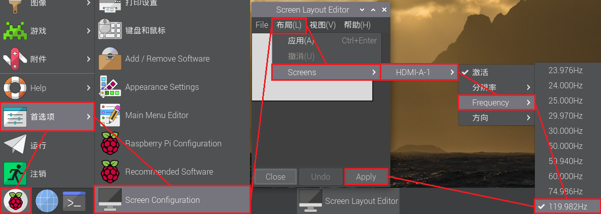
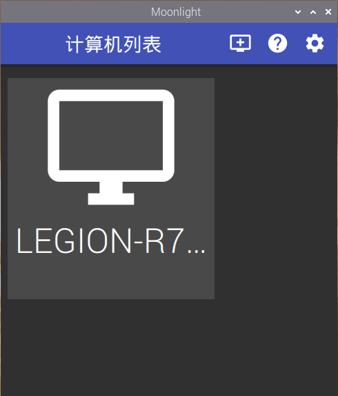

# 用树莓派躺床上玩PC游戏

*版本：1.0*

查看Github渲染器中的**目录**：使用Github Markdown渲染页面右上角的“菜单”（⋮☰）按钮。

---


最近开始玩上了某款手游，因为我的手机屏比较小而且明显该手游的PC端手感更好，再加之之前十分觊觎Steamdeck，希望可以低成本在床上躺着玩3A大作的心愿，故想起来带在身边但是吃灰已久的树莓派4B，于是便有了这篇文章。

本来是觉得网络上肯定有不少人写过类似文章的，毕竟串流也不是件什么新鲜事；结果搜索一番，简中开放网络上几乎所有的文章都有一定的时效性滞后，且不是很完美适合我手中的各类设备，所以最后还是打算在挖了几个坑没填的情况下又开新坑了。

本文高度适用于我自己的环境，因此本文并不是一件标准的教程文章。本文将介绍如何在已拥有如下的设备中，逐步搭建软硬件环境并完成串流在床上玩游戏的过程。目前仅涉及本地局域网串流而不涉及广域网串流，将来可能会研究一下广域网，也可能就鸽了。

以标题图为拓扑示意图，所涉及***软硬件环境***有：  
**硬件：**
- 一台安装了Windows 10/11操作系统的PC，拥有有线/无线网卡，GPU不限
- 一台树莓派4B，拥有至少15w输出、接口为Type-C的电源，一张至少8GB的MicroSD/TF卡
- PC应有访问MicroSD/TF卡的方式，无论MicroSD/TF卡读卡器、MicroSD to SD卡套+SD卡读卡器等
- 为树莓派4B准备的显示输出设备，无论是显示器、电视、投影仪等（本文中为便携式显示器（HDMI 1080p120hz））
- 音频输出设备，无论是音响、耳机等（本文中为无线耳机（USB 2.4Ghz））
- 为树莓派4B准备的输入设备：键盘鼠标等（这点不是必须的，但有的话会很方便）
- 一个手柄，不限任何品牌手柄（本文中为Xbox无线手柄（2020款，有线模式））
- 路由器/交换机（本文中为无线家用路由器，设备间均由Wifi连接）
  
**软件：**
- 对于英伟达独立显卡，可使用[Nvidia Geforce Experience](https://www.nvidia.cn/geforce/geforce-experience/)；对于任何GPU，都可使用[Sunshine](https://app.lizardbyte.dev/Sunshine/?lng=en#Download)
- 最新的[Raspberry Pi OS](https://www.raspberrypi.com/software/)
- Raspberry Pi OS上的[Moonlight Qt](https://github.com/moonlight-stream/moonlight-docs/wiki/Installing-Moonlight-Qt-on-Raspberry-Pi-4)
  
由拓扑图可见，游戏/视频画面由PC上的GPU进行渲染，然后经由服务端——Geforce Experience中的SHIELD Gamestream或Sunshine进行视频编码并串流，通过局域网网关交换数据，将数据传送到树莓派中，经过树莓派上的客户端——Moonlight Qt进行接收、解包、视频解码并显示在输出屏幕上。同时，连接在树莓派上的输入设备也可以经过这一套数据链将输入数据传回PC，从而远程控制PC进行操作。

## 一、PC端的准备操作

本节将介绍拥有英伟达独立显卡的PC上使用Geforce Experience软件中的SHIELD Gamestream功能进行串流。

首先，确定你安装了Geforce Experience软件，如果没有，可以根据上文*软硬件环境*中的链接进行下载。在安装后需要登陆英伟达账号（一个显卡驱动优化软件为啥还非得登录账号呢），然后点击右上角的 *设置（⚙️）* 图标，点击左边栏的 *“SHIELD”* ，然后打开 *“GAMESTREAM”* 开关。


PC端目前便设置好了。

### 没有英伟达显卡，或英伟达显卡太老，没有对应Geforce Experience软件支持怎么办？

可以使用开源的Sunshine软件，Sunshine受SHIELD Gamestream启发，可以在任意GPU上（当然也包括了英伟达显卡）对Moonlight客户端进行串流。但由于我不选择这种方式，此处仅提供两个相关链接，你也可以自行搜索。

[使用Sunshine + Moonlight 来实现毫秒级延迟的远程串流 - 哔哩哔哩](https://www.bilibili.com/read/cv33188914/)  
[Sunshine+Moonlight+Android手机串流配置（局域网、无手柄）_moonlight安卓-CSDN博客](https://blog.csdn.net/qq_43317133/article/details/134793637)

## 二、树莓派端的准备操作

本文以树莓派4B作为示例，因为以前树莓派4B价格疯涨起来之前我买了一块用于学习和个人项目开发，之后便一直闲置了，苦于找不到应用实例。找到3年前留下的MicroSD卡，引导后还能看到以前的项目文件，还有点怀旧的感慨。当时的树莓派官方操作系统还叫Raspbian，想要输出高刷新率还需要手动修改配置文件，现在在最新的Raspberry Pi OS Bookworm上只消点下设置就行了，所以我一向还是很喜欢更新各种设备的系统的。

### 1. 制作带有Raspberry Pi OS的MicroSD卡

本节将介绍刷写MicroSD卡并从之引导Raspberry Pi OS的操作。树莓派4B及以上还支持从USB存储设备，或M.2硬盘扩展坞引导系统的操作，不过我没钱所以就不在此介绍了。

准备一张闲置的、空间大于8GB的MicroSD卡，将其插入到PC中（本节仅介绍Windows系统下烧写的操作）。请注意：下面的操作将抹除MicroSD卡上的所有数据，所以在操作前请先将必要数据进行备份。

1. 下载Raspberry Pi OS系统镜像（本文将使用行文时最新的Debian 12 bookworm版本）：  
   进入[Raspberry Pi OS](https://www.raspberrypi.com/software/operating-systems/)下载页面，向下滚动，找到 *“Raspberry Pi OS (64-bit)”* ，选择右边三种系统变体中你喜欢的版本。“with desktop”版本包含默认的桌面操作环境；“with desktop and recommended software”版本除了默认的桌面操作环境外，还附带了一些开发工具等；“Lite”版本仅具有基本组件，不带有默认的桌面环境。在本文中，使用 *“with desktop”* 版本：点击该版本右边的蓝色 *“Download”* 按钮下载系统镜像。  
     
   *如果你的树莓派在“Raspberry Pi OS (64-bit)”列表中的“Compatible with:”列表中，则推荐使用64位版本；若不在，则请使用网页上的“Raspberry Pi OS”*  
   你可以在下载完系统镜像后，对镜像文件进行SHA256值校验，若其和网站上对应镜像给出的 *“Download”* 按钮下方的 *“Show SHA256 file integrity hash:”* 中的SHA256值相同，则文件没有损坏。  
2. 下载Rufus镜像刷写软件  
   进入[Rufus - 轻松创建 USB 启动盘](https://rufus.ie/zh/)下载页面，向下滚动，找到 *“下载”* ，选择前两种版本其一即可。  
     
   下载后请将其安装或放在某一文件夹下，并启动。

打开Rufus，在 *设备* 处选择你的MicroSD卡。在 *引导类型选择* 处选择 *镜像文件（请选择）* ，点击右边的 *选择* 按钮，选中刚才下载的Raspberry Pi OS系统镜像（本例中为`2024-03-15-raspios-bookworm-arm64.img.xz`）。其余一切选项维持默认。


准备完成后，点击 *“开始”* 按钮，对MicroSD卡进行系统烧录。再次提醒：此操作会抹掉MicroSD卡上的所有数据，如有重要数据请提前进行备份。

待烧录完成后，带有Raspberry Pi OS的MicroSD卡便制作好了。

### 2. 使用树莓派安装并启动Raspberry Pi OS

将MicroSD卡插入到树莓派中的SD卡读卡器中。将树莓派接入到供电能力在15W及以上的电源中（包括充电宝，这很重要），接入显示输出设备及输入设备。

> 没有任何显示输出设备和输入设备，也可以通过局域网访问远程桌面的方式访问树莓派，并使用远程桌面进行操作。具体方式请在网络上搜索。推荐使用显示输出设备及输入设备，本文也将在此基础上进行说明。

显示器将先显示一个树莓派Logo和一段代码，然后显示一个色盘，最后进入到Raspberry Pi OS OOBE中：  
*（此处的截图由运行在x86虚拟机平台下的Raspberry Pi Desktop bullseye截图而来，与树莓派上的安装程序相差不大）*

首先是欢迎语和Logo；待其准备完成后显示新的欢迎语，点击 *“Next”* ：

  
  

设置 *区域和语言* ，完成后点击 *“Next”* 。

  

创建 *用户* ，输入 *用户名（Enter username）* 并输入两遍 *密码(Enter password和Confirm password)* ，完成后点击 *“Next”* 。请注意：用户名最好不要用常见预留用户名如“root”“pi”。

  

之后OOBE应该会让你选择 *WiFi接入* 。（由于我是在虚拟机上截的图，默认是主机NAT，此处Raspberry Pi Desktop认为我通过有线网络访问互联网故跳过了WiFi选择，所以此处没有截图。）

我印象中，OOBE还会让你选择安装哪款浏览器：Chromium或火狐，或两款均装。这个看个人喜好。

在你成功接入网络后，OOBE会提示你是否要进行 *升级系统和软件* 。如果你的网络环境好，可以在此处选择 *“Next”* 进行升级，这在树莓派4B上运行的时间还挺长的，大概要半个小时？当然，你也可以在此处选择 *“Skip”* 暂时跳过升级，在进入桌面后也可以自行升级。

  
  

在升级安装完成后/跳过升级后，OOBE将提示 *安装完成* ，此时点击 *“Restart”* 按钮，重启设备，进入系统。

  

### 3. 进行必要设置并安装必要软件

#### 3.1 个性化设置

**a. 桌面设置**

在 *桌面* 上点击 *右键 - 桌面偏好设置* ，进入 *外观设置* ：

  

以下为部分设置解释：

> - Desktop（桌面）选项卡：  
> Picture（壁纸）：选择桌面壁纸  
> - Menu Bar（菜单栏）选项卡：  
> Size（图标大小）：调整任务栏图标大小  
> Position（任务栏位置）：调整任务栏位置（屏幕上方或下方）  
> - System（系统）选项卡：  
> Theme（主题）：调整系统主题（亮色或暗色）

**b. 任务栏设置**

  

> - 红色：编辑任务栏组件  
> 在任务栏上 *右键* ，选择 *“Add/Remove Plugins”* ，在弹出的窗口中编辑任务栏组件。在本例中，任务栏添加了CPU占用率、SoC温度、GPU占用率监控图表。  
> - 蓝色：固定开始菜单项到任务栏  
> 在 *开始菜单项* 上 *右键* ，选择 *“Add to Launcher”* ，即可将开始菜单项固定到任务栏。  
> - 绿色：取消固定到任务栏  
> 在 *已固定到任务栏的项目* 上 *右键* ，选择 *“Remove from Launcher”* ，即可将已固定到任务栏的项目移除。

**c. 高刷新率设置（当接入到显示输出设备且设备支持高刷新率）**

  

> 选择 *“开始菜单 - 首选项 - Screen Configuration”* ，在弹出的 *“Screen Layout Editor”* 窗口中，选择 *“布局 - Screens - <你目前插入的HDMI口> - Frequency”* ，选择你喜欢的屏幕刷新率。然后，点击 *“Apply”* 使之生效，屏幕此时应该会更改为你选择的刷新率。若显示正常，则在弹出的窗口选择确认。

**d. 时区设置与Wifi地区设置**

  

**e. 设置开机自动打开NumLock**

[Auto Numlock in Pi OS Bookworm - Raspberry Pi Forums](https://forums.raspberrypi.com/viewtopic.php?t=357592)

#### 3.2 安装Xbox手柄驱动

默认情况下Raspberry Pi OS是不安装手柄驱动的。要安装Xbox手柄驱动，需要先打开命令行终端。选择 *“开始菜单 - 附件 - LX 终端”* ，或者按下 *“Ctrl + Alt + T”* ，打开 *LX 终端* 。

如果想要调整终端中的字体大小，可以使用 *“Ctrl + Shift + =”，“Ctrl + Shift + -”* 。

首先输入如下语句，对系统和软件进行完整升级；如果在安装Raspberry Pi OS时进行了 *升级系统和软件* ，则此处执行如下语句应该不会有什么变化：  
```Shell
sudo apt update
sudo apt upgrade
```  
在Windows中你不升级可能还能用各种软件，在Linux中最好还是升级了吧。然后执行以下语句，安装Xbox手柄驱动：  
```Shell
sudo apt install xboxdrv
```  

  

打开浏览器搜索“在线手柄测试”，测试手柄是否正确连接且被系统识别。下面是一个支持在线手柄测试的网站：

[Gamepad Tester - Check Controllers and Joysticks Online](https://hardwaretester.com/gamepad)

你可能需要重新插拔Xbox手柄并按一下西瓜键来激活它。当手柄输入在网站上有反应，那么手柄工作正常。*（我只测试了有线连接因为没钱买Xbox专用无线接收器。DS4手柄没带来所以也没测试。）*


#### 3.3 安装Moonlight Qt客户端

建议跟着官方安装指南进行安装，因为官方的文档总是最新最合适的：

[Installing Moonlight Qt on Raspberry Pi 4 · moonlight-stream/moonlight-docs Wiki](https://github.com/moonlight-stream/moonlight-docs/wiki/Installing-Moonlight-Qt-on-Raspberry-Pi-4)

请确保你在上一步中将系统更新到最新。在终端中运行以下命令（直接整个复制粘贴到终端中并按回车键运行）：  
```Shell
curl -1sLf 'https://dl.cloudsmith.io/public/moonlight-game-streaming/moonlight-qt/setup.deb.sh' | distro=raspbian codename=$(lsb_release -cs) sudo -E bash
sudo apt install moonlight-qt
```

（因为写文章的时候已将装完了所以没得截图）正常情况下，安装应该是无人值守的，直接一步到完成。安装完成后，在 *“开始菜单 - 游戏”* 中应该会存在 *“Moonlight”* 。（图见 *二、3.1 b* ）

## 三、进行局域网速度测试（可选）

因为串流是要通过网络传输编码的视频数据包，因此一个稳定而快速的网络环境是很有必要的。常见的网络测速方式，如speedtest.net，只能测试与互联网的连接速度，并不能测局域网内设备间的连接速度。因此，可以使用一款名为iperf的开源软件进行局域网内测速，目前已经发展到第三代，可根据下面的文章进行测试，在此不再赘述。本节的操作不是必要的，但能让你对你所处的局域网性能有一个基础的认识。

[iperf3测速服务器搭建和使用指南](https://www.zhihu.com/tardis/bd/art/473778492)

文章中仅介绍了iperf3在Windows端和安卓/iOS端进行测速的操作，这里补充一下在树莓派上的操作：

由于局域网间互传基本属于等价双向的（除非你的硬件或设置造成了某设备上传和下载产生明显差异），因此，如果要测试设备A和设备B之间的传输速度，没有必要非得指定其中的某一设备为服务端而另一端为客户端，两端角色可互换。本节将以PC作为服务端，其他所有设备作为客户端来测试。

在树莓派的终端中执行以下命令来安装iperf3：

```Shell
sudo apt install iperf3
```

一般来说，apt将会一同安装两个支持库，然后在安装过程中问你要不要将iperf3安装为一项服务，这样每次树莓派开机后都会在后台自动运行一个iperf3。这个看个人喜好，我由于不是每次开机都想测速就不装了。 *（再次忘截图了，欸嘿）*

如何获知服务端的局域网DHCP IP地址？对于Windows 11，可以打开 *“开始菜单 - 设置 - 网络和 Internet - <你目前连接局域网的网络> - 属性 - IPv4 地址：”* 来获取；或者直接在 *Windows命令提示符* 或 *终端* 中输入

```PowerShell
ipconfig
```

在输出的结果中，找到目前你连接的网络，然后找到其中的 *“IPv4 地址”* ，后面的一串数字便是你这台Windows设备的局域网DHCP IP地址。如果不知道哪个是正在连接的网络，只要找到以`192.168`开头的、不以`0`或`1`结尾的地址，一般就是本机的局域网DHCP IP地址。

  

之后你就可以按照上面的知乎文章在树莓派上用iperf3作为客户端进行测速了。

  

可见在我的PC - 路由器 - 树莓派4B的环境中，局域网传输速度约为100 Mbps (12.5 MB/s)。

虽然树莓派4B上的这块 *博通BCM4345/6 Wifi芯片* 在5Ghz（IEEE 802.11ac）下的理论最高速度为433.3 Mbps（[来源](https://www.digikey.de/htmldatasheets/production/1955355/0/0/1/bcm43455.html)），但我搜到的大部分测速结果都封顶在110 Mbps左右，那我估计树莓派4B的Wifi性能也就到这了。但树莓派4B上的有线网络可是用的实打实的千兆网卡，所以如果条件允许，还是推荐接入有线网络到路由器。 *（但我不想在床上拉网线就算了）* 

***对照对比：***

**树莓派4B安装[LineageOS 21 (Android 14)](https://konstakang.com/devices/rpi4/LineageOS21/)** 运行iperf3测速结果：


可能是运行效率或者驱动的问题，其封顶在约85 Mbps且极不稳定。在该平台上串流的效果不是很理想：

20240522-222043.png)

左上角基本一目了然了。

**iPhone 13 mini** 运行iperf3测速结果：

  

速度快效果就好吗？其实根本卡的不能玩：

20240404-0138.png)

但Moonlight强大的一点是，我在这三个平台上的输入基本无感延迟，无论画面卡不卡。

## 四、使用Moonlight Qt客户端进行串流

打开树莓派上的Moonlight客户端，因为在 *一、* 中已经设置好了Geforce Experience SHIELD Gamestream或Sunshine，所以此时在 *计算机列表* 中应该直接出现局域网上的PC服务端：

  

其中显示的PC服务端计算机名为你的PC的计算机名（Network ID）。

点击它进行连接，Moonlight客户端将提供给你一个4位数字配对码，同时在PC上将会相应地要求你输入这个配对码： *（本节仅介绍Geforce Experience SHIELD Gamestream）* 

  
  

PC服务端确定输入配对码正确后，服务端和客户端正式建立连接。此时在Moonlight客户端中，PC服务端计算机上面的锁应该会消失。

  

点击PC服务端计算机图标，进入到服务端应用列表。默认情况下，Geforce Experience SHIELD Gamestream服务端会给出一个Steam图标（如果你在服务端安装了Steam），Sunshine服务端会给出Steam和桌面。关于如何配置PC服务端中的应用列表，请见 *一、* 中的链接。

  

调整Moonlight客户端串流的设置，请点击应用右上角的*设置（⚙️）* 图标。对于Moonlight串流，客户端占主导地位，因此画质设置等一般情况下服务端会根据客户端设置进行优化。对于Sunshine，其提供了更多的服务端手动设置和覆盖选项。关于如何进行这些设置，请见 *一、* 中的链接。

  
*提醒下(一开始我就理解错了)“视频比特率”指的是串流的视频流的比特率而不是网络连接速率，Moonlight会尝试网络连接能够运行的最大速率，比如我目前的速率大概能稳定在95 Mbps，那么Moonlight将使用剩下的最多95 - 24 = 71 Mbps来优化串流体验（并不会把全部的带宽都占用到）。如果24 Mbps下的串流速度体验十分流畅，那么适当提高视频比特率将带来更好的串流画质体验，但也会更考验局域网网络质量。*

点击应用图标，开始串流并打开服务端相应的应用。

  
*体验强于手机很多，左上角的统计信息也可看出这一点*

**最终成品：**

  

如果要进一步减少设备复杂度，可以使用双口输出均大于15w的充电宝给便携屏和树莓派供电，Xbox手柄也可以使用专用无线接收器并将其直接插在PC上，鼠标侧键可录制宏来一键开关统计信息、暂停串流等。其实如果有大屏电视，尤其是装在那种可移动画架式电视支架上的，那在床上/客厅沙发上只拿一个手柄就够了。

但这套玩玩PC上的手游这种还行，大型3A游戏还是坐在电脑桌前玩吧。

## 五、杂项

### 1. 显示统计信息

在Moonlight串流时显示统计信息（视频流、解码、网络等）：按下 *“Ctrl + Alt + Shift + S”*。统计信息将显示在串流画面的左上角，图见 *四、* 。

目前（202405），Moonlight Qt客户端并未在设置中添加如手机客户端那样的全局开启开关，但可能在不远的将来会推出这一功能（见此[Pull request](https://github.com/moonlight-stream/moonlight-qt/pull/1209)）。

### 2. 使用手柄暂停串流

如果是Xbox手柄，按下 *“LB + RB + View + Menu”* ；对于DS手柄，按下 *“L1 + R1 + Select + Start”* 。

### 3. 使用PC上的无线耳机

先将无线耳机连接到PC并设定为默认输出设备。取消勾选Moonlight客户端设置中的 *“音频设置 - 流式传输启动时将目标计算机的扬声器静音”* 。如果树莓派连接到了音频输出，断开音频或者将树莓派静音。

