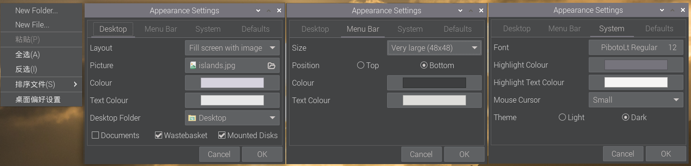

# 用树莓派躺床上玩PC游戏

*版本：1.0*

查看Github渲染器中的**目录**：使用Github Markdown渲染页面右上角的“菜单”（⋮☰）按钮。

---

最近开始玩上了某款手游，因为我的手机屏比较小而且明显该手游的PC端手感更好，再加之之前十分觊觎Steamdeck，希望可以低成本在床上躺着玩3A大作的心愿，故想起来带在身边但是吃灰已久的树莓派4B，于是便有了这篇文章。

本来是觉得网络上肯定有不少人写过类似文章的，毕竟串流也不是件什么新鲜事；结果搜索一番，简中开放网络上几乎所有的文章都有一定的时效性延后，且不是很完美适合我手中的各类设备，所以最后还是打算在挖了几个坑没填的情况下又开新坑了。

本文高度适用于我自己的环境，因此本文并不是一件标准的教程文章。本文将介绍如何在已拥有如下的设备中，逐步搭建软硬件环境并完成串流在床上玩游戏的过程。目前仅涉及本地局域网串流而不涉及广域网串流，将来可能会研究一下广域网，也可能就鸽了。

以标题图为拓扑示意图，所涉及***软硬件环境***有：  
**硬件：**
- 一台安装了Windows 10/11操作系统的PC，拥有有线/无线网卡，GPU不限
- 一台树莓派4B，拥有至少15w输出、接口为Type-C的电源，一张至少8GB的MicroSD/TF卡
- PC应有访问MicroSD/TF卡的方式，无论MicroSD/TF卡读卡器、MicroSD to SD卡套+SD卡读卡器等
- 为树莓派4B准备的显示输出设备，无论是显示器、电视、投影仪等（本文中为便携式显示器（HDMI 1080p120hz））
- 音频输出设备，无论是音响、耳机等（本文中为无线耳机（USB 2.4Ghz））
- 为树莓派4B准备的输入设备：键盘鼠标等（这点不是必须的，但有的话会很方便）
- 一个手柄，不限任何品牌手柄（本文中为Xbox无线手柄（2020款，有线模式））
- 路由器/交换机（本文中为无线家用路由器，设备间均由Wifi连接）
  
**软件：**
- 对于英伟达独立显卡，可使用[Nvidia Geforce Experience](https://www.nvidia.cn/geforce/geforce-experience/)；对于任何GPU，都可使用[Sunshine](https://app.lizardbyte.dev/Sunshine/?lng=en#Download)
- 最新的[Raspberry Pi OS](https://www.raspberrypi.com/software/)
- Raspberry Pi OS上的[Moonlight Qt](https://github.com/moonlight-stream/moonlight-docs/wiki/Installing-Moonlight-Qt-on-Raspberry-Pi-4)
  
由拓扑图可见，游戏/视频画面由PC上的GPU进行渲染，然后经由服务端——Geforce Experience中的SHIELD Gamestream或Sunshine进行视频编码并串流，通过局域网网关交换数据，将数据传送到树莓派中，经过树莓派上的客户端——Moonlight Qt进行接收、解包、视频解码并显示在输出屏幕上。同时，连接在树莓派上的输入设备也可以经过这一套数据链将输入数据传回PC，从而远程控制PC进行操作。

## 一、PC端的准备操作

本节将介绍拥有英伟达独立显卡的PC上使用Geforce Experience软件中的SHIELD Gamestream功能进行串流。

首先，确定你安装了Geforce Experience软件，如果没有，可以根据上文*软硬件环境*中的链接进行下载。在安装后需要登陆英伟达账号（一个显卡驱动优化软件为啥还非得登录账号呢），然后点击右上角的 *设置（⚙️）* 图标，点击左边栏的 *“SHIELD”* ，然后打开 *“GAMESTREAM”* 开关。

PC端目前便设置好了。

### 没有英伟达显卡，或英伟达显卡太老，没有对应Geforce Experience软件支持怎么办？

可以使用开源的Sunshine软件，Sunshine受SHIELD Gamestream启发，可以在任意GPU上（当然也包括了英伟达显卡）对Moonlight客户端进行串流。但由于我不选择这种方式，此处仅提供两个相关链接，你也可以自行搜索。

[使用Sunshine + Moonlight 来实现毫秒级延迟的远程串流 - 哔哩哔哩](https://www.bilibili.com/read/cv33188914/)  
[Sunshine+Moonlight+Android手机串流配置（局域网、无手柄）_moonlight安卓-CSDN博客](https://blog.csdn.net/qq_43317133/article/details/134793637)

## 二、树莓派端的准备操作

本文以树莓派4B作为示例，因为以前树莓派4B价格疯涨起来之前我买了一块用于学习和个人项目开发，之后便一直闲置了，苦于找不到应用实例。找到3年前留下的MicroSD卡，引导后还能看到以前的项目文件，还有点怀旧的感慨。当时的树莓派官方操作系统还叫Raspbian，想要输出高刷新率还需要手动修改配置文件，现在在最新的Raspberry Pi OS Bookworm上只消点下设置就行了，所以我一向还是很喜欢更新各种设备的系统的。

### 1. 制作带有Raspberry Pi OS的MicroSD卡

本节将介绍刷写MicroSD卡并从之引导Raspberry Pi OS的操作。树莓派4B及以上还支持从USB存储设备，或M.2硬盘扩展坞引导系统的操作，不过我没钱所以就不在此介绍了。

准备一张闲置的、空间大于8GB的MicroSD卡，将其插入到PC中（本节仅介绍Windows系统下烧写的操作）。请注意：下面的操作将抹除MicroSD卡上的所有数据，所以在操作前请先将必要数据进行备份。

1. 下载Raspberry Pi OS系统镜像（本文将使用行文时最新的Debian 12 bookworm版本）：  
   进入[Raspberry Pi OS](https://www.raspberrypi.com/software/operating-systems/)下载页面，向下滚动，找到 *“Raspberry Pi OS (64-bit)”* ，选择右边三种系统变体中你喜欢的版本。“with desktop”版本包含默认的桌面操作环境；“with desktop and recommended software”版本除了默认的桌面操作环境外，还附带了一些开发工具等；“Lite”版本仅具有基本组件，不带有默认的桌面环境。在本文中，使用 *“with desktop”* 版本：点击该版本右边的蓝色 *“Download”* 按钮下载系统镜像。  
     
   *如果你的树莓派在“Raspberry Pi OS (64-bit)”列表中的“Compatible with:”列表中，则推荐使用64位版本；若不在，则请使用网页上的“Raspberry Pi OS”*  
   你可以在下载完系统镜像后，对镜像文件进行SHA256值校验，若其和网站上对应镜像给出的 *“Download”* 按钮下方的 *“Show SHA256 file integrity hash:”* 中的SHA256值相同，则文件没有损坏。  
2. 下载Rufus镜像刷写软件  
   进入[Rufus - 轻松创建 USB 启动盘](https://rufus.ie/zh/)下载页面，向下滚动，找到 *“下载”* ，选择前两种版本其一即可。  
     
   下载后请将其安装或放在某一文件夹下，并启动。

打开Rufus，在 *设备* 处选择你的MicroSD卡。在 *引导类型选择* 处选择 *镜像文件（请选择）* ，点击右边的 *选择* 按钮，选中刚才下载的Raspberry Pi OS系统镜像（本例中为`2024-03-15-raspios-bookworm-arm64.img.xz`）。其余一切选项维持默认。

准备完成后，点击 *“开始”* 按钮，对MicroSD卡进行系统烧录。再次提醒：此操作会抹掉MicroSD卡上的所有数据，如有重要数据请提前进行备份。

待烧录完成后，带有Raspberry Pi OS的MicroSD卡便制作好了。

### 2. 使用树莓派安装并启动Raspberry Pi OS

将MicroSD卡插入到树莓派中的SD卡读卡器中。将树莓派接入到供电能力在15W及以上的电源中（包括充电宝，这很重要），接入显示输出设备及输入设备。

> 没有任何显示输出设备和输入设备，也可以通过局域网访问远程桌面的方式访问树莓派，并使用远程桌面进行操作。具体方式请在网络上搜索。推荐使用显示输出设备及输入设备，本文也将在此基础上进行说明。

显示器将先显示一个树莓派Logo和一段代码，然后显示一个色盘，最后进入到Raspberry Pi OS OOBE中：  
*（此处的截图由运行在x86虚拟机平台下的Raspberry Pi Desktop bullseye截图而来，与树莓派上的安装程序相差不大）*

首先是欢迎语和Logo；待其准备完成后显示新的欢迎语，点击 *“Next”* ：

  
  

设置 *区域和语言* ，完成后点击 *“Next”* 。

  

创建 *用户* ，输入 *用户名（Enter username）* 并输入两遍 *密码(Enter password和Confirm password)* ，完成后点击 *“Next”* 。请注意：用户名最好不要用常见预留用户名如“root”“pi”。

  

之后OOBE应该会让你选择 *WiFi接入* 。（由于我是在虚拟机上截的图，默认是主机NAT，此处Raspberry Pi Desktop认为我通过有线网络访问互联网故跳过了WiFi选择，所以此处没有截图。）

我印象中，OOBE还会让你选择安装哪款浏览器：Chromium或火狐，或两款均装；哪种办公套件，LibreOffice或FreeOffice，或两款均装。这个看个人喜好。

在你成功接入网络后，OOBE会提示你是否要进行 *升级系统和软件* 。如果你的网络环境好，可以在此处选择 *“Next”* 进行升级，这在树莓派4B上运行的时间还挺长的，大概要半个小时？当然，你也可以在此处选择 *“Skip”* 暂时跳过升级，在进入桌面后也可以自行升级。

  
  

在升级安装完成后/跳过升级后，OOBE将提示 *安装完成* ，此时点击 *“Restart”* 按钮，重启设备，进入系统。

  

### 3. 进行必要设置并安装必要软件

**3.1 个性化设置**

    a. 桌面设置

在 *桌面* 上点击 *右键 - 桌面偏好设置* ，进入 *外观设置* ：

  

以下为部分设置解释：

> - Desktop（桌面）选项卡：  
> Picture（壁纸）：选择桌面壁纸  
> - Menu Bar（菜单栏）选项卡：  
> Size（图标大小）：调整任务栏图标大小  
> - System（系统）选项卡：  
> Theme（主题）：调整系统主题（亮色或暗色）