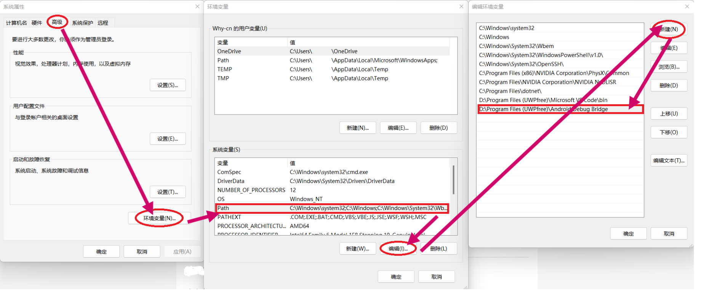
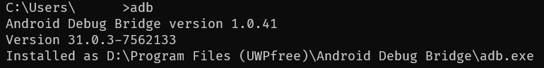
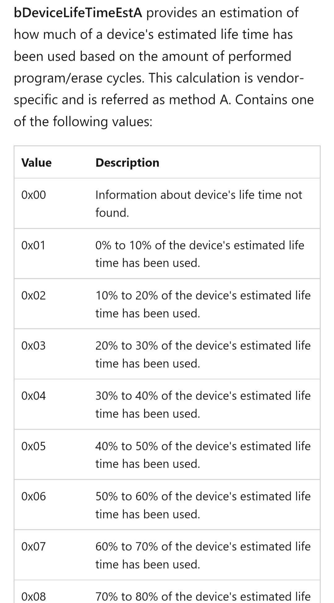
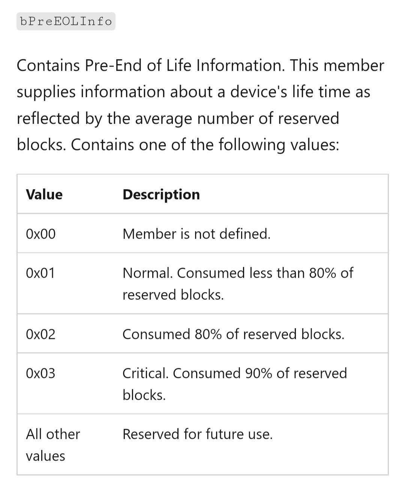
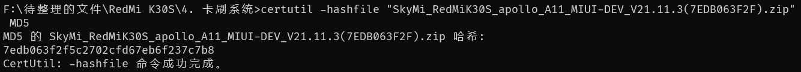
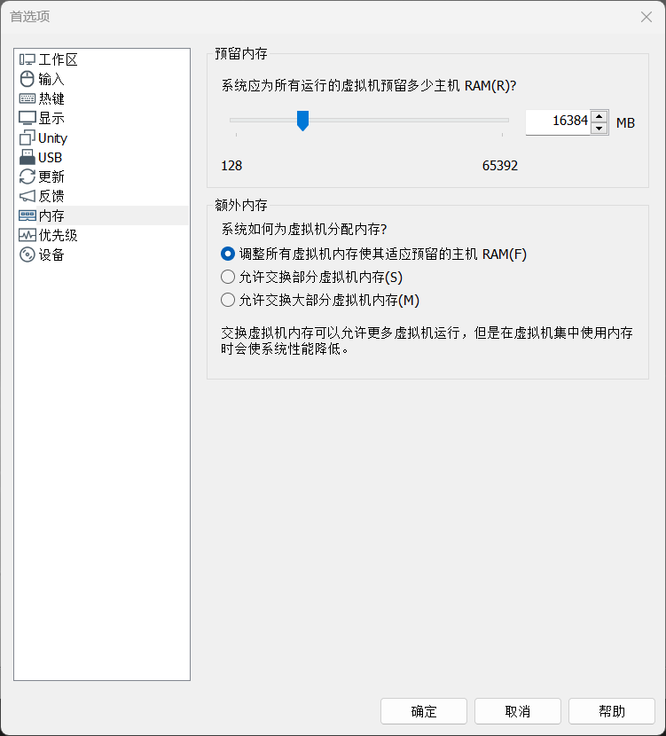
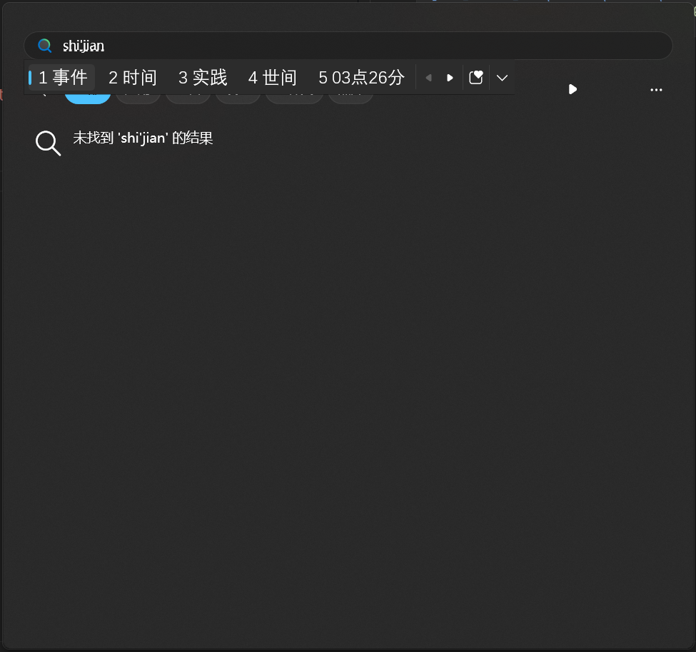

# 技巧集合

*版本：1.0 本文章不提供英文版*

一些杂七杂八的小技巧合集，主要是怕忘了，哪天可以捡起来接着看。

查看Github渲染器中的**目录**：使用Github Markdown渲染页面右上角的“菜单”（⋮☰）按钮。

## 设置ADB到Windows环境变量中

假设 *<ADB文件夹地址>* 为D:\Program Files (UWPfree)\Android Debug Bridge，那么使用Windows徽标键 + R打开“运行”，输入“SYSDM.CPL”，回车打开“系统属性”，点击“高级”选项卡，点击下方“环境变量”按钮，在弹出的“环境变量”页面中选中下方“系统变量”(或“用户变量”)中的“Path”一行，点击“编辑”按钮，在弹出的“编辑环境变量”页面中点击“新建”按钮，然后输入ADB文件夹的地址，一路确定。



在任意位置打开命令提示符，输入“adb”并回车，如果出现大量提示符并在第三行显示“Installed as *<ADB文件夹地址>*\adb.exe”，就说明adb环境变量设置成功了。



这样的好处是今后使用他人分享的使用了adb命令的bat脚本时不需要再配置/使用附带的adb组件，而且可以在任意位置启动adb，而不需要一遍遍复制文件到adb文件夹下。不过需要注意的是，传输本地电脑上的文件应尽量使用绝对路径，以免adb找不到文件。

## 去除MIUI（6+）开机系统完整性验证（破解卡米）

[图文分享 - 酷安](https://www.coolapk.com/feed/28722337)

## 安卓手机双系统（同安卓版本，不同ROM）制作

[保姆级-小米手机双系统制作教程_哔哩哔哩_bilibili](https://www.bilibili.com/video/BV133411n7QW)

根据教程，本人已经成功将红米K30S刷入MIUI国际版 V12.5.8.0和Nusantara Project LTS A11并可灵活切换。Dot OS 5.2.1失败，是刷机包的问题，鉴于Dot OS开发组目前的懒狗状况也只能叹息一下了。

视频中没有提到的几点：

1. 双系统最好不要跨安卓版本，可以试试，但不推荐。
2. 一定要保留好各个时候/sdcard/rannki文件夹下的文件并归档！节省时间甚至可能用来救砖！
3. 安装双系统后OTA升级基本寄了，可以下载卡刷包在TWRP里刷入升级，不用双清。
4. 一些重定位app储存空间的app会导致失效或者系统出现严重问题。
5. 我的机出现一个系统掉基带一个不掉的问题，不清楚是不是共性问题。

## 安卓设备查看UFS闪存损耗程度（健康信息）

使用任意工具（需要ROOT）打开

```Shell
/sys/devices/platform/soc/1d84000.ufshc/health_descriptor/
```

下面三个文件，其中life_time_estimation_a和life_time_estimation_b一般是相同的可视作一个量，初始健康度这两个值都应该是“0x01”。





## Windows查询MD5值

```PowerShell
certutil -hashfile <文件路径> MD5
```


certutil工具从Windows XP Professional版本之后的所有Windows上提供。

## MIUI查询电池健康

[图文分享 - 酷安](https://www.coolapk.com/feed/32766278)

## MIUI线刷降级报错MiFlash update sparse crc list failed

[MIUI12.5降级 MiFlash update sparse crc list failed 错误解决方案 sparsecrclist_哔哩哔哩_bilibili](https://www.bilibili.com/video/BV1XX4y1K79f)

## MIUI云控的一些讨论

[MIUI云控的部分说明 来自 代号10007 - 酷安](https://www.coolapk.com/feed/39260011)

MIUI云控这个事吧，我觉得没必要非得彻底干掉它，第一是完全摆脱MIUI云控唯一的办法就是不用MIUI，第二云控并不一定会限制所有应用的机能（赛马娘甚至比原生还流畅了点），第三是云控删了，温控删了，下一步可能就是主板烧了……

## 监控哪些安卓应用在内部存储空间拉屎

[媒体存储设备管理 - 防止媒体存储滥用的 Xposed 模块](https://github.com/MaterialCleaner/Media-Provider-Manager/blob/main/README_zh-CN.md)

## 解决VMware Workstation长期占用硬盘和卡顿的问题

最近（202405）VMware的Workstation Pro对个人用户免费了，我也是从Player 17切到了Workstation 17 Pro。之前使用的时候发现只要用它就会导致虚拟磁盘所在的机械硬盘占用长时间维持在100%，且虚拟机很卡；给了16G的虚拟内存，但主机的占用显示虚拟机远未占用这么多的内存；在虚拟机运行期间查看虚拟机文件夹发现有和虚拟内存一样大小的.vmem文件，于是猜测VMware应该是将内存随时转储到硬盘中了，或者是某种很恼人的swap机制。

以前使用Virtual Box和Hyper-V的时候从来没遇到过这样的问题。我的内存足够给虚拟机开这么多的虚拟内存，完全不需要VMware帮我swap到本地硬盘中。写这段之前通过搜索并编辑了VMware的配置文件.vmx解决了这个问题，不过在切换到Workstation Pro之后发现这个配置可以直接在设置中更改，下面是更改的步骤：

1. 在VMware Workstation中，打开“编辑 - 首选项 - 内存”。
    
2. 在“额外内存”选项块中，选中“调整所有虚拟机内存使其适应预留的主机 RAM”。

这样，VMware便会在主机内存剩余空间足够的情况下，不会再将虚拟机内存转储（或swap）到主机本地硬盘中。因为我是将虚拟机虚拟硬盘放在了机械硬盘中（Windows 7也不需要很高的I/O性能），所以在原来VMware Player总是动不动就swap，导致虚拟机一直卡的不行，这下终于是解决了。

> 保留.vmx文件的配置以便备用：
```ini
MemTrimRate = "0"
sched.mem.pshare.enable = "FALSE"
sched.mem.maxmemctl = 0
MemAllowAutoScaleDown = "FALSE" 
mem.ShareScanTotal = 0
mem.ShareScanVM = 0
mem.ShareScanThreshold = 8192
mainMem.useNamedFile = "FALSE"
```

## 卸载Windows 11小组件

[doc/240119.md · 技术爬爬虾/技术爬爬虾资源汇总 - Gitee.com](https://gitee.com/tech-shrimp/me/blob/master/doc/240119.md#%E5%8D%B8%E8%BD%BD%E5%B0%8F%E7%BB%84%E4%BB%B6)

## 关闭Windows 11开始菜单的Bing网络搜索

复制以下代码，保存为.reg文件并并入到注册表中。
```re
Windows Registry Editor Version 5.00

[HKEY_CURRENT_USER\Software\Policies\Microsoft\Windows\Explorer]
"DisableSearchBoxSuggestions"=dword:00000001
```



这样开始菜单搜索就不会联网搜索了，只会显示本地相关结果。

## 在Linux上惯用的Markdown编辑器

原本是想在Linux中找一个支持Web App的Markdown编辑器，这样能省得安装一个App来编辑了，顺便还能在Chrome OS中使用。（顺便说一下好像火狐浏览器不支持Web App）找来找去，最后还是[Visual Studio Code网页版](https://vscode.dev/)最好用，因为其能够编辑本地文件并随时保存到本地。结果发现vscode.dev作为Web App无法跨域，也就是说，仅可以编辑.md文件，但无法用链接（相对路径）预览本地图片。最后还是得安装应用。